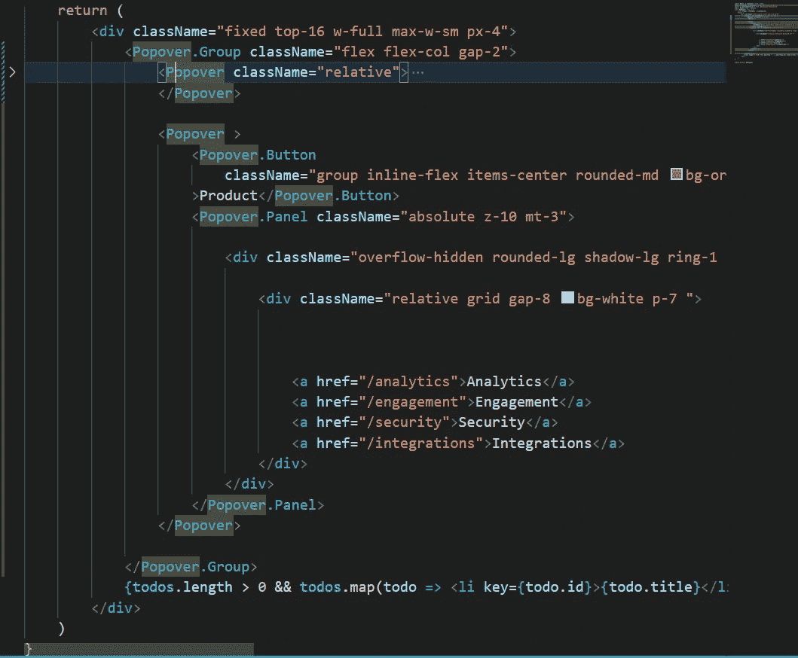

# HeadlessUI: Popover

> 原文：<https://javascript.plainenglish.io/headlessui-popover-part-6-grouping-85856497ba4d?source=collection_archive---------8----------------------->

## 第 6 部分:分组


Photo by [Radowan Nakif Rehan](https://unsplash.com/@radowanrehan?utm_source=medium&utm_medium=referral) on [Unsplash](https://unsplash.com?utm_source=medium&utm_medium=referral)

为了确保当用户在组内弹出窗口之间跳转时面板保持打开，但是当用户在组外跳转时关闭任何打开的面板，我们使用<popover.group>来包装</popover.group>

```
import { Popover } from '@headlessui/react'  function MyPopover() {   return (<Popover.Group><Popover>         
<Popover.Button>Product</Popover.Button>         
<Popover.Panel>{/* ... */}</Popover.Panel>       
</Popover>        
<Popover>         
<Popover.Button>Solutions</Popover.Button>         
<Popover.Panel>{/* ... */}</Popover.Panel>       
</Popover>
</Popover.Group>) }
```

在我们的例子中，我们也使用<popover.group>来包装</popover.group>



我们再加一个

```
<Popover ><Popover.ButtonclassName="group inline-flex items-center rounded-md bg-orange-700 px-3 py-2 text-base font-medium text-white hover:text-opacity-100 focus:outline-none focus-visible:ring-2 focus-visible:ring-white focus-visible:ring-opacity-75">Product</Popover.Button><Popover.Panel className="absolute z-10 mt-3"><div className="overflow-hidden rounded-lg shadow-lg ring-1 ring-black ring-opacity-5"><div className="relative grid gap-8 bg-white p-7 "><a href="/analytics">Analytics</a><a href="/engagement">Engagement</a><a href="/security">Security</a><a href="/integrations">Integrations</a></div></div></Popover.Panel></Popover>
```

在<popover.group>处，我们添加类`flex flex-col gap-2`来分隔每个<弹出框></popover.group>

```
<Popover.Group className="flex flex-col gap-2">
```


如果你喜欢这个故事，你可能也喜欢中等会员。一个月才 5 美元(一杯咖啡的价格！)但是它会在支持你最喜欢的作家的同时，给你无限的接触故事的机会。如果你注册使用[这个链接](https://ckmobile.medium.com/membership)，我会赚一小笔佣金。谢谢！

# 关注我们: [YouTube](https://www.youtube.com/channel/UCu4-4FnutvSHVo9WHvq80Ww?sub_confirmation=1) ， [Medium](https://ckmobile.medium.com/) ， [Udemy](https://www.udemy.com/user/cyruschan2/) ， [Linkedin](https://www.linkedin.com/company/ckmobi/) ， [Twitter](https://twitter.com/ckmobilejavasc1) ， [Instagram](https://www.instagram.com/ckmobile8050) ， [Gumroad](https://app.gumroad.com/ckmobile) ， [Quora](https://ckmobile.quora.com/) ， [Telegram](https://t.me/ckmobi)

*更多内容请看*[***plain English . io***](https://plainenglish.io/)*。报名参加我们的* [***免费周报***](http://newsletter.plainenglish.io/) *。关注我们关于*[***Twitter***](https://twitter.com/inPlainEngHQ)[***LinkedIn***](https://www.linkedin.com/company/inplainenglish/)*[***YouTube***](https://www.youtube.com/channel/UCtipWUghju290NWcn8jhyAw)***，以及****[***不和***](https://discord.gg/GtDtUAvyhW) *对成长黑客感兴趣？检查* [***电路***](https://circuit.ooo/) ***。*****