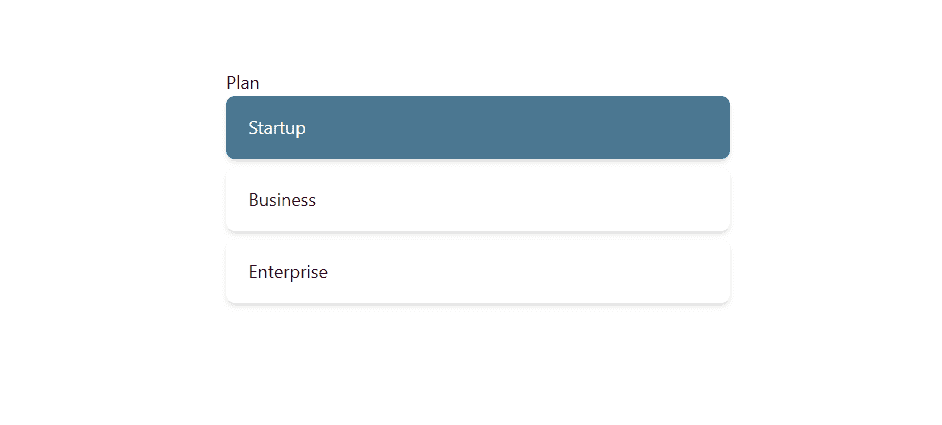

# HeadlessUI-单选按钮组第 1 部分-基本示例

> 原文：<https://javascript.plainenglish.io/headlessui-radio-group-part-1-basic-example-998aeaedf468?source=collection_archive---------8----------------------->


Photo by [Christian Wiediger](https://unsplash.com/@christianw?utm_source=medium&utm_medium=referral) on [Unsplash](https://unsplash.com?utm_source=medium&utm_medium=referral)

在本文中，我们将使用 headless UI、Next.js 和 TailwindCSS 创建一个单选按钮组。

在我们[创建了 Next.js 项目](https://nextjs.org/docs/getting-started)并且[安装了 tailwindCSS](https://tailwindcss.com/docs/guides/nextjs) 之后，安装 headless UI。

```
npm install @headlessui/react
```

转到根文件夹并创建“组件”文件夹。

在文件夹下，创建 MyRadioGroup.js。

添加计划，循环计划，选项激活时会变成红色，选中时会变成蓝色

```
<div className="space-y-2">{plans.map((plan) => (<RadioGroup.Optionkey={plan.name}value={plan}className={({ active, checked }) =>`${active? 'bg-red-500 ring-2 ring-white ring-opacity-60 ring-offset-2 ring-offset-sky-300': ''}${checked ? 'bg-sky-900 bg-opacity-75 text-white' : 'bg-white'}relative flex cursor-pointer rounded-lg px-5 py-4 shadow-md focus:outline-none`}><span >{plan.name}</span></RadioGroup.Option>))}</div>
```

## 完整代码

```
import React, { useState } from 'react'import { RadioGroup } from '@headlessui/react'const plans = [{name: 'Startup',ram: '12GB',cpus: '6 CPUs',disk: '160 GB SSD disk',},{name: 'Business',ram: '16GB',cpus: '8 CPUs',disk: '512 GB SSD disk',},{name: 'Enterprise',ram: '32GB',cpus: '12 CPUs',disk: '1024 GB SSD disk',},]const MyRadioGroup = () => {let [plan, setPlan] = useState('startup')return (<div className="w-full px-4 py-16"><div className="mx-auto w-full max-w-md"><RadioGroup value={plan} onChange={setPlan}><RadioGroup.Label>Plan</RadioGroup.Label><div className="space-y-2">{plans.map((plan) => (<RadioGroup.Optionkey={plan.name}value={plan}className={({ active, checked }) =>`${active? 'bg-red-500 ring-2 ring-white ring-opacity-60 ring-offset-2 ring-offset-sky-300': ''}${checked ? 'bg-sky-900 bg-opacity-75 text-white' : 'bg-white'}relative flex cursor-pointer rounded-lg px-5 py-4 shadow-md focus:outline-none`}><span >{plan.name}</span></RadioGroup.Option>))}</div></RadioGroup></div></div>)}export default MyRadioGroup
```



如果你喜欢这个故事，你可能也喜欢中等会员。一个月才 5 美元(一杯咖啡的价格！)但是它会在支持你最喜欢的作家的同时，给你无限的接触故事的机会。如果你注册使用[这个链接](https://ckmobile.medium.com/membership)，我会赚一小笔佣金。谢谢！

*关注我们:*[*YouTube*](https://www.youtube.com/channel/UCu4-4FnutvSHVo9WHvq80Ww?sub_confirmation=1)*，*[*Medium*](https://ckmobile.medium.com/)*，*[*Udemy*](https://www.udemy.com/user/cyruschan2/)*，*[*Linkedin*](https://www.linkedin.com/company/ckmobi/)*，*[*Twitter*](https://twitter.com/ckmobilejavasc1)*，*[](https://www.instagram.com/ckmobile8050)

**更多内容请看*[***plain English . io***](https://plainenglish.io/)*。报名参加我们的* [***免费周报***](http://newsletter.plainenglish.io/) *。关注我们关于*[***Twitter***](https://twitter.com/inPlainEngHQ)[***LinkedIn***](https://www.linkedin.com/company/inplainenglish/)*[***YouTube***](https://www.youtube.com/channel/UCtipWUghju290NWcn8jhyAw)***，以及****[***不和***](https://discord.gg/GtDtUAvyhW) ***