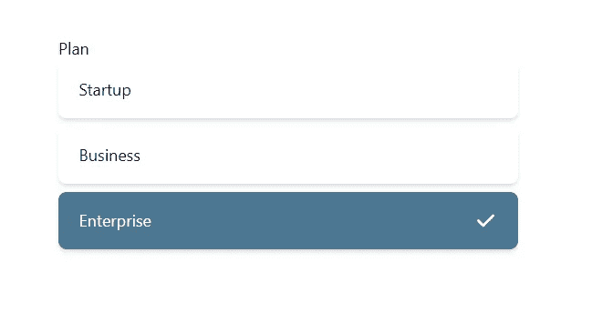

# HeadlessUI-单选按钮组第 2 部分-复选图标

> 原文：<https://javascript.plainenglish.io/headlessui-radio-group-part-2-checkicon-a2aec3f5e1b6?source=collection_archive---------22----------------------->


Photo by [Philipp Katzenberger](https://unsplash.com/@fantasyflip?utm_source=medium&utm_medium=referral) on [Unsplash](https://unsplash.com?utm_source=medium&utm_medium=referral)

在这篇文章中，我们将添加一个勾号图标，所以每次当项目被选中时，右边都会出现一个勾号图标。

首先，我们需要安装 react heroicons。

```
npm install [@heroicons/react](http://twitter.com/heroicons/react)
```

导入顶部的<checkicon>。</checkicon>

```
import { CheckIcon } from '@heroicons/react/solid'
```

就在<radiogroup.option>之前，添加</radiogroup.option>

```
{({checked})=>(<><div className="flex w-full justify-between"><span >{plan.name} </span>{checked && (<div><CheckIcon className="w-6 h-6"/></div>)}</div></>)}
```



现在，如果该项被选中，右边会有一个勾号。

如果你喜欢这个故事，你可能也喜欢中等会员。一个月才 5 美元(一杯咖啡的价格！)但是它会在支持你最喜欢的作家的同时，给你无限的接触故事的机会。如果你注册使用[这个链接](https://ckmobile.medium.com/membership)，我会赚一小笔佣金。谢谢！

*关注我们:* [*YouTube*](https://www.youtube.com/channel/UCu4-4FnutvSHVo9WHvq80Ww?sub_confirmation=1) *，*[*Medium*](https://ckmobile.medium.com/)*，*[*Udemy*](https://www.udemy.com/user/cyruschan2/)*，*[*Linkedin*](https://www.linkedin.com/company/ckmobi/)*，*[*Twitter*](https://twitter.com/ckmobilejavasc1)*，*[*insta*](https://www.instagram.com/ckmobile8050)

*更多内容请看*[***plain English . io***](https://plainenglish.io/)*。报名参加我们的* [***免费周报***](http://newsletter.plainenglish.io/) *。关注我们关于*[***Twitter***](https://twitter.com/inPlainEngHQ)[***LinkedIn***](https://www.linkedin.com/company/inplainenglish/)*[***YouTube***](https://www.youtube.com/channel/UCtipWUghju290NWcn8jhyAw)***，以及****[***不和***](https://discord.gg/GtDtUAvyhW) **