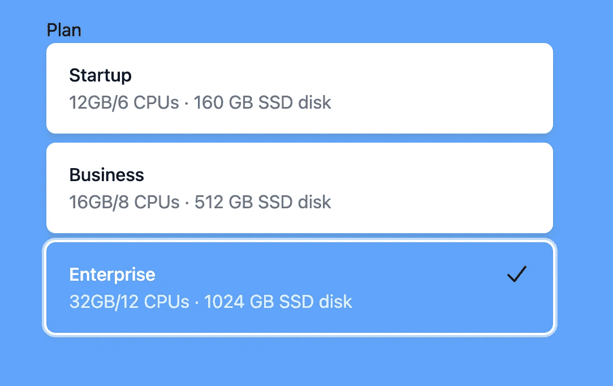

# HeadlessUI-无线电组第 3 部分-标签和描述

> 原文：<https://javascript.plainenglish.io/headlessui-radio-group-part-3-label-and-description-2b3ea3b55acd?source=collection_archive---------14----------------------->


Photo by [Lorenzo Herrera](https://unsplash.com/@lorenzoherrera?utm_source=medium&utm_medium=referral) on [Unsplash](https://unsplash.com?utm_source=medium&utm_medium=referral)

在这一部分，我们将使用<radiogroup.description>添加描述。</radiogroup.description>

要添加<radiogroup.description>，在<radiogroup.option>中添加以下内容。</radiogroup.option></radiogroup.description>

```
import React, { Fragment, useState } from 'react'import { RadioGroup } from '@headlessui/react'import { CheckIcon } from '@heroicons/react/20/solid'const plans = [{name: 'Startup',ram: '12GB',cpus: '6 CPUs',disk: '160 GB SSD disk',},{name: 'Business',ram: '16GB',cpus: '8 CPUs',disk: '512 GB SSD disk',},{name: 'Enterprise',ram: '32GB',cpus: '12 CPUs',disk: '1024 GB SSD disk',},]const MyRadioGroup = () => {const [plan, setPlan] = useState(plans[0])return (<div className="w-full px-4 py-16"><div className="mx-auto w-full max-w-md"><RadioGroup value={plan} onChange={setPlan}><RadioGroup.Label >Plan</RadioGroup.Label><div className="space-y-2">{plans.map((plan) => (/* Use the `active` state to conditionally style the active option. *//* Use the `checked` state to conditionally style the checked option. */<RadioGroup.Option key={plan.name} value={plan} as={Fragment}>{({ active, checked }) => (<liclassName={`${active ? ' ring-2 ring-white ring-opacity-60 ring-offset-2 ring-offset-sky-300' : 'bg-white text-black'}relative flex justify-between cursor-pointer rounded-lg px-5 py-4 shadow-md focus:outline-none`}>**<div>****<RadioGroup.Label****as="p"****className={`font-medium  ${checked ? 'text-white' : 'text-gray-900'****}`}****>****{plan.name}****</RadioGroup.Label>****<RadioGroup.Description****as="span"****className={`inline ${checked ? 'text-sky-100' : 'text-gray-500'****}`}****>****<span>****{plan.ram}/{plan.cpus}****</span>{' '}****<span aria-hidden="true">&middot;</span>{' '}****<span>{plan.disk}</span>****</RadioGroup.Description>****</div>**{checked && <CheckIcon className="h-6 w-6" />}</li>)}</RadioGroup.Option>))}</div></RadioGroup></div></div>)}export default MyRadioGroup
```

我们还添加了类，当项目被选中时，描述具有蓝色粗体颜色，否则它是灰色的，并且文本很小。



如果你喜欢这个故事，你可能也喜欢中等会员。一个月才 5 美元(一杯咖啡的价格！)但是它会在支持你最喜欢的作家的同时，给你无限的接触故事的机会。如果你用[这个链接](https://ckmobile.medium.com/membership)注册，我会赚一小笔佣金。谢谢！

*关注我们:*[*YouTube*](https://www.youtube.com/channel/UCu4-4FnutvSHVo9WHvq80Ww?sub_confirmation=1)*，*[*Medium*](https://ckmobile.medium.com/)*，*[*Udemy*](https://www.udemy.com/user/cyruschan2/)*，*[*Linkedin*](https://www.linkedin.com/company/ckmobi/)*，*[*Twitter*](https://twitter.com/ckmobilejavasc1)*，*[](https://www.instagram.com/ckmobile8050)

**更多内容请看*[***plain English . io***](https://plainenglish.io/)*。报名参加我们的* [***免费周报***](http://newsletter.plainenglish.io/) *。关注我们关于*[***Twitter***](https://twitter.com/inPlainEngHQ)[***LinkedIn***](https://www.linkedin.com/company/inplainenglish/)*[***YouTube***](https://www.youtube.com/channel/UCtipWUghju290NWcn8jhyAw)***，以及****[***不和***](https://discord.gg/GtDtUAvyhW) ***