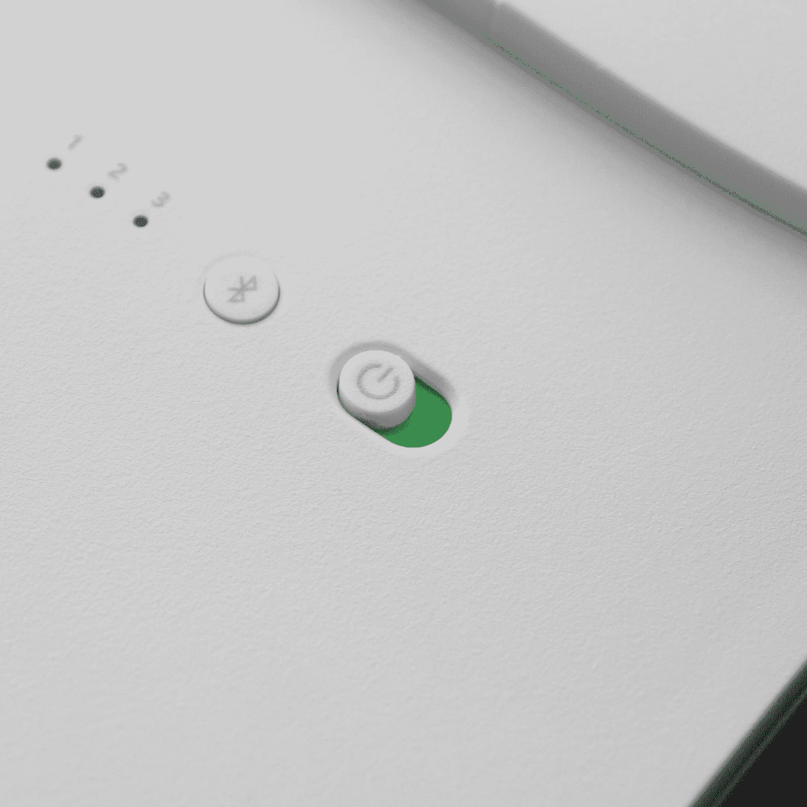
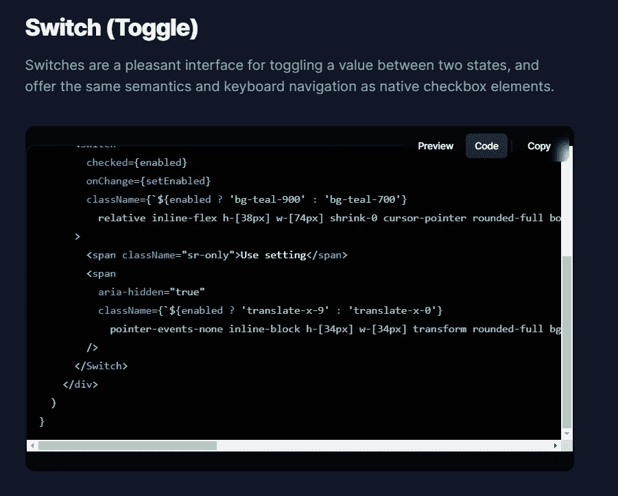
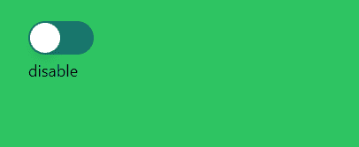

# 如何用 Next.js 创建一个无头 UI 开关

> 原文：<https://javascript.plainenglish.io/headlessui-switch-part-1-install-necessary-packages-and-basic-example-b54a3bc4aeff?source=collection_archive---------12----------------------->

## 第 1 部分:安装必要的包并创建一个基本示例。



Photo by [Isaac Li Shung Tan](https://unsplash.com/@isaactanlishung?utm_source=medium&utm_medium=referral) on [Unsplash](https://unsplash.com?utm_source=medium&utm_medium=referral)

在我们创建了 Next.js 项目之后，我们需要安装 Headless UI 和 Tailwind CSS。

安装无头用户界面:

```
yarn add @headlessui/react
```

安装顺风 CSS:

```
npm install -D tailwindcss postcss autoprefixer
npx tailwindcss init -p
```

配置您的模板路径:

```
module.exports = {
  content: [
    "./pages/**/*.{js,ts,jsx,tsx}",
    "./components/**/*.{js,ts,jsx,tsx}",
  ],
  theme: {
    extend: {},
  },
  plugins: [],
}
```

将顺风指令添加到 CSS 中:

```
[@tailwind](http://twitter.com/tailwind) base;
[@tailwind](http://twitter.com/tailwind) components;
[@tailwind](http://twitter.com/tailwind) utilities;
```

## 创建 MyToggle.js

转到根文件夹，创建“组件”文件夹。在文件夹内，添加 MyToggle.js。

从文档中复制代码并在<switch>下添加这一行。</switch>

```
{enabled? <div>enable</div>:<div>disable</div>}
```



```
import { useState } from 'react'import { Switch } from '@headlessui/react'export default function MyToggle() {const [enabled, setEnabled] = useState(false)return (<><Switchchecked={enabled}onChange={setEnabled}className={`${enabled ? 'bg-teal-900' : 'bg-teal-700'}relative inline-flex h-[38px] w-[74px] shrink-0 cursor-pointer rounded-full border-2 border-transparent transition-colors duration-200 ease-in-out focus:outline-none focus-visible:ring-2  focus-visible:ring-white focus-visible:ring-opacity-75`}><span className="sr-only">Use setting</span><spanaria-hidden="true"className={`${enabled ? 'translate-x-9' : 'translate-x-0'}pointer-events-none inline-block h-[34px] w-[34px] transform rounded-full bg-white shadow-lg ring-0 transition duration-200 ease-in-out`}/></Switch>**{enabled? <div>enable</div>:<div>disable</div>}**</>)}
```

返回 index.js:

```
import MyToggle from '../components/MyToggle'export default function Home() {return (<div className="bg-green-500 h-screen p-10"><MyToggle/></div>)}
```



如果你喜欢这个故事，你可能也喜欢中等会员。一个月才 5 美元(一杯咖啡的价格！)但是它会在支持你最喜欢的作家的同时，给你无限的接触故事的机会。如果你用[这个链接](https://ckmobile.medium.com/membership)注册，我会赚一小笔佣金。谢谢！

关注我们: [YouTube](https://www.youtube.com/channel/UCu4-4FnutvSHVo9WHvq80Ww?sub_confirmation=1) ， [Medium](https://ckmobile.medium.com/) ， [Udemy](https://www.udemy.com/user/cyruschan2/) ， [LinkedIn](https://www.linkedin.com/company/ckmobi/) ， [Twitter](https://twitter.com/ckmobilejavasc1) ， [Instagram](https://www.instagram.com/ckmobile8050) ， [Gumroad](https://app.gumroad.com/ckmobile) ， [Quora](https://ckmobile.quora.com/) ， [Telegram](https://t.me/ckmobi)

*更多内容请看*[***plain English . io***](https://plainenglish.io/)*。报名参加我们的* [***免费周报***](http://newsletter.plainenglish.io/) *。关注我们关于*[***Twitter***](https://twitter.com/inPlainEngHQ)**和*[***LinkedIn***](https://www.linkedin.com/company/inplainenglish/)*。查看我们的* [***社区不和谐***](https://discord.gg/GtDtUAvyhW) *加入我们的* [***人才集体***](https://inplainenglish.pallet.com/talent/welcome) *。**