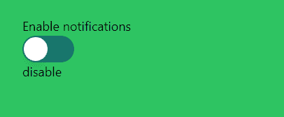

# 如何用 Next.js 创建一个无头 UI 开关

> 原文：<https://javascript.plainenglish.io/headlessui-switch-part-2-custom-label-46e98c5f76d?source=collection_archive---------4----------------------->

## 第 2 部分:向无头 UI 开关添加自定义标签

在本文中，我们将向交换机添加标签。用户可以点击标签来启用或禁用它，我们也可以使它不可点击。要向交换机添加自定义标签，我们需要添加交换机组。


Photo by [Max Duzij](https://unsplash.com/@max_duz?utm_source=medium&utm_medium=referral) on [Unsplash](https://unsplash.com?utm_source=medium&utm_medium=referral)

```
import { useState } from 'react'import { Switch } from '@headlessui/react'export default function MyToggle() {const [enabled, setEnabled] = useState(false)return (<><Switch.Group><div className="flex flex-col ">**<Switch.Label className="mr-4">Enable notifications</Switch.Label>**<Switchchecked={enabled}onChange={setEnabled}className={`${enabled ? 'bg-teal-900' : 'bg-teal-700'}relative inline-flex h-[38px] w-[74px] shrink-0 cursor-pointer rounded-full border-2 border-transparent transition-colors duration-200 ease-in-out focus:outline-none focus-visible:ring-2  focus-visible:ring-white focus-visible:ring-opacity-75`}><span className="sr-only">Use setting</span><spanaria-hidden="true"className={`${enabled ? 'translate-x-9' : 'translate-x-0'}pointer-events-none inline-block h-[34px] w-[34px] transform rounded-full bg-white shadow-lg ring-0 transition duration-200 ease-in-out`}/></Switch>{enabled ? <div>enable</div> : <div>disable</div>}</div></Switch.Group></>)}
```



为了使标签不可点击，添加`passive`道具到<开关。标签>:

```
<Switch.Label passive className="mr-4">Enable notifications</Switch.Label>
```


如果你喜欢这个故事，你可能也喜欢中等会员。一个月才 5 美元(一杯咖啡的价格！)但是它会在支持你最喜欢的作家的同时，给你无限的接触故事的机会。如果你用[这个链接](https://ckmobile.medium.com/membership)注册，我会赚一小笔佣金。谢谢！

关注我们: [YouTube](https://www.youtube.com/channel/UCu4-4FnutvSHVo9WHvq80Ww?sub_confirmation=1) ， [Medium](https://ckmobile.medium.com/) ， [Udemy](https://www.udemy.com/user/cyruschan2/) ， [LinkedIn](https://www.linkedin.com/company/ckmobi/) ， [Twitter](https://twitter.com/ckmobilejavasc1) ， [Instagram](https://www.instagram.com/ckmobile8050) ， [Gumroad](https://app.gumroad.com/ckmobile) ， [Quora](https://ckmobile.quora.com/) ， [Telegram](https://t.me/ckmobi)

加入分支机构赚钱

[](https://ckmobile.gumroad.com/affiliates) [## Gumroad

### 编辑描述

ckmobile.gumroad.com](https://ckmobile.gumroad.com/affiliates) 

*更多内容请看*[***plain English . io***](https://plainenglish.io/)*。报名参加我们的* [***免费周报***](http://newsletter.plainenglish.io/) *。关注我们关于*[***Twitter***](https://twitter.com/inPlainEngHQ)**和*[***LinkedIn***](https://www.linkedin.com/company/inplainenglish/)*。查看我们的* [***社区不和谐***](https://discord.gg/GtDtUAvyhW) *加入我们的* [***人才集体***](https://inplainenglish.pallet.com/talent/welcome) *。**