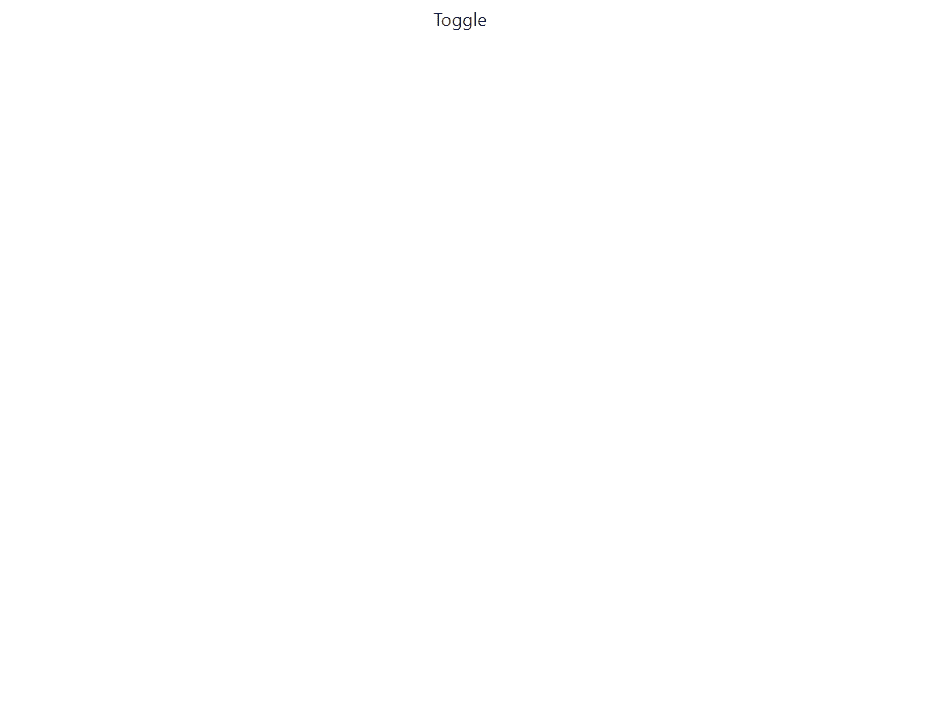

# HeadlessUI-过渡第 1 部分-基本示例

> 原文：<https://javascript.plainenglish.io/headlessui-transitions-part-1-basic-example-1e213b97a3ad?source=collection_archive---------6----------------------->

在本文中，我们将做一个<transition>组件基本示例。在[使用 Next.js](https://nextjs.org/docs/getting-started) 和[创建项目后，安装了 TailwindCSS](https://nextjs.org/docs/getting-started) 。</transition>


Photo by [James Harrison](https://unsplash.com/@jstrippa?utm_source=medium&utm_medium=referral) on [Unsplash](https://unsplash.com?utm_source=medium&utm_medium=referral)

安装无头用户界面

```
npm install @headlessui/react
```

## 创建组件

在根文件夹中，创建“components”文件夹，在该文件夹中创建 MyComponent.js。

```
import { Transition } from '@headlessui/react'import React, {useState} from 'react'const MyComponent = () => {const [isShowing, setIsShowing] = useState(false);return (<><button className="absolute top-2 " onClick={() => setIsShowing((isShowing) => !isShowing)}>Toggle</button><Transitionshow={isShowing}enter="transition-opacity duration-75"enterFrom="opacity-0"enterTo="opacity-100"leave="transition-opacity duration-150"leaveFrom="opacity-100"leaveTo="opacity-0">I will fade in and out</Transition></>)}export default MyComponent
```

然后转到 index.js，导入

```
import MyComponent from '../components/MyComponent'export default function Home() {return (<div className="grid place-items-center h-screen" ><MyComponent/></div>)}
```



如果你喜欢这个故事，你可能也喜欢中等会员。一个月才 5 美元(一杯咖啡的价格！)但是它会在支持你最喜欢的作家的同时，给你无限的接触故事的机会。如果你用[这个链接](https://ckmobile.medium.com/membership)注册，我会赚一小笔佣金。谢谢！

关注我们: [YouTube](https://www.youtube.com/channel/UCu4-4FnutvSHVo9WHvq80Ww?sub_confirmation=1) ， [Medium](https://ckmobile.medium.com/) ， [Udemy](https://www.udemy.com/user/cyruschan2/) ， [Linkedin](https://www.linkedin.com/company/ckmobi/) ， [Twitter](https://twitter.com/ckmobilejavasc1) ， [Instagram](https://www.instagram.com/ckmobile8050) ， [Gumroad](https://app.gumroad.com/ckmobile) ， [Quora](https://ckmobile.quora.com/) ， [Telegram](https://t.me/ckmobi)

*更多内容请看*[***plain English . io***](https://plainenglish.io/)*。报名参加我们的* [***免费周报***](http://newsletter.plainenglish.io/) *。关注我们上*[***Twitter***](https://twitter.com/inPlainEngHQ)[***LinkedIn***](https://www.linkedin.com/company/inplainenglish/)*[***YouTube***](https://www.youtube.com/channel/UCtipWUghju290NWcn8jhyAw)**和* [***不和***](https://discord.gg/GtDtUAvyhW) *对成长黑客感兴趣？检查* [***电路***](https://circuit.ooo/) ***。*****