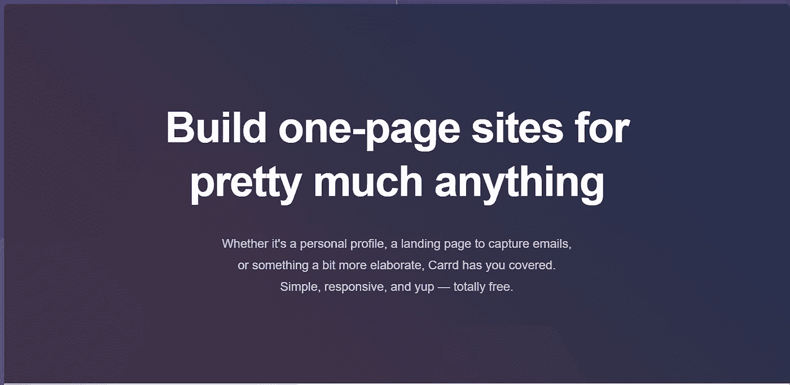

# 我用来扩展业务的 10 个重要网站、应用程序和工具

> 原文：<https://javascript.plainenglish.io/here-are-10-vital-websites-apps-tools-that-i-use-to-scale-my-business-fd74dba9a3d3?source=collection_archive---------3----------------------->

## 90%的人不知道所有这些应用程序

Photo by [alan KO](https://unsplash.com/@iyunmai?utm_source=medium&utm_medium=referral) on [Unsplash](https://unsplash.com?utm_source=medium&utm_medium=referral)

我们这一代人对商业、创业和副业感兴趣。是的，我就是其中之一，我喜欢有人推荐最棒的网站、应用程序或工具来发展或扩大我的业务。

最近几个月，我和一些初创公司合作过，甚至为自己创办了一家公司(目前处于早期阶段)。我能理解大多数时候处理这些可能很困难。此外，互联网上有些东西我们可以用来解决我们没有意识到的问题。

如果你不精通技术，也可能很难找到合适的工具，比如赢得客户、管理职责和向消费者销售。

因此，我将使用我熟悉的工具、网站或应用程序来帮助您。

我免费分享你们每一个人。没有任何网站的附属链接或促销。所以不要指望我在卖什么东西，我觉得大部分都是免费的。

听起来很棒？如果你想帮助我，你可以[关注我](https://nitinfab.medium.com/)，通过我的[推荐链接](https://nitinfab.medium.com/membership)成为一名普通会员，或者将此分享给你的朋友。就是这样。

我们开始吧。

## **1。日历**

当你开始创业时，你可能需要向专家学习，雇佣员工，联系客户，以及做许多其他事情。

[Calendly](https://calendly.com/) 是这个的唯一工具。然后，我可以与他们共享链接，他们可以根据他们的空闲时间安排通话。

它是市场上最好的工具之一，几乎每个公司都在使用它。

## **2。织机**

为了与开发者和消费者互动，我们有电子邮件、Slack 和其他工具。但是，如果我们需要向消费者或 IT 专家提供某些视觉效果(视频)呢？

我们不知道该做什么。可以，我们可以制作视频，分享给大家。

但是你也可以使用 [Loom](https://www.loom.com/) 分享你拍摄的视频。不打一对一的电话，和几千人联系也是可行的。

## **3。松弛度**

到目前为止，我已经在三家公司工作过，你会惊讶地发现，他们都利用空闲时间进行交流。

由于其易用性、可靠性和有用的特性，它是独一无二的产品。

## **4。Canva**

每个公司都必须制作一份演示文稿来展示他们的产品或服务。此外，如果你想开设课程，开设 YouTube 频道，或者成为一名平面设计师， [Canva](https://www.canva.com/) 可以帮助你。

## **5。观念**

目前为止我所知道的最好的网站之一。甚至，我已经写了一个帖子给[通过观念](/how-to-make-an-extra-500-every-month-with-this-easy-side-hustle-bac6fd48cdfe)赚钱。

根据网站的说法，这是一个你可以思考、写作和计划的中心。捕捉创意、管理项目，甚至运营一家完整的公司——按您的方式去做。

## **6。Carrd**

Source: Carrd

大多数现代创作者不需要 5-6 页的网站；相反，他们想要一个单页网站或模板来突出他们的职业生涯。

唯一的解决方案是 [Carrd](https://carrd.co/) 。

第一次使用后，我无法阻止自己告诉我所有的朋友。

但是什么是 Carrd 呢？从下图中你可以更好地理解它。

Src:

## **7。口香糖路**

我的一个朋友格雷西在 Gumroad 上提供数码产品。为了拓展业务，她免费赠送了一些数码产品。

你会惊讶地发现，至少有 20-30%的顾客会为免费商品付费。

另外，你们中的一些人可能对 Gumroad 很熟悉。如果不是，这是一个数字市场平台，用于自助出版数字服务，包括书籍、会员、课程和其他数字服务。

所以，如果你经营一家销售数码产品的企业，你应该考虑使用 Gumroad。

## **8。销售课程**

我的朋友大多是程序员和设计师，他们中的一些人提供他们的课程。当我们交流时，他们通常会推广 Udemy、Skillshare 和 Teachable 来销售课程。

建议基于几个方面，包括客户服务、高获客、广泛推广等等。

如果你想推广你的课程，试试这些平台。

## **9。扎皮尔**

所以，当我开始创业时，我不需要扎皮尔。不久之后，这些工具迅速吸引了我的注意力，我无法在我的项目上投入足够的时间。

在那之后，我开始利用扎皮尔。即使是现在，我也无法回避。

但是 Zapier 到底是什么？这是一个简单的自动化任务的工具。您可以连接超过 3000 个应用程序，包括 Gmail、Slack、Mailchimp、Discord、Typeform、YouTube、Stripe 等。

## 10。自由

我用过的最棒的工具之一。大多数时候，当你需要专注于你的工作时，会有通知、应用程序和其他分心的事情占用你的时间。

为此你可以利用自由。根据他们的[官方网站](https://freedom.to/)，Freedom 是 Mac、Windows、Android、iOS 和 Chrome 的应用和网站拦截器，超过 200 万人使用它来恢复注意力和生产力。

就这样——谢谢。

[*如果你喜欢阅读这样的故事，并想帮助我成为一名作家，请考虑成为一名中等成员*](https://nitinfab.medium.com/membership) *。每月花费 5 美元，你可以无限制地访问媒体内容。如果你通过我的链接注册，我会得到一点佣金。*

 [## 作为一名开发者，你可以在睡觉的时候用 5 种不同的方式赚钱

### 不要指望博客，媒体，YouTube

javascript.plainenglish.io](/5-different-ways-you-can-make-money-as-a-developer-while-you-sleep-ad54715b6ad7)  [## 如何用这种简单的方法每月多赚 500 美元

### 没有废话，请不要期待博客，YouTube，自由职业者，或媒体

javascript.plainenglish.io](/how-to-make-an-extra-500-every-month-with-this-easy-side-hustle-bac6fd48cdfe) 

*更多内容请看* [***说白了就是***](http://plainenglish.io/) *。报名参加我们的* [***免费每周简讯***](http://newsletter.plainenglish.io/) *。在我们的* [***社区不和谐***](https://discord.gg/GtDtUAvyhW) *获得独家获取写作机会和建议。*