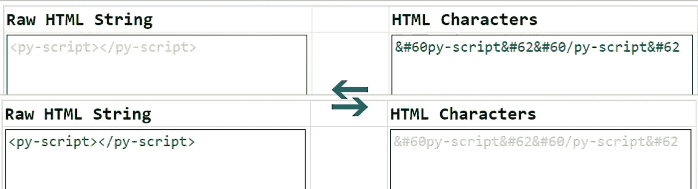

# 2 编码/解码 HTML 实体的 JavaScript 方法

> 原文：<https://javascript.plainenglish.io/here-are-2-javascript-approaches-to-encode-decode-html-entities-52989bb12031?source=collection_archive---------0----------------------->

## 不需要插件。2 个策略— (1)一个 <textarea>HTML 元素& (2) Regex 模式实现。</textarea>

在直接进入实现细节之前，下面旨在分别展示 HTML 代码片段的编码/解码，以便为本文的其余部分指定上下文:



Image by Author | Showcases the raw html string **<py-script></py-script>** transformed into unicode characters **&#60py-script&#62&#60/py-script&#62** and vice-versa

# 为什么这是必要的？

一般来说，技术文档通常包含代码片段作为其内容的一部分，以供读者将来自我参考。因此，当这些前述文档被数字编译并以 HTML 格式呈现时，对代码片段的 HTML 实体进行编码对于正确显示和查看是必要的。典型的例子是，请随时查看下面这篇文章，这篇文章强调了在任何 HTML 格式的文档中显示代码片段的各个方面:

[](https://medium.com/weekly-webtips/6-useful-but-lesser-known-html-tags-attributes-9e9f2c0208c4) [## 6 个有用但鲜为人知的 HTML 标签和属性

### 这些标签的存在是有充分理由的…包括示例+用例。

medium.com](https://medium.com/weekly-webtips/6-useful-but-lesser-known-html-tags-attributes-9e9f2c0208c4) 

*   **注:标签<代码>和< pre >在以上内容中特别举例说明。**

正如另一位媒体作家 [Vit Tertiumnon](https://medium.com/u/d77a278794a1?source=post_page-----52989bb12031--------------------------------) 在他的文章中所说:

 [## JS:如何解码 HTML 实体

### 如果你想把 和其他 HTML-entities 改成普通的特殊字符。

tertiumnon.medium.com](https://tertiumnon.medium.com/js-how-to-decode-html-entities-8ea807a140e5) 

> *没有编码或解码 HTML 实体的 JavaScript 内置功能。*

因此，我也相信，为在线社区中的其他人分享两种不同的(经过验证的)以编程方式执行这项任务的方法是有益的。

## 方法一.使用一个 <textarea>HTML DOM 元素</textarea>

(注意:这只是一个免责声明，这种方法最初来自同一位媒体作家 [Vit Tertiumnon](https://medium.com/u/d77a278794a1?source=post_page-----52989bb12031--------------------------------) 的文章，但做了一些调整)

*   要编码:

```
function encodeHTMLEntities(text) {
  let textArea = document.createElement('textarea');
  textArea.innerText = text;
  let encodedOutput=textArea.innerHTML;
  let arr=encodedOutput.split('<br>');
  encodedOutput=arr.join('\n');
  return encodedOutput;
}
```

*   用法:

```
let sampleRawHTMLStr="<py-script></py-script>";
let encodedOutput=encodeHTMLEntities(sampleRawHTMLStr);
// output: &lt;py-script&gt;&lt;/py-script&gt;
```

*   要解码`encodedOutput`:

```
function decodeHTMLEntities(text) {
  let textArea = document.createElement('textarea');
  textArea.innerHTML = text;
  return textArea.value;
}
```

*   用法:

```
let decodedOutput=decodeHTMLEntities(encodedOutput);
// output: <py-script></py-script>
```

## 方法二。使用正则表达式模式

或者，也可以在 JavaScript 中使用正则表达式模式来获得与上面类似的理想输出:

*   要编码:

```
function encodeHTMLEntities(rawStr) {
  return rawStr.replace(/[\u00A0-\u9999<>\&]/g, ((i) => `&#${i.charCodeAt(0)};`));
}
```

*   用法:

```
let sampleRawHTMLStr="<py-script></py-script>";
let encodedOutput=encodeHTMLEntities(sampleRawHTMLStr);
// output: &#60;py-script&#62;&#60;/py-script&#62;
```

*   要解码`encodedOutput`:

```
function decodeHTMLEntities(rawStr) {
  return rawStr.replace(/&#(\d+);/g, ((match, dec) => `${String.fromCharCode(dec)}`));
}
```

*   用法:

```
let decodedOutput=decodeHTMLEntities(encodedOutput);
// output: <py-script></py-script>
```

# 方法一和方法二概述

基于各自的输出，这两种方法都成功地对`<py-script></py-script>`进行了编码

**I. < textarea >方法**

```
&lt;py-script&gt;&lt;/py-script&gt;
```

**二。正则表达式方法**

```
&#60;py-script&#62;&#60;/py-script&#62;
```

前者呈现为 *Unicode 字符，而*后者以*十进制*格式编码每个 HTML 实体。然而，这两种方法在 HTML 文档中的显示并无不同:

```
<py-script></py-script>
```

*   实际演示可点击查看[。](https://incubated-geek-cc.github.io/html-encode-decode/)
*   请随意参考 [html_entities](https://www.w3schools.com/charsets/ref_html_entities_4.asp) 获取 html 实体及其编码对应的完整列表。

## 个人评论

总的来说，我个人更喜欢后者的方法(即使用正则表达式模式)，因为代码更干净，但这完全取决于个人偏好。理想情况下，整个网页的编码标准是一致的，以便于维护。

**最后但同样重要的是，请在评论中提出更有效的方法！(计算速度提高或代码更简洁)。会非常有兴趣知道任何替代方案！** —😀

现在你知道了！非常感谢你坚持到这篇文章的结尾！❤希望这篇文章对你有所帮助，如果你想了解更多地理信息系统(GIS)、数据分析和 Web 应用相关的内容，请随时关注 Medium 。会非常感激—😀

— 🌮请给我买一份玉米卷🎀˶❛◡❛)

[](https://geek-cc.medium.com/membership) [## 通过我的推荐链接加入灵媒——李思欣·崔

### 获得李思欣·崔和其他作家在媒体上的所有帖子！😃您的会员费直接…

geek-cc.medium.com](https://geek-cc.medium.com/membership) 

*更多内容看* [***说白了。报名参加我们的***](https://plainenglish.io/) **[***免费周报***](http://newsletter.plainenglish.io/) *。关注我们关于*[***Twitter***](https://twitter.com/inPlainEngHQ)*和*[***LinkedIn***](https://www.linkedin.com/company/inplainenglish/)*。查看我们的* [***社区不和谐***](https://discord.gg/GtDtUAvyhW) *加入我们的* [***人才集体***](https://inplainenglish.pallet.com/talent/welcome) *。***