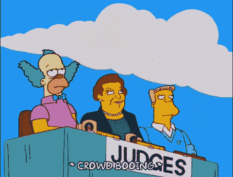

# 以下是你的工作可能有毒的三个奇怪原因

> 原文：<https://javascript.plainenglish.io/here-are-3-weird-reasons-why-your-job-may-be-toxic-ecdba82929cc?source=collection_archive---------16----------------------->

## 我花了 12 周的时间才发现开发人员是一份有毒的工作。

Photo by [Pesce Huang](https://unsplash.com/@pesce?utm_source=unsplash&utm_medium=referral&utm_content=creditCopyText) on [Unsplash](https://unsplash.com/?utm_source=unsplash&utm_medium=referral&utm_content=creditCopyText)

在你的工作场所忽略 2 到 3 个危险信号是我们所有人都倾向于做的事情，但是在你的工作场所忽略大量的危险信号是你应该避免的。

在你的工作中有大量的危险信号意味着你的工作更有可能是一份有毒的工作，从事有毒的工作有很多缺点。最严重的缺点是你将不再享受你的个人生活。

如果你还在考虑你的工作是否有毒，那么让我给你一些有针对性的理由，这些理由很可能告诉你你的工作有毒。

## 想想你的工作会让你起鸡皮疙瘩

正常人起鸡皮疙瘩主要有两个原因。首先是因为兴奋，其次是因为恐惧。

如果当你想到你的工作时因为兴奋而起鸡皮疙瘩，那么你爱你的工作和你的老板。因此，继续为你的公司服务。

另一方面，如果你在思考工作时感到害怕，那么有些事情就不好了。即使想到你的工作让你感到疲惫和压力——这与工作无关——那么恭喜你，你的工作是有毒的。

如果你觉得自己无法平静地睡上至少 7 到 8 个小时，那么你的工作就是有毒的，你必须对此做些什么。

如果你的饮食习惯因为你的工作而被打乱，那么很可能这是你从事有毒工作的另一个迹象。

## 你的工作生活平衡将会被破坏

我有一个叫凯利的朋友，他每周日都要准备文件，我很确定这是有毒工作的另一个常见迹象。

除了工作，你的个人生活也同样重要。每当你认为你的个人生活在很大程度上受到了工作的影响，那么再次恭喜你，你的工作是有毒的。

如果你的工作让你感到筋疲力尽，那么你可能会考虑放慢一点速度，分析出了什么问题。

如果你的老板坚持让你加班却没有额外报酬，那么你必须意识到这里有些地方不好。如果你加班几个月却没有额外报酬，你的工作很可能是有害的。

## 完全没有增长

[Giphy](https://media.giphy.com/media/l2JdYkTPVG9gRbvhK/giphy.gif)

在美国，每个季度的通胀率都在 7%左右，与前几年的通胀数据相比，这是非常高的。这仅仅意味着 100 美元的商品现在要花 107 美元。

7%的通货膨胀率和不加薪就像随着时间的推移而下降。你的工资保持不变，而价格却以前所未有的速度逐年上涨。

我有一个朋友，拿着同样的工资工作了 3 年，我向他解释了什么是通货膨胀。他把这件事告诉了他的老板，现在他的工资每年上涨 5%,比以前的 0%还高。

这个故事的寓意是，如果你应该拿着同样的薪水工作很多年，那么你的工作对一些人来说可能听起来有毒。

我有另一个朋友，他在工作场所什么也没学到，他的知识停滞不前，就像公司的财务状况一样。我警告过他三次，升级是必须的，获得经验是必须的。他答应我用一切可能的方式提升自己。

如果你觉得你的公司在很长一段时间内增长率为 0%，那么你的工作可能是有害的。

关于我——我是*科技*和*自我提升* [*的顶级作家点击这里*](https://aniketz.medium.com/) *阅读更多我的文章。*

如果你想购买 5 美元的中等会员 [*点击这里*](https://aniketz.medium.com/membership) (你用 [*这个链接*](https://aniketz.medium.com/membership) 购买中等会员，我会从你的会员费中拿一小部分作为佣金)。如果你想订阅我的邮件列表，那么请点击**。**

* [## 通过我的推荐链接加入 Medium-Aniket

### 作为一个媒体会员，你的会员费的一部分会给你阅读的作家，你可以完全接触到每一个故事…

aniketz.medium.com](https://aniketz.medium.com/membership)* 

*[**通过电子邮件获取我的文章点击这里**](https://aniketz.medium.com/subscribe) **|** [**购买 5 美元中等会员**](https://aniketz.medium.com/membership)*

**更多内容请看*[***plain English . io***](https://plainenglish.io/)*。报名参加我们的* [***免费每周简讯***](http://newsletter.plainenglish.io/) *。关注我们关于*[***Twitter***](https://twitter.com/inPlainEngHQ)*和*[***LinkedIn***](https://www.linkedin.com/company/inplainenglish/)*。加入我们的* [***社区不和谐***](https://discord.gg/GtDtUAvyhW) *。**