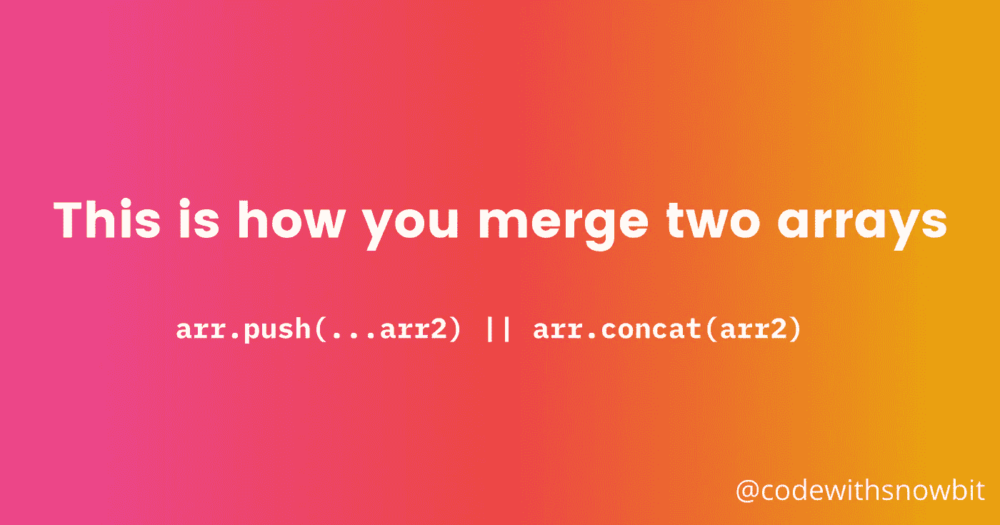
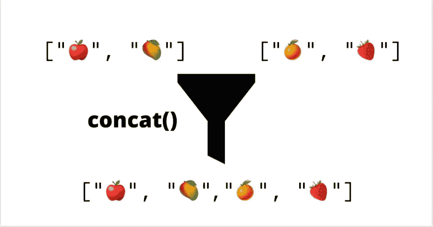
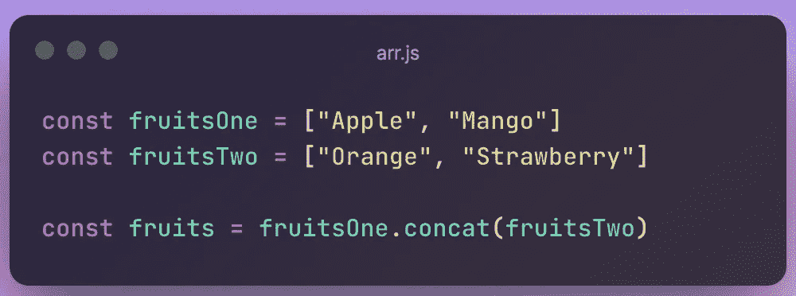
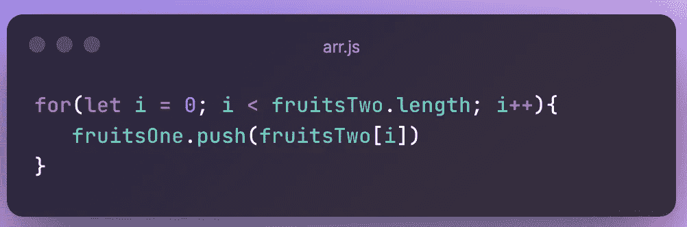

# 如何在 JavaScript 中合并数组

> 原文：<https://javascript.plainenglish.io/here-are-a-few-ways-to-merge-array-5d729a3709da?source=collection_archive---------15----------------------->

## JavaScript 中合并两个数组的几种方法。

# 大家好👋

朋友们好，我是**雪球**。我是一个年轻的热情和自学前端网站开发人员，并打算成为一名成功的开发人员。

今天，我在这里讨论一个简单但重要的 JavaScript 话题。在本文中，我将讨论几种合并数组的方法，您可以在下一个项目中合并数组时使用这些方法。

# 🌟介绍

数组是一个有序列表，数组中的每个值被称为一个由**索引**指定的**元素**。数组可以存储以下类型的数据:

*   数字
*   线
*   布尔型

# 用 concat()方法合并数组

*   concat()方法连接两个或多个数组，并返回一个包含连接数组的新数组，而不改变原始数组。

# 使用 push()方法合并

*   push 方法将元素添加到现有数组的末尾。
*   在这里，数组中的项被推送到原始数组，从而更新原始数组。
*   可以用两种方式使用 push()方法合并数组:
    **1)使用 spread 操作符和 2)使用 for 循环。**
*   spread 操作符是更好的方法，因为它可以保持代码的整洁和效率。

*   一个可以使用`for loop`；我不建议你用那个，因为你知道我在展示这个方法。

所以，这就是这篇文章，我希望这篇文章对你有所帮助。

感谢您的阅读，祝您愉快！

你的欣赏是我的动力😊—同样给予

*   在 Twitter 上关注我— [@codewithsnowbit](https://twitter.com/codewithsnowbit)
*   在 YouTube 上订阅我— [用雪球编码](https://www.youtube.com/channel/UCNTKqF1vhFYX_v0ERnUa1RQ?view_as=subscriber&sub_confirmation=1)

*更多内容请看* [***说白了就是***](http://plainenglish.io/) *。报名参加我们的**[***免费每周简讯***](http://newsletter.plainenglish.io/) *。在我们的* [***社区***](https://discord.gg/GtDtUAvyhW) *获得独家获得写作机会和建议。**