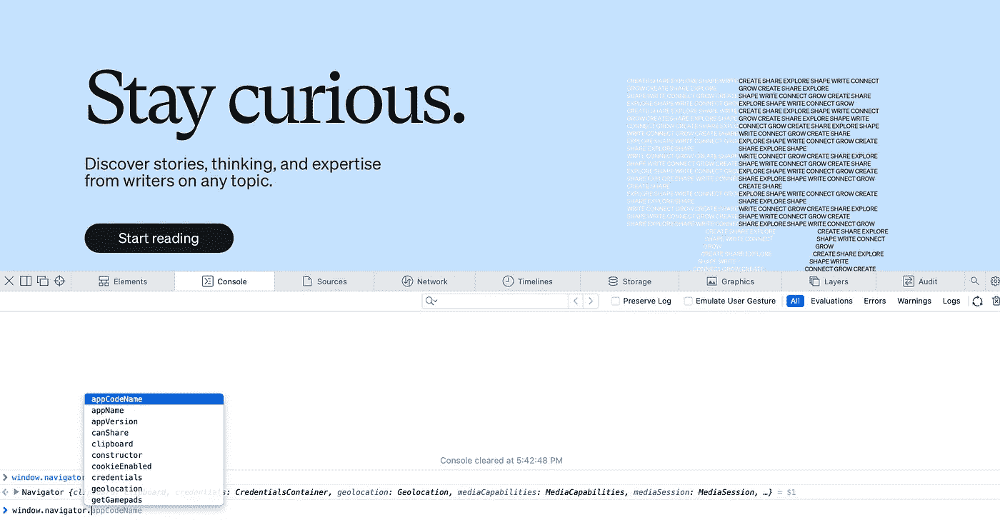

# 以下是前端 Web 开发人员如何获取您的浏览器信息

> 原文：<https://javascript.plainenglish.io/heres-how-frontend-web-developers-get-your-browser-information-d2c86133fbbd?source=collection_archive---------16----------------------->

## 这 6 个内置的单行代码识别设备和浏览器特定的信息。


Photo by [KOBU Agency](https://unsplash.com/@kobuagency?utm_source=unsplash&utm_medium=referral&utm_content=creditCopyText) on [Unsplash](https://unsplash.com/s/photos/browser?utm_source=unsplash&utm_medium=referral&utm_content=creditCopyText)

开发 web 应用程序的前端是一个繁琐而耗时的过程。不是因为它很难编码，而是因为它需要很高的精确度，开发人员需要遵循大量的规则。与 Android 或 IOS 不同，web 有很多种类，或者你可以说 web 上有不同的浏览器，浏览器标准有些不相似。一个 web 开发人员需要照顾到所有这些。

当涉及到开发 web 应用程序时，基于功能的可用性而不是针对特定的浏览器来逐步增强自己的 web 应用程序总是明智的。因此，有时开发人员需要检测浏览器信息来修复特定于浏览器的错误。

开发人员访问这些信息的方式可以根据开发人员的需求和要求而有所不同，但在大多数情况下，开发人员需要通过浏览器来获取这些信息。

这篇文章将帮助开发者通过浏览器的内置对象属性来检测关于网络浏览器和设备的信息。

开发人员可以借助浏览器内置的窗口对象提供的导航器对象来访问浏览器信息。人们可以在使用 Javascript 的 web 浏览器的控制台中找到它。如果你正在阅读这篇文章，你可以按照下面的命令来尝试这一行代码。
***点击鼠标右键进入“检查元素”部分。***



Screenshot By Author

# 1.平台

导航器的 platform 属性返回为其编译的计算机的平台。

```
window.navigator.platform
```

# 2.在线的

判断某人是否在线的一个简单方法是使用 navigator 对象的 online 属性。online 属性返回一个 boolean 值，该值表示用户的网络状态。

```
window.navigator.online
```

# 3.分享

如果我们想让 web 处理从一个应用程序到另一个应用程序的数据共享，就像你在手机上看到的那样，我们可以使用 navigator share 属性。有很多方法可以达到同样的效果，但这是最简单的。

```
window.navigator.share
```

# 4.语言

要检测网站的当前语言设置，可以使用 navigator 对象的 language 属性。

```
window.navigator.language
```

# 5.用户代理

如果你想知道 web 开发人员是如何检测到用户在使用什么——web 还是手机，那就是因为这个特性。

```
window.navigator.useragent
```

另一种检测方法是检查屏幕上的接触点数量，但我会将该信息留待日后使用。

# 6.Cookie 已启用

此属性将返回 web cookies 是否已启用。在 web 上设置 cookie 之前，了解用户是否允许它出现在 web 上是至关重要的。有其他高级方法可以做到这一点，但这将让开发人员很好地了解正在发生的事情。有时候，在调试大型应用程序的代码时，这是非常高效的。

```
window.navigator.cookieEnabled
```

这就是这篇文章的内容。感谢您阅读我的帖子，并走了这么远。

如果你喜欢这篇文章，你也可以看看我的其他文章。

[](/3-ways-senior-developers-stay-up-to-date-with-technology-trends-859f55566cfe) [## 高级开发人员紧跟技术趋势的 3 种方法

### 如何做一名高级开发人员，即使你不是。

javascript.plainenglish.io](/3-ways-senior-developers-stay-up-to-date-with-technology-trends-859f55566cfe) [](/10-engineering-blogs-i-read-to-stay-up-to-date-with-technology-trends-faa006460fd9) [## 我阅读的 10 个工程博客，以跟上技术趋势

### 2022 年及以后的顶级工程博客。

javascript.plainenglish.io](/10-engineering-blogs-i-read-to-stay-up-to-date-with-technology-trends-faa006460fd9) [](/a-programmer-wronged-some-young-founders-and-no-one-is-talking-about-it-85bb25fd5521) [## 一个程序员冤枉了一些年轻的创始人，却没有人谈论这件事

### 程序员们，不要在你们公司尝试这个。

javascript.plainenglish.io](/a-programmer-wronged-some-young-founders-and-no-one-is-talking-about-it-85bb25fd5521) [](/12-terminal-commands-i-use-every-day-as-a-developer-4a38135ab305) [## 作为开发人员，我每天使用的 12 个终端命令

### 作为软件开发人员如何有效地使用计算机终端

javascript.plainenglish.io](/12-terminal-commands-i-use-every-day-as-a-developer-4a38135ab305) 

使用 [**我的会员链接**](https://karanjagota.medium.com/membership) 订阅 Medium，这样你就可以欣赏我所有的文章，让我们一起让这一年成为你生命中的一年。

**你觉得这篇文章有帮助吗？作为一名前端开发人员，我是否错过了您做的一些事情？请在评论区告诉我。我很想知道你对此的看法。**

*更多内容看* [***说白了就是 io***](https://plainenglish.io/) *。报名参加我们的* [***免费周报***](http://newsletter.plainenglish.io/) *。关注我们关于*[***Twitter***](https://twitter.com/inPlainEngHQ)*和*[***LinkedIn***](https://www.linkedin.com/company/inplainenglish/)*。加入我们的* [***社区***](https://discord.gg/GtDtUAvyhW) *。*