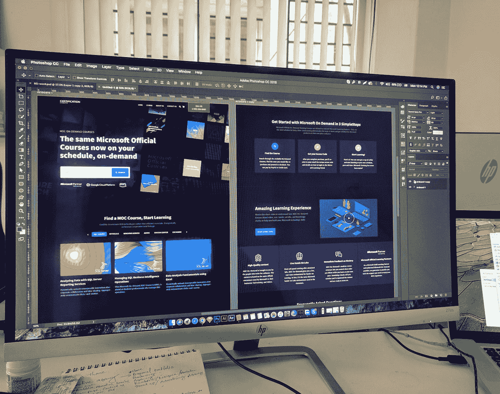

# 以下是你如何通过销售用户界面/UX 设计额外赚取 500 美元的方法

> 原文：<https://javascript.plainenglish.io/heres-how-you-can-make-an-extra-500-selling-ui-ux-designs-233aa6e549b3?source=collection_archive---------4----------------------->

## 赚取额外收入的循序渐进的方法。

Photo by [Eftakher Alam](https://unsplash.com/@easiblu?utm_source=medium&utm_medium=referral) on [Unsplash](https://unsplash.com?utm_source=medium&utm_medium=referral)

我之前发表了一篇关于如何通过各种兼职赚钱的指南。从那时起，许多人要求每个主题的详细指南。所以我从这个开始。

首先，让我向你保证，通过 UI 设计赚钱是可能的，我将演示如何赚钱。

别担心，你不用花一毛钱去学习这个过程，也不用花一毛钱去卖你的设计。

请记住，这不是一个赞助的帖子，我写它没有得到任何报酬。我的主要目标是为你提供有用的内容，帮助你使自己变得有价值并赚钱。

激动吗？让我们开始吧。

1.  **学习 UI/UX 设计**

如果你是一名网页开发人员、网页设计师或平面设计师，制作和销售设计将会很简单。

如果没有，有各种 YouTube 频道和网站，你可以在那里了解设计，获得灵感，并创造自己的设计。

你可以从 freeCodeCamp、 [DesignCourse](https://www.youtube.com/c/DesignCourse) 和许多其他类似的 YouTube 频道获取设计教程。

老实说，我最初专注于网站的开发方面，但我很快明白网站的设计方面要重要得多。

用户将看不到你使用过什么语言或者你开发过什么框架。用户将看到网站(有吸引力的设计)，它运行的速度，以及它如何可能对用户有用。

就在那时，我试图学习设计。

**2。选择平台，开始设计**

最好能应用你所学的东西。否则，你会失去你的天赋，浪费你的时间。这就是为什么每次我学习新东西的时候，我都试图用它来让自己变得更有价值，实现一些东西，或者用它来赚钱。

我也用我的设计能力做了同样的事情。选择 Figma 是因为它是免费的，并且被大多数设计师使用。

有几个平台可以用来创建设计，如 Adobe XD、Sketch 等。

然而，他们中的一些人是有报酬的。嗯，你不需要投入任何资金，因为一些平台，如 Figma，可以免费使用，并提供许多功能。

**3。在线平台销售**

准确地说，当你刚开始你的设计生涯时，没有人会给你提供工作。

主要原因是没有人知道你或你的能力，你需要一些练习来成为这方面的专家。

这是你可以开始侧推的地方。不要设计然后删除你的设计，试着把它们上传到不同的在线平台。

我主要使用 Themeforest 和 Creative Market，尽管还有很多其他选择。

我将使用我之前的一篇文章中的一个例子。

source: Themeforest

这是一个真实的例子。我去了一个叫 Themeforest 的网站，寻找 Figma UI 布局。

你可以看到开发者提供的 UI 模板价格分别为 32 美元、24 美元和 19 美元。

以 Rocketboard UI 模板为例。它售价 32 美元，迄今已售出 289 台。所以设计师一共赚了 9248 美元(包括设计师要付给平台的佣金)。

是不是很酷？

你可以用同样的方式在平台上销售。但是，请不要在这些网站上出售你的任何想法；相反，练习和改进你的设计，直到你相信它有益于他人。

我知道这是一个非常基本和简单的教程，任何人都可以遵循。所以不要浪费任何时间，现在就开始吧。

就这样——谢谢。

[*如果你喜欢看这样的故事，并想帮助我成为一名作家，可以考虑成为一名中等会员*](https://nitinfab.medium.com/membership) *。它每月花费 5 美元，给你* [*无限制访问媒体内容*](https://nitinfab.medium.com/membership) *。如果你通过我的链接注册，我会得到一点佣金。*

*更多内容看* [***说白了就是***](https://plainenglish.io/) *。报名参加我们的* [***免费周报***](http://newsletter.plainenglish.io/) *。关注我们* [***推特***](https://twitter.com/inPlainEngHQ) *和*[***LinkedIn***](https://www.linkedin.com/company/inplainenglish/)*。查看我们的* [***社区不和谐***](https://discord.gg/GtDtUAvyhW) *加入我们的* [***人才集体***](https://inplainenglish.pallet.com/talent/welcome) *。*