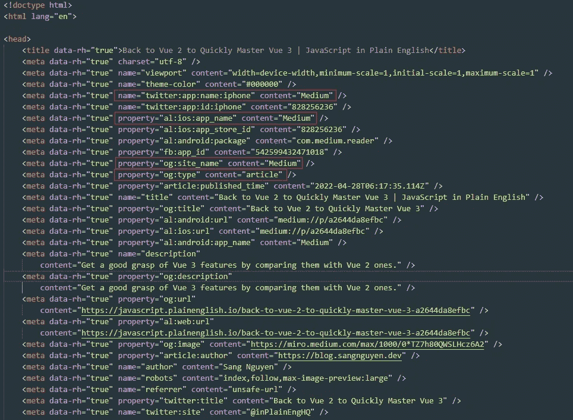
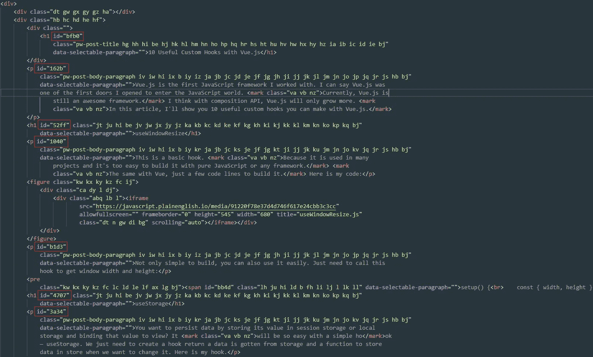

# 以下是我在为 Medium 构建 Chrome 扩展时学到的东西

> 原文：<https://javascript.plainenglish.io/heres-what-i-learned-when-i-built-a-chrome-extension-for-medium-ca228743a198?source=collection_archive---------9----------------------->

## 这些是我在为 Medium 做了 Chrome 扩展后学到的东西


Photo by [Scott Graham](https://unsplash.com/@homajob?utm_source=medium&utm_medium=referral) on [Unsplash](https://unsplash.com?utm_source=medium&utm_medium=referral)

我为 Medium 做了第一个 Chrome 扩展。这是我第一次做那样的延伸。在构建的时候，我研究了一些媒体来构建我的特性。所以今天，我将在这篇文章中与你分享它们。

# 这个扩展是做什么的？

来说说我建的扩展吧。这个扩展允许用户复制代码块中的内容，复制段落的 URL 并生成目录。为此，我需要回答一些问题来构建它。

*   第一个问题是如何检测当前网站是否中等。
*   第二个问题是如何列出项目来制作目录。

在接下来的部分，我会谈谈如何回答这些问题，以及我从中学到了什么。

# 如何检测一个当前网站是否中等？

这是我开始构建任何扩展时首先考虑的问题。如果你想建立一个运行在任何网站上的扩展，你可能不需要关心这个。但是在这种情况下，您的扩展构建为在一个特殊的网站上运行。在我的可选中，我们应该考虑这一点。因为我们不想在其他网站上运行不必要的脚本。

要做到这一点，我们有很多方法。我们可以使用简单的方法，在我的脚本中添加一个条件来检测当前的 URL，如下所示:

```
if(window.location.host.startsWith('medium.com')) {
  // Run your script
}
```

这是一个简单的方法。但是因为某些原因我真的不喜欢它。第一个原因是我们仍然需要运行脚本内容。这种情况可以帮助我们避免执行整个脚本。但是我们的 Javascript 文件中的脚本仍然被执行。

为了解决这个问题，我们可以用`manifest.json`尝试另一个解决方案。在`content_scripts`中，我们可以定义`matches`属性，让浏览器知道哪个网站将运行我们的脚本。

```
{
  "content_scripts": [
    {
      "matches": ["https://*.medium.com/*"].
      "js": ["/path/to/your/script"]
    }
  ]
}
```

我试试上面的解决方案。这是一个很好的解决方案，但我有一个问题。正如我所说的，我们可以使用“匹配”属性来定义我们想要运行脚本的网站模式。但是 Medium 并不只有“medium.com”这个域名。Medium 允许用户将其域用作自定义域，而不是使用 Medium 域。这意味着除了域名“medium.com ”,我们还处理自定义域名。用户可以使用任何他们想要的域名。所以这种情况下`matches`物业帮不了我们。他们需要将其值更改为“*://*/*”，并在我们的脚本中处理检测。

在我尝试了一些方法来检测网站是媒体后，我找到了一种方法。我们需要从一些元标签中获取数据，并使用这些值进行检测。有一些我从中型文章页面 HTML 中得到的 meta 标签。



在这张照片中，我们有一些包含值“Medium”的数据标签。我们可以用它们来检测一个网站是否是一个中等网站。如果我们想检查当前的媒体页面是一个文章页面，我们可以对“og:type”属性再做一次检查。下面是一个示例代码:

```
function isMedium() {
  const site = document.querySelector('meta[property="og:site_name"]');
  return site && site.content === 'Medium';
}

function isMediumArticlePage() {
  if(!isMedium()) {
    return false;
  }

  const type = document.querySelector('meta[property="og:type"]');
  return type && type.content === 'article';
}
```

如您所见，我只是检查了 meta 标记的内容值，该标记有一个属性值“og:site_name”。为了检测文章页面，我们只需要再检查一次属性值为“article”的 meta 标签。

在这一部分，我有一些笔记。首先要注意的是，我们检测网站是中型的方式取决于我们想要运行脚本的页面。如果你只在有固定域名的网站上运行你的脚本(中型主页，中型管理页面…)，你可以使用`matches`属性`menifest.json`为它定义一个模式。但是如果你想在有自定义域的页面上运行你的脚本，你需要在你的脚本中处理它。第二个注意事项是在我们的脚本中检测网站的方式。我们有很多方法可以做到这一点。我的方法是使用 meta 标签的内容值。它帮助我们知道网站属于媒体，即使它是一个自定义域。

# 在目录中列出标题的方法

在这一部分，我将谈谈我在构建两个函数 TOC 和 Copy Code 时所做的研究。

第一个功能是生成 TOC。为此，我们需要知道那篇文章的标题是什么。换句话说，我们需要知道 Medium 是如何管理它的块的。在网上研究和检查文章的 HTML 之后，我理解了媒体块的基本规则。我将在这里展示一小段 HTML 代码。



如你所见，我们在一篇文章中有许多区块。每个块都有自己的 ID。许多 HTML 标签可能会成为一个块，这取决于块的任务。我们用`<p>`表示段落，`<pre>`表示代码块，`<h1>`表示标题…从这些信息中，我们可以从 HTML 标签中检测出一个代码块何时是标题块。我的工作只需要创建一个演示文章，并找到包含标题标题的 HTML 标签。之后，我只需要创建一个包含链接到 id 的标签的列表。

如果你想在文章发表前创建一个目录(在写作页面上)，你可以用同样的方法。您只需要将“id”属性更改为“name”属性。当本文发布时，块的“名称”将被转换为“名称”属性。

# 其他注释

除此之外，我还有一些其他的笔记给你。

第一个注意事项与 SPA 有关。Medium 是一个单独的页面，所以当用户点击一个链接时，它可能会通过 SPA 的方式重定向到这个页面。这意味着当用户转到其他页面时，你的脚本可能不会运行。如果您有一个每次页面加载时都要运行的脚本，那么您应该关心这个问题。在我的例子中，我只是用一个简单的代码通过`MutationObserver`和`location`来处理它。它看起来会像这样:

```
function startYourScript() {
  let previousUrl = '';
  const observer = new MutationObserver(function(mutations) {
    if (location.href !== previousUrl) {
      previousUrl = location.href; // Renew the current URL
      // You can run your script here
    }
  });
  observer.observe(document, {subtree: true, childList: true});
}
```

这是我的函数的一个简单版本。这个概念是让一个“观察者”跟随当前的 URL。当这个 URL 改变时，我们只需要再次运行我们的脚本。

第二个注意不仅仅是关于中等扩展。它适用于所有站点。如果你想为列表中的项目显示一个小部件或按钮，你不应该把它直接添加到原来的 HTML 中。当用户执行某些操作时，它们可能会被删除。或者更糟糕的是，它可能会使原有的功能或风格出现一些问题。

# 结论

这些都是我想在这篇文章中分享的东西。我喜欢在介质上写作和阅读，所以我也喜欢做一些东西来提高我的阅读体验。为 Medium 构建一个 Chrome 扩展是一种有趣的体验。我学到了很多新东西。希望对大家有用。如果你想使用我的扩展，你可以在这里安装。


Photo by [Ales Krivec](https://unsplash.com/@aleskrivec?utm_source=medium&utm_medium=referral) on [Unsplash](https://unsplash.com?utm_source=medium&utm_medium=referral)

感谢您的阅读。如果您有任何反馈或建议，请随时通过 [Linkedin](https://www.linkedin.com/in/thaisangnguyen3894/) 或 [Twitter](https://twitter.com/tasyit) 联系我。

*更多内容请看*[***plain English . io***](https://plainenglish.io/)*。报名参加我们的* [***免费周报***](http://newsletter.plainenglish.io/) *。关注我们关于*[***Twitter***](https://twitter.com/inPlainEngHQ)[***LinkedIn***](https://www.linkedin.com/company/inplainenglish/)*[***YouTube***](https://www.youtube.com/channel/UCtipWUghju290NWcn8jhyAw)*[***不和***](https://discord.gg/GtDtUAvyhW) ***。*****

*****对缩放您的软件启动感兴趣*** *？检查* [***电路***](https://circuit.ooo/?utm=publication-post-cta) *。***