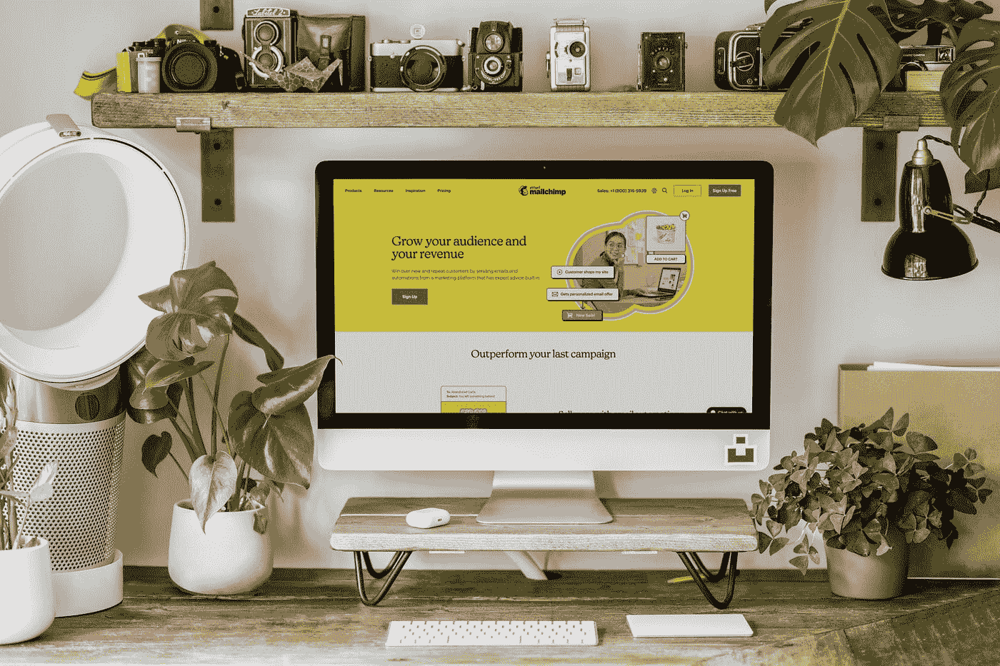
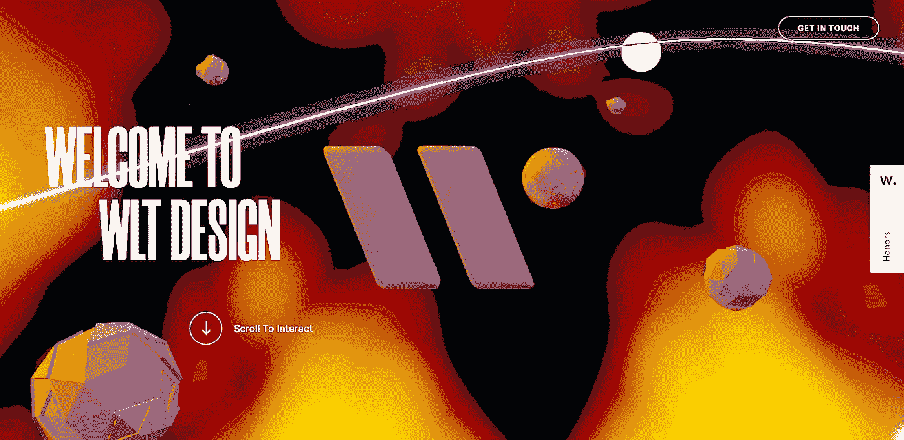
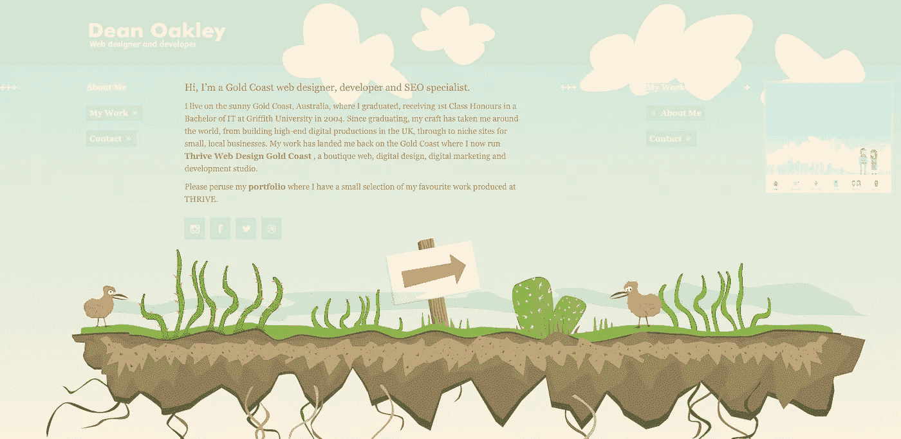
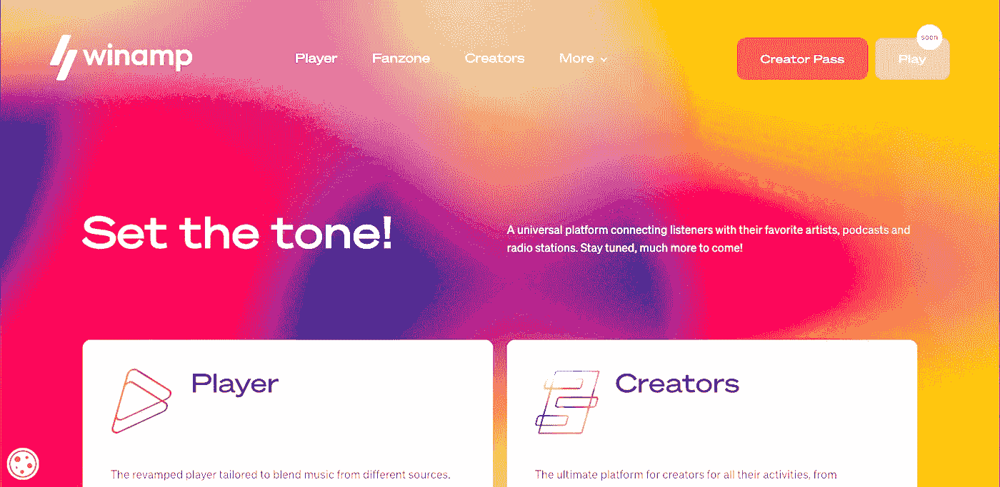
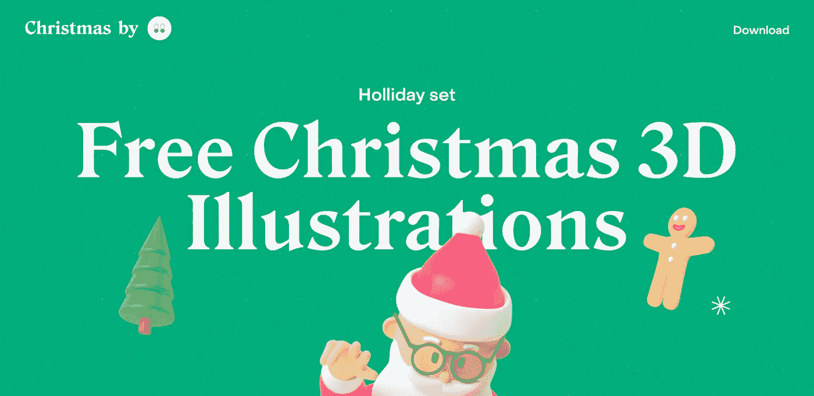
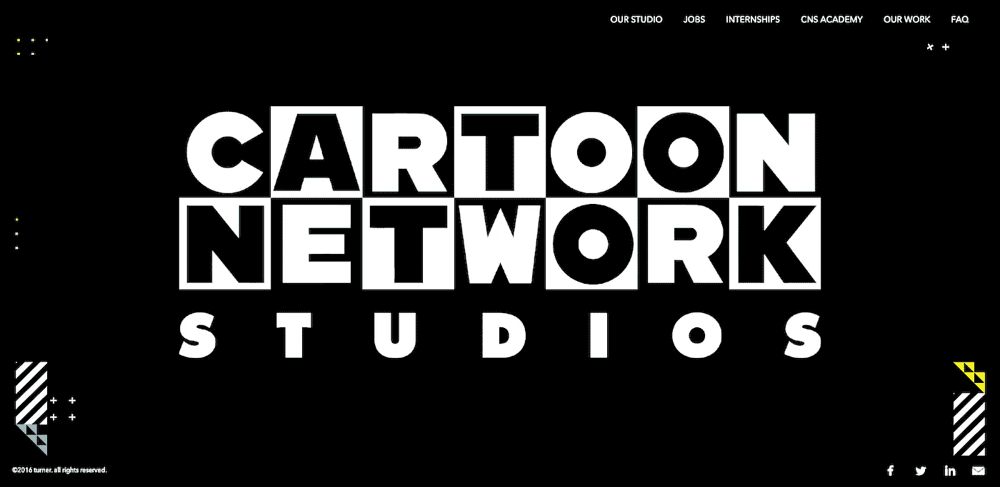

# 以下是 2023 年等待我们的网页设计趋势

> 原文：<https://javascript.plainenglish.io/heres-what-web-design-trends-are-waiting-for-us-in-2023-cf190c25186?source=collection_archive---------5----------------------->

## 有着惊人的例子。

Photo by [Mailchimp](https://unsplash.com/@mailchimp?utm_source=medium&utm_medium=referral) on [Unsplash](https://unsplash.com?utm_source=medium&utm_medium=referral)

离 2023 年只剩一个月了，可以开始准备更新了。这将有助于你创建一个相关的网站来吸引用户的注意力和解决业务问题。

# 3D 图形

网页设计中的三维世界诞生于 2020 年，今天它是许多大公司使用的关键趋势之一。它有助于用户将注意力集中在重要的事情上，并使其更容易感知信息。

毫无疑问，明年 3D 图形将继续获得动力——许多不同的包定期出现，甚至还有 glTF 3D 编辑工具: [iconscout](https://iconscout.com/360-gltf-3d-models) 、 [producthunt](https://www.producthunt.com/products/morflax-studio) 。

查看几个网站寻找灵感，比如([古董](https://www.antic.xyz/))和( [wlt.design](https://wlt.design/) )

我将在 2023 年的网站和平面设计趋势中看到类似的 3D 元素用例。比如广告、插图等等。

Image Source: [wlt.design](https://wlt.design/)

# 洛蒂动画

2023 年的设计趋势将不会充满我们习惯看到的全动画网站。如果早期页面上的动画被用在几乎每一个元素中，那么我们会看到这种强度在未来会降低。与此同时，网站不会停止失去其交互性，仍然会吸引注意力。

Image Source: [https://dribbble.com/shots/5496664-Yoga-Hero-Animation](https://dribbble.com/shots/5496664-Yoga-Hero-Animation)

这样一个简单而有效的技术会给你的网站一个吸引人的外观，并以最好的方式展现它的本质。例如，看看上面的动画——热爱瑜伽的用户会欣赏这个动画，因为它最终传达了一种自由感。

要重现这样的效果，使用洛蒂库就足够了，洛蒂库会实时显示后期效果动画。然后，你必须从 Lottiefiles 下载 GIF 并上传到网站。

## 提示:

尽量用点状动画。不需要将它添加到所有的标题、文本、图片和其他元素中。与其为了精力而插入动画，不如把亮点挑出来重点看。

# 手绘风格

这种网页设计趋势最近向我们走来，并逐渐获得势头。接下来的一年，我们将会看到许多网站使用笔画作为独立元素或与文本交互:下划线、删除线或笔画短语。

Image Source: [https://deanoakley.com/](https://deanoakley.com/)

用户会热情地浏览这样的网站，并很可能执行有针对性的操作，比如“留下请求”

您也可以将绘制的样式作为附加字体来应用。整个网站可以采用手写字体的经典设计。

# 复杂渐变

不同颜色的组合出现在遥远的 80 年代和 90 年代，但仍然很流行。网站上的渐变是我们将在 2023 年遇到的另一个当前趋势。只是它们会以一个更复杂的版本呈现，和我们想象的稍有不同。

这些将是具有复杂结构和惊人外观的网格渐变。这种风格为创意提供了更多的机会，用户看到这样的功能会想:“哇，这就是设计！”。这种梯度创造了运动的错觉，同时保持极简主义。

我建议不要随意选择颜色，以使梯度多汁和时尚。要搜索它们，你可以使用 Adobe 的服务。在这种情况下，一个人应该坚持自然界中所谓的自然颜色——绿色、黄色、蓝色等等。

Image source: [https://www.winamp.com/](https://www.winamp.com/)

# 粘土质

粘土形态是我们将在 2023 年看到的最新网页设计趋势之一。这是另一个 3D 图形，代表友好和有吸引力的人。

它主要由以下组件组成:

*   浅色、柔和色和亮色；
*   大圆角；
*   双内影；
*   外影。

Claymorphism 非常适合需要交互的极简项目。用户很容易察觉这样的网站，几乎可以在任何市场竞争。

你可以在[圣诞节. wannathis.one](https://christmas.wannathis.one/) 和[人类. wannathis.one 服务](https://humans.wannathis.one/)查看和购买酷包。

Image Source: [christmas.wannathis.one](https://christmas.wannathis.one/)

# 孟菲斯——80 年代的潮流

孟菲斯风格起源于 80 年代初的意大利。然后被设计师和建筑师使用，现在在网页设计中也能找到这种风格。

它的主要特点是违反通常的规则和更多的自由。如果你想创造一个有创意和大胆的项目，孟菲斯是你的选择。

同时，我们并不是在讨论你的网站会看起来很疯狂，对于一个简单的用户来说很难理解。相反，一个用户友好的网站的所有品质都会保留，但同时，它会在竞争中脱颖而出。

例如，看看一些很酷的孟菲斯风格的项目，你会立刻明白一切:

*   [上象限](https://upperquad.com/)；
*   [塑造农场](https://shapefarm.net/)；
*   [卡通网络工作室](https://www.cartoonnetworkstudios.com/)。

Image Source: [https://www.cartoonnetworkstudios.com/](https://www.cartoonnetworkstudios.com/)

# 视差滚动

我们将在明年看到的另一个趋势是视差滚动。它的主要特点是交互性:当滚动时，站点不断地与用户交互。开始动画和逐渐显示图片和文本是视差滚动将要开发的应用领域。

这里有一个灵感的例子。

# 清晰的界限

网站上的边框是我们明年将会遇到的另一个趋势。在他们的帮助下，我们可以为用户提供略有不同的页面设计。

清晰的边框会让网站看起来更真实，更有吸引力。这种风格将完全适合任何极简主义项目，并用纤细简洁的线条来补充。

反过来，这将使用户更容易与网站互动，你将能够显示更多的内容，而不会使页面拥挤。

看看 [Shopify](https://shopify.supply/) 就知道了。

# 交互式字体

字体对于任何设计都是不可或缺的:如果使用不当，字体可以改善设计，也可以让设计出错。2023 年，我们将看到更多根据情况变化的交互式字体。

例如，看看下面的网站——在那里，悬停上的文本改变了它的粗体，由于这一点，创建了一个极好的效果，铭文变得更容易阅读。

网站上交互式字体的一个例子

再来看看 [jomor.design](https://www.jomor.design/) 。

想要跟随趋势是完全合理的行为。如果你定期更新网站，那么随着时间的推移，它将保持其相关性。您可以单独或组合应用这些技术。例如，将漂亮的渐变添加到交互式排版中，或者将 3D 图形与动画一起使用。

有了这些，人们应该记住易用性。不管趋势如何，网站必须让目标受众能够理解。

这些是由专业设计师和营销人员共同创建的现代网站布局。选择一个适合你的模板，编辑它，并与新鲜的网站设计理念保持同步。因此，您的项目将始终保持相关性。

## 更多内容请访问 [PlainEnglish.io](https://plainenglish.io/) 。

*报名参加我们的* [***免费周报***](http://newsletter.plainenglish.io/) *。关注我们上* [***推特***](https://twitter.com/inPlainEngHQ) ， [***领英***](https://www.linkedin.com/company/inplainenglish/) ***，***[***YouTube***](https://www.youtube.com/channel/UCtipWUghju290NWcn8jhyAw)***，以及****[***不和***](https://discord.gg/GtDtUAvyhW) *

## *想扩大你的软件创业规模吗？检查[电路](https://circuit.ooo/?utm=publication-post-cta)。*