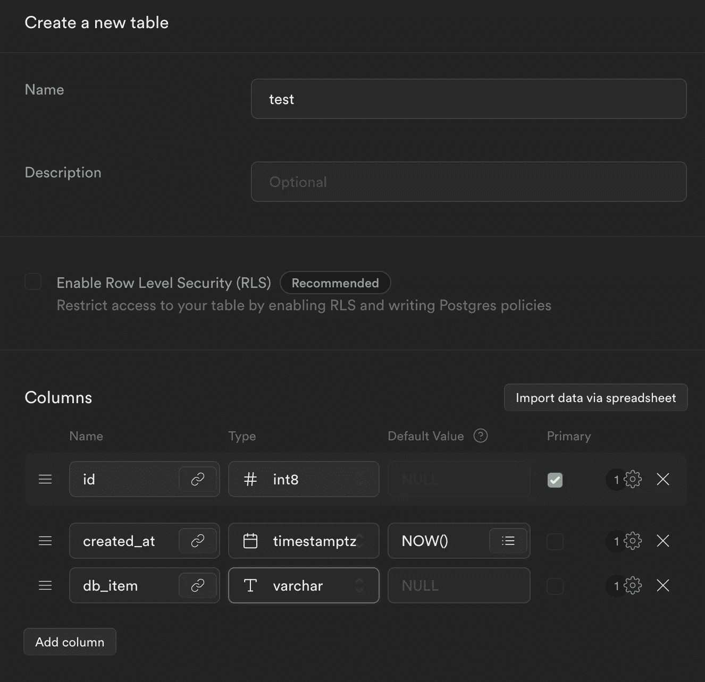

# 这就是为什么你应该放弃 MongoDB，转而使用 Supabase

> 原文：<https://javascript.plainenglish.io/heres-why-you-should-ditch-mongodb-and-switch-to-supabase-374b43f4ebc2?source=collection_archive---------5----------------------->

## 用 JavaScript 解释


Photo by [Boitumelo Phetla](https://unsplash.com/@writecodenow?utm_source=medium&utm_medium=referral) on [Unsplash](https://unsplash.com?utm_source=medium&utm_medium=referral)

使用云数据库比不使用有更多的优势。

可以基于模型来创建它们，如果您需要新的服务器实例，它们是可伸缩的和容易访问的。

许多开发过 web 服务器或其他 web 项目的人可能对 [MongoDB](https://www.mongodb.com/) 很熟悉。在像 Express、Django、Flask 这样的框架中，以及在许多编程语言中，它很容易使用。

但是你需要数据模型。这也是我转投 [Supabase](https://supabase.com/) 的原因。

它很容易在你想要的任何编程语言中使用，而且许多流行的框架都为 Supabase 准备了文档，此外，它真的很容易使用，速度超快。

# 要求

这当然取决于你在做什么样的项目，但是一般来说，任何一个 [IDE](https://en.wikipedia.org/wiki/Integrated_development_environment) 都可以完成这项工作——当然还有 Supabase 软件包。

在本指南中，我将在 Node.js 中使用 JavaScript 和 Express 框架，您可以从下面下载。

*   [Node.js](https://nodejs.org/en/)
*   [快递](https://expressjs.com/en/starter/installing.html)
*   [Supabase](https://www.npmjs.com/package/@supabase/supabase-js)

您还需要一个免费的 Supabase 帐户，并在您的仪表板中创建一个项目。您还可以在那里找到 API_KEY 和 API_URL。

# 设置开发环境

要安装所需的包，你需要 [NPM](https://www.npmjs.com/) (节点包管理器)。

如果你已经安装了，我们将开始初始化一个新的项目。

使用您的终端并输入以下命令。

```
> npm i -y
```

这将建立一个新的项目环境。

为了安装所需的软件包，我们再次使用 npm 命令:

```
> npm install express @supabase/supabase-js
```

现在创建您的基础项目文件:`index.js`并导入两个必需的模块。我们还通过调用`express()`方法和带有端口的`.listen()`来初始化服务器。

当您现在运行`node index.js`命令时，将启动一个 web 服务器，您可以在浏览器中访问它。服务器会返回一条`Cannot GET /`消息。因为我们还没有设定路线。

# 设置 Supabase 服务器实例

既然我们已经设置了基本的 Node.js 服务器，现在我们可以开始开发一些数据库了。

让我们设置一个数据库客户机。

我们现在可以使用`client`对象向云数据库发送请求。

# 插入、选择和删除数据

最重要的是通过创建一个包含几行的表来为您的数据准备数据库。

我假设您对数据库有基本的了解。



[Screenshot of Supabase dashboard.](https://supabase.com/)

现在让我们准备一条路线和我们想要使用的数据。

插入数据伴随着`client`中的`.insert()`方法。

别忘了让路线[异步](https://www.merriam-webster.com/dictionary/asynchronous)。

这将数据插入到数据库中，但我们希望检查任务是否已成功完成。

添加一个小的 if 语句。

为了查看特定的数据，我们首先从数据库中取出所有的数据，然后使用普通的 javascript 对其进行过滤。

我们可以用同样的代码删除一些东西。

# 完整代码示例

[](https://bryandijkh.medium.com/membership) [## 加入我的介绍链接媒体-布赖恩迪克伊岑

### 作为一个媒体会员，你的会员费的一部分会给你阅读的作家，你可以完全接触到每一个故事…

bryandijkh.medium.com](https://bryandijkh.medium.com/membership)