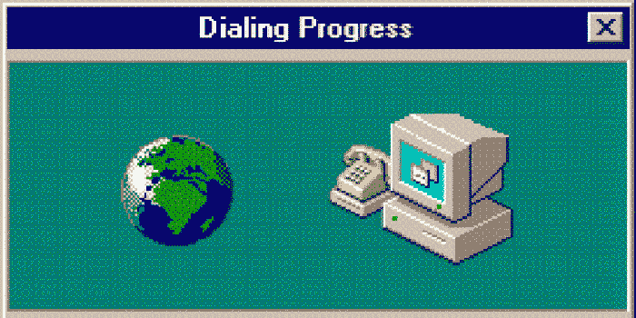
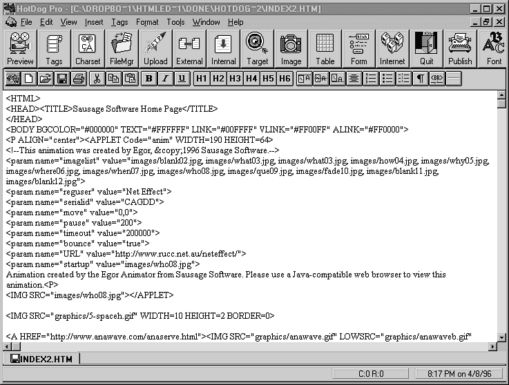
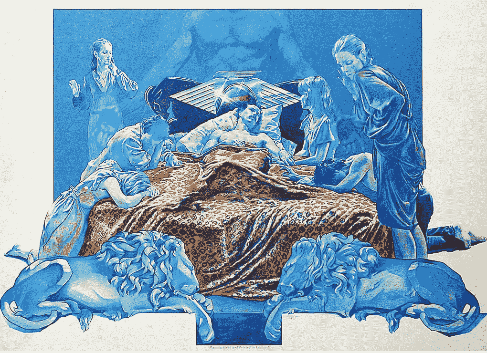
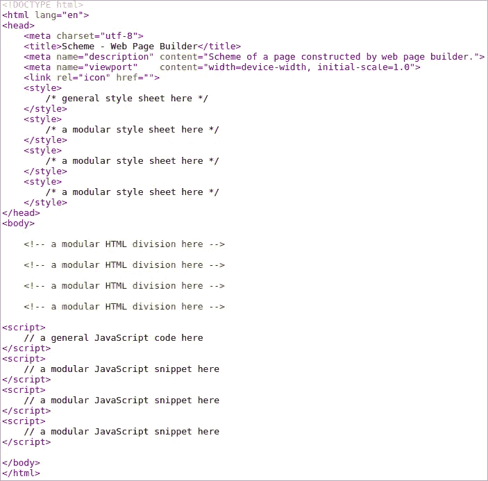

# 嘿，HTML…我回来了，亲爱的！

> 原文：<https://javascript.plainenglish.io/hey-html-i-am-back-darling-4505b557a66d?source=collection_archive---------5----------------------->

## 我对网络开发者地狱的修复

You don’t need to suffer

## 介绍

[*再见，HTML。你好，画布！*](/goodbye-html-hello-canvas-part-1-92f750961666?source=your_stories_page----------------------------------------) 是一篇获得了大量关注的系列文章。让一些人不安。这些文章展示了如何通过简单地(有一个不错的库)用画布构建网页来避免 HTML/CSS 问题。

当然，我的建议是**不要**在任何地方使用基于画布的页面**，但只在有意义的地方使用。**

这个系列得到了很多关注，这让我觉得人们真的对 HTML/CSS 有意见。一些人回复(非常)沮丧的事实让我认为人们不想离开 HTML/CSS(一点也不奇怪)。

然后，我对自己说，“这一次我将使用纯 HTML/CSS 解决方案来解决 HTML/CSS 问题！”。

## 回到过去

我记得当网络/互联网开始的时候——从普通人的角度来看。

这种连接是通过连接在电脑和电话之间的调制解调器实现的(当时没有手机)。互联网是杂志封面上的主题。我指的是纸质杂志；没有数字杂志或博客。这条新闻过去常常强调这项新技术有多棒，因为除了使用电子邮件，你还可以访问该国证券交易所的网站。印象深刻！就我个人而言，我有点失望，因为在最初的 24 个月里(我认为)，证券交易所神奇的网站总是显示它的地址(城市，街道……)。

Windows dial-up internet connection

除了处理硬件(调制解调器和电缆)之外，您还必须购买一份纸质杂志和一张包含软件(浏览器)的软盘，以便浏览互联网。两种浏览器之间有一场竞赛:微软互联网浏览器和网景浏览器(火狐的祖先)。

没有 CSS。一开始没有 JavaScript。只是简单的超文本标记语言，有着无聊/丑陋的语法和愚蠢的规则。

愚蠢的规则:两个或两个以上连续的 witespaces 值一个；但是 HTML 会自动在元素之间插入空白，无需询问。我认为愚蠢的规则是“宣布你想展示的东西，然后遗忘细节”哲学的一部分。这是一个伟大的战略；直到你需要处理细节。

没有反应，Vue，Angular，Svelte...那个时代的热门工具(当然不是框架)是热狗——非常适合任何青少年。

根据[维基百科](https://en.wikipedia.org/wiki/HotDog)，*热狗是香肠软件在 20 世纪 90 年代中期开发的一款 HTML 编辑器*。

那么……**香肠**软件制作**热狗**的编辑呢？从心底里，我必须爱那些家伙；)

HotDog HTML editor by Sausage Software

注意代码:绝对清晰、易懂，尽管有标记语法。如果你想知道哪个是*身体*的背景颜色，去读一下*身体*标签！

Jason Knight 总是说，“ ***HTML 是尿简单的****...*在以前，我会 100%同意。

注意:任何纠正这个“历史”部分的回复都是非常受欢迎的。

## 地狱

那个原来好的，古老的 HTML 改变了很多，再也不是野餐(带热狗)了。

昨天，我写了一个非常简单的演示页面(在一个 div 标签中有两个画布)。但是它没有展示画布。我无聊地浪费了 15 分钟，直到发现 CSS 中的一个错别字，因为 Chrome 从不抱怨糟糕的 CSS。

*亲爱的 Chrome，关于 CSS 错误的警告，就像你处理 JavaScript 一样，会不会给你带来太多麻烦？不需要警告一切。仅仅警告前 3 个 CSS 错误是非常有用的。*

我敢打赌，一半的读者刚刚开始回答我应该使用一些 IDE 或 CSS 编辑器——它们都有其优缺点，包括安装。

地狱就是这样成长的，你不是一开始就消灭邪恶，而是拥抱一个新的邪恶来帮助你与第一个邪恶共存

我再也不会抱怨 HTML/CSS 了，**今天**。

有时候，一个人只有在离开地狱后才意识到自己身处地狱。

无论如何，如果你不觉得自己身处 web 开发人员的地狱，我有什么理由不同意呢？

Sabbath Bloody Sabbath — front cover

## 天堂

对天堂有很多的想象和定义。考虑到目前这篇文章的问题，我对天堂的定义是"**天堂是创建一个网页的地方是*小便简单*** *"。*

为了达到那种神圣的简单，我宁愿不死。毕竟，一个**网页只是一堆矩形**，看在上帝的份上！

Sabbath Bloody Sabbath — back cover

# 如你所愿的网络发展

构建网页**布局**的一些方法:

1.  编写 HTML 和 CSS
2.  编写 JavaScript
3.  选项' 1 '加上{选项' 2' }
4.  使用一些框架
5.  选项' 4 '加上{选项' 1 '或选项' 2' }
6.  选项“4”加上{选项“1”和选项“2 }
7.  选项“5”加上{某些领域特定语言}

可能上面的一些选项有些夸张——我说不上来。反正以上选项都不是我所愿。

为了构建一个网页的布局(包括 3 或 4 个布局，目标是现有的基本屏幕尺寸范围)，我宁愿使用一个可视化工具，而不是编程语言；更不用说，愿上帝保佑我的灵魂，CSS(及其媒体的质疑)。

而且，为了运行这么简单的可视化工具，我不愿意在我的电脑上安装任何东西；更别说，愿上帝两次保佑我的灵魂，那个叫 NPM 的平行宇宙；在那里，没有一个外星人可以不依赖依赖而呼吸或放屁…你知道我在说什么。

因此，我希望我能在我的浏览器中运行这样一个可视化工具作为网页。

另外，我不希望产生的代码与可读的、**经典的/通用的、**、可维护的、可移植的 HTML/CSS 有任何不同；因为我不想被杰森·奈特诅咒(这不是主要原因，但这确实是一个有效的担忧；)

如果这个浏览器工具能自动将我的作品保存在 cookies 或本地存储中，那就太好了。

最后，为了让我完全满意，我更喜欢

*   不用支付任何费用
*   不为宣传所烦
*   不注册(提供我的电子邮件地址)

在你说我贪婪或者自私之前，记得我写的是“完全”。

我们一直在谈论布局。为什么不包括样式和内容(文本、图像、小部件)？当然，这个东西必须包括在内。

这个工具应该包括表格，动画，任何需要的东西！

万一，而不是一个单一的页面，我正在创建一个大的网站，然后输出的工具将成为服务器的模板！

现在，如果你说，“*哦不！工具&生成的网页太重/太慢/太臃肿！我会说，“*请继续读下去。*”。*

或者，如果你说，“*它只是一个网站建设者。*”，我会回复，“*是的！非常体面的一个——里面没有垃圾。*”。

## 描述工具

我真的认为浏览器是这样一个工具的合适环境:性能、内存或文件大小都没有问题。我有一些使用浏览器应用程序的经验，比如绘图工具和视频游戏。

在内部，网页(工具)有两个或更多的大部分。当一个可见时，其他的都不可见。一个设计好的按钮或击键使可见的部分与下一个不可见的部分交替出现。这就像改变网页而不改变互联网地址。

内部页面的种类:

*   说明
*   控制中心
*   选择模型
*   选择组件
*   显示结果页面

结果页面是在客户机(工具)中构建的，而不是在服务器中。服务器的存在只是为了服务页面/工具。

**车型和风格**

像任何网站建设者一样，该工具提供了可供选择的模型。此外，字体系列，颜色等。没什么大不了的。

**组件**

好的。这是一个热门话题。生成的页面以完整的部分组织(宽度= 100%)。每个部门都是绝对独立的。

## 对结果网页的剖析

我不喜欢需要大量资源才能工作的网页，它们必须从任何地方加载数十个样式表，大型库，从外太空加载数十个稀疏的 JavaScript 片段。**真是废话！！！**

我知道我会因为上面的声明被人恨上好几年。我不喜欢这样，但我不在乎。看着这样一个页面的源代码，对我来说，就像是在想象魔鬼得了流感时的地狱。

产生的网页的特征

*   所有纯 HTML 创建的 HTML 元素和文本，*非 JavaScript* : 1) **100%授权**被**任何浏览器**理解；**任意网络爬虫**和**任意**屏幕阅读器**；2) 100%可读和可移植——不依赖工具**
*   3 个独立的部分:CSS、HTML ( *body* )和 JavaScript
*   完整/不臃肿的样式表；可读性、可移植性和独立性
*   没有大的库，只有必要的模块化、轻量级的 JavaScript 代码片段
*   所有代码(HTML/CSS/JS)嵌入(*)；代码很小
*   当改变风格时，大网站需要一个桌面/服务器工具来更新所有的静态 HTML 页面和模板(没问题)

编辑:(*)对于小网页来说，嵌入是有意义的。对于一个大网站来说，一个外部样式表是非常可以接受的。

Scheme of the resulting page

## 我的解决方案

版块标题是“如你所愿的 Web 开发”。但是我一直在谈论我的愿望。

我想我们都想要同样的东西——我知道这是多么笼统的说法！

好吧，如果你不喜欢我的想法，没关系；非常好！

但是如果你喜欢它们，我会告诉你一件事，那些想法不是“我的解决方案”。

**我的解决办法是:** [如你所愿](https://webasyouwish.com/)

换句话说，我刚刚开始了一个项目，按照我们的愿望构建 web 工具。我需要至少 2 周才能展示一些有用的东西。我将非常需要反馈！

你能把芥末和番茄酱递给我吗？

## 编辑:

2022 年 11 月 14 日

项目正在运行。

*更多内容看* [***说白了就是***](https://plainenglish.io/) *。报名参加我们的* [***免费每周简讯***](http://newsletter.plainenglish.io/) *。关注我们关于**[***推特***](https://twitter.com/inPlainEngHQ) *和*[***LinkedIn***](https://www.linkedin.com/company/inplainenglish/)*。加入我们的* [***社区不和谐***](https://discord.gg/GtDtUAvyhW) *。**