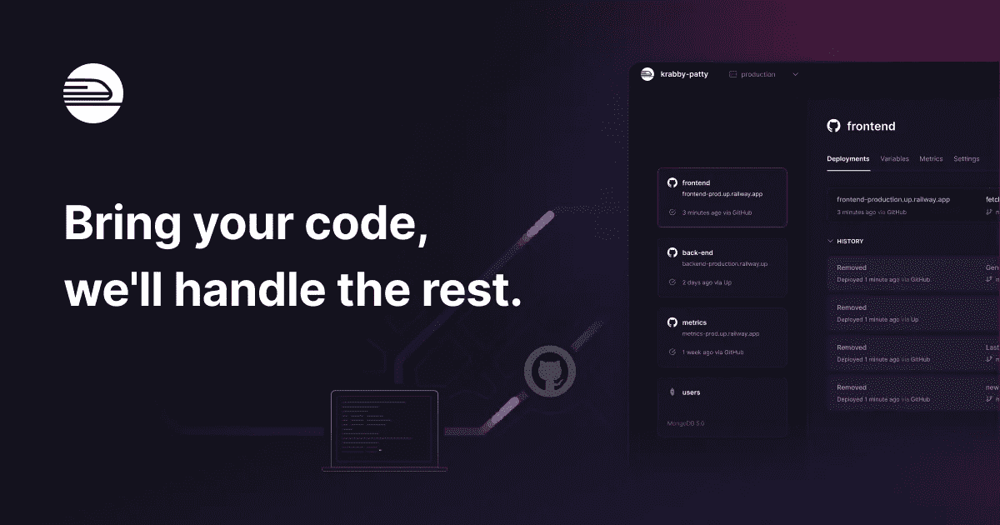

# 永远不要再为爱好项目买单

> 原文：<https://javascript.plainenglish.io/hidden-tips-tricks-to-cut-costs-for-hobby-projects-6dea2d4c2741?source=collection_archive---------3----------------------->

当你正在建立你最新最大的爱好项目时，你不想倾家荡产。虽然它只是你业余时间的产物，但你也不想限制它提供的功能。

在本文中，您可以找到一些隐藏的提示和技巧，我用它们来尽可能地降低我的爱好项目的成本，同时为我的用户提供他们想要的一切。

Photo by [micheile dot com](https://unsplash.com/@micheile?utm_source=medium&utm_medium=referral) on [Unsplash](https://unsplash.com?utm_source=medium&utm_medium=referral)

# Cron 作业的 GitHub 操作

即使在你的 GitHub 免费计划中，你每月也能获得 2000 分钟的 GitHub 活动。如果您只是使用这些来测试和部署您的项目，那么您可能还有很多剩余。

我们可以聪明地利用这些时间。让我们和他们一起工作吧！
GitHub 动作使用触发工作流的事件。你可能知道常见的像`commit`和`push`，但是其中一个触发器恰好是`schedule`。通过将这个触发器与 Curl 等各种内置工具结合起来，我们可以很容易地以固定的时间间隔发送 API 请求。

这个代码片段将在每天午夜向 api.example.com 发送一个 POST 请求，是不是很棒！

如果你也在寻找一个工具，使编写这些 Cron 时间表变得更容易，那么你正在寻找 [Crontab.guru](https://crontab.guru/) 。

# 你的电子邮件的 AWS SES

如果你想发送电子邮件，那么你很可能遇到了像 SendGrid 这样的工具，它们在实际发送电子邮件的基础上为你提供了大量的功能。

用 SendGrid 每月发送 1000 封电子邮件会让你花费 19.95 美元。老实说，在你爱好项目的第一阶段，你真的需要高级分析和交付跟踪吗？

虽然设置起来要多做一些工作，但是可以考虑看看 AWS SES。你向 SendGrid 支付 20 美元购买一千封电子邮件，你就可以通过 AWS SES 发送 20 万封。

AWS SES 的好处是可扩展性。如果你只有很少的云经验，通过他们的 API 发送一封简单的电子邮件应该不会超过 5 分钟。如果你的小项目发展得比预期的要快，那么你可以通过[实现交付和点击跟踪](https://medium.com/aws-in-plain-english/aws-ses-click-tracking-with-a-custom-domain-the-definitive-guide-in-2022-c39a81a61e0c)来轻松构建 AWS SES！

# 免费主持整个活动

我对基于 JavaScript 的堆栈只有很好的制作经验，所以这一部分可能不适用于你们所有人。主持你的项目是另一个大障碍，而且很快会变得昂贵。

让我给你两个惊人的平台，你可以用它们来免费托管你的大部分项目！

## 铁路后端

在 Heroku 停止他们的业余爱好项目的免费等级后，我个人转而选择了铁路，我不得不说我很惊喜。我应该早点做出改变，因为 Railway 带来的工具令人印象深刻。

铁路提供免费计划或升级到按分钟收费的付费计划的可能性。也就是说，如果你的项目不消耗资源，那么你也不用为它们付费。

借助他们针对 PostgreSQL、MongoDB、MySQL 和 Redis 的即插即用数据库解决方案，您将立即投入使用！

## 韦尔塞尔的前端

这个对你们来说不应该是一个惊喜，你们大多数人已经知道我是一个多么狂热的 Next.js 粉丝。在 Vercel 上托管你的前端应该是很容易的。他们的免费层是业余爱好项目的完美解决方案，不会花费你任何东西。

如果您用 Next.js 编写整个应用程序，您甚至可以利用 Vercel 的无服务器 API 函数，完全削减托管和维护后端的成本。

# 为学生提供的非凡优惠

如果你注册为学生，那么你可以大大受益于许多优惠！

## GitHub 学生开发者包

其中最大的将是 [GitHub 学生开发者包](https://education.github.com/pack)。为有抱负的软件开发人员收集优惠、折扣和免费赠品。一些最有价值的产品是免费的 GitHub Pro，当你是学生时，你用 Stripe 赚的第一个 1000 美元没有交易费，200 美元的数字海洋信用。

## 免费访问 JetBrains 编辑器

作为一名学生，你可以免费使用 JetBrains 的所有编辑器。这些是一些最强大、最全面的 ide，您应该充分利用它们！

*更内容于* [***普通英语***](https://plainenglish.io/) *。报名参加我们的* [***免费周报***](http://newsletter.plainenglish.io/) *。在*[***Twitter***](https://twitter.com/inPlainEngHQ)[***LinkedIn***](https://www.linkedin.com/company/inplainenglish/)*[***YouTube***](https://www.youtube.com/channel/UCtipWUghju290NWcn8jhyAw)*以及*[**T42 不和**](https://discord.gg/GtDtUAvyhW) *上跟随我们。对增长黑客感兴趣？查看* [***电路***](https://circuit.ooo/) *。**