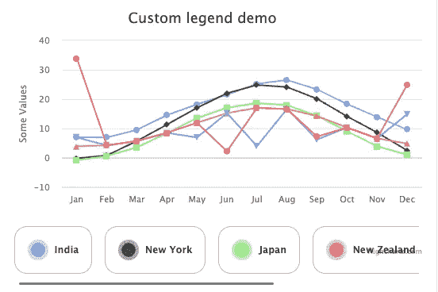

# 高图表:如何自定义图例

> 原文：<https://javascript.plainenglish.io/highchart-how-to-create-a-custom-legend-2c8290b8ee8?source=collection_archive---------10----------------------->

我一直在努力定制 Highcharts 中的 legend，所以我想创建一个演示我最终实现了什么，可能对其他人有用。

现在，我没有解释所有的步骤，只是创建了一个 JSFiddle:

我希望这是有帮助的，如果你有更好的技术或想法，请在评论中告诉我，或者如果你喜欢这个，请鼓掌。

快乐学习！

*更多内容请看*[***plain English . io***](https://plainenglish.io/)*。报名参加我们的* [***免费周报***](http://newsletter.plainenglish.io/) *。关注我们关于*[***Twitter***](https://twitter.com/inPlainEngHQ)*和*[***LinkedIn***](https://www.linkedin.com/company/inplainenglish/)*。查看我们的* [***社区不和谐***](https://discord.gg/GtDtUAvyhW) *加入我们的* [***人才集体***](https://inplainenglish.pallet.com/talent/welcome) *。*