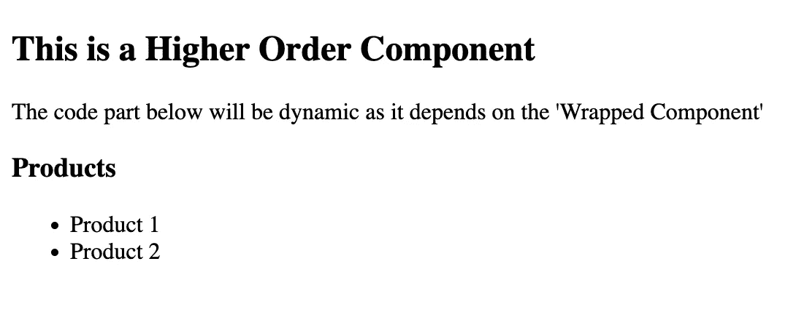
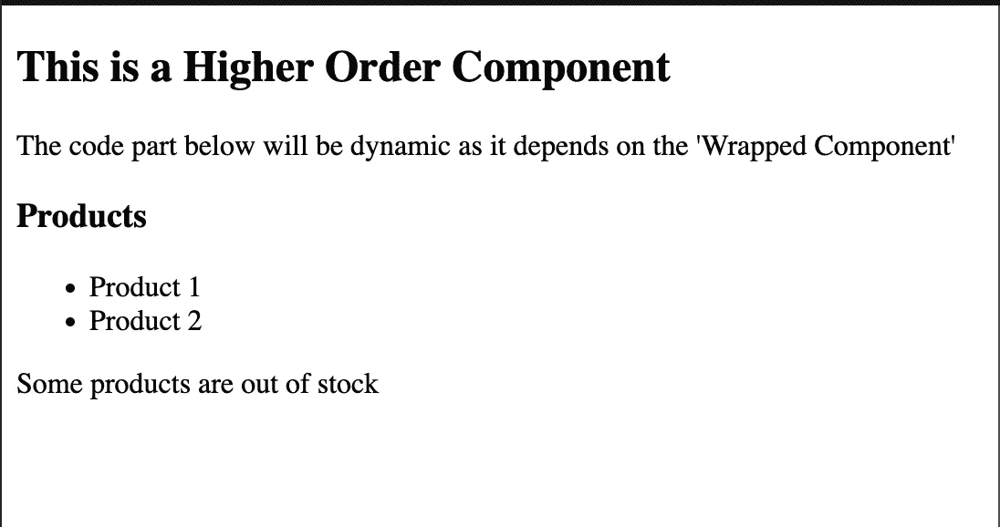

# React 中的高阶组件

> 原文：<https://javascript.plainenglish.io/higher-order-components-in-react-aa39c0ffe675?source=collection_archive---------3----------------------->

## React 中有哪些高阶组件，以及如何创建和使用高阶组件。


Image by Author

> 在这篇博客中，我将从功能组件而不是基于类的组件的角度来讨论高阶组件。

# 什么是高阶元件？

高阶组件(HOC)不是 React 中使用的库或 npm 模块。相反，它只是 React 中使用的一种高级技术，用于重用组件逻辑，以避免重复。

高阶组件将功能组件作为参数，并返回增强组件。

特设是这样的:

```
const HigherOrderComponent = (WrappedComponent) => function HOC() {
  return (
    <section>
      <h1>This is a Higher Order Component</h1>
      <div>
        <h2>
          The code part below will be dynamic as it depends on the 'Wrapped
          Component'
        </h2>
        <WrappedComponent />
      </div>
    </section>
  );
};export default HigherOrderComponent;
```

在上面的代码片段中，我们有以下内容:

*   函数“HigherOrderComponet”接受一个名为“WrappedComponent”的参数，它将是一个功能组件。
*   这个“HigherOrderComponet”函数立即返回一个名为“HOC”的函数(可以是任何名称，也可以是一个箭头函数)，它是一个功能组件，即它返回 JSX 代码。
*   如您所见，我们从“HOC”功能组件返回 JSX，该组件利用了我们期望作为参数的“WrappedComponent”。
*   我们在导出其他组件时使用这个高阶组件。

假设我们有另一个名为“Products”的组件，为了将高阶组件与“Products”组件一起使用，我们可以在导出时将“Products”组件包装在“Higher Order Component”函数中。

```
import HigherOrderComponent from "./HigherOrderComponent";const Products = () => {
  return (
    <div>
      <h3>Products</h3>
      <ul>
        <li>Product 1 </li>
        <li>Product 2 </li>
      </ul>
    </div>
  );
};export default HigherOrderComponent(Products);
```

在上面的代码片段中，“HigherOrderComponent”使用产品组件来提供一个新的增强组件。

在用 HigherOrderComponent 函数包装了产品组件之后，产品组件看起来将如下所示:

```
function HOC() {
  return (
    <section>
      <h1>This is a Higher Order Component</h1>
      <div>
        <h2>
          The code part below will be dynamic as it depends on the 'Wrapped
          Component'
        </h2>
        <Products />
      </div>
    </section>
  );
}
```

这将是产品组件的可视化输出:



Image by Author

当使用高阶组件时，`props`在组件内部无法正常工作。

让我们将一个名为`info`的`prop`添加到组件中的`Products`中，并将这个`info`的值传递到`App`组件中。

```
// Products.js
import HigherOrderComponent from "./HigherOrderComponent";const Products = ({ info }) => {
  return (
    <div>
      <h3>Products</h3>
      <ul>
        <li>Product 1 </li>
        <li>Product 2 </li>
      </ul>
      <p>{info}</p>
    </div>
  );
};export default HigherOrderComponent(Products);//_app.js
export default function App() {
  return (
    <>
      <Products info="Some products are out of stock" />
    </>
  );
}
```

这是上面代码的输出:


Image by Author

*   `prop` `info`的值没有显示在网页上，尽管我们正确地传递和接收了那个`prop`的值。
*   发生这种情况是因为当`HigherOrderComponent`正在**消费**组件`Products`并且我们没有在`HigherOrderComponent`中指定我们正在期待`WrappedComponent`的一些道具，所以`props`没有在`HOC`组件函数中被利用。
*   为了确保道具正常工作，我们可以对 HigherOrderComponent 做一个小小的编辑:

```
const HigherOrderComponent = (WrappedComponent) => function HOC(props) {
  return (
    <section>
      <h1>This is a Higher Order Component</h1>
      <div>
        <h2>
          The code part below will be dynamic as it depends on the 'Wrapped
          Component'
        </h2>
        <WrappedComponent {...props} />
      </div>
    </section>
  );
};export default HigherOrderComponent;
```

现在，我们在我们的 HOC 功能组件中接受 props，并使用 spread 操作符获取所有的`props`值，并将其传递给 WrappedComponent。因此，现在在导出产品组件时，它将看起来像这样:

```
function HOC(props) {
  return (
    <section>
      <h1>This is a Higher Order Component</h1>
      <div>
        <h2>
          The code part below will be dynamic as it depends on the 'Wrapped
          Component'
        </h2>
        <Products info="Some products are out of stock" />
      </div>
    </section>
  );
}
```

这里，`info` `prop` get 是从 HOC 功能组件的 props 参数中析构的。这样做之后，我们的输出将是这样的:



Image by author

*更多内容看* [***说白了。报名参加我们的***](https://plainenglish.io/) **[***免费周报***](http://newsletter.plainenglish.io/) *。关注我们关于* [***推特***](https://twitter.com/inPlainEngHQ) ，[***LinkedIn***](https://www.linkedin.com/company/inplainenglish/)*，*[***YouTube***](https://www.youtube.com/channel/UCtipWUghju290NWcn8jhyAw)*，以及* [***不和***](https://discord.gg/GtDtUAvyhW) *。对增长黑客感兴趣？检查* [***电路***](https://circuit.ooo/) *。***