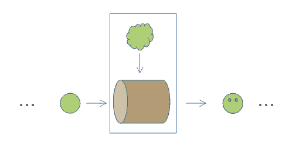
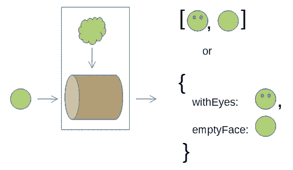
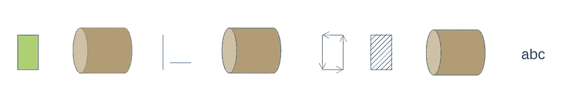

# 简化纯函数的高阶函数

> 原文：<https://javascript.plainenglish.io/higher-order-functions-that-simplify-pure-functions-bb4ae1817092?source=collection_archive---------15----------------------->


在本文中，我描述了一种强调声明式风格的纯函数实现模式。

它基于放在基本原型中的两个新的高阶函数，以便它们可用于所有对象和函数(使用点符号)。

# 高阶函数

在下文中，我将使用高阶函数的首字母缩写词 HOF:在其输入参数中有一个或多个函数和/或作为其调用的结果产生一个新函数的函数。

# 纯功能实现

纯函数本质上是一系列基本变换，从输入参数开始，经过一系列中间结果，产生最终结果。

## 程序实施

在一般情况下，转换需要由序列中在它们之前的转换生成的中间结果的子集作为输入(除了函数的输入参数的可能子集)。

因此，该函数被分成一组将结果存储在局部变量中的过程步骤。

## 用函数链实现

在大多数情况下，可以简化上述方案，将函数实现为单个转换管道，其中一个转换管道的输出是下一个转换管道的输入。


如果转换是内联定义的*，那么 pure 函数的输入参数在转换闭包内是可用的。*

**

*为了最大化该模式的适用性，如果需要，转换可以将先前的结果传播到下游，在结果中插入输入(在这种情况下，结果是一个元组或一个映射)。*

**

# *一管函数(变换)*

*对于 JavaScript，有两种不同的方法来连接函数:*

*   *点符号，通过使用预定义的方法，允许产生新字符串或新数组的转换的连接(但我们也将看到对象的解决方案)。*
*   *一种 HOF，它将函数作为输入，并将中间结果和函数调用结合起来。这种 HOF 通常被称为*管。**

*这两种技术可以混合在一起，以获得最佳的实现。*

*我将开始描述第二种选择。*

## *后缀组合(管道功能)*

*可以使用函数组合的数学概念创建一个函数链:`f( g( h(o) ) )`。这可以直接解释为 JavaScript 代码，但是这种方法有三个主要问题:*

***大量嵌套层次。嵌套层次很难阅读。**
一个简单的解决方案是定义一个 HOF，它返回组合函数，然后将其应用于起始对象:
`compose(f,g,h)(o)`*

*作曲 HOF 的定义很简单:
`compose = (...fs) => o => fs.reduceRight((a, f) => f(a), o)`*

***应用于输入对象(h)的第一个变换是*合成*参数列表中的最后一个。***

*在数学中，你也有类似的问题。可以避免采用所谓的反向波兰记法(或后缀记法):操作数列在运算符之前。如`5 + 3`写成`5 3 +`。同样，`f( g( h(o) ) )`可以写成`o h g f`(在后缀符号中不使用括号)。*

*在 JavaScript 中，我们定义了 HOF *管道*，和 RPN 一样，它颠倒了操作符的顺序:
`pipe = (...fs) => o => fs.reduce((a, f) => f(a), o)`*

*现在我们可以写:`*pipe(h,g,f)(o)*`*

***o 的操作数*在函数管的错误一侧。****

*参数 *o* 应位于变换序列`*pipe(h,g,f)(****o****) // wrong side*` *的左侧。**

*这个问题将在我们讨论了点符号的用法之后解决。*

*如上所述，*管道*函数本质上是函数组合的后缀符号，所以我更喜欢把它命名为*后缀组合*。*

## *调用纯函数的点符号*

*点符号用于调用类**方法**，这里我们想要构建纯函数(没有突变)。*

*如果我们只使用不改变对象的方法，我们仍然可以实现纯函数。在这种情况下，点符号可以解释为调用以对象作为第一个参数的函数的语法糖。*

*按照这种思路，使用点符号调用任何以对象作为第一个参数的函数将会很有趣。*

```
*f = (o, arg1, arg2, ...) **o.f(arg1, arg2)   // not possible***
```

*另一方面，通过将函数定义为一个类的方法，将对象定义为该类的实例，这已经是可能的了…*

```
*class MyObj { f(arg1, arg2)  { console.log(arg1, arg2) }}
o = new MyObj()
o.f('arg1', 'arg2')*
```

*但关键是能够做到这一点，而不陷入面向对象编程的沼泽(我知道，我对 OOP 不领情，但这符合本文的精神)。*

*不幸的是，这是不可能的…但类似的东西可以实现。*

# *调用 HOF*

*为了模拟函数的点调用，可以使用点符号定义类似于*管道*函数的东西，并使其可从任何类型的对象调用:*

```
*Object.defineProperty(
  Object.prototype,
  'invoke’,
  {
    value:i
      function(...fs) {
        return fs.reduce((a, f) => f(a), this)
      },
    enumerable: false
  }
)*
```

*因此，即使不可能写出`o.h.g.f`，至少也可以这样写:*

```
*o.invoke(h).invoke(g).invoke(f)    
   // or
o.invoke(h,g,f)*
```

*现在，参数 o 位于函数管的正确一侧:*

```
*pipe(h,g,f)(**o**) **o**.invoke(h,g,f)* 
```

# *矩形的周长和面积(管道示例)*

*为了说明上面表达的概念，让我们考虑一个将正交(垂直或水平)矩形转换为包含矩形面积和周长的字符串的函数。*

*最终结果不是很有用，但是让我们把重点放在函数的实现上。*

**

*垂直/水平矩形可以由两个点来表示:两个相对的顶点。一个点可以用一个数字向量来表示:*

```
*rect = {a: [2, 6], b: [5, 2]}*
```

*第一个转换检索边:*

```
*const sides =
  r => [Math.abs(r.a[0] - r.b[0]), Math.abs(r.a[1] - r.b[1])]*
```

*第二个转换将周长和面积添加到结果元组中:*

```
*const  addPerimeterAndArea =
  sides => [...sides, 2*(sides[0]+sides[1]), sides[0]*sides[1]]*
```

*第三个转换创建输出字符串:*

```
*const rectPropsToString =
  rectProps => `
    sides: ${rectProps[0]}, ${rectProps[1]}
    perimeter: ${rectProps[2]}
    area: ${rectProps[3]}
  `*
```

*现在我们准备将函数定义为一个单一的转换管道:*

```
*const rectToString = 
  rect => rect.invoke(sides, addPerimeterArea, rectPropsToString)console.log(rectToString({a: [2, 6], b: [5, 2]})) **sides: 3, 4
      perimeter: 14
      area: 12***
```

# *中值(点符号示例)*

*给定一个数值向量，中值是排序向量的中心值(当向量长度为偶数时，两个中心值的平均值)。*

*该函数可以作为一个管道来实现，而不需要调用函数，但是中心值的提取有点复杂，所以最好为它使用一个有感召力的名称。*

```
*const extractCentralValues =
  v => v.slice(div2(v.length>>1 - 1, v.length>>2 + !v.length%2)*
```

*在*二进制*中，整数被 2 除就像在*以 10 为基数*中被 10 除一样:跳过最后一个数字。在二进制中，这可以简单地通过*符号传播右移*运算符(> >)来实现。*

*一个实现变体，使用有感召力的名称，并且只执行一次除以 2，在代码片段中使用了更高阶的 IIFE(立即调用的函数表达式)，以粗体显示。*

```
*const extractCentralValues =
  **((middleIndex, evenLength) =>** 
    v => v.slice(middleIndex, middleIndex + 1 + evenLength)
  **)(v.length>>1 - 1, !v.length%2)***
```

*可以将 *middeIndex* 和 *evenLength* 定义为函数，并且为了执行一次除法(除以 2 ),可以使用*middeIndex*的内存化版本(具有单值缓存),但是在这些情况下，我更喜欢 IIFEs。*

**中值*功能*现在可以定义为一个管:**

```
*const median = v => 
  v.sort()
   .invoke(extractCentralValues)
   .reduce((a, e) => a+e/2, 0)*
```

*是的，reduce 可以被一个有着动人名字的函数代替:*

```
*const meanValue = v =>
  v.reduce((a,e) => a + e)/v.length*
```

*此时，我们有两种选择来列出转换(我更喜欢第一种):*

```
*const median = v => 
  v.sort()
   .invoke(extractCentralValues)
   .invoke(meanValue)*or*const median = v => 
  v.sort()
   .invoke(
      extractCentralValues,
      meanValue
   )*
```

# *绑定额外参数(bindArgs HOF)*

*如果一个转换需要 main 函数的附加输入参数，那么这个转换应该被内联定义，这样它们在闭包中是可用的。但是这种解决方案排除了使用可唤起的名字的可能性。*

*幸运的是，有一个选择:我们可以部分地应用转换。*

**部分应用*将函数的一些参数绑定到固定值，并返回一个采用更少输入参数的新函数。在我们的例子中，只有第一个参数是自由的:*

```
*Object.defineProperty(
  Function.prototype,
  'bindArgs',
  {
    value:
      function(...args) {
        return **o => this(o, ...args)**
      },
    enumerable: false
  }
)*
```

*上面代码中新应用的部分函数以粗体显示。注意 args 值是如何冻结到闭包中的。*

# *点的旋转(绑定示例)*

*(笛卡尔)点旋转一个角度*α*(以弧度为单位)可以通过将该点变换到极坐标中，将该角度加到极角上，然后反向变换到笛卡尔坐标中来获得。*

*是的，旋转一个点最有效的方法是通过使用*旋转矩阵* …但这只是一个演示绑定函数用法的例子。*

```
*const toPolar = 
  p => [Math.sqrt(p[0]*p[0]+p[1]*p[1]), Math.atan2(p[1],p[0])]const polarRotation = (p, angle) => [p[0], p[1] + angle]const toCartesian = p => [p[0]*Math.cos(p[1]), p[0]*Math.sin(p[1])]*
```

*polarRotation 函数有两个参数…在函数管中使用该函数之前，必须绑定第二个参数。*

*旋转功能是:*

```
*const rotate = (p, angle) =>
  p.invoke(
    toPolar,
    polarRotation.bindArgs(angle),
    toCartesian
  )*
```

# *概述*

*在提出了一个实现纯函数的模型(管道模型)之后，我定义了两个 Hof(*invoke*和 *bindArgs* )，这两个 Hof 允许这个模型应用于大多数函数的实现。三个简单的例子阐明了如何使用它。*

**更多内容看* [***说白了。报名参加我们的***](http://plainenglish.io/) **[***免费周报***](http://newsletter.plainenglish.io/) *。在我们的* [***社区不和谐***](https://discord.gg/GtDtUAvyhW) *获得独家获取写作机会和建议。****