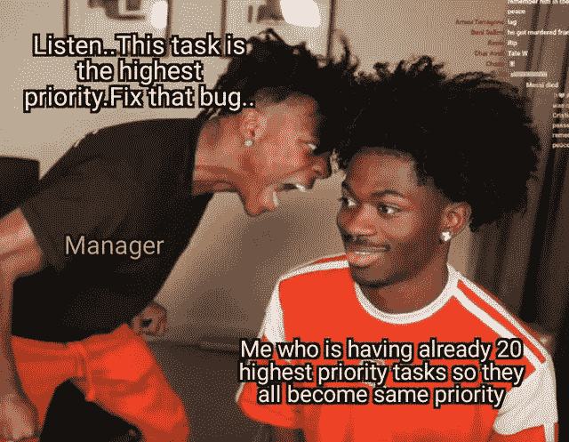
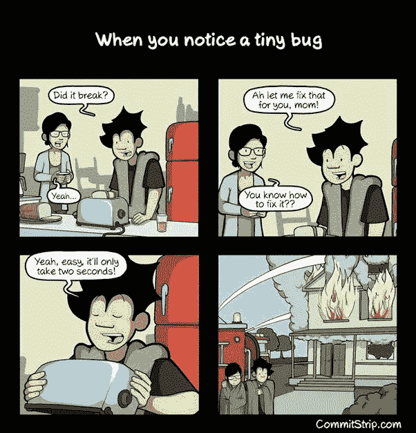
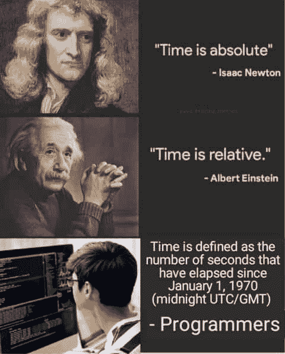

# 每个程序员都能联想到的搞笑模因

> 原文：<https://javascript.plainenglish.io/hilarious-memes-which-every-programmer-can-relate-to-44100d24a63d?source=collection_archive---------3----------------------->

## 最佳编程模因汇编

Photo by [Priscilla Du Preez](https://unsplash.com/@priscilladupreez?utm_source=medium&utm_medium=referral) on [Unsplash](https://unsplash.com?utm_source=medium&utm_medium=referral)

## ***模因与幸福有什么联系吗？*** 如果你是我喜欢的类型，我喜欢在完成工作后看到手机和我在那边看到的东西。猜猜看。

我主要看 T4 视频、抖音和网络上发布的迷因。我不知道为什么，但它有助于**提神和缓解工作压力**。这就是为什么我相信

> *“笑是人类最好的刷新按钮”*

在这篇文章中，我汇编了一些我在网上喜欢的模因。

# 当我的经理问这个问题时……是的，有时会中断……永无止境的争吵

Picture Credit:https://www.pinterest.com

# 我生命中有意义的信息…

Picture Credit:[https://www.reddit.com/r/ProgrammerHumor/](https://www.reddit.com/r/ProgrammerHumor/)

# 当您要求处理您不知道的代码时…

Picture Credit:[https://www.reddit.com/r/ProgrammerHumor/](https://www.reddit.com/r/ProgrammerHumor/)

# 当有人要求逃跑时…

Picture Credit:[https://www.reddit.com/r/ProgrammerHumor/](https://www.reddit.com/r/ProgrammerHumor/)

# 当您在堆栈跟踪中找不到该名称时…

Picture Credit:[https://www.reddit.com/r/ProgrammerHumor/](https://www.reddit.com/r/ProgrammerHumor/)

# 我们只知道一个 CSS 领域，它以风格或开始。钢性铸铁

Picture Credit:[https://www.reddit.com/r/ProgrammerHumor/](https://www.reddit.com/r/ProgrammerHumor/)

# 一切皆有可能..不管怎样，你都能得到结果…

[https://www.facebook.com/yuva.krishna.memes](https://www.facebook.com/yuva.krishna.memes)

# 让我们去虚拟世界的 Div…他们是如何照顾我改变立场，使正确的路线…

[https://www.facebook.com/yuva.krishna.memes](https://www.facebook.com/yuva.krishna.memes)

# 优先级…

Picture Credit:[https://www.reddit.com/r/ProgrammerHumor/](https://www.reddit.com/r/ProgrammerHumor/)

# 程序员信条…

Picture Credit:[https://www.reddit.com/r/ProgrammerHumor/](https://www.reddit.com/r/ProgrammerHumor/)

# 通常发生在我周五工作的时候，为客户做演示…

[https://www.facebook.com/ProgrammersCreateLife/photos/a.241809332534619/3750971258285058/](https://www.facebook.com/ProgrammersCreateLife/photos/a.241809332534619/3750971258285058/)

# 有时初级开发人员知道得更多…

[https://www.facebook.com/DZoneInc/photos/a.336758034711/10159280091324712](https://www.facebook.com/DZoneInc/photos/a.336758034711/10159280091324712)

# 我根据项目购买课程，当我按照指示结束时，就像这样…

[https://www.facebook.com/javascriptJS/photos/a.1387402908063976/2172042662933326/](https://www.facebook.com/javascriptJS/photos/a.1387402908063976/2172042662933326/)

# 当我试图修复让事情变得更混乱的小臭虫时…

[https://www.quora.com/What-are-the-best-programming-comic-strips](https://www.quora.com/What-are-the-best-programming-comic-strips)

# 总会有一些隐藏的臭虫..不要打扰他们…

[https://www.facebook.com/ProgrammersCreateLife/photos/a.241809332534619/3817315068317343/](https://www.facebook.com/ProgrammersCreateLife/photos/a.241809332534619/3817315068317343/)

# 现实还是现实？

Picture Credit:[https://programmerhumor.io/](https://programmerhumor.io/)

# 奖金内容

# 奖金内容

# 展示你的作品总是更好…哈哈

[https://www.facebook.com/DZoneInc/photos/a.336758034711/10159513354989712](https://www.facebook.com/DZoneInc/photos/a.336758034711/10159513354989712)

# 经常发生…我总是去不同的页面…

[https://www.facebook.com/DZoneInc/photos/a.336758034711/10159513354989712](https://www.facebook.com/DZoneInc/photos/a.336758034711/10159513354989712)

# 为什么编译器不够聪明，不能自动修复所有问题？

[https://www.facebook.com/DZoneInc/photos/a.336758034711/10159505422369712/](https://www.facebook.com/DZoneInc/photos/a.336758034711/10159505422369712/)

# 它看起来像它的工作…这应该够了…哈哈…

[https://www.facebook.com/DZoneInc/photos/a.336758034711/10159501229644712/](https://www.facebook.com/DZoneInc/photos/a.336758034711/10159501229644712/)

# 让我们星期一继续…

[https://www.facebook.com/photo?fbid=2965577677092733&set=gm.2875612219372995](https://www.facebook.com/photo?fbid=2965577677092733&set=gm.2875612219372995)

# 时间是可以定义的，程序员

[https://www.facebook.com/photo?fbid=352070916544458&set=gm.2875632262704324](https://www.facebook.com/photo?fbid=352070916544458&set=gm.2875632262704324)

# 一些可怕的东西藏在你的背后…

[https://www.facebook.com/DZoneInc/photos/10159479172079712](https://www.facebook.com/DZoneInc/photos/10159479172079712)

# 这种和平是不可想象的……

[https://www.facebook.com/javascriptJS/photos/a.1387402908063976/2251831714954420/](https://www.facebook.com/javascriptJS/photos/a.1387402908063976/2251831714954420/)

# 在家工作……饼状图……老实说，不是真的……

[https://www.facebook.com/yuva.krishna.memes](https://www.facebook.com/yuva.krishna.memes)

# 开发版本与质量保证版本…

[https://www.monkeyuser.com/2018/happy-flow/?sc=true&dir=random](https://www.monkeyuser.com/2018/happy-flow/?sc=true&dir=random)

# 当任务经理有责任关闭无响应的东西时…

[https://www.facebook.com/photo?fbid=10159630257979673&set=gm.2870233513227290](https://www.facebook.com/photo?fbid=10159630257979673&set=gm.2870233513227290)

# 希望你有一个伟大的一天…

*更多内容请看*[***plain English . io***](https://plainenglish.io/)*。报名参加我们的* [***免费周报***](http://newsletter.plainenglish.io/) *。关注我们关于*[***Twitter***](https://twitter.com/inPlainEngHQ)[***LinkedIn***](https://www.linkedin.com/company/inplainenglish/)*[***YouTube***](https://www.youtube.com/channel/UCtipWUghju290NWcn8jhyAw)*[***不和***](https://discord.gg/GtDtUAvyhW) *。对增长黑客感兴趣？检查* [***电路***](https://circuit.ooo/) *。***