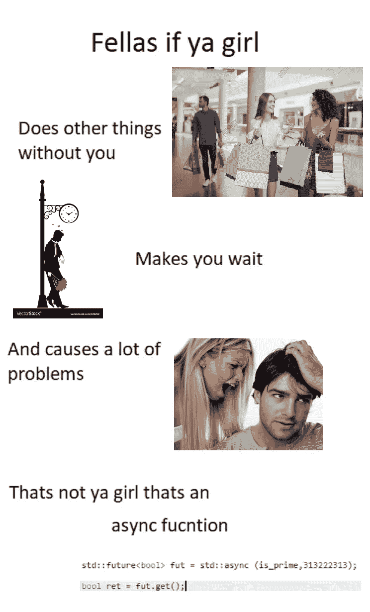

# IT 专业人员可以理解的令人捧腹的编程笑话

> 原文：<https://javascript.plainenglish.io/hilarious-programming-jokes-that-it-professionals-can-relate-to-30258509e48a?source=collection_archive---------2----------------------->

## 潮流节目笑话。

Photo by [Katrina Berban](https://unsplash.com/@kattrinnaaaaa?utm_source=medium&utm_medium=referral) on [Unsplash](https://unsplash.com?utm_source=medium&utm_medium=referral)

新的一年，新的开始。作为你的微笑专家，我又想出了一篇文章，汇集了我在社交媒体上发现的流行节目笑话。

这些笑话的用意是让你发笑，纠正你的情绪。因为:

> "笑声是人机最好的刷新按钮."

让我们沉浸在笑声中。

# 最佳肾上腺素激增。

Picture Credit:[https://www.monkeyuser.com/](https://www.monkeyuser.com/)

# 可悲的现实。粗略的估计变成了最后期限。

Picture Credit:[https://www.facebook.com/yuva.krishna.memes](https://www.facebook.com/yuva.krishna.memes)

# 当某人完成工作后没有留下任何文件就离开了公司。

Picture Credit:[https://www.reddit.com/r/ProgrammerHumor](https://www.reddit.com/r/ProgrammerHumor)

# 你做的第一件事就是:“你好世界”。

Picture Credit:[https://www.reddit.com/r/ProgrammerHumor](https://www.reddit.com/r/ProgrammerHumor)

# 有人忘记终止实例了吗？

Picture Credit:[https://www.reddit.com/r/ProgrammerHumor](https://www.reddit.com/r/ProgrammerHumor)

# 那种压力。

Picture Credit:[https://www.reddit.com/r/ProgrammerHumor](https://www.reddit.com/r/ProgrammerHumor)

# 使用 Regex，没有什么是不言自明的。

Picture Credit: [https://programmerhumor.io/javascript-meme](https://programmerhumor.io/javascript-meme)

# COBOL 有那么老吗？

Picture Credit: [https://programmerhumor.io/javascript-meme](https://programmerhumor.io/javascript-meme)

# 最近我在 Angular 中为一个内存泄漏提供了一个解决方案。

Picture Credit: [https://programmerhumor.io](https://programmerhumor.io/javascript-meme)

# 异步函数可以和我们有关。LOL。

Picture Credit: [https://programmerhumor.io](https://programmerhumor.io/javascript-meme)

# 书上的东西都不能抄袭所以……:)

Picture Credit:[https://www.reddit.com/r/ProgrammerHumor](https://www.reddit.com/r/ProgrammerHumor)

# 不要碰它，因为它工作得很好。

Picture Credit:[https://www.reddit.com/r/ProgrammerHumor](https://www.reddit.com/r/ProgrammerHumor)

# 当一个初级 dev 看到前端 UI 的时候。

Picture Credit:[https://www.reddit.com/r/ProgrammerHumor](https://www.reddit.com/r/ProgrammerHumor)

# 你常用的测试名称是什么？

Picture Credit:[https://www.reddit.com/r/ProgrammerHumor](https://www.reddit.com/r/ProgrammerHumor)

# 当想法是在纸上而不是线框图。

Picture Credit:[https://www.reddit.com/r/ProgrammerHumor](https://www.reddit.com/r/ProgrammerHumor)

**额外的微笑**

# 你感觉到任何超自然现象吗？这个大家肯定都感受过一次。

[https://www.facebook.com/photo?fbid=2965032800448974&set=gm.2890010224599861](https://www.facebook.com/photo?fbid=2965032800448974&set=gm.2890010224599861)

# 哈哈，只是为了好玩！

[https://www.facebook.com/photo/?fbid=1282456812216206&set=gm.2886904718243745](https://www.facebook.com/photo/?fbid=1282456812216206&set=gm.2886904718243745)

# 金钱是第一动机。

[https://www.facebook.com/yuva.krishna.memes/photos/a.105527467815845/382625006772755/](https://www.facebook.com/yuva.krishna.memes/photos/a.105527467815845/382625006772755/)

# 聪明的家伙。

[https://www.facebook.com/yuva.krishna.memes/photos/a.105527467815845/382621070106482/](https://www.facebook.com/yuva.krishna.memes/photos/a.105527467815845/382621070106482/)

# 我们这里不这么做。

[https://www.facebook.com/yuva.krishna.memes/photos/a.105527467815845/382616893440233/](https://www.facebook.com/yuva.krishna.memes/photos/a.105527467815845/382616893440233/)

# 让我们看看你是否能猜出接下来的 2。

[https://www.facebook.com/yuva.krishna.memes/photos/a.105527467815845/382604443441478/](https://www.facebook.com/yuva.krishna.memes/photos/a.105527467815845/382604443441478/)

# 是的，我是值得的。

[https://www.reddit.com/r/ProgrammerHumor/comments/otsz33/reading_your_old_code/](https://www.reddit.com/r/ProgrammerHumor/comments/otsz33/reading_your_old_code/)

# 你在什么地方有过这种感觉吗？

[https://www.reddit.com/r/ProgrammerHumor/comments/otk8r3/me_choosing_stack_overflow_answers/](https://www.reddit.com/r/ProgrammerHumor/comments/otk8r3/me_choosing_stack_overflow_answers/)

# 这里少了点什么。请在评论中告诉我。

[https://www.facebook.com/photo?fbid=3863966907046367&set=gm.844650382920885](https://www.facebook.com/photo?fbid=3863966907046367&set=gm.844650382920885)

# 我太老了。

[https://www.facebook.com/photo/?fbid=4220391241333272&set=gm.6478381755520887](https://www.facebook.com/photo/?fbid=4220391241333272&set=gm.6478381755520887)

# 希望你经常微笑。祝你有美好的一天！

*更多内容看* [***说白了。报名参加我们的***](https://plainenglish.io/) **[***免费周报***](http://newsletter.plainenglish.io/) *。关注我们关于*[***Twitter***](https://twitter.com/inPlainEngHQ)*和*[***LinkedIn***](https://www.linkedin.com/company/inplainenglish/)*。加入我们的* [***社区***](https://discord.gg/GtDtUAvyhW) *。***