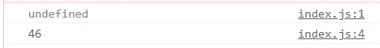
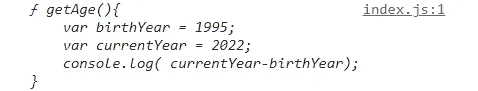
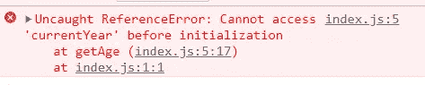
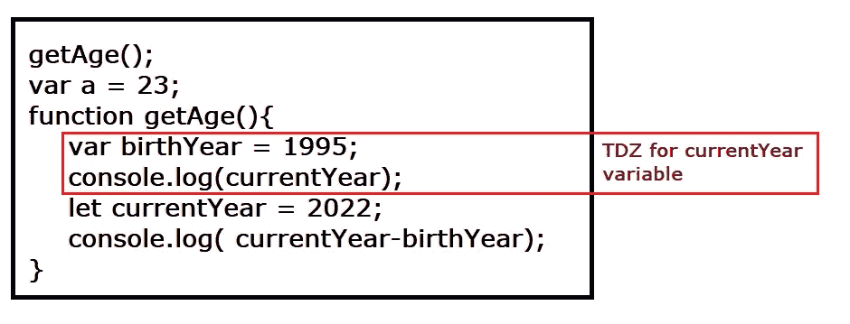

# 在 JavaScript 中提升

> 原文：<https://javascript.plainenglish.io/hoisting-in-javascript-d469541fda3c?source=collection_archive---------14----------------------->

The above image is created by Divyojyoti Ghosh(me) on [www.canva.com](http://www.canva.com/) using different elements available for making designs.

JavaScript 中的提升是一种机制，允许甚至在执行变量声明之前访问一些变量。

让我们借助一个例子来理解——

Code Snippet 1

对于上面的代码片段，与其他编程语言一样，JavaScript 也将为 console.log 语句输出 a 和 b 的值。

现在，如果我们将`console.log(a)`语句移到声明变量 a 之前的代码顶部，让我们看看会发生什么。

Code Snippet 2

与任何其他编程语言不同，第一条语句(即在声明前访问变量 a)不会产生任何错误，但它会打印出`undefined`。

output for the Code Snippet 2

发生这种情况是因为提升的机制，使用 var 声明的 JavaScript 变量在执行之前被提升，换句话说，它们被提升到其作用域的顶部，这就是为什么它不会产生任何错误。

JavaScript 中的提升是由于执行上下文中的可变环境而发生的(在[的执行上下文文章](https://medium.com/javascript-in-plain-english/execution-context-in-javascript-abe424d000b)中详细讨论)。执行上下文中代码的执行分两个阶段，创建阶段和执行阶段。

使用 **var** 定义的变量存储在变量环境中，默认值为‘未定义’。在执行阶段，代码的执行是逐行进行的，所以代码为一个在声明前被访问的变量打印`undefined`。

# 功能提升

JavaScript 中的命名函数也被提升，这就是为什么它们可以在声明上面的代码中被调用。

Code Snippet 3

上面的代码输出 27，但是当我们试图在声明之前打印函数而不是调用它时会发生什么？

Code Snippet 4

对于上面的代码片段，代码直接打印了函数定义。

Output for Code Snippet 4

在执行上下文的创建阶段，函数作为它们的文字声明保存在变量环境中，所以当函数名被控制台记录时，整个函数被打印出来。函数只有在被调用时才会执行，例如`getAge();`会开始执行 getAge 函数。

# 时间死区(TDZ)

我们可以在变量声明之前访问 var 变量，但不能访问 let 和 const 变量，从技术上来说，所有类型的变量都是提升的，但在 let 和 const 的情况下，变量声明上方的变量范围内的区域被认为是临时死区，在那里这些变量不能被访问，如果代码试图从该区域访问，它们会抛出 ReferenceError。

Code Snippet 5

在上面的代码中，第 5 行抛出一个 ReferenceError，因为 currentYear 是从它的 TDZ 访问的。

Output for Code Snippet 5

# 为什么是 TDZ？

时间死区是随着 ES6 中的 let 和 const 变量的引入而引入的。TDZ 使得 let 和 const 变量在声明之前不可访问，这使得代码不容易出错。

同样，这也使得常量变量成为真正的常量变量，因为如果没有 TDZ，它会把初始值显示为`undefined`，然后在声明之后赋值。但是对于 TDZ，如果从 TDZ 访问，它只会一直显示一个值或一个错误。

# 参考

[https://www . udemy . com/course/the-complete-JavaScript-course/](https://www.udemy.com/course/the-complete-javascript-course/)

 [## 发现要点

### 我做这个要点是为了展示一些你可以用 discord.py 做的事情的例子，也是因为…

gist.github.com](https://gist.github.com/) 

*更多内容尽在* [***说白了. io***](https://plainenglish.io/) *。报名参加我们的* [***免费周报***](http://newsletter.plainenglish.io/) *。关注我们上* [***推特***](https://twitter.com/inPlainEngHQ)[***领英***](https://www.linkedin.com/company/inplainenglish/)*[***YouTube***](https://www.youtube.com/channel/UCtipWUghju290NWcn8jhyAw)**和* [***不和***](https://discord.gg/GtDtUAvyhW) *对成长黑客感兴趣？检查出* [***电路***](https://circuit.ooo/) ***。*****