# JavaScript 中的提升直观地解释了🔥 😍

> 原文：<https://javascript.plainenglish.io/hoisting-in-javascript-explained-visually-750ab77cb8a2?source=collection_archive---------9----------------------->


Photo by [Pankaj Patel](https://unsplash.com/@pankajpatel?utm_source=medium&utm_medium=referral) on [Unsplash](https://unsplash.com?utm_source=medium&utm_medium=referral)

开发人员通常对 JavaScript 又爱又恨，因为有时它并不像预期的那样工作。学习 JavaScript 基础知识和它的特点可以帮助开发人员调试和编写干净的代码。

这篇博客文章旨在解释这样一个特点，即使用动画 gif 来提升🌟✨.读完这篇博客后，你将离成为一名摇滚明星开发者更近了一步🎸😎。


# JavaScript 代码的执行。

在理解提升的概念之前，让我们首先通过一个例子来了解 JavaScript 如何在后台运行代码。

```
var a = 2;
var b = 4;

var sum = a + b;

console.log(sum);
```

在这个简单的例子中，我们初始化两个变量 a 和 b，并分别存储 2 和 4。然后我们将 a 和 b 的值相加，存储在 sum 变量中。让我们看看 JavaScript 如何在浏览器中执行代码🤖。

当 JS 第一次收到我们的代码时，它将创建一个执行上下文。执行上下文将首先扫描所有代码，并将内存分配给所有变量和函数。对于变量，特别是 var，JavaScript 将在内存中存储 undefined，对于函数，它将在内存中保存整个函数代码引用。


既然我们已经扫描并为代码分配了内存，我们就可以执行代码了。JavaScript 将再次开始逐行检查整个代码。

当遇到变量 a = 2 时，它在内存中将 2 赋给' a'。直到现在，a 的值还没有定义。

同样，它对 b 变量做同样的事情。它将 4 分配给 b。然后，它计算并在内存中存储总和的值，即 6。现在，在最后一步中，它在控制台中打印 sum 值，然后在代码完成时销毁全局执行上下文。


如果你想学习更多关于 JavaScript 代码执行的知识，我在 medium 上写了一篇文章。

链接:【JavaScript 如何工作:可视化指南🔥 🤖

# var 中的吊装

为了理解用 var 定义的变量的提升，让我们以代码执行中的例子为例。然而，在这个例子中，我们将在开始时打印总数，而不是在结束时。

```
console.log(sum);

var a = 2;
var b = 4;

var sum = a + b;
```

上述代码在其他编程语言中会抛出错误，但在 JavaScript 中不会。

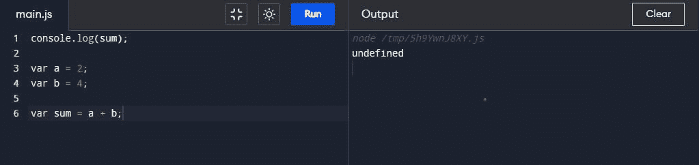

正如我们在代码执行一节中看到的，当 JS 第一次收到我们的代码时，它会创建一个执行上下文。执行上下文将首先扫描所有代码，并将内存分配给所有变量和函数。


现在，扫描完代码后，它将开始逐行执行代码。在第一行中，javascript 检查内存中 sum 的值，并输出 undefined。

现在，当它遇到 var a = 2 时，它在内存中将 2 赋给' a'。直到现在，a 的值还没有定义。

同样，它对 b 变量做同样的事情。它将 4 分配给 b。然后，它计算并在内存中存储总和的值，即 6。

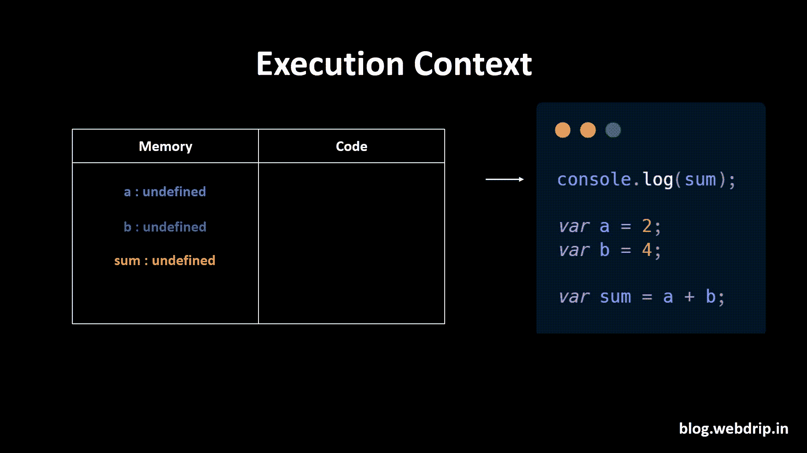

如果我们在计算完总和后登录控制台，让我们看看输出。

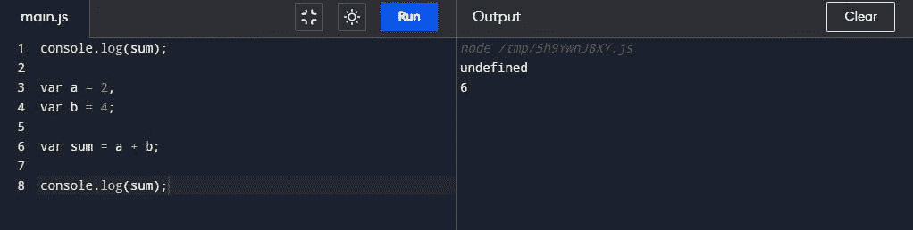

最初，它将打印 undefined，在计算总和之后，它将打印 6。javaScript 中的这种特性被称为提升。让我们在 Let，const 关键字和函数中学习提升。

# 在左侧和右侧吊装

当我们引用一个在声明前用 var 关键字声明的变量时，它只是返回它的默认值:undefined！但是，如前面的示例所示，这有时会导致“意外”行为。

因此，ES6 引入了两个新的 JavaScript 关键字来应对这种意外行为:let 和 const。这两个关键字是块范围。为了保持这篇文章的简洁，我们将在另一篇博客中学习更多关于范围的内容。

让我们通过一个例子来看看 Let 和 const 中的提升。

```
console.log(a);
console.log(sum);

var a = 2;
let b = 4;
const c = 6;

const sum = a + b + c;
```

所以让我们再次从代码的执行开始，当 JS 第一次收到我们的代码时，它会创建一个执行上下文。执行上下文将首先扫描所有代码，并将内存分配给所有变量和函数。我知道我已经多次提到这一点，但这很重要😅。

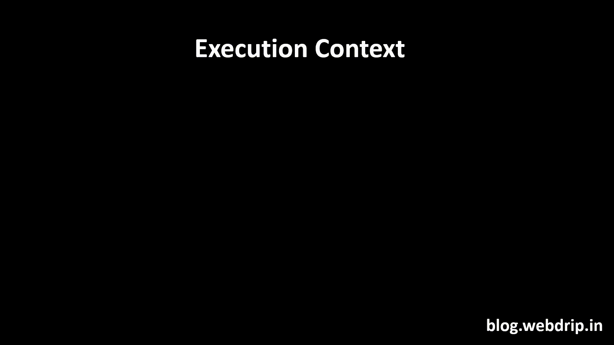

与 var 相反，其中**未定义的**存储在内存中，let 和 const 变量是**未初始化的**。

扫描完代码后，它将开始逐行执行代码。第一行将打印“a”的值，即控制台中未定义的值。但是，当我们试图在初始化之前访问 let 和 const 关键字时，每当我们试图访问未初始化的变量时，就会抛出 ReferenceError。无法访问未初始化的变量，因为它们位于临时死区中。

时间死区仅仅意味着我们在声明之前不能访问变量。

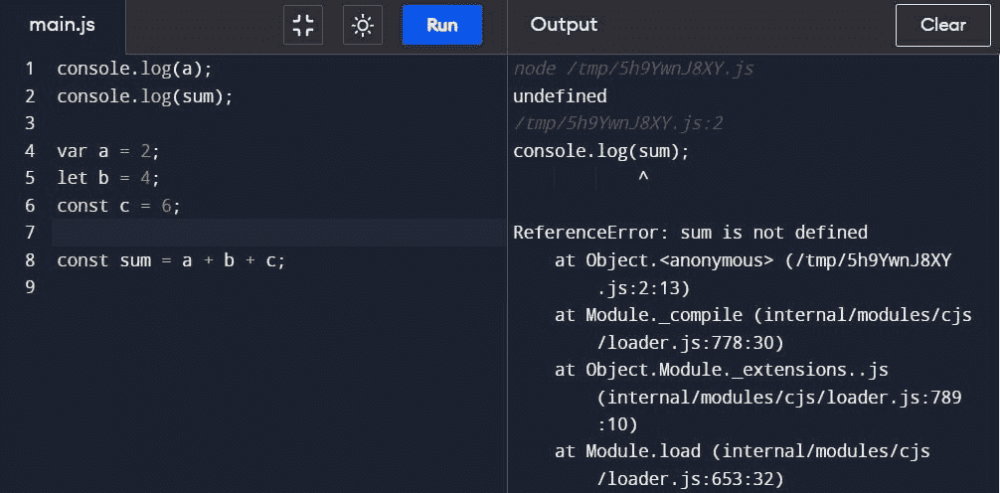

如果我们试图打印 b 的值而不是总和，结果将是一样的。

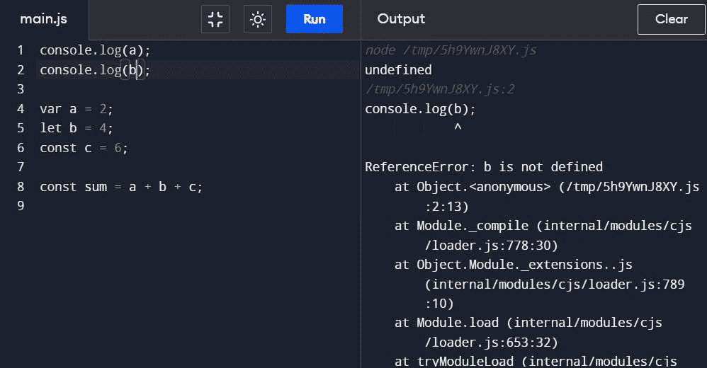

一旦变量值的减速完成，必须打印总和值。

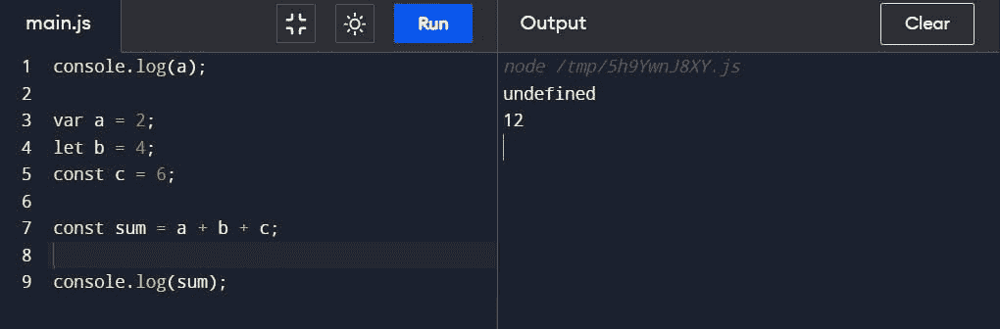

这是代码执行的可视化。

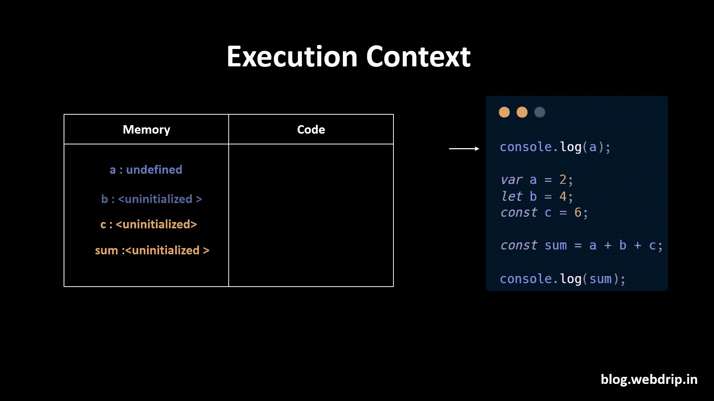

# 功能提升

当 javaScript 开始扫描代码并遇到一个函数时，它会将该函数的引用存储在内存中。这就是为什么我们可以在创建函数之前调用它。让我们通过一个例子来看看它的作用。

```
printSum(4,5)

function printSum(a,b){
	const c = a + b;
	console.log(c);
}
```

以下代码的输出将是。

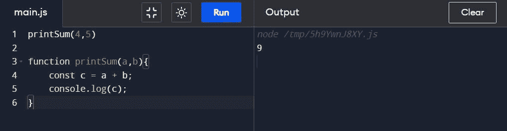

让我们试着想象一下，首先 JavaScript 会扫描代码，它会在第 3 行遇到一个函数，它会将该函数的引用添加到内存中。

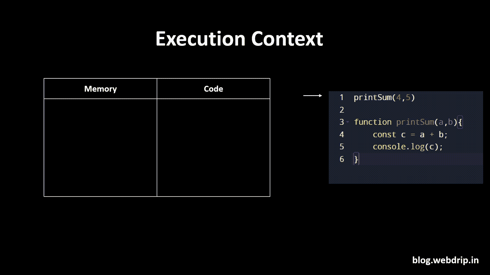

Javascript 现在将逐行运行代码。它在第一行遇到一个函数。当一个函数在 javascript 中执行时，它会在我们的全局执行上下文中创建新的执行上下文。将函数执行上下文视为一个小型执行上下文，它有内存和一个位置来执行函数中的代码。

在这篇[博客文章](https://dev.to/narottam04/how-javascript-works-visually-explained-269j)中阅读更多关于函数如何执行代码的内容。

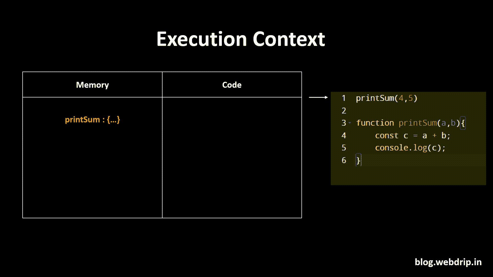

一旦函数中的所有代码都被执行，函数的执行上下文就被破坏了。

# 参考

`1>` [纳马斯 JavaScript](https://www.youtube.com/watch?v=Fnlnw8uY6jo&list=PLlasXeu85E9cQ32gLCvAvr9vNaUccPVNP&index=4)


我希望这篇文章是有益的。💪🏾如果您有任何问题，请随时评论或联系我。

如果你想支持我的工作，你可以[给我买杯咖啡](https://www.buymeacoffee.com/narottam) ❤️❤️.

*原发布于*[*https://webdriphashnode . hashnode . dev*](https://webdriphashnode.hashnode.dev/hoisting-in-javascript-explained-visually)*。*

*更多内容请看* [***说白了。报名参加我们的***](https://plainenglish.io/) **[***免费周报***](http://newsletter.plainenglish.io/) *。关注我们*[***Twitter***](https://twitter.com/inPlainEngHQ)*和*[***LinkedIn***](https://www.linkedin.com/company/inplainenglish/)*。查看我们的* [***社区不和谐***](https://discord.gg/GtDtUAvyhW) *加入我们的* [***人才集体***](https://inplainenglish.pallet.com/talent/welcome) *。***