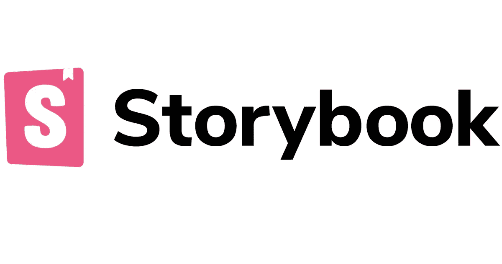
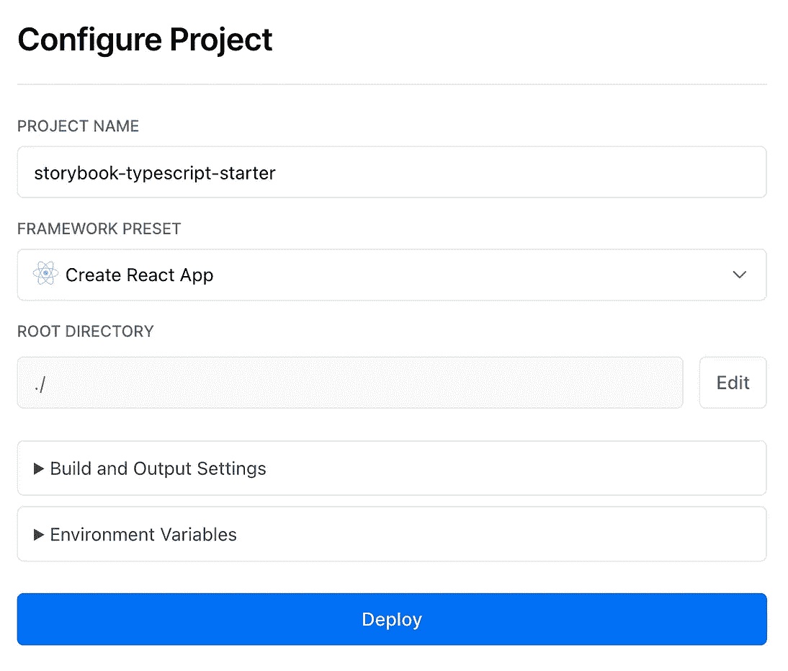
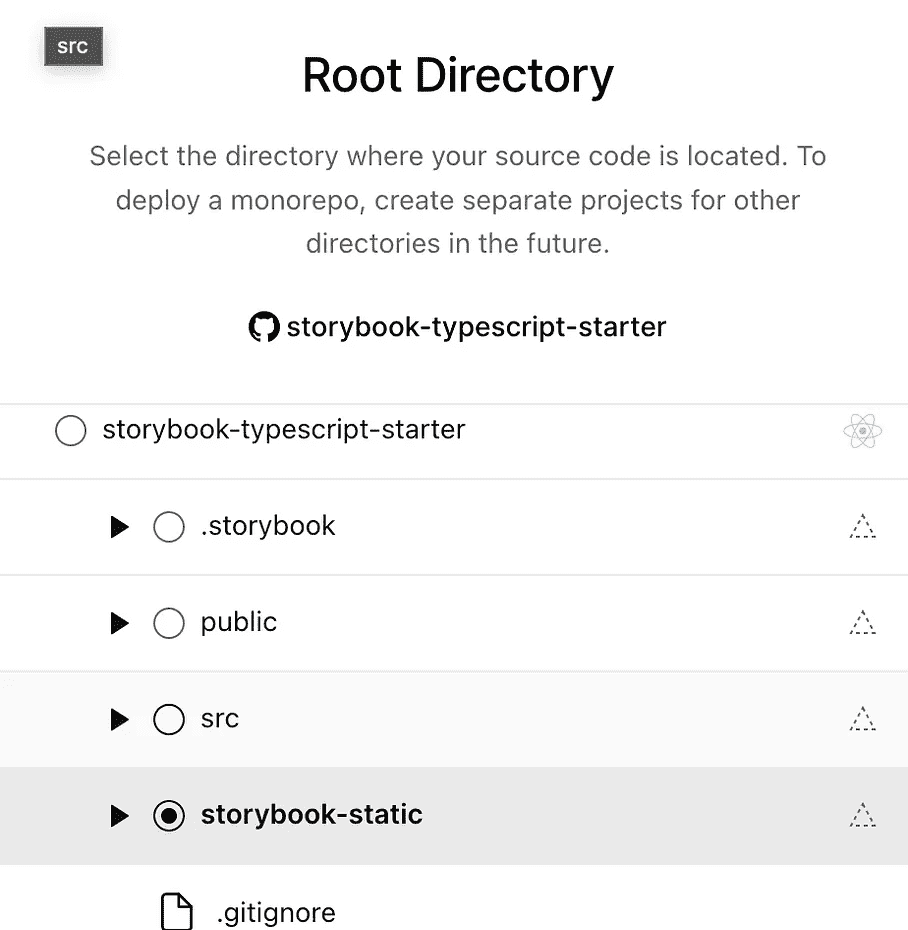
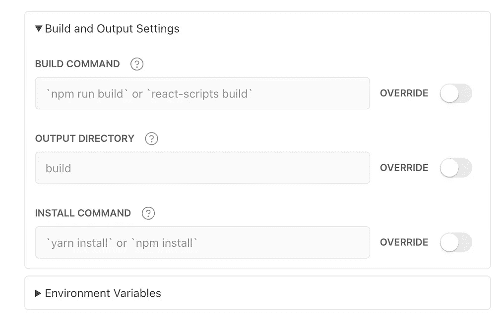
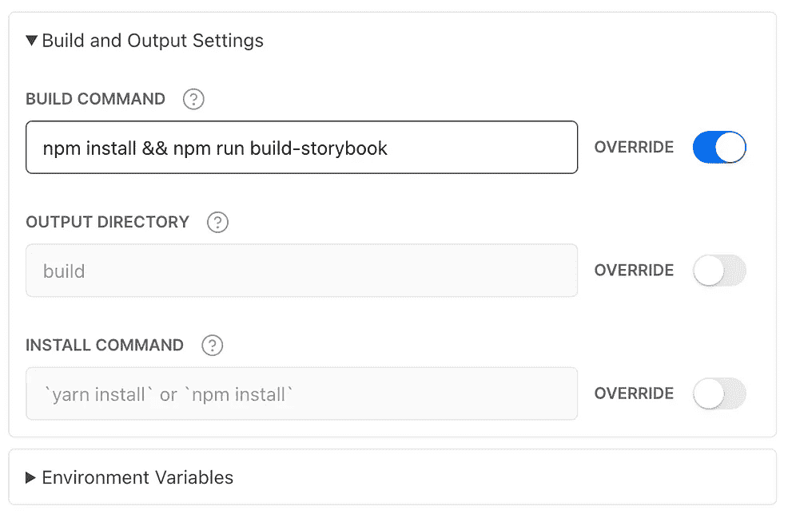

# 如何在 Vercel 上免费托管故事书

> 原文：<https://javascript.plainenglish.io/host-storybook-for-free-on-vercel-6644ec52aaf9?source=collection_archive---------4----------------------->

## 使用 Storybook(一个组件文档库)和 Vercel(一个站点托管服务)获得组件库的免费文档。

[Credits](https://miro.medium.com/max/1200/1*JfsudFzdONEBWZP1u1t2nQ.png)

## 介绍

Storybook 是一个开源工具，用于构建独立的 UI 组件和页面。它简化了 UI 开发、测试和文档。通过利用 storybook，您可以展示组件的 Api，并确保您拥有组件系统的“活文档”。

为了跟上进度，请分叉此[启动器库](https://github.com/EvanBurbidge/storybook-typescript-starter)。

## 为什么是故事书

有几个原因让我在写组件文档的时候会去看故事书。首先，它适用于大多数前端 Javascript 框架，我曾在 Vue 和 React 中使用过。

它提供的用于记录 api 的控件是一流的。它们允许您测试传递到每个组件中的不同值，并作为测试本身。

他们有一个可扩展的插件库，我使用插件是为了方便访问，也是为了监控与每个组件相关的单元测试。当我需要检查特定组件的状态时，这是一个巨大的资产。

## 如何在 Vercel 上部署

Vercel 是一个用于前端框架和静态站点的平台，旨在与您的无头内容、商务或数据库集成。我们要利用的句子的要点是“静态站点”。

当我们运行 npm run build-storybook 时，我们输出一个静态目录，可以很容易地上传到 Vercel。

我们需要做的第一件事是将我们的项目导入 Vercel。在您的仪表板上，您可以通过单击“新建项目”按钮来完成此操作。在 import git repository 列表中，输入您用上面的 starter 创建的 repo 的名称。

我们现在要编辑配置设置，第一件事是更改“根目录”。这个要改成“故事书静态”。

我们需要做的下一件事是更新构建和输出设置。将构建脚本更新为

`npm install && npm run build-storybook`

我们需要做的第二个覆盖是输出目录。我们需要将它设置为“.”为了让它找到故事书生成的 index.html。

一旦完成，我们就可以按部署了。第一次构建会花费一些时间，但是随着节点模块缓存的构建，后续的部署会花费越来越少的时间。

部署完成后，Vercel 会为您的部署提供一个 URL，您可以使用它来查看您的组件库。对于上述启动回购的最终结果，您应该会看到类似这样的内容。

 [## Webpack 应用程序

### 编辑描述

story book-typescript-starter . vercel . app](https://storybook-typescript-starter.vercel.app/?path=/story/button--primary) 

如果您想注册获取更多的媒体内容，请通过以下[链接](https://thewebuiguy.com/membership)注册。这将使我能够通过一个来自媒体的小佣金写更多的故事。

*更内容于* [***通俗地说就是***](http://plainenglish.io/) *。**[***报名参加我们的免费周报***](http://newsletter.plainenglish.io/) *。在我们的* [***社区纠纷***](https://discord.gg/GtDtUAvyhW) *中获得独家写作机会和建议。**