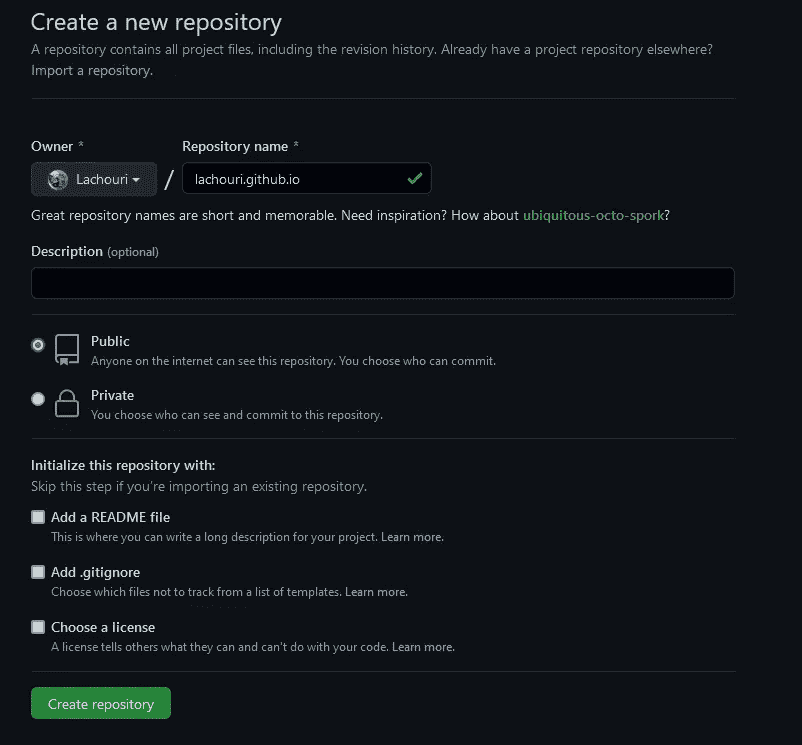
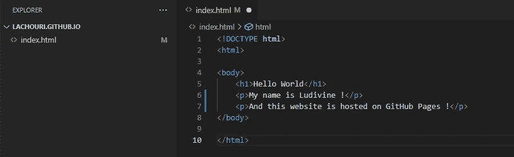
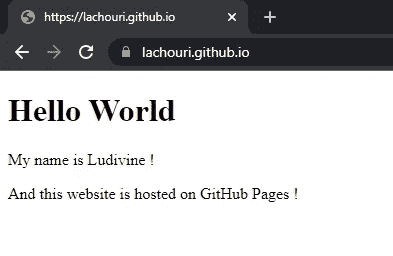

# 免费在 GitHub 页面上托管您的网站

> 原文：<https://javascript.plainenglish.io/host-your-website-on-github-pages-for-free-1b4894104014?source=collection_archive---------16----------------------->

## 免费的 GitHub 网站托管指南。

Photo by [Clément Hélardot](https://unsplash.com/@clemhlrdt?utm_source=unsplash&utm_medium=referral&utm_content=creditCopyText) on [Unsplash](https://unsplash.com/?utm_source=unsplash&utm_medium=referral&utm_content=creditCopyText)

你知道你可以在 GitHub 上免费主持一个网站吗？

没有吗？那我给你看看。

# 创建存储库

您需要创建一个存储库，并将其命名为 *yourUsername.github.io.*

❗你需要把它公之于众。

# 推送你的网站

为了测试我的网站，我将使用一点代码创建一个简单的*index.html*文件，并将它放到 GitHub 上。

*   然后用`git init`初始化回购
*   用`git add .` 和`git commit -m "First commit”`创建一个提交
*   用`git branch -M main`创建主分支
*   用`git remote add origin https://github.com/yourUsername/yourRepo`将本地回购链接到 git 存储库
*   最后用`git push -u origin main`推

等待一分钟左右，转到以下网址:[https://your username . github . io](https://yourUsername.github.io)，以及🎉您的网站出现。

现在你知道了。感谢您的阅读。

*原贴于我的* [*博客*](https://blog.ludivineachouri.com/) *。查看我的*[*insta gram*](https://www.instagram.com/la.dev/)*账号，了解更多关于 web 开发的知识。*

*更多内容请看*[***plain English . io***](http://plainenglish.io/)*。报名参加我们的* [***免费周报***](http://newsletter.plainenglish.io/) *。在我们的* [***社区不和谐***](https://discord.gg/GtDtUAvyhW) *获取独家写作机会和建议。*