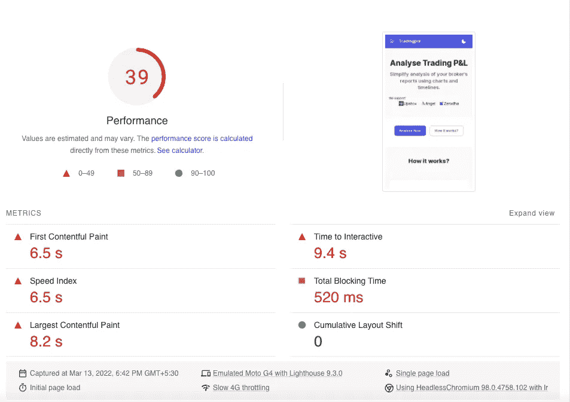
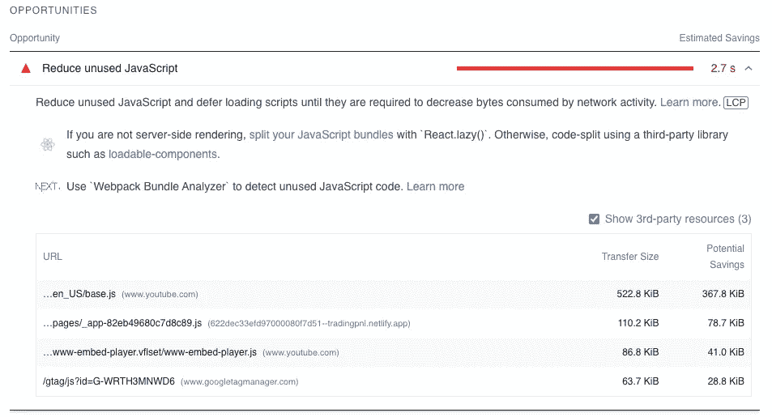
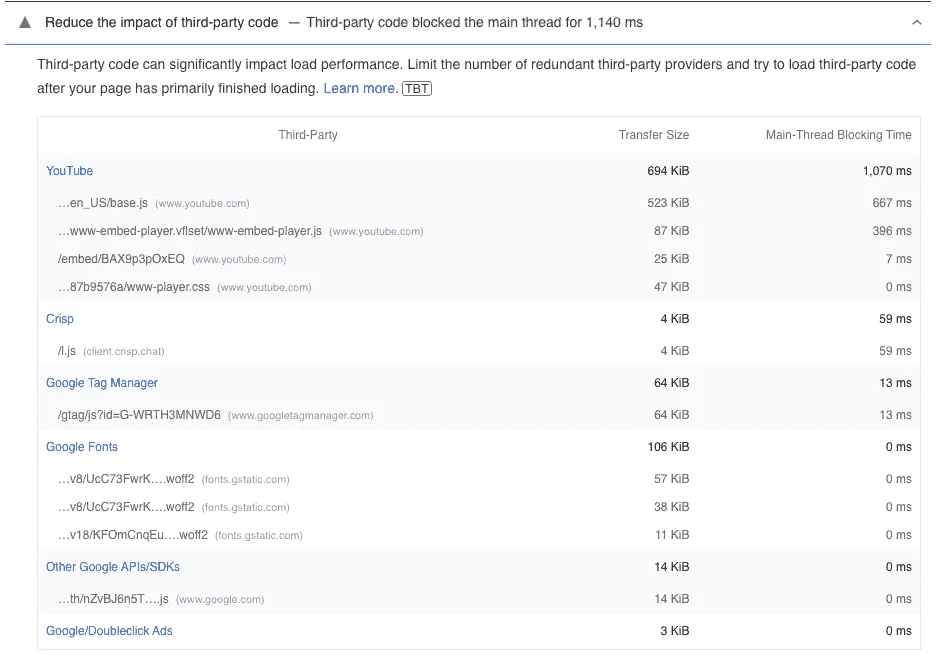
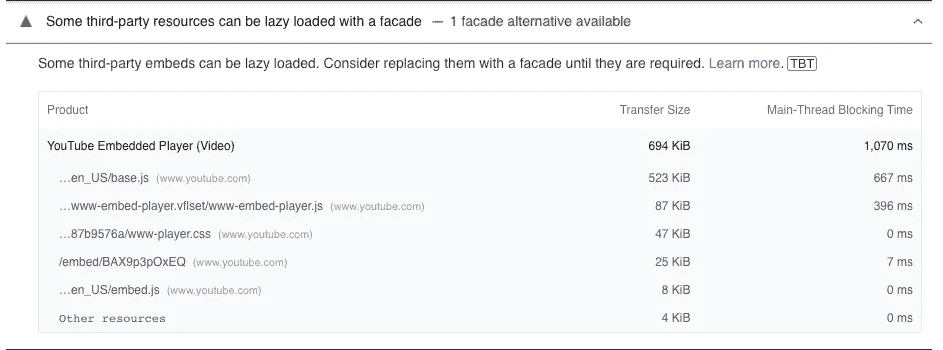
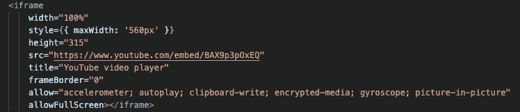
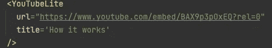
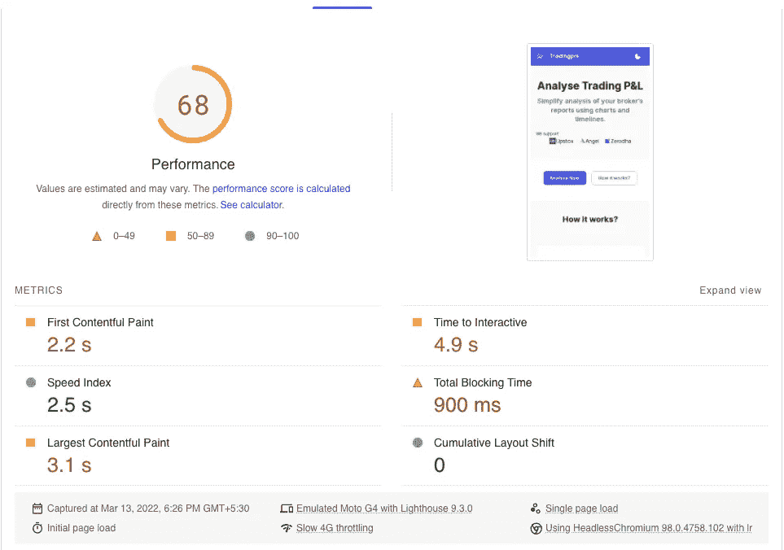

# YouTube 视频如何破坏你的网站性能以及如何修复它

> 原文：<https://javascript.plainenglish.io/how-a-youtube-video-can-destroy-your-site-performance-and-how-to-fix-it-4e285749567d?source=collection_archive---------8----------------------->

## 如何修复因 YouTube 视频嵌入而导致的网站性能问题。


Photo by [freestocks.org](https://www.pexels.com/@freestocks?utm_content=attributionCopyText&utm_medium=referral&utm_source=pexels) from [Pexels](https://www.pexels.com/photo/person-holding-space-gray-iphone-5-34407/?utm_content=attributionCopyText&utm_medium=referral&utm_source=pexels)

我拥有一个网站，这是一个应用程序，以图形方式分析交易者的利润和损失。你可以在这里查看:

[](https://tradingpnl.in) [## 一个分析你的交易 pnl 的应用程序

### 使用图表和时间线简化对经纪人报告的分析。

贸易进口](https://tradingpnl.in) 

虽然大部分功能都在社交登录之后，但它有一个解释该工具的登录页面。

我制作了一个 YouTube 视频来展示如何使用这个工具，并把它放在登陆页面上。

今天我碰巧参加了来自 [Reactify](https://twitter.com/reactify_in) 社区的关于网页性能的[研讨会。](https://www.youtube.com/watch?v=A7BYHd32Uh0)

作为任何网站所有者都会做的第一件事，我还使用以下方法分析了我的网站性能:

 [## PageSpeed 洞察

### 编辑描述

页面速度. web.dev](https://pagespeed.web.dev/) 

看看我得到的可怜分数。😟



Poor performance score for tradingpnl.in



这个网站足够聪明，可以展示机会。看看大部分都和 YouTube 有什么关系。



The possible solution: facade

最后，可能的解决方案是使用一个[外观](https://web.dev/third-party-facades/?utm_source=lighthouse&utm_medium=lr)。您可以在此页面上了解解决此问题的许多选项:

[](https://web.dev/third-party-facades/?utm_source=lighthouse&utm_medium=lr) [## 用 facades 惰性加载第三方资源

### 第三方资源通常用于显示广告或视频以及与社交媒体集成。默认…

网络开发](https://web.dev/third-party-facades/?utm_source=lighthouse&utm_medium=lr) 

让我告诉你我是如何修理它的。

因为我使用 [React](https://reactjs.org/) 来构建我的站点，所以我寻找了一个 React 库来做这件事。我已经登陆 [React Youtube Light](https://www.npmjs.com/package/react-youtube-lite) 。

安装软件包后:

```
*npm install react-youtube-light*import { YouTubeLite } from 'react-youtube-lite';
```

改变这一点很简单:



Iframe embed code for YouTube

对此:



YouTube embed with react-youtube-light

看看我的页面分数是如何提高的🎉。



Page score after optimisation

额外奖励:如果你想知道“什么？rel=0”位于 YouTube URL 的末尾，这是为了避免在原始视频结束后显示许多建议视频。

现在你知道了。感谢您的阅读。

*更多内容请看*[***plain English . io***](https://plainenglish.io/)*。报名参加我们的* [***免费周报***](http://newsletter.plainenglish.io/) *。关注我们关于*[***Twitter***](https://twitter.com/inPlainEngHQ)*和*[***LinkedIn***](https://www.linkedin.com/company/inplainenglish/)*。加入我们的* [***社区不和谐***](https://discord.gg/GtDtUAvyhW) *。*