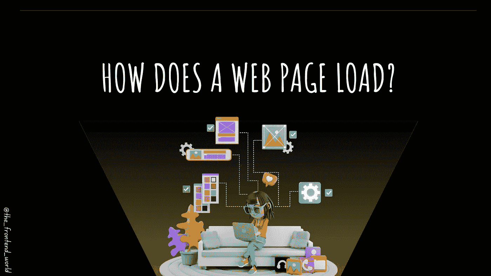
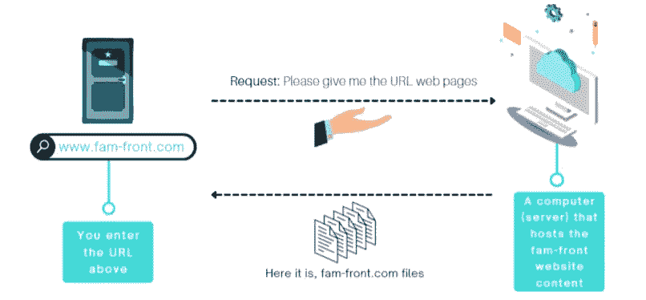
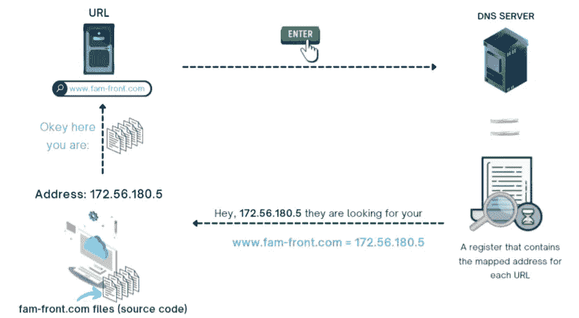
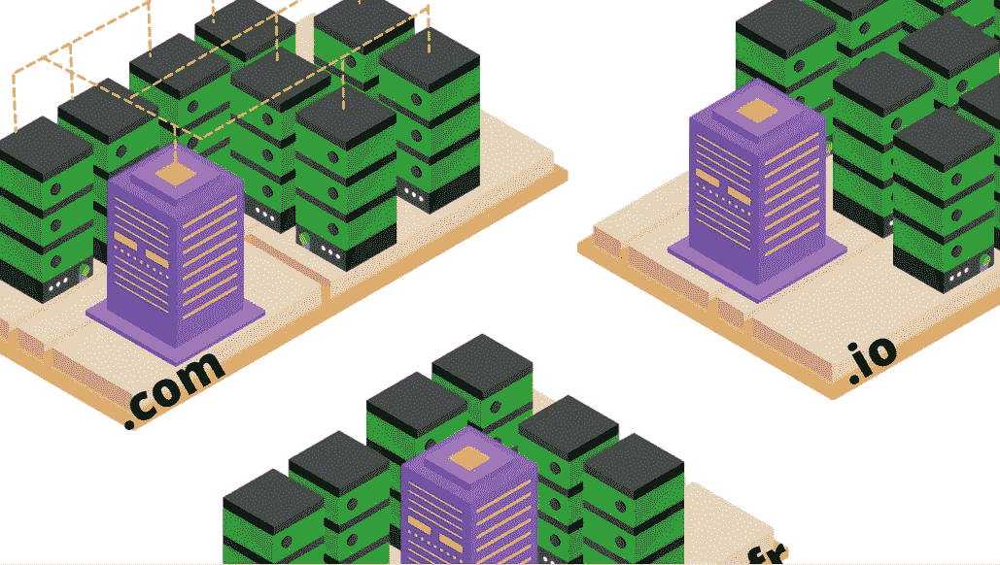
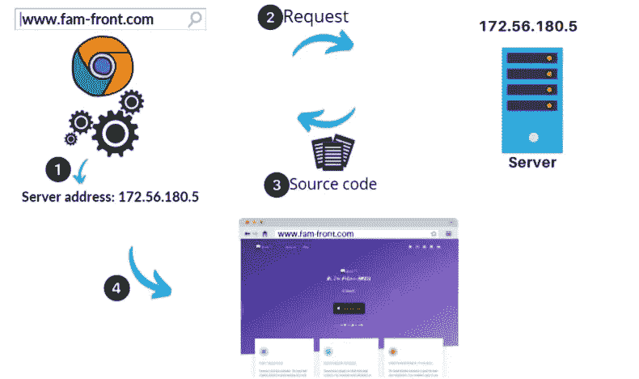
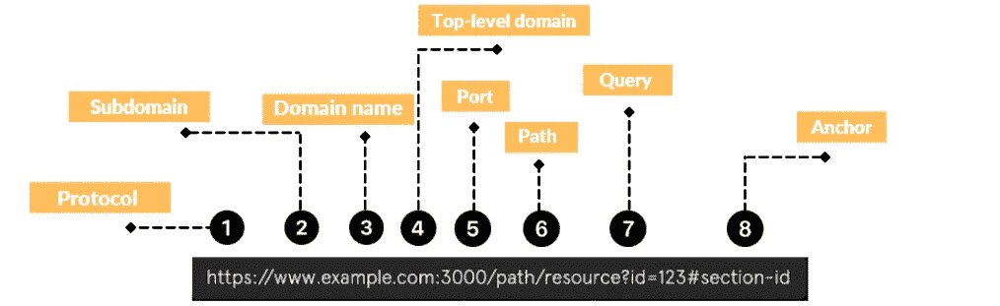

# 网页是如何加载的？后台发生了什么？

> 原文：<https://javascript.plainenglish.io/how-does-a-web-page-load-what-happens-in-the-background-260cee68a88f?source=collection_archive---------3----------------------->

## 当你访问一个网页时，幕后发生了什么？

By FAM

你好，

我们的 [2022 网络计划](https://medium.com/geekculture/2022-web-program-is-launched-f38a3280af1a?source=your_stories_page----------------------------------------)已经启动，这是我们将要采取的第一步:

> 网络在内部是如何运作的？当你点击一个网页时会发生什么？

在学习任何关于网络的技能之前，我们首先需要了解网络是如何工作的。这篇文章将清楚地解释网络是如何工作的，以便有一个清晰的心理图像。

在学习任何关于网络的知识之前，这一步是必不可少的。web 或 Internet 不仅仅是通过在浏览器中输入 URL 来访问它。很多事情都是幕后发生的，我给你曝光。

## 故事从网站门开始…网址

一个 URL 就像一扇门。我们输入一个网址，点击回车，奇迹就发生了。让我们把一个网站看成一本书。您正在访问的图书不在您的笔记本电脑或台式机上。因为我们可以在互联网上调用它，这意味着它以某种方式存储在某个地方，它保存在另一台计算机中，这样互联网上的每个人都可以通过它的入口访问它， ***URL*** 。

By FAM

现在，服务器如何知道他有输入的 URL 的文件？好问题，不是吗？在用户请求 URL 和服务器应答请求之间有更多隐藏的步骤。

## 服务器和网站之间的关系

服务器不是别的，就是一台可用的计算机 24H/24。服务器需要三样东西来显示你正在等待的网页:

*   URL 在 DNS 服务器上有其转换后的地址(IP 地址)。
*   这个 IP 地址只不过是托管服务器的真实且唯一的地址。
*   IP 地址是托管网页的服务器的地址。这意味着我们的网站文件(*源代码*)在服务器上的某个地方，并且随时可用。

如果服务器得到了这三样东西，连接就建立了。

> IP 地址**类似于家庭地址。它是独一无二的，每个服务器都有一个。**
> 
> DNS 服务器就像一个寄存器，它会告诉一个 URL ' **X** '它的 **IP** 地址。

现在让我们从更大的角度来看整个事情

By FAM

## 为什么我们需要 DNS？网页已经有了唯一的网址，不是吗？

好问题！当你拜访某人时，你需要一个唯一的地址才能联系到他。URL 已经是唯一的。

计算机的实际地址不是人类的。互联网上的每台计算机都有一个唯一的 IP 地址。要记住你想访问的每个网站的 IP 地址是不可能的。就像是:172.56.190.3。

让事情更人性化。添加了 DNS 步骤。DNS 服务器获得了互联网上每个 URL 及其对应地址的注册。顺便说一下，就像电话号码一样。😜我只记得我的。对于其他人，我使用他们的名字在智能手机上找到他们(🤫).

**有多个 DNS 服务器……**

想象一下，全世界的人都连接在一起，请求同一个服务器。就像是:

我们需要遍布全球的多台服务器来满足巨大的需求。有一个主 DNS 服务器，浏览器通过它来获取每个区域的 IP 地址。之后，主 DNS 服务器可以与服务器通信以获得 IP 地址。

By FAM

## 最终大视图

By FAM

***源代码*** 是网站内容。它获得了 HTML、CSS、JS 和浏览器呈现网页所需的资源。这部分将在程序的下一章解释。

## URL 是由很多东西组成的…

By FAM

这就是我们下次将看到的***HTTP&HTTPS****部分！*

*敬请期待，下期再见；)*

## *很高兴知道*

*   ***URL** =统一资源定位器*
*   *IP =互联网协议*
*   ***=域名系统***

# ***2022 年网络计划路线图***

## ***I -一般网络知识***

> *****工作原理*****

*   ***HTTPS***
*   ****表头&方法****
*   ***…***

*****了解更多:*****

*** [## 2022 网络计划启动！

### 改变来自心态和习惯

medium.com](https://medium.com/geekculture/2022-web-program-is-launched-f38a3280af1a)  [## 我的网络文章 2022 年路线图

### 让我们提升我们的网络技能和知识！

javascript.plainenglish.io](/my-web-articles-roadmap-for-2022-20387cab9b07) 

> 我今天的故事到此结束，我希望你喜欢它，并从中吸取教训，❤

如果我的作品有 ***打动了你。*** 如果你 ***享受它。*** 如果你觉得 ***值得。请你成为付费会员来支持我，你的一部分费用会寄给我。*** **这将有助于我提供更多的时间来写好文章。**

 [## 如果你喜欢看我的文章… ♥️

### 如果你喜欢读我的文章… ♥️，当我的文章发表时，欢迎你第一个得到通知…

famzil.medium.com](https://famzil.medium.com/subscribe) 

亲爱的读者，感谢你存在于我的生活中。让我们在 [**中**](https://medium.com/@famzil/)**[**领英**](https://www.linkedin.com/in/fatima-amzil-9031ba95/)**[**脸书**](https://www.facebook.com/The-Front-End-World)**[T21【insta gram](https://www.instagram.com/the_frontend_world/)**、** [**YouTube**](https://www.youtube.com/channel/UCaxr-f9r6P1u7Y7SKFHi12g) 、**或****上联系一下吧********

*****更多内容参见***。注册我们的* [*免费周报*](http://newsletter.plainenglish.io/) *。在我们的* [*社区不和*](https://discord.gg/GtDtUAvyhW) *中获得写作机会和建议。*********