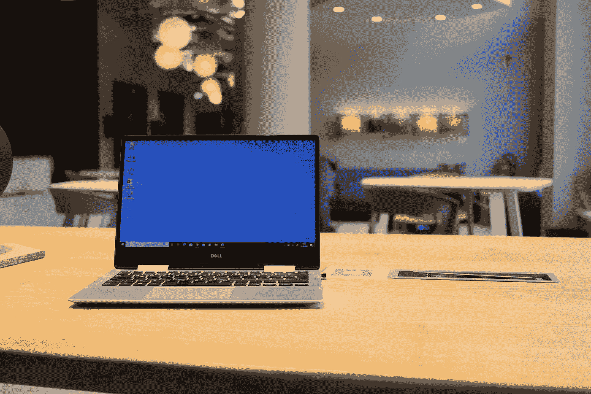

# Linux 如何提高你作为程序员的生产力？

> 原文：<https://javascript.plainenglish.io/how-does-linux-increase-your-productivity-as-a-programmer-658f7996b63c?source=collection_archive---------12----------------------->

## 我来分享一下我使用 Windows 的经验。

Photo by [Piero Nigro](https://unsplash.com/@pieronigro?utm_source=medium&utm_medium=referral) on [Unsplash](https://unsplash.com?utm_source=medium&utm_medium=referral)

每天早上进入公司，我做的第一件事就是打开电脑，等几分钟屏幕出现输入我的密码。

我有一个在登录时运行的脚本，它禁用了我公司的偏执狂安装的两个反病毒程序中的一个(我无法禁用该死的迈克菲)，然后启动两个浏览器，VS 和 VS 代码。当他这么做的时候，我喝了一杯咖啡，吃了一些烤饼，因为如果我呆在电脑前，我会很生气。

当我必须编译我正在处理的解决方案时。我用耐心武装自己，一边看 YouTube 上的几个视频，一边把它交给编译。这给了我充足的时间。如果我用`ng`命令启动 Angular，我仍然看到三个或一个长。

有时候，有些情况需要快速行动，比如生产故障或担心的经理希望你放下手头的工作，马上回答一些问题。

在这些情况下，我无法避免紧张。我打开一个浏览器窗口，大约 30 秒钟后出现。我找到一个网络资源(又是 30 秒)，打开一个日志文件(又是 30 秒)。在那段时间里，空气可以被刀切断，如果我必须做的是打开一个解决方案，而不是我此刻打开的，我不会告诉你任何事情。

下午，杀毒软件被设定为启动，这时我去吃午饭，因为用电脑工作是不可能的。你知道杀毒软件已经启动了，因为你可以听到你的同事说出一连串的侮辱。

控制台(CMD)烂透了。要选择文本，你需要给一个特殊的选项来选择文本，另一个来复制它。我吓坏了，他们已经有 40 个版本的 Windows，而我们仍然和 Windows 95 一样。但另一方面，也有软件在等着你拥有一个有能力的控制台，比如 NPM、Node.js 等。

在 Windows 中，路径大小限制被激活，这很烦人。也不能快速创建名称以句点开头的文件(使用 Node.js 时这一点很重要)。

如上所述，有大量恼人的小花絮浪费你的时间。

最后，当你回家并有两分钟时间赶火车时，Windows 会用漂亮的自动更新或简单的缓慢做事(甚至关机)来回报你。

如果你想删除一个零字节的文本文件，祝你好运。现在想象以上情况都没有发生。那就是 Linux。

*更多内容看* [*说白了. io*](http://plainenglish.io/) *。报名参加我们的* [*免费每周简讯*](http://newsletter.plainenglish.io/) *。在我们的* [*社区*](https://discord.gg/GtDtUAvyhW) *获得独家写作机会和建议。*