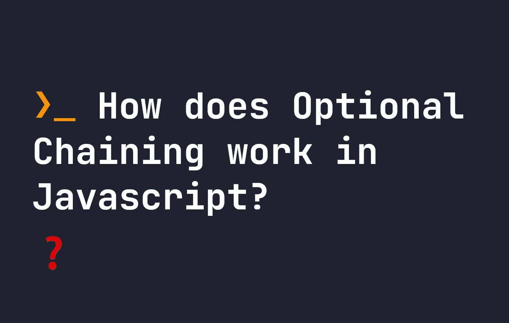

# JavaScript 中的可选链接是如何工作的？

> 原文：<https://javascript.plainenglish.io/how-does-optional-chaining-work-in-javascript-7f57bb653191?source=collection_archive---------10----------------------->



可选链接是 JavaScript 中的一个特性，它允许我们访问对象的子属性，即使父对象不存在。当属性在一个对象上是可选的时候使用它，这样我们就不会返回一个错误，而是从 Javascript 得到一个结果。**让我们看看它是如何工作的**。

# JavaScript 可选性介绍

任何使用过 Javascript 一段时间的人都可能会遇到一个非常常见的问题，即在我们做任何事情之前，访问可选的子属性需要很多额外的逻辑来测试它是否存在。

作为一个例子，想象一个构建文章的软件，其中对象`article`可能有一个名为`relatedArticle`的子属性，在这个子属性中，我们可能有一些相关文章的基本信息。让我们想象我们通过`article.relatedArticle.url`访问一篇相关文章的 URL 然而，并不是每篇文章都有相关文章。传统上，在 JavaScript 中，假设定义了`article`,我们可能会这样写:

```
let article = {};
let url;
if(article.relatedArticle !== undefined) {
    url = article.relatedArticle.url;
}
```

或者我们可能会尝试这样的东西来代替:

```
let article = {}
let url = article.relatedArticle ? article.relatedArticle : undefined;
```

如果`relatedArticle`未定义，这最终会避免以下错误:

```
Cannot read properties of undefined (reading 'url')
```

但是，如果我们有多个子级别，我们可能会写一长串`undefined`语句。对于非常大的对象来说，这可能会变得非常乏味并且失去控制。例如，下面当我们不确定这些对象是否会被定义时，我们尝试访问`article.relatedArticle.url.rootDomain`:

```
let article = {};
let rootDomain;
if(article.relatedArticle !== undefined && article.relatedArticle.url !== undefined) {
    rootDomain = article.relatedArticle.url.rootDomain;
}
```

**可选性**解决了过多`undefined`检查的问题。如果某个东西被赋予了一个可选的`?.`标签，那么如果它存在，这个值将被返回——否则它不会抛出一个错误。在上面的例子中，我们甚至不再需要一个`if`语句:

```
let article = {};
let rootDomain = article.relatedArticle?.url?.rootDomain;
```

通过添加`?.`，如果`relatedArticle`或`url`未定义**或**为空**，它将简单地传递到下一个属性，而不会抛出错误。我们甚至可以通过使用 [nullish 合并](https://fjolt.com/article/javascript-nullish-coalescing)设置默认值来改进这一点。下面，如果发现`rootDomain`属性未定义，它将返回`[https://google.com/](https://google.com/:)` [:](https://google.com/:)**

```
let article = {};
let rootDomain = article.relatedArticle?.url?.rootDomain ?? 'https://google.com/';
```

# 如何在 JavaScript 中使用可选链接

在大多数示例中，您可以使用如上所述的可选链接，以避免对象中真正可选的属性出错:

```
let article = {};
let rootDomain = article.relatedArticle?.url?.rootDomain;
```

对此需要注意的一点是，不能在对象的末尾添加问号。因此，下面的代码会抛出一个错误:

```
let article = {};
let rootDomain = article.relatedArticle?.url?.rootDomain?;
// Will throw an error like `Unexpected token ';'`
```

虽然这是使用可选链接最常见的方式，但是在你的代码中还有其他方式实现它。让我们也来探究一下，看看如何在代码和项目中使用可选链接。

# 何时不使用可选链接

**注意:**你应该**而不是**使用可选链接来避免错误。如果您过度使用可选链接，您将隐藏错误，并使以后调试代码更加困难。相反，**只对真正的可选属性使用可选链接**！

# 可选的函数链接

您可以对预期可能返回对象的函数使用可选链接。它的工作原理与之前完全相同，只是我们在函数- `myFunction(...arguments)?.x`后添加了`?.`:

```
let myFunction = (x, y, z) => {
    if(z !== undefined) {
        return {
            x: x,
            y: y,
            z: z
        }
    }
}let arguments = [ 1, 2, 3 ];let getX = myFunction(...arguments)?.x;
console.log(getX); // Returns 1;
```

在这个阶段，最好知道，默认情况下，如果一个函数没有`return`，它将返回`undefined`——所以这在您不确定函数是否会返回任何东西的情况下非常有用。

# 可选的数组链接

可选的链接也可以用于数组。例如，如果您不确定是否会定义一个属性，但它包含一个数组。下面，一个用户可以有一个有效地址的数组，我们想从他们的**第一个**地址得到他们地址的第一行。由于它可能不总是存在，我们可以在这里使用可选的链接来尝试和恢复它。

```
let myUser = {
    name: "John Doe",
    age: 155
}let getAddress = myUser.addresses?.[0]?.first
```

在这种情况下，`addresses`没有在`myUser`上定义，所以`getAddress`将简单地返回`undefined`。如果我们想检查一个应该是数组的属性，符号是`obj.prop?.[index]`，而如果我们想检查一个可能不存在，但有子元素的数组索引，符号是`obj[index]?.prop`。

# 具有可选功能的可选链接

有时，对象属性的返回可能是一个函数。在这些情况下，我们可能想要运行这个函数，但是因为它并不总是被定义，所以我们只希望它在那里的时候被触发。在这种情况下，我们可以使用符号`?.()`来运行该函数，如果它存在的话。考虑下面的例子:

```
let myObject = [
    {
        id: 15,
        adder: (x) => {
            return x + 10;
        }
    },
    {
        id: 145,
    }
]myObject.forEach((item) => {
    let runFunction = item.adder?.(10) || 10;
    console.log(runFunction);
});
```

**在**上面，我们有一个包含数组的对象，其中每个对象包含一个 id — `id`，也可能包含函数`adder`。在这个例子中，我们想要运行这个`adder`函数(如果它存在的话),或者如果这个函数没有定义的话，就把这个值默认为`10`——所以我们运行这个函数:

```
let runFunction = item.adder?.(10) || 10;
```

在这里，如果定义了`adder`，它就会运行，所以我们为数组的第一个元素获取`x + 10`或`20`，为第二个元素获取`10`，因为`adder`不存在。

# 结论

可选链接非常有用，并且得到了广泛的支持(不包括 Internet Explorer)。根据返回类型，它可以与属性、数组或函数的任意组合一起使用。例如:

*   `obj?.property`
*   `obj?.[property]`
*   `obj[index]?.property`
*   `obj?.(args)`
*   `func(args)?.property`

因此，可选链接是简化代码的一个很好的方法，它为对象中真正的可选属性提供了语法和意义。

*更多内容请看*[***plain English . io***](https://plainenglish.io/)*。报名参加我们的* [***免费周报***](http://newsletter.plainenglish.io/) *。关注我们关于*[***Twitter***](https://twitter.com/inPlainEngHQ)*和*[***LinkedIn***](https://www.linkedin.com/company/inplainenglish/)*。查看我们的* [***社区不和谐***](https://discord.gg/GtDtUAvyhW) *加入我们的* [***人才集体***](https://inplainenglish.pallet.com/talent/welcome) *。*