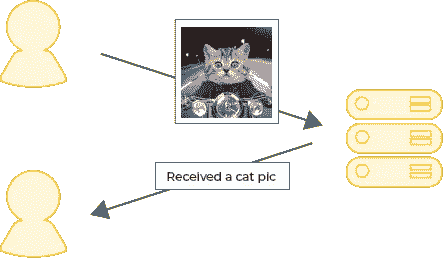
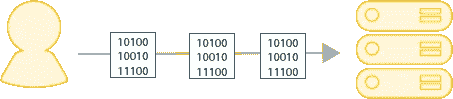
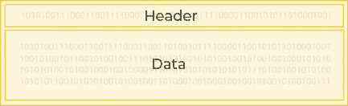
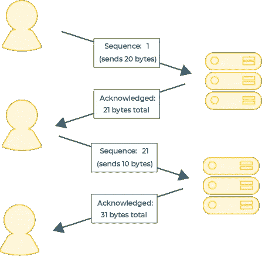
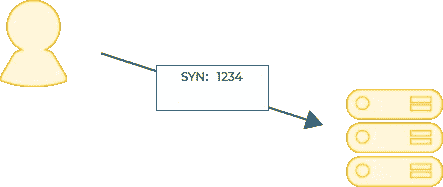
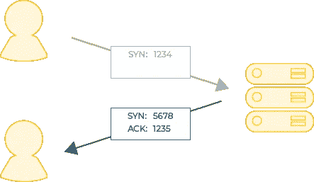
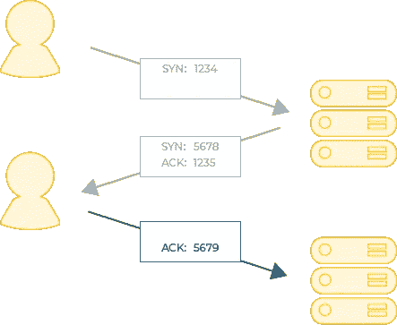

# TCP 是如何工作的？

> 原文：<https://javascript.plainenglish.io/how-does-tcp-work-910a92b691b8?source=collection_archive---------24----------------------->

# 什么是 TCP？

TCP(传输控制协议)是机器通过网络进行通信的协议，是构建互联网的基础。

TCP 最有用的特性之一是它的“弹性”，这意味着它可以应对不可靠的网络而不会丢失任何数据。

这是可能的，因为接收数据的机器*确认它已经收到了数据。如果*发送方*没有得到确认，它知道重新发送数据。*

# 它是如何工作的？

当我们通过网络发送数据时，我们通常将数据分组为“数据包”:

每个数据包的开头是“报头”；元数据的一部分，用于描述数据包中的内容:

TCP 报头有一个称为“序列号”的特殊块。

序列号用于记录相互通信的两台机器发送和接收了多少字节。

*   发送数据的机器*将序列号设置为本次对话期间总共*发送的字节数*。然后，它发送下一个数据块。*
*   接收的机器*通过将其接收到的字节数加到序列号上并将其传回发送方来“确认”数据的接收。它通过在 TCP 报头的另一部分设置一个值来实现这一点；“确认号”。*

这个简单的机制允许我们检测数据何时丢失；如果*发送方*发送了 20 个字节，而*接收方*只应答了 10 个，我们就知道有些数据没有收到。

有各种各样的机制来处理这个问题，但是最简单的是由*发送方*简单地重新发送数据。

# 随机化序列号

出于安全原因，我们不希望序列号是可预测的。如果是，就有可能“劫持”通信。

因此，即使序列号跟踪交换了多少字节，它们也不是从 0 开始的。相反，双方为他们的序列号生成随机的起始值。

但是，如果这些数字是随机的，那么两个客户是如何对它们达成一致的呢？

这就是“TCP 握手”的用武之地…

# TCP 握手

当一个连接开始时，第一台机器决定它的随机“序列号”并把它发送给另一方。

这种传输被称为`SYN`，因为它旨在“同步”序列号。

另一方知道这是一个`SYN`请求，因为我们在发送它时打开了数据包报头中的一个特殊位。

在这个例子中，我们选择了`1234`作为随机“序列号”。

另一方现在必须`ACK`或‘确认’序列号。

它通过向其添加`1`，并在报头的“确认号”部分将其传回(它还在报头中设置了一个特殊的`ACK`位)来实现这一点。

它现在生成自己的随机序列号，并将其发送回另一台机器。

在本例中，它生成了`5678`作为它的序列号:

最后，原始方确认另一台机器的序列号，也是通过给它加上`1`并在报头的“确认号”部分将其发回:

握手现在已经完成，客户端可以开始通信了。

你也可能看到 TCP 握手被写成`SYN,SYN/ACK,ACK`，指的是握手包被发送的顺序。

*我的* [*通迅订户*](https://www.baseclass.io/newsletter) *先收到这个。*

*更多内容请看* [***说白了。报名参加我们的***](https://plainenglish.io/) **[***免费周报***](http://newsletter.plainenglish.io/) *。关注我们*[***Twitter***](https://twitter.com/inPlainEngHQ)*和*[***LinkedIn***](https://www.linkedin.com/company/inplainenglish/)*。加入我们的* [***社区不和谐***](https://discord.gg/GtDtUAvyhW) *。***