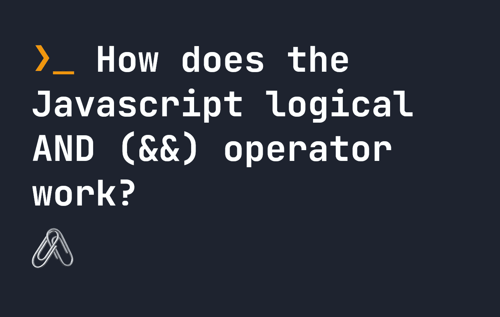

# JavaScript 逻辑 AND (&&)运算符是如何工作的？

> 原文：<https://javascript.plainenglish.io/how-does-the-javascript-logical-and-operator-work-18c696633184?source=collection_archive---------2----------------------->



JavaScript 中的逻辑 AND (&&)运算符在 [JavaScript 逻辑](https://fjolt.com/article/javascript-logical-statements)中经常使用，但也可以用来返回值。在另一篇文章中，我介绍了[逻辑 OR (||)操作符如何工作](https://fjolt.com/article/javascript-logical-or)。`&&`的工作方式相似，但逻辑不同。如果所有操作数都是`true`，AND `&&`运算符返回 true，如果任何操作数是`false`，则返回`false`。如果在布尔上下文之外使用，它的作用与`||`相反——它将返回遇到的第一个`falsy`操作数，或者如果它们都为真，则默认为右边的操作数。

在这个完整的指南中，让我们看看`&&`是如何工作的，并通过一些例子来解释它何时返回值，以及它将返回什么值

# JavaScript 中的 Truthy 和 falsy

就像`||`操作符一样，`&&`依赖于 JavaScript 中的`truthy`和`falsy`的概念。你可以在这里了解真理和谬误——本质上，以下值被认为是`falsy`，而其他值被认为是`truthy`:

*   `false`
*   `0`或`-0`或`0n`
*   任何空字符串，即`""`
*   `null`
*   `undefined`
*   `NaN`

# JavaScript 中的逻辑 AND 运算符是如何工作的？

在布尔上下文中，如果所有操作数都是`truthy`或`true`，则`&&`简单地返回`true`，如果任何操作数是`falsy`或`false`，则返回`false`。当我说布尔上下文时，我指的是需要`true`或`false`的情况，比如在`if..else`语句中，或者任何以某种方式测试逻辑的语句中。

这样工作的原因是因为这些语句强制`truthy`或`falsy`语句为真或假。让我们看一些布尔上下文中的`&&`的例子:

```
// This statement is TRUE and the console.log fires, 
// since "1" and "2" are both non-empty strings, so they are truthy
if("1" && "2") {
    console.log('this is true');
}// This statement is TRUE, and the console.log fires,
// since both statements test as true - 1 is less than 10, and 2 is less than 10
if(1 < 10 && 2 < 10) {
    console.log('this is true');
}// This statement is FALSE, and the console.log does not fire,
// since "" is falsy, and since one operand is false, the statement overall is false
if("" && 1 < 10) {
    console.log('this is false');
}
```

在这种情况下，`&&`之所以这样工作，是因为`&&`返回值。如果找到一个`falsy`值，它返回`falsy`值，否则返回`truthy`值。因为它编译成一个返回值，如果发现任何`falsy`值，它将返回`false`。否则，它返回`truthy`，因此返回`true`。

# 使用 AND 运算符返回值

这种情况并不常见，但是如上所述，`&&`语句确实会返回值，就像其他运算符一样，比如`||`或 [nullish 合并运算符](https://fjolt.com/article/javascript-nullish-coalescing) `??`。

它可以用在您希望返回一个`falsy`值作为首选的场景中，否则，默认为给定的右侧操作数。这是因为如果发现**左边的**操作数是`truthy`，那么`&&`将默认为**右边的**操作数。让我们看一些例子。

```
// This is set to "" since "" is falsy - && always takes the first operand if falsy
let x = "" && 1;// This is set to 2, since 1 is truthy - && defaults to the right hand operand if the left hand is truthy.
let y = 1 && 2;// This is set to 3, since `1 < 5` is truthy, so && defaults to the right hand operand
let z = 1 < 5 && 3;
```

如果这有一点令人困惑，那就把它放在`&&`应该如何再次工作的背景下考虑。`&&`测试所有操作数是否都为真，并从左到右遍历它们。如果第一个是`truthy`，那就要去第二个。然后它返回第二个，如果是`truthy`，整个语句是`true` -否则，如果是`falsy`，整个语句是`false` -因为所有操作数都需要用 and 运算`true`。

# 链接 AND 运算符

既然是操作符，`&&`可以被链接，但是应用了相同的逻辑。它将返回链中的第一个`falsy`操作数，否则，返回最后一个操作数。我们来看几个例子。

```
// x is set to 3, since true and 1 are both truthy.
let x = true && 1 && 3;// y is set to false, since false is falsy.
let y = false && true && 3;// z is set to x, since both {} and [] are truthy.
let z = {}  && [] && x;
```

# 结论

逻辑 AND ( `&&`)操作符经常在 JavaScript 中使用，因此理解它的工作原理对于在现实世界中使用 JavaScript 至关重要。尽管我们每天都在使用它，但它通常不被认为是**返回值**，或者充当[或运算符](https://fjolt.com/article/javascript-logical-or)的反义词。了解这一点是为您期望成为`falsy`的变量设置默认值的有用工具。

*更多内容请看* [***说白了就是***](https://plainenglish.io/) *。报名参加我们的* [***免费每周简讯***](http://newsletter.plainenglish.io/) *。关注我们*[***Twitter***](https://twitter.com/inPlainEngHQ)*和*[***LinkedIn***](https://www.linkedin.com/company/inplainenglish/)*。查看我们的* [***社区不和谐***](https://discord.gg/GtDtUAvyhW) *加入我们的* [***人才集体***](https://inplainenglish.pallet.com/talent/welcome) *。*