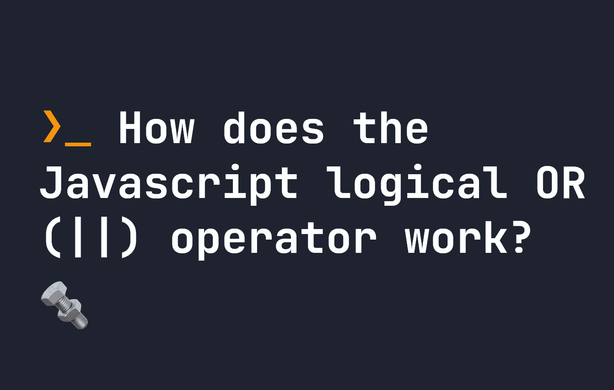

# JavaScript 逻辑 OR (||)运算符是如何工作的？

> 原文：<https://javascript.plainenglish.io/how-does-the-javascript-logical-or-operator-work-a184d93b63e8?source=collection_archive---------19----------------------->

## 逻辑 OR (or ||)运算符是理解 JavaScript 的关键。让我们看看它是如何工作的。



JavaScript 中的逻辑 OR(或`||`)运算符是这样一种运算符，如果左侧为**真值**，则返回左侧**的值，否则默认返回右侧的值。这意味着它可以用来测试两个逻辑语句，如果左边的操作数是`falsy`，它还可以返回右边的操作数。让我们来看看它是如何工作的。**

# truthy 和 falsy 在 JavaScript 中实际上是什么意思？

在我们继续之前，让我们先了解一下`falsy`是什么意思。这似乎是一个模糊的说法，但它实际上有一个非常具体的定义。以下值是 JavaScript 中的`falsy`:

*   `false`
*   `0`或`-0`或`0n`
*   `any`空字符串，即`""`
*   `null`
*   `undefined`
*   `NaN`

同样，`truthy`简单来说就是**不是** `falsy`的任何东西。

因为`falsy`可能意味着`0`和`""`，所以它有时可能不是设置默认值的好选择。例如，在某些场景中，如果您的值确实是`0`并且您想要显示它，那么您将无法使用`||`操作符。对于这些情况，最好考虑一下[无效合并操作符](https://fjolt.com/article/javascript-nullish-coalescing)。

# JavaScript 中的逻辑 OR 运算符是如何工作的？

如前所述，`||`操作符在 JavaScript 中有两个主要功能。最常见的是在逻辑`if..else`语句中，如果它的一个或多个操作数是`truthy`，它返回 true，但是如果它是`truthy`，它也用于返回第一个值，否则默认为右边的操作数。

`||`以这两种方式工作，因为它实际上返回一个值。

# 使用逻辑 OR 和逻辑

你可能已经见过在逻辑语句中最常用的`||`，比如`if`和`else`。在这些情况下，我们通常测试一个逻辑语句，所以如果一个或多个操作数是`truthy`，那么`||`将返回`true`。下面发生的是`||`操作符返回一个值，然后`if`语句将其转换为`true`或`false`

```
let x = 100;// This returns true, since both of these statements are correct.
if(x > 5 || x > 10) {
    // ...
}// Since both "1" and "2" can be converted to true, this also returns true in this context.
if("1" || "2") {
    // ...
}// Since both "" and null are falsy, they are converted to false, and as such this returns false.
if("" || null) {
    // ...
}
```

这是您将在代码中使用`||`的主要方式之一，但它也经常用于根据`truthy`或`falsy`返回值。

# 返回值

现在让我们看看逻辑语句之外的另一个例子。如上所述，`||`如果是`truthy`则返回其左侧，否则返回其右侧。

这听起来有点混乱，所以让我们看几个例子。

```
// Is set to 1, since the first operand is falsy 
let x = false || 1;// Is set to hello, since "hello" is truthy
let y = "hello" || true;
```

在上例中，由于`x`的左侧设置为`false`，因此`x`变为 1。同样，在`y`中由于`"hello"`不是`falsy`，`y`的值就是`"hello"`。该功能不同于其在逻辑语句和`if..else`语句中的应用，但在许多情况下是有用的。

有趣的是，即使最后给出的是`falsy`，JavaScript 依然会返回。例如:

```
// Is set to null since false is falsy
let x = false || null;// Is set to false since 0 is falsy
let y = 0 || false;
```

# 链接 OR 运算符

在 JavaScript 中链接`||`操作符是可能的。链接逻辑语句时(在`if..else`子句中)，如果任何链接项为`truthy`，该语句将返回 true:

```
// This works since both "1" and true are truthy
if("1" || true || false) {
    // ...
    console.log('this works')
}// This doesn't work since all values are falsy
if(false || null || undefined) {
    console.log('this does not work');
}
```

当我们在逻辑语句之外使用链接的`||`时，它将使用找到的第一个`truthy`值，或者默认为最终值。比如下面，`x`等于`3`，`y`是`true`，`z`是`{}`。如果你想知道为什么`z`是`{}`，那是因为任何不是`falsy`的东西都是`truthy`，这意味着一个对象是`truthy`！

```
// x is set to 3
let x = false || 0 || 3;// y is set to true
let y = false || true || 3;// z is set to  {}
let z = {} || [] || x;
```

# 结论

`||`操作符经常在逻辑语句中使用，如果找到一个值，则默认为非`falsy`值。这是一个灵活的操作符，是理解 JavaScript 的核心。如果您对另一个类似的操作符感兴趣，您可能还想了解一下 [nullish 合并操作符](https://fjolt.com/article/javascript-nullish-coalescing)。

*更多内容看* [***说白了就是***](https://plainenglish.io/) *。报名参加我们的* [***免费每周简讯***](http://newsletter.plainenglish.io/) *。关注我们* [***推特***](https://twitter.com/inPlainEngHQ)**和*[***LinkedIn***](https://www.linkedin.com/company/inplainenglish/)*。查看我们的* [***社区不和谐***](https://discord.gg/GtDtUAvyhW) *加入我们的* [***人才集体***](https://inplainenglish.pallet.com/talent/welcome) *。**