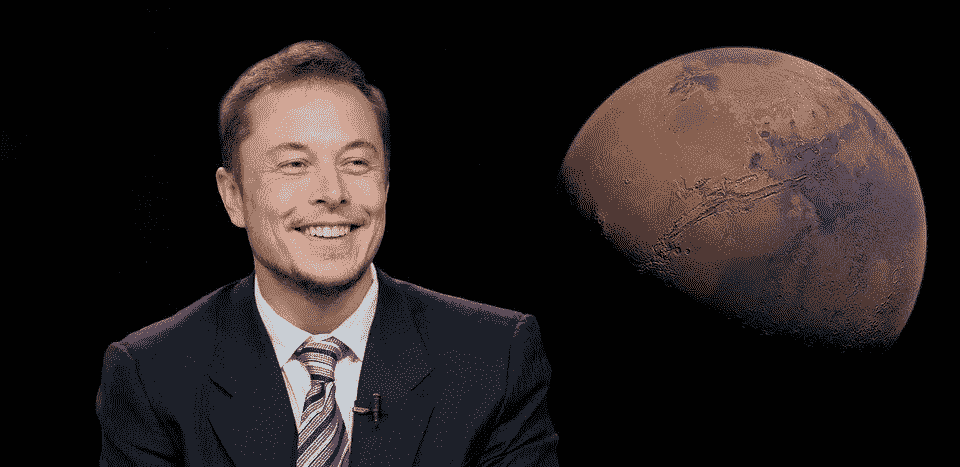
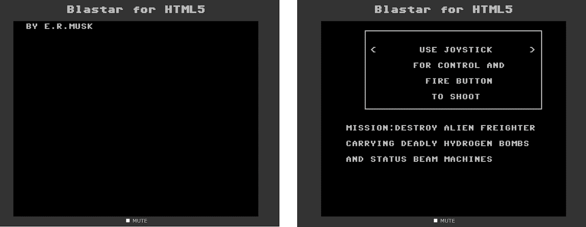

# 埃隆·马斯克如何学习编程

> 原文：<https://javascript.plainenglish.io/how-elon-musk-learned-programming-16fd6fc1e695?source=collection_archive---------2----------------------->

## 这是全能的埃隆·马斯克疯狂的编程之旅

[Pixabay](https://pixabay.com/photos/elon-musk-mars-space-exploration-6083103/)

没有人能定义你真正的极限，你的老师，你的老板，你的父母都不能。努力不懈地工作，不要担心自己的极限。

除了是外星人(😅)，埃隆马斯克(Elon Musk)是 SpaceX 和特斯拉的首席执行官，也是 boring 公司、PayPal 的一部分)、Neural ink、Open AI 和 Zip 2 的创始人。

埃隆·马斯克是目前世界上最富有的人，拥有大约 2750 亿美元的实时净资产。毫无疑问，埃隆·马斯克是全球数百万人的理想之选，也是企业家的导师。

谁不被埃隆·马斯克逗乐，最近他的一条推文引起了加密货币世界的混乱。他目前真的处于他旅程的巅峰。

大多数人不知道的是，埃隆·马斯克的职业生涯是从编程开始的。所有程序员和爱好者知道这个事实不都觉得好笑吗？毫无疑问，他是程序员可以用他们的代码改变世界的真实例子。

## 早期编程之旅

大约 9 岁的时候，埃隆·马斯克得到了第一次在电脑上获得实践经验的机会。他只用了 3 天时间就学会了包含在一台名为“如何编程”的旧电脑中的全部手册。。很明显老电脑那时候没有微软让生活更轻松。因此，埃隆·马斯克引入了编程。

在他第一次接触编程之后，Elon Musk 深入研究了各种与编程相关的书籍，毫无疑问，他从书籍中获得了所有的编程技能，这些书籍是 80 年代学习编程的最佳资源。

Elon Musk 在学习编程后也开始玩很多游戏，他玩了当时所有可用的游戏。Elon 非常热衷于玩不同类型的游戏，并很快发现了他开发游戏的热情。

1983 年，Elon Musk 开发了他的第一款游戏 Blaster，这是一款太空射击游戏，他用一种未指明的编程语言开发。后来，他以 500 美元的价格将自己开发的第一款游戏 Blaster 连同所有源代码卖给了一家杂志公司。2000 年早期，所有者用 HTML 重新编写了它。

Blasted Game Developed by Elon Musk

在如此年轻的时候，他是所有同学中最优秀的程序员，而这些同学的能力甚至都不及他。毫无疑问，他只用了 3 天就完成了 6 个月的编程教材，这是难以置信的。

## 数百万来自编码

在他晚年的时候，他放弃了斯坦福大学的博士学位，去追求他对编程的热情。他和哥哥合伙创办了一家软件公司 Zip2。这就像是谷歌地图和 Yelp 的早期组合。它允许企业上网，因为图书指南在那个时代已经有点过时了。

1999 年，Zip2 被一家名为康柏的公司以 2 . 07 亿美元收购，这使得 26 岁的埃隆·马斯克的净资产更上一层楼。通过这笔交易，他成了千万富翁。

在这之后，马斯克创办了一家名为 X 的新公司，他将自己所有的净资产都投入到了这家公司的发展中。这家公司与市场上所有提供不同金融服务的竞争者竞争。

随着市场竞争的激烈，马斯克与一家优秀的公司合并，成立了一家新公司 PayPal。2000 年代后期，易贝以大约 10 亿美元的价格收购了 PayPal，埃隆·马斯克是主要股东，他从这笔交易中获得了巨额利润。

在他余下的历史旅程中，埃隆·马斯克是 Space X 的首席执行官，特斯拉是他在这个星球上最富有的人。毫无疑问，埃隆·马斯克对每个人来说都是一种鼓舞。他用他的创造力和创新创造了革命。

就这样，这是文章的结尾。希望它对你有价值。如果你喜欢这篇文章，点击这里订阅我的邮件列表。我会通过电子邮件给您发送技术相关的文章。

[**通过邮件获取此类文章点击这里**](https://aniketz.medium.com/subscribe) **|** [**购买 5 美元中等会员资格**](https://aniketz.medium.com/membership)

[如果你觉得这篇文章有价值，那么点击这里阅读更多的技术文章](https://aniketz.medium.com/)

 [## 通过我的推荐链接加入 Medium-Aniket

### 作为一个媒体会员，你的会员费的一部分会给你阅读的作家，你可以完全接触到每一个故事…

aniketz.medium.com](https://aniketz.medium.com/membership) 

*更多内容请看*[*plain English . io*](http://plainenglish.io/)*。报名参加我们的* [*免费每周简讯*](http://newsletter.plainenglish.io/) *。在我们的* [*社区不和谐*](https://discord.gg/GtDtUAvyhW) *获得独家获得写作机会和建议。*