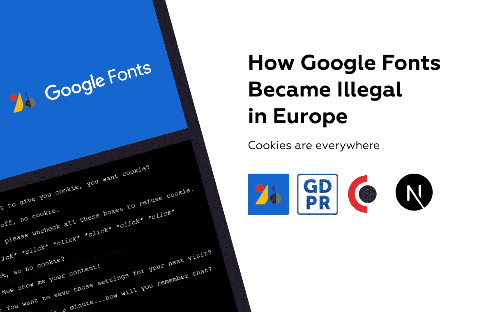
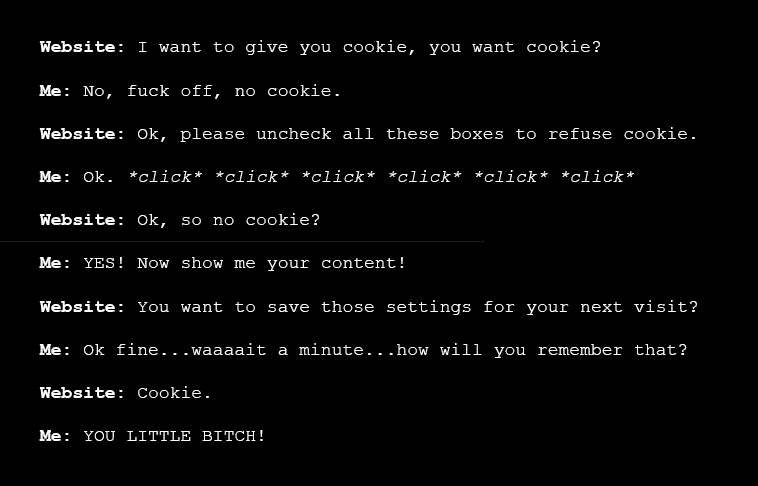
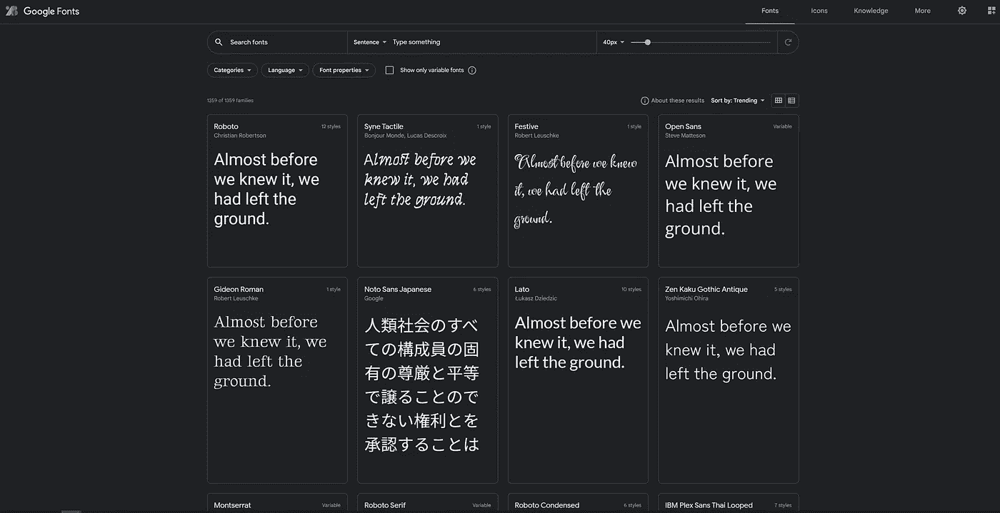
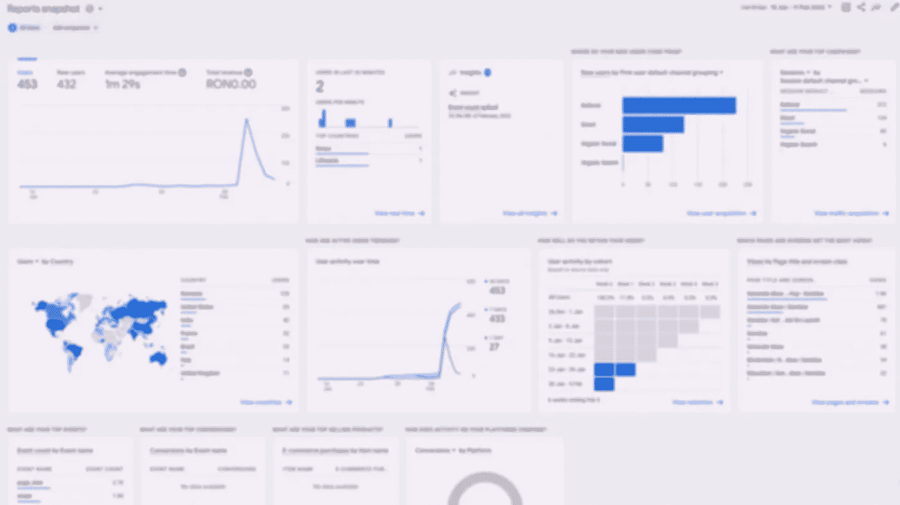
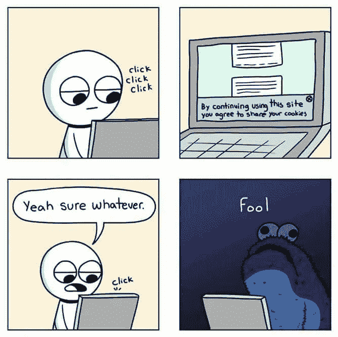
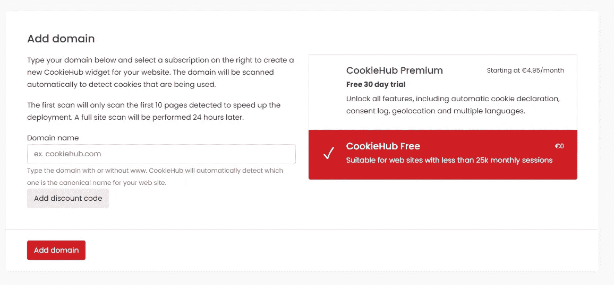
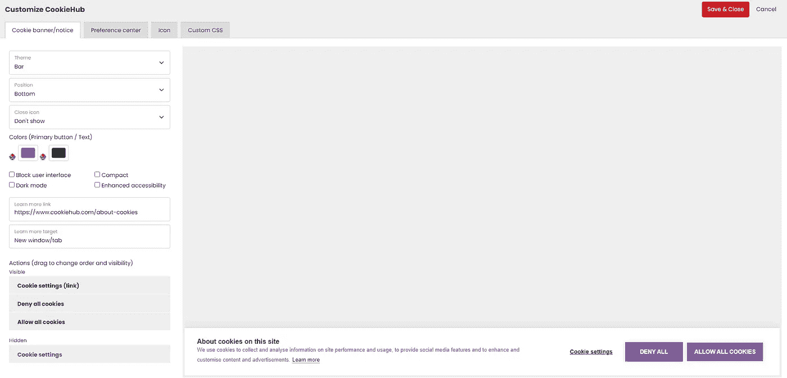
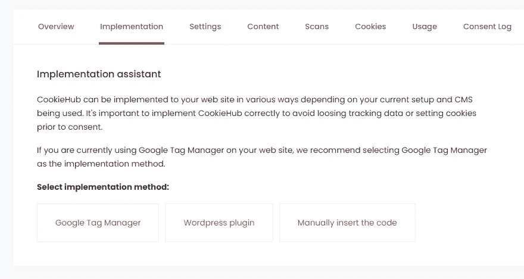
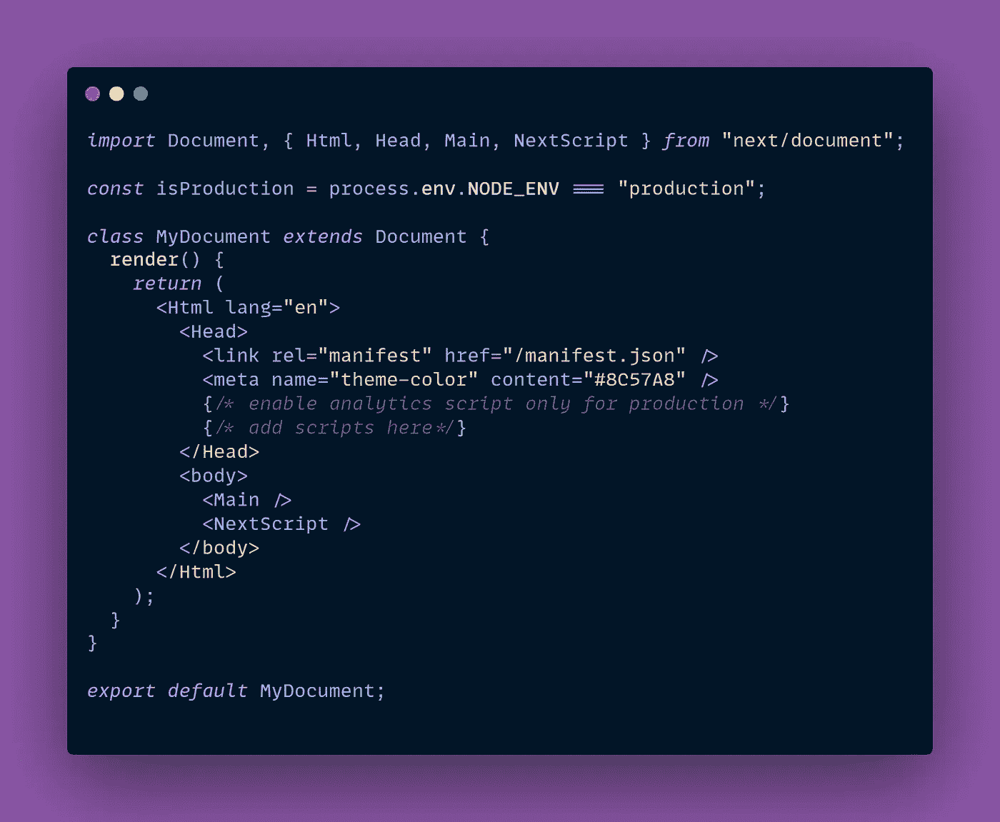

# 谷歌字体如何在欧洲变得“非法”

> 原文：<https://javascript.plainenglish.io/how-google-fonts-became-illegal-in-europe-7d2b1575be01?source=collection_archive---------3----------------------->

## 饼干到处都是

GDPR & EPR 限制对于欧盟以外的开发者或者没有法律团队的小网站来说并不为人所知，这可能会影响很多应用程序。

Cookies are the Definition of Annoying

# 谷歌字体违法？

***是&否***

最近[黑客新闻](https://thehackernews.com/2022/01/german-court-rules-websites-embedding.html?fbclid=IwAR3toxj3Ipm9c4NaSf46iU2bvqeeiC9Aiw2R5-8sBW9WpnA50Lg5cuUWfeM)上出现了一篇文章，讲述了一家德国法院如何命令一家网站运营商支付高达€100 英镑，用于在不知情的情况下通过嵌入[谷歌字体](https://fonts.google.com/)脚本将用户的 IP 发送给谷歌。

这听起来像是一件不太可能发生在你身上的事情，因为你可能在自己的服务器上托管字体，所以你得救了。不幸的是，这不仅适用于[谷歌字体](https://fonts.google.com/)，大多数谷歌 API 都因以某种形式记录用户数据而臭名昭著。

对于大企业来说，微不足道的罚款并不可怕，但它应该提出一个问题，即是否值得进一步忽视它，并冒着被处以更高罚款的风险，因为解决这个问题并不是那么麻烦。

# 什么是 GDPR & EPR

开发者不喜欢过于复杂的法律内容。

[通用数据保护法规](https://gdpr.eu/what-is-gdpr/) (GDPR)是世界上最严格的隐私和安全法规。尽管事实上它是由欧盟(EU)设计和颁布的，但它对各地以欧盟公民为目标或收集其数据的企业强加了义务。2018 年 5 月 25 日，该条例正式生效。

违反 GDPR 隐私和安全法规的人将面临巨额罚款，罚款金额高达数千万欧元。

让我们举一个更严重的例子，它实际上可能导致对用户跟踪的真正指控。我最近推出了 OpenAI 驱动的应用创意生成器 GenIdea，出于纯粹的好奇，我想尝试全新的 Google Analytics 4 API。

GA4 可能是你能在网站中实现的最具侵入性的追踪软件，幸运的是，我及时记住了遵守 GDPR 的政策，并同意添加 cookies 功能。

Google Analytics 4 | Dashboard

在谷歌字体法律索赔的几周前，奥地利数据保护局(DSB)裁定，专注于健康的网站 [NetDoktor](https://www.netdoktor.de/) 使用谷歌分析，将访问者的数据导出到美国的谷歌服务器，违反了 GDPR 法规，有可能为美国的情报监控打开大门。

这证实了让用户决定他们同意哪些 cookies 的重要性，即使这通过令人讨厌的弹出窗口降低了用户体验。

# 如何遵守欧盟法律

***可怕的同意饼干到处弹出***

有两种方法可以做到这一点，但没有一种是真正完美的，最明显的一种是不使用任何跟踪 API，但这是有争议的，因为即使是 cookies 也被视为 PII(个人身份信息)。

你可能很幸运，你的网站真的没有任何可能违反 GDPR 规则的功能，你可以开始了，但是如果不是这样，那就到了 cookies 的时间了。

Cookies 一直存在(自 94 '年以来)，它们是在客户机和服务器之间传递有用的会话信息、认证甚至跟踪数据的标准。

当 cookies 也是个人数据收集的主要原因之一时，它怎么会是解决方案呢？

2011 年的 [Cookie 法首次通过要求网站运营商向用户提供允许或拒绝使用 Cookie 的选择，迫使网站运营商在通过 Cookie 管理用户数据时更加小心。](https://www.cookielaw.org/the-cookie-law/)

解决方案是给用户一种同意 cookies 的方式，这通常是通过一个覆盖/模态/弹出来实现的，当你进入网站的第二秒钟，它就烦人地覆盖了大部分屏幕。显然，这增加了开发时间，但是我想在 UX 和 DX(用户体验和开发者体验)之间总会有一个平衡。

我发现这种情况与以前 Android 设备上的“日历应用程序需要所有权限”完全相似。

这个故事本身值得写一篇文章，但几年前，Android 中的应用程序权限只在安装时被批准一次，并且“隐藏”在设置菜单中。这导致了简单应用程序的出现，这些应用程序请求所有可能的权限以窃取数据或欺骗用户。

闲聊到此为止，让我们尝试实现一个 cookie 同意特性。我将使用 [CookieHub](https://www.cookiehub.com/) ，因为它集成速度快，可定制性高，开发者体验流畅。

首先添加您网站的域名，如果您每月有超过 25k 个会话，请选择免费计划或高级计划，然后按照显示的步骤操作。

接下来，我总是喜欢在嵌入脚本之前定制和添加品牌，因此提取您的品牌颜色，让 cookie 同意弹出窗口在您的网站上有家的感觉。

为了整合 cookie 同意功能，我们有 2 个选项(如果使用 WordPress，则有 3 个)。如果你正在使用 Google Analytics，最好的方法是将 GA4 配置移动到 [Google Tag Manager](https://tagmanager.google.com/) 并按照教程中显示的步骤操作。

谷歌标签管理器可能会压倒在第一次与所有额外的菜单，但按照一步一步的例子，你将准备推出 GDPR 兼容分钟。

如果您正在与 [Next.js](https://nextjs.org/) 集成，您可以通过创建一个 custom _document.jsx 文件轻松地将脚本附加到文档中。

希望你喜欢这个简短的“法律”故事，不要忘记鼓掌并关注更多软件相关的内容🚀。

*更多内容看**[***说白了。报名参加我们的***](http://plainenglish.io/) **[***免费周报***](http://newsletter.plainenglish.io/) *。在我们的* [***社区不和谐***](https://discord.gg/GtDtUAvyhW) *获得独家获取写作机会和建议。****