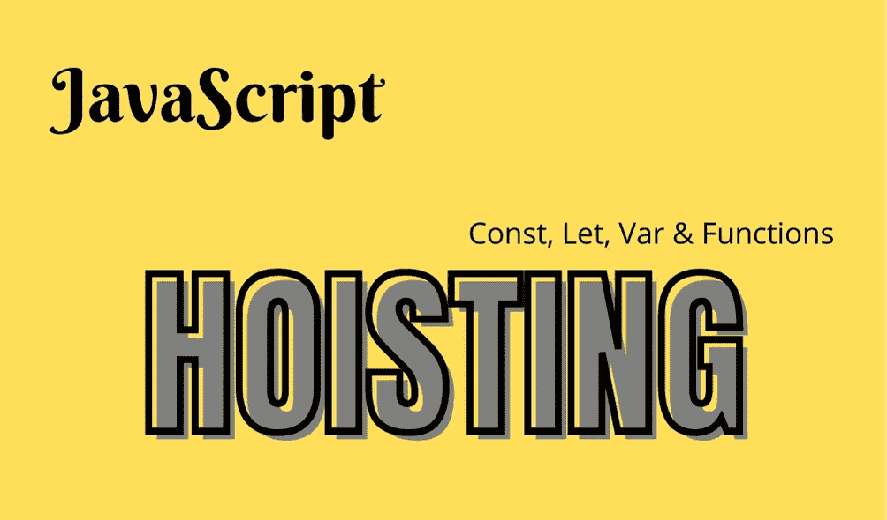

# JavaScript 中提升的工作方式——变量和函数

> 原文：<https://javascript.plainenglish.io/how-hoisting-works-in-javascript-variables-and-functions-27a5b931d530?source=collection_archive---------20----------------------->

提升是 JavaScript 中由解释器完成的一个非常重要的过程。在执行代码之前，解释器将函数和变量的声明移动到它们作用域的顶部。这个特性在 JavaScript 中被称为提升。



# 可变提升

在 JavaScript 中，我们可以用 const、let 和 var 声明变量。我将单独详细解释每个变量声明类型，因为在托管时行为是不一样的。

## Var 托管

先说个例子。

```
console.log(myName);function inlineFunction(){
  console.log("Hello World!");
}var myName="Nissim Zarur";
```

正如你在上面的例子中看到的，我们在声明前调用变量`myName`，并尝试`console.log`其中的值。当我们试图运行代码时，奇迹发生了。主机被激活，会发生什么？变量`myName`被移动到 JavaScript 文件的顶部。意味着**现在的声明是在**的`console.log`之前，但是这里要注意，变量`myName`只是在 JavaScript 文件的顶部声明的，对“Nissim Zarur”赋值的初始化是**而不是**发生的。

**为什么有帮助？**

这很有帮助，因为我们不会收到`Uncaught ReferenceError: myName is not defined`的错误，相反，我们会收到`undefined`作为返回值。

**有什么区别？**

当我们收到错误`Uncaught ReferenceError: myName is not defined`时，意味着变量`myName`从未被声明，当我们收到返回值`undefined`时，意味着变量被声明但没有像代码中某处发生的那样被初始化或赋给值“Nissim zar ur”；相反，提升过程将变量`myName`初始化为默认值`undefined`。

```
console.log(myName); // Will print to the console "undefined"function inlineFunction(){
  console.log("Hello World!");
}var myName="Nissim Zarur";
```

## Const & Let 吊装

这就是 var 和 const/let 提升之间的巨大差异。在幕后，用*声明的变量 let* 和 *const* 也被吊起，但与 *var* 不同的是，它们**不**接收默认值`undefined`。

那么如果我们在初始化 const/let 变量之前调用它们会发生什么呢？我们会得到一个错误:`Uncaught ReferenceError: can’t access lexical declaration ‘myName’ before initialization`。

```
console.log(myName); // Uncaught ReferenceError: can’t access...function inlineFunction(){
  console.log("Hello World!");
}const myName="Nissim Zarur";
```

# 功能托管

这种类型的托管非常重要，并且确实使我们的代码更加安全。我们举个例子来说明一下。

```
printSomething(); //Will print to the console "Hello World".
function printSomething(){
  console.log("Hello World");
}
```

正如我们在上面的例子中所看到的，我们调用了一个还没有声明的函数，但是它仍然可以很好的工作。那是因为涉及到了‘功能托管’。在幕后，函数 `printSomething`的声明被移动到 JavaScript 文件的顶部。这意味着，实际上，函数调用是在声明之后而不是之前进行的。

这种魔力保护我们的代码免受在函数声明之前可能发生的错误调用。

# 箭头函数托管

好吧，那我们先从结论开始。箭头函数和常规函数的宿主行为是不一样的。让我们看看下面的例子:

```
printSomething(); //Uncaught TypeError: printSomething is not a function.var printSomething => (){
  console.log("Hello World");
}
```

## 为什么会这样？

箭头函数的托管行为就像关键字`const`、`var`、`let`，当我们试图调用`printSomething`函数时，我们收到错误`Uncaught TypeError: printSomething is not a function`。让我们想想幕后的步骤:

*   `printSomething`是一个`var`变量，因此，它位于 JavaScript 文件的顶部。
*   变量`printSomething`收到默认值`undefined`。
*   我们尝试调用箭头函数`printSomething`，但是它仍然是用`undefined`的值定义的。
*   出现错误`Uncaught TypeError: printSomething is not a function`。

**感谢您迄今为止的阅读，**如果您喜欢这样的内容，并且您想支持我作为一名程序员和作家撰写更多这样的文章， [***请使用我的链接注册 Medium 成为会员(5 美元/月订阅)，您将可以无限制地访问 Medium 上的所有内容。***](https://medium.com/membership/@nissimzarur)

这就是现在，希望你喜欢这篇文章。

关注我，获取更多有趣且有帮助的文章。

*更多内容请看*[***plain English . io***](https://plainenglish.io/)*。报名参加我们的* [***免费周报***](http://newsletter.plainenglish.io/) *。关注我们关于*[***Twitter***](https://twitter.com/inPlainEngHQ)*和*[***LinkedIn***](https://www.linkedin.com/company/inplainenglish/)*。查看我们的* [***社区不和谐***](https://discord.gg/GtDtUAvyhW) *加入我们的* [***人才集体***](https://inplainenglish.pallet.com/talent/welcome) *。*