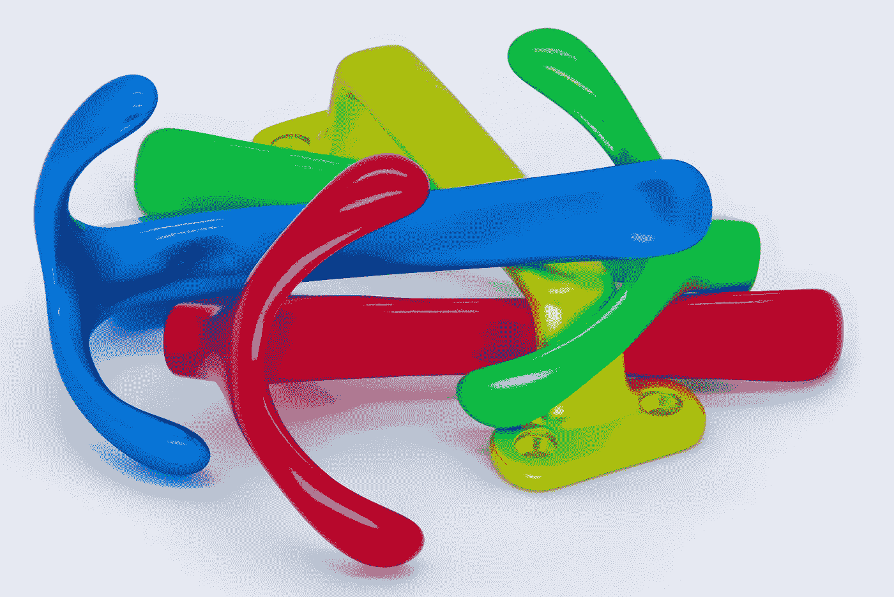
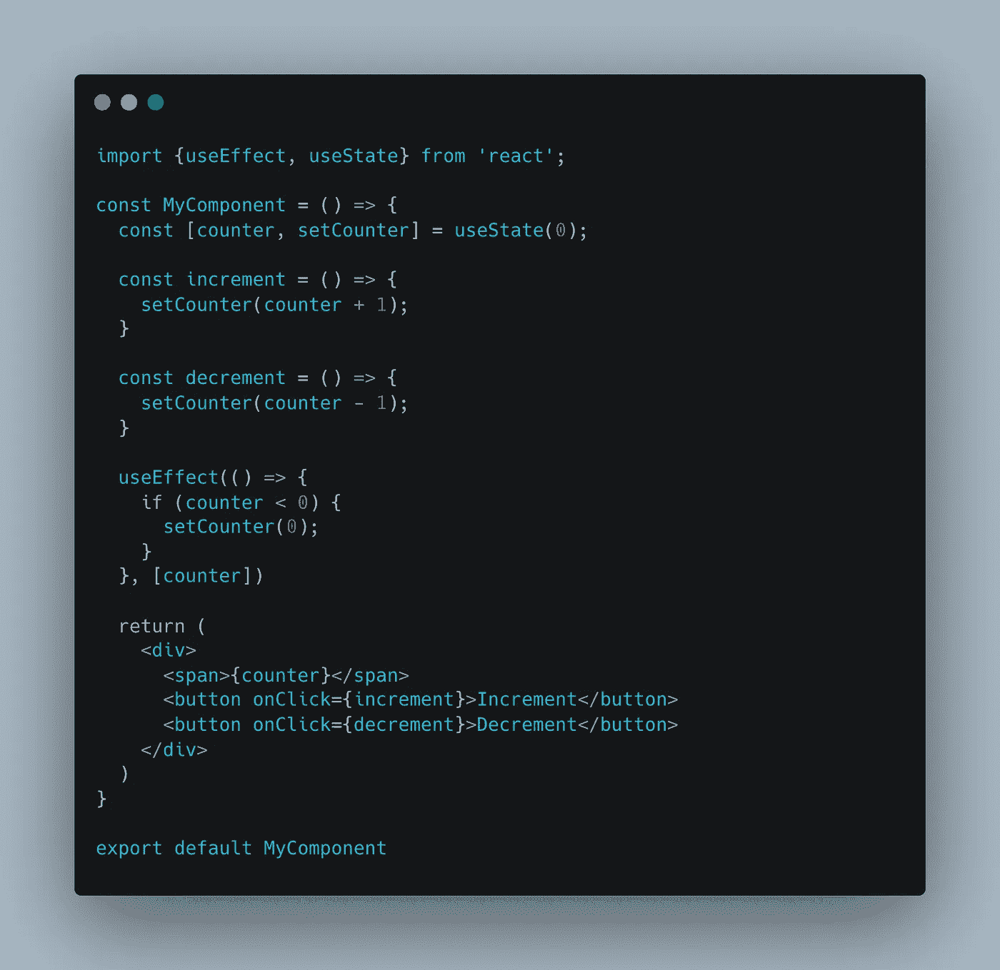
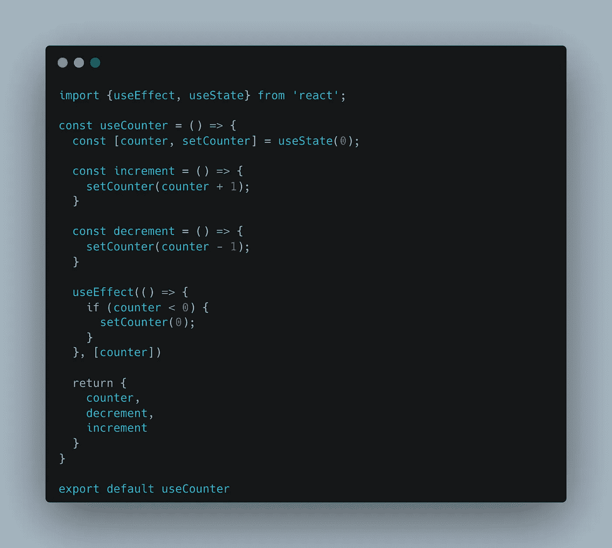
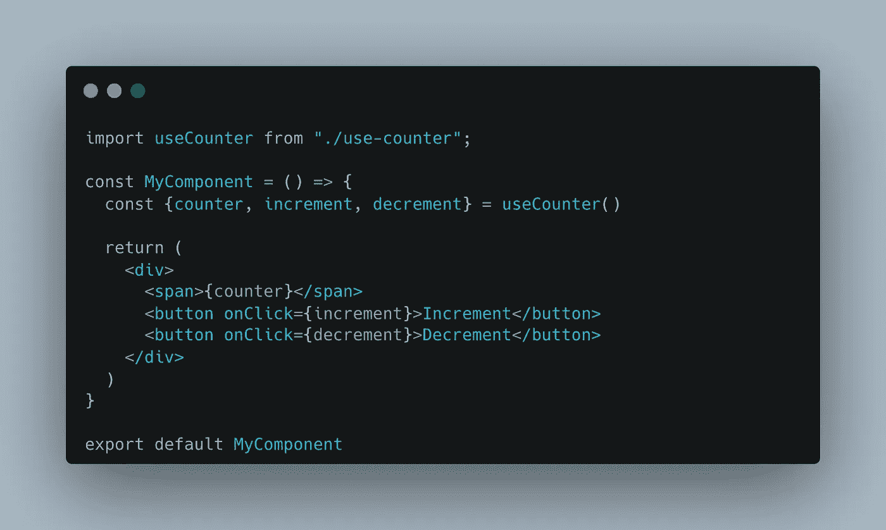

# 钩子如何让我们拥有更干净、更简单的组件

> 原文：<https://javascript.plainenglish.io/how-hooks-allow-us-to-have-cleaner-simpler-components-34a773355282?source=collection_archive---------6----------------------->

## 为什么您应该将您的逻辑导出到 React 挂钩中。

Photo by analogicus: [https://www.pexels.com/photo/colorful-metal-hooks-on-white-background-10665635/](https://www.pexels.com/photo/colorful-metal-hooks-on-white-background-10665635/)

我喜欢钩子，我认为它们是 React 团队创造的最好的东西。然而，我可以看到，即使在今天，许多开发人员可能不愿意创建他们自己的定制挂钩，而更喜欢坚持使用 React 提供的挂钩，并根据逻辑而不是 UI 目的来拆分他们的组件。

但是钩子是使你的逻辑外部化和保持你的组件整洁的最好方法！我们一起来看看为什么。

> 本文将首先关注理论，然后在最后展示一个例子。敬请期待！

# 清洁剂成分

React 组件会很快变得一团糟。JSX 格式在同一个文件中已经有了 HTML 和 JS，100 行代码可以很快找到。

使用钩子，可以通过创建定制的钩子来管理所有的业务逻辑，并且只返回 UI 格式的数据，从而分割逻辑。这样，您的组件应该只关心 UI，而将逻辑/数据获取留给钩子。这就引出了我的第二点。

# 单一责任

作为坚实原则的一部分，单一职责是使组件/功能/类更简单、更清晰、更易于测试和维护的重要部分。

钩子能帮上忙。通过一个(或一些)钩子来整理逻辑，组件的职责将是显示数据，钩子将从 API 获取数据，处理数据，并返回可用的数据。

# 复用性

反应是可重用性。整个组件系统就是这样工作的！钩子也不例外。通过将逻辑导出到一个或多个挂钩中，它允许您更好地控制您的逻辑，还可以将您的挂钩重用到多个组件或挂钩中！

# 易测性

当使用包括数据获取在内的一系列逻辑测试 React 组件时，我们都有过这种挣扎的时刻。但是，如果我们能够将所有这些都隔离到一个易于测试、隔离并使嘲笑变得简单的地方，会怎么样呢？钩子！

现在让我们用一个例子来说明这一切。这是一个包含一些逻辑的组件:

A component showing a counter and two buttons to change its value

如果你已经阅读我的文章有一段时间了，你应该知道计数器是我最喜欢的例子！

现在，该组件将需要一些 UI 测试，以确保按钮正常工作，计数器正确地递增/递减，并从 UI 检查值是否是预期的值。

这不是那个，但可以改进！

从这段代码中，我可以看到创建一个钩子来管理计数器的状态，并且只返回它的值和修改它的两个函数的可能性。你的新钩子应该是这样的:

Our useCounter hook

这是我们的新钩子，几乎和以前的代码一样，但是我们排除了所有与前端相关的代码！

现在对于我们的组件来说，我们只需要稍微修改一下就可以使用钩子返回的值了！

Our component with the usage of the hook

我们到了。我们最终得到了两个更易测试的文件。您也可以决定在另一个组件中使用钩子，而不需要太多的重构！

我希望你喜欢这篇文章，并希望更喜欢我们亲爱的钩子！

如果你喜欢，不要犹豫留下掌声或关注！

*更多内容请看*[***plain English . io***](https://plainenglish.io/)*。报名参加我们的* [***免费周报***](http://newsletter.plainenglish.io/) *。关注我们关于*[***Twitter***](https://twitter.com/inPlainEngHQ)[***LinkedIn***](https://www.linkedin.com/company/inplainenglish/)*，以及* [***不和***](https://discord.gg/GtDtUAvyhW) *。*