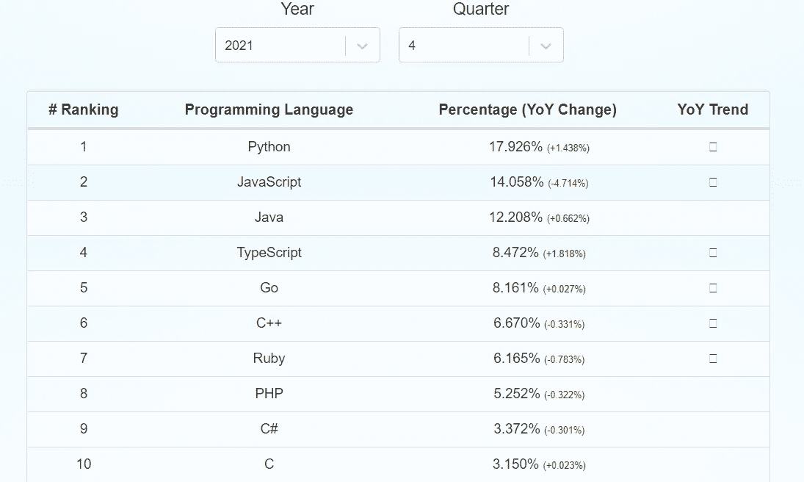
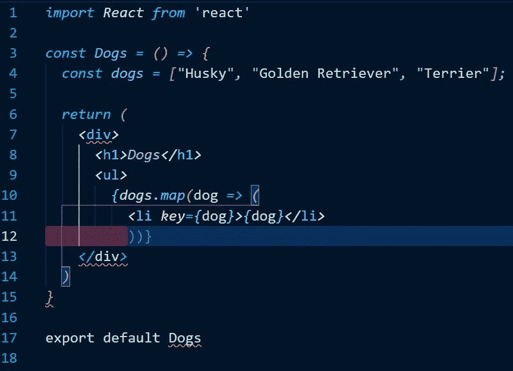
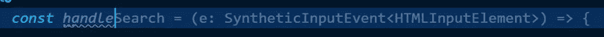
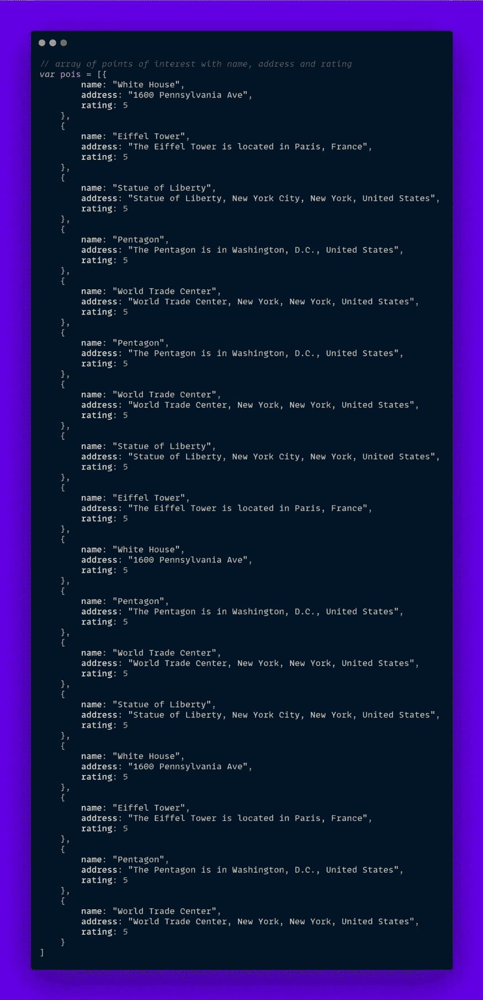
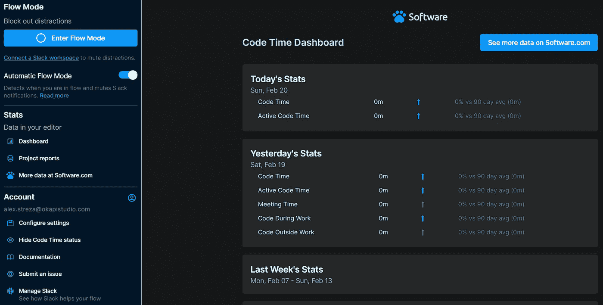

# 我如何用人工智能提高我的编码速度和生产率

> 原文：<https://javascript.plainenglish.io/how-i-boosted-my-coding-speed-and-productivity-with-ai-42b1b683c6d6?source=collection_archive---------8----------------------->

## AI 会取代编码还是会？

去年是一个不可思议的编写代码的时间，随着[【GPT-3】](https://openai.com/api/)&[GitHub 副驾驶](https://copilot.github.com/)的出现，AI 得到了重大升级，这被一些人认为是程序员末日的开始。

但事实并非如此，AI 距离能够编写可扩展的应用程序和设计复杂的系统还很远，因为当前的实现只是一个更快编写代码的辅助工具。

Developers Against AI

如果你已经了解了这个介绍，很可能你已经对这个工具有了一个预先的看法，不管是正面的还是负面的。我知道当这个主题首次展示时，有数百篇文章涉及这个主题，但这篇博客文章是为了展示持续使用 GitHub Copilot 超过 6 个月的体验。

# 我如何使用它

> 过度限定的自动完成工具

大部分时间我都在用**JavaScript**([React](https://reactjs.org/))编码，这对自动完成选项来说是一个很大的优势，因为 AI 是在 GitHub 库上训练的，JS 是第二常见的语言( [14%的 GitHub 是 JS](https://madnight.github.io/githut/#/pull_requests/2021/4) )。

这意味着建议更容易被发现，人工智能中的语法错误也更少。

我发现 Copilot 真正出彩的不可思议的地方是结束代码行和结束括号。

这可能看起来很平凡，但它节省了很多时间，因为写 JSX 可能会导致一些非常恼人的括号意大利面，这是立即解决。

Close Brackets Automatically

当我第一次在我的项目中采用 [Typescript](https://github.com/typescript-cheatsheets/react) 时，我发现很难记住事件处理程序和 HTML 组件的所有类型，比如按钮和输入。看看这个华丽的建议，副驾驶只是自己处理一切，这是宏伟的。

Autocomplete Types

Copilot 用 style 完成的另一项任务是生成模拟数据。我参与的大多数项目在前端和后端开发速度上有明显的差距，这就产生了瓶颈。

通常 UI 是在 API 准备好之前实现的，而模拟 API 很少能很快运行起来，所以我们手动编写示例值来测试组件，这是一个可怕的、重复的混乱。有了一个评论，我们可以生成接近无限的数据，这是美丽的。😍

Generate Mock Data

这些是 GitHub Copilot 帮助我更快编码的一些主要方式，即使看起来不多，但随着时间的推移，它确实增加了。

# 我节省了多少时间(大概)

> 不多，但诚实(重复)的工作

我估计我三分之一的代码是通过 GitHub Copilot 完成的，这是一个非常粗略的数字，但这可能意味着 33%的速度提升。

我正计划使用[代码时间](https://www.software.com/code-editors/visual-studio-code)对此做更深入的研究，这是另一个伟大的**生产力**扩展，有助于减少外部噪音并专注于编码。类似于看到使用 Copilot 和不使用 Copilot 的人一周花在编码上的时间，这虽然不准确，但更接近事实。

[Code Time Extension](https://www.software.com/product/code-time)

# 如何获得它

> 现在就花 0 美元(免费)获得您自己的副驾驶

要获得扩展，你需要首先注册进入[beta‘测试’等待列表](https://github.com/features/copilot/signup)，但是你会很快进入，这花了我不到一周的时间，我早在 6 月份就注册了，当时它刚出来，每个人都在试用它。

安装 [VSCode 扩展](https://marketplace.visualstudio.com/items?itemName=GitHub.copilot)，您可以从零配置开始，享受更好的编码体验。

> 不幸的是，我最近看到一个 GitHub 帖子解释说技术预览阶段已经满了，新用户只能进入，所以可能需要更长时间

现在你已经准备好**提升**你的编码，并且立刻完成那些任务，我希望你喜欢这篇关于人工智能生产力的文章。不要忘记👏并关注更多软件&编程相关内容💜或者[甚至**造** & **推出**一个 AI app 从头做起](https://medium.com/r?url=https%3A%2F%2Fjavascript.plainenglish.io%2Fhow-i-launched-a-saas-in-60-days-with-an-empty-pocket-313aa59c3e78)。

*更多内容请看*[***plain English . io***](https://plainenglish.io/)*。报名参加我们的* [***免费周报***](http://newsletter.plainenglish.io/) *。关注我们关于*[***Twitter***](https://twitter.com/inPlainEngHQ)*和*[***LinkedIn***](https://www.linkedin.com/company/inplainenglish/)*。加入我们的* [***社区不和谐***](https://discord.gg/GtDtUAvyhW) *。*