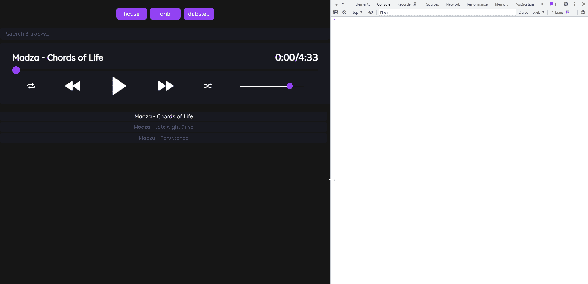

# 我如何使用 React 构建一个音乐播放器来展示我自己的曲目🎵😍

> 原文：<https://javascript.plainenglish.io/how-i-built-a-music-player-using-react-to-showcase-my-own-tracks-6ffb93c9cca2?source=collection_archive---------12----------------------->

## 使用 React 从头开始构建音乐播放器应用程序的全面指南。


不久前，我建立了自己的[作品集](https://madza.dev)，并编写了一个定制的[音频播放器](https://www.madza.dev/music)来展示我的曲目。从那以后，相当多的人对它的技术实现感兴趣。我总是回答说，我可能会为它写一篇完整的教程，但严格的截止日期从未设定。

2022 年 4 月，我看到一个由 [Hashnode](https://hashnode.com) 宣布的[写作马拉松](https://townhall.hashnode.com/the-epic-hashnode-writeathon?source=hashnode_feed)，其中一个入口类别是 Web 应用。我知道这是一个进入并最终完成工作的绝佳机会。我很高兴我偶然发现了它，因为它真的激励了我。

这篇文章不仅对你将获得的实际最终结果有益，而且对那些希望转行到应用程序开发或探索 React 生态系统的人也有教育意义，原因如下:

1.  我将展示完整的应用程序创建周期，从功能规划、线框图和设计，到创建组件、实现逻辑、增加响应能力和部署应用程序。
2.  它将教你如何在 React 中思考，例如，当从普通 JavaScript 转换时，这是一个相当大的转变。您将学习如何设置和构建 React app，以及该库的一些最佳实践和思维模式。

以下是我的作品集中音乐播放器的部署预览和使用，让您了解我们将在本教程中构建的内容:


音频播放器的源代码是[开源](https://github.com/madzadev/audio-player)。我还用它制作了一个 NPM [包](https://www.npmjs.com/package/@madzadev/audio-player)，这样你也可以很容易地在你现有的项目中设置它。

## 规划功能

最基本的音频播放器通常带有一组最少的功能，如播放/暂停按钮、音量或进度控制，如果您想播放一首曲目，这可能是一个好的解决方案。

但是，如果您关心一些额外的功能和最终用户的体验，您可能会想要一些高级的解决方案。

在本教程中，我们将重点关注一个更复杂的情况，您有多个曲目要展示，需要实现一种方法来快速找到或过滤它们，并希望控制播放顺序的行为。我们将实施的完整功能列表包括:

1.  播放和暂停音频
2.  下一首和上一首曲目
3.  重复曲目
4.  无序播放轨道顺序
5.  进度滑块
6.  剩余时间/总时间
7.  音量滑块
8.  搜索音轨
9.  按流派过滤曲目
10.  播放列表项目

## 创建线框

音频播放器将使用简单的用户界面，不同的功能被分成不同的组件。这将使音频播放器更直观，并在与它交互时改善整体用户体验。

应用程序的整个线框将如下所示:


我们将使用`Template`组件作为子组件的主要容器。如果子元素本身包含其他元素，它们将被包装在`Box`组件中。

整个应用程序将被包装到`PageTemplate`包装器中，其中将包含子组件:`TagsTemplate`、`Search`、`PlayerTemplate`和`PlaylistTemplate`。

`TagsTemplate`将进一步包括子`TagItem`，`PlayerTemplate`将包括`TitleAndTimeBox`，`Progress`和`ButtonsAndVolumeBox`，而`PlaylistTemplate`将包括`PlaylistItem`组件。

此外`TitleAndTimeBox`组件将包括`Title`和`Time`组件，而`ButtonsAndVolumeBox`将包括`ButtonsBox`和`Volume`组件。

最后，`ButtonsBox`将包括所有用于用户控制的`Button`组件。

## 设计应用程序

音频播放器的设计将基于最大的可访问性，以便所有的信息都易于阅读，并且所有的动作按钮都易于与播放器的背景面板区分开来。

为此，将使用以下配色方案:


标签的背景颜色为紫色，以突出音频播放器其余部分使用的主要配色方案。这将向用户提供关于所包含的曲目流派的大量通知。为了进一步改善用户体验，他们会在鼠标悬停时将背景颜色改为绿色。

搜索将有一个黑色的背景，上面显示灰色的占位符文本。为了通知用户输入值是预期值，占位符文本的颜色将特意与文本的其余部分区别开来。一旦输入完毕，文本将以白色显示。

播放器本身将有一个深色的背景颜色，所有包含的轨道，标题和时间的文本将是白色的，以提供最大的对比度。此外，播放器中的所有图标也将是白色的，因此它们在深色背景中很显眼。

对于进度条和音量滑块，已用进度将显示为白色，而左侧进度将显示为深色。滑块旋钮将使用与标签相同的背景颜色，因此用户会被告知他们可以与标签交互。

最后，所有播放列表项也将有一个黑色背景。为了突出当前播放的曲目，它将具有白色，而播放列表中其余不活跃的曲目将具有与搜索占位符相同的颜色。

## 字体

音频播放器将使用三种不同的字体系列。下面我将描述哪些元素将使用什么字体系列，并给出一些示例文本的预览。

*   标签文本和当前/总时间组件将使用[瓦雷拉圆形](https://fonts.google.com/specimen/Varela+Round)字体。


*   曲目标题、搜索占位符值和活动播放列表项将使用[流沙](https://fonts.google.com/specimen/Quicksand)字体。


*   非活动播放列表项将使用[弹出字体](https://fonts.google.com/specimen/Poppins)。


如果你想使用任何其他字体系列，请随意在[谷歌字体](https://fonts.google.com/)中选择一些替代品。有大量的字体可供选择，只要确保在项目中使用的样式表中替换它们。

## 设置 React 应用程序

为了从样板文件开始，我们将使用官方支持的 CLI 工具 [Create React App](https://reactjs.org/docs/create-a-new-react-app.html#create-react-app) ，让您在一分钟或更短的时间内创建一个新的 [ReactJS](https://reactjs.org) 项目。

打开您的终端并运行以下命令:`npx create-react-app@latest audio-player`。等待几分钟，终端向导应该会完成安装项目所需的依赖项。

然后通过运行`cd audio-player`并运行`npm start`来启动开发服务器，将您当前的工作目录更改为新创建的项目文件夹。

现在打开您的浏览器，导航到 [http://localhost:3000](http://localhost:3000) ，您应该看到 ReactJS 应用程序模板，如下所示:


切换回项目并查看文件文件夹树。导航到`src`目录并删除当前目录中的所有文件，因为我们将从头开始创建所有文件。

## 设置应用程序的基础

我们将首先创建应用程序的根文件，这将呈现整个应用程序。

为此，导航到`src`文件夹并创建一个新文件`index.js`。确保包含以下代码:

```
import React from "react";
import ReactDOM from "react-dom/client";
import "./index.css";
import { Player } from "./App";

const tracks = [
  {
    url: "https://audioplayer.madza.dev/Madza-Chords_of_Life.mp3",
    title: "Madza - Chords of Life",
    tags: ["house"],
  },
  {
    url: "https://audioplayer.madza.dev/Madza-Late_Night_Drive.mp3",
    title: "Madza - Late Night Drive",
    tags: ["dnb"],
  },
  {
    url: "https://audioplayer.madza.dev/Madza-Persistence.mp3",
    title: "Madza - Persistence",
    tags: ["dubstep"],
  },
];

const root = ReactDOM.createRoot(document.getElementById("root"));
root.render(
  <React.StrictMode>
    <Player trackList={tracks} />
  </React.StrictMode>
);
```

首先，我们导入了`React`和`ReactDOM`，这样我们就能够在文件中创建一个渲染函数。我们还导入了样式表文件，该文件将在我们创建完之后创建，并且已经包含了我们的应用程序逻辑所在的`Player`组件。

对于每个音轨，我们需要它的源、标题和标签，所以我们已经创建了一个由三个样本音轨组成的对象数组，它们将作为道具传入`Player`组件。

音频源来自我部署的[示例项目](https://audioplayer.madza.dev/)，所以你不必在线搜索音轨。或者，您可以将一些本地文件上传到项目中并链接到它们。

接下来，在`src`文件夹中，创建一个新文件`index.css`并包含这些样式规则:

```
@import url('https://fonts.googleapis.com/css2?family=Varela+Round&display=swap');
@import url('https://fonts.googleapis.com/css2?family=Quicksand:wght@500&display=swap');
@import url('https://fonts.googleapis.com/css2?family=Poppins&display=swap');

* {
  padding: 0;
  margin: 0;
  box-sizing: border-box;
}

body {
  background-color: #151616;
}

:root {
  --tagsBackground: #9440f3;
  --tagsText: #ffffff;
  --tagsBackgroundHoverActive: #2cc0a0;
  --tagsTextHoverActive: #ffffff;
  --searchBackground: #18191f;
  --searchText: #ffffff;
  --searchPlaceHolder: #575a77;
  --playerBackground: #18191f;
  --titleColor: #ffffff;
  --timeColor: #ffffff;
  --progressSlider: #9440f3;
  --progressUsed: #ffffff;
  --progressLeft: #151616;
  --volumeSlider: #9440f3;
  --volumeUsed: #ffffff;
  --volumeLeft:  #151616;
  --playlistBackground: #18191f;
  --playlistText: #575a77;
  --playlistBackgroundHoverActive:  #18191f;
  --playlistTextHoverActive: #ffffff;
}
```

首先，我们从 Google 字体中导入了 Varela Round、流沙和 Poppins 字体。

然后，我们重置应用程序上所有元素的规则，以确保所有元素在每个浏览器上看起来都一样。我们移除了填充和边距，并配置了盒子大小，以在宽度和高度中包含填充和边距。

最后，我们设置了主体背景颜色，并创建了一个全局配色方案，我们将在整个应用程序中使用。由于有了`:root`选择器，以后可以通过`var(--property)`访问每种颜色。

## 下载图标

为了提供出色的音频控制用户体验，我们将使用 PNG 图标进行播放、暂停、循环、随机播放列表顺序以及切换到上一首和下一首曲目。

为了跟踪循环和随机播放按钮的状态，白色图标将用于非活动状态，而灰色图标将用于活动状态。

我编译了一个包含所有图标的可下载包，你可以在这里下载。确保提取文件夹并将其包含在`src`目录中。

或者，你可以在 flaticon.com 或 icons8.com 等网站上下载自己的图标。只要确保你的名字和上面下载包里的一样就行了。

## 创建组件

在我们的音频播放器中，我们将使用 20 个组件。对于大多数组件，我们将创建单独的 JS 和 CSS 模块文件。您可以手动创建它们，但是我建议您运行以下命令，它将在几秒钟内创建您需要的所有内容:

`mkdir components && cd components && touch PageTemplate.js TagsTemplate.js TagsTemplate.module.css TagItem.js TagItem.module.css Search.js Search.module.css PlayerTemplate.js PlayerTemplate.module.css TitleAndTimeBox.js TitleAndTimeBox.module.css Title.js Title.module.css Time.js Time.module.css Progress.js Progress.module.css ButtonsAndVolumeBox.js ButtonsAndVolumeBox.module.css ButtonsBox.js ButtonsBox.module.css Loop.js Loop.module.css Previous.js Previous.module.css Play.js Play.module.css Pause.js Pause.module.css Next.js Next.module.css Shuffle.js Shuffle.module.css Volume.js Volume.module.css PlaylistTemplate.js PlaylistTemplate.module.css PlaylistItem.js PlaylistItem.module.css`。

一旦创建了所有组件，让我们用代码和样式规则填充它们。

打开`PageTemplate.js`并包含以下代码:

```
export const PageTemplate = ({ children }) => {
  return <div>{children}</div>;
};
```

这是应用程序的主要包装组件，将包括我们将在接下来的步骤中创建的所有子组件。

打开`TagsTemplate.js`，包含以下代码:

```
import styles from "./TagsTemplate.module.css";

export const TagsTemplate = ({ children }) => {
  return <div className={styles.wrapper}>{children}</div>;
};
```

这将是我们将使用的所有标签的包装组件，并将确保它们遵循正确的布局。

打开`TagsTemplate.module.css`，包含以下样式规则:

```
.wrapper {
    width: 100%;
    margin: 20px auto;
    height: auto;
    color: var(--primaryText);
    display: inline-block;
    text-align: center;
  }
```

我们首先设置宽度，以获取包装器中所有可用的宽度，在顶部和底部添加一些边距，设置标记文本中使用的颜色，将其居中对齐，并确保标记水平显示为行内元素。

打开`TagItem.js`，包含以下代码:

```
import styles from "./TagItem.module.css";

export const TagItem = ({ status, onClick, tag }) => {
  return (
    <div
      className={`${styles.tag} ${status === "active" ? styles.active : ""}`}
      onClick={onClick}
    >
      {tag}
    </div>
  );
};
```

这些将是标签组件本身。每个标签都将接收到`status`属性，通过定制的样式规则来控制哪个标签是活动的;`onClick`属性描述标签被点击时会发生什么，以及`tag`属性为每个标签给出一个标题。

打开`TagItem.module.css`并包含以下样式规则:

```
.tag {
  background-color: var(--tagsBackground);
  color: var(--tagsText);
  height: 40px;
  min-width: 100px;
  display: inline-grid;
  place-items: center;
  margin: 5px 5px;
  transition: transform 0.2s;
  padding: 0 10px;
  font-family: 'Varela Round', sans-serif;
  border-radius: 10px;
  font-size: 18px;
}

.active {
  background-color: var(--tagsBackgroundHoverActive);
  color: var(--tagsTextHoverActive);
}

.tag:hover {
  background-color: var(--tagsBackgroundHoverActive);
  color: var(--tagsTextHoverActive);
  cursor: pointer;
  transform: scale(1.1);
}
```

我们设置了背景和文本颜色，定义了高度和宽度，将内容居中，添加了一些边距和填充，设置了字体大小，并为播放列表项添加了一些圆角。

对于活动标签，我们设置不同的背景和文本颜色。对于悬停标签，我们还为背景和文本设置了不同的颜色，并添加了一些大小缩放，并将光标改为指针。

打开`Search.js`并包含以下代码:

```
import styles from "./Search.module.css";

export const Search = ({ onChange, value, placeholder }) => {
  return (
    <input
      type="text"
      className={styles.search}
      onChange={onChange}
      value={value}
      placeholder={placeholder}
    />
  );
};
```

搜索组件将有一个描述输入值改变时行为的`onChange`属性，一个跟踪输入值的`value`属性，以及一个当搜索栏中没有输入时显示占位符文本的`placeholder`属性。

打开`Search.module.css`，包含以下样式规则:

```
.search {
  font-family: 'Quicksand', sans-serif;
  height: 40px;
  border: none;
  font-size: 18px;
  width: 100%;
  margin: 0 auto 10px auto;
  background-color: var(--searchBackground);
  color: var(--searchText);
  padding-left: 20px;
  border-radius: 10px;
}

.search::placeholder {
  color: var(--searchPlaceHolder);
}
```

我们为文本设置了字体系列、字体大小和颜色，以及栏的特定高度，并确保它使用了父级的所有可用宽度。我们还在底部添加了一些边距，在左侧添加了填充，并移除了默认边框，设置了圆角。

对于占位符值，我们设置文本颜色。

打开`PlayerTemplate.js`，包含以下代码:

```
import styles from "./PlayerTemplate.module.css";

export const PlayerTemplate = ({ children }) => {
  return <div className={styles.wrapper}>{children}</div>;
};
```

这将是播放器组件的主包装器，它将包括所有的子组件和子组件。

打开`PlayerTemplate.module.css`并包含以下样式规则:

```
.wrapper {
  border-radius: 10px;
  padding: 0 40px;
  background-color: var(--playerBackground);
  overflow: auto;
  font-family: 'Quicksand', sans-serif;
}
```

在样式规则中，我们确保包装器有一些左右填充、深色背景色、特定的字体系列、漂亮的圆角和自动溢出行为。

打开`TitleAndTimeBox.js`并包含以下代码:

```
import styles from "./TitleAndTimeBox.module.css";

export const TitleAndTimeBox = ({ children }) => {
  return <div className={styles.wrapper}>{children}</div>;
};
```

这是播放器包装器的第一个子组件，将包括标题和时间组件。

打开`TitleAndTimeBox.module.css`并包含以下样式规则:

```
.wrapper {
    display: grid;
    grid-template-columns: auto 200px;
    margin: 30px 0 20px 0;
  }
```

我们确保包装器使用网格布局，将可用的分成两列，其中左列是从可用空间中减去右列的宽度计算出来的，右列被设置为`200px`。我们还确保包装器有一些顶部和底部的空白。

打开`Title.js`并包含以下代码:

```
import styles from "./Title.module.css";

export const Title = ({ title }) => {
  return <h1 className={styles.title}>{title}</h1>;
};
```

标题组件将包括`title`道具，它将显示轨道的名称。

打开`Title.module.css`并包含以下样式规则:

```
.title {
  color: var(--titleColor);
  font-size: 28px;
}
```

我们为标题设置颜色，并为它设置特定的字体大小。

打开`Time.js`并包含以下代码:

```
import styles from "./Time.module.css";

export const Time = ({ time }) => {
  return <h1 className={styles.time}>{time}</h1>;
};
```

时间组件将接收显示曲目播放时间和总时间的`time`属性。

打开`Time.module.css`并包含以下样式规则:

```
.time {
  font-family: 'Varela Round', sans-serif;
  color: var(--timeColor);
  text-align: right;
  font-size: 30px;
}
```

我们为文本设置字体系列、大小和颜色，并将其向右对齐。

打开`Progress.js`并包含以下代码:

```
import styles from "./Progress.module.css";

export const Progress = ({ value, onChange, onMouseUp, onTouchEnd }) => {
  return (
    <div className={styles.container}>
      <input
        type="range"
        min="1"
        max="100"
        step="1"
        value={value}
        className={styles.slider}
        id="myRange"
        onChange={onChange}
        onMouseUp={onMouseUp}
        onTouchEnd={onTouchEnd}
        style={{
          background: `linear-gradient(90deg, var(--progressUsed) ${Math.floor(
            value
          )}%, var(--progressLeft) ${Math.floor(value)}%)`,
        }}
      />
    </div>
  );
};
```

progress 组件将接收`value`属性以获取范围的当前值，接收`onChange`属性以控制滑块旋钮被拖动时的行为，接收`onMouseUp`属性以传递用户释放鼠标按钮时的事件，接收`onTouchEnd`属性以传递一个或多个触摸点从触摸屏设备的触摸表面移除时的事件。

我们还设置范围的最小值为`1`，最大值为`100`，增加步长为`1`。为了用不同的颜色制作已使用的进度和左侧进度，我们设置了自定义样式，并添加了一个角度为`90`的线性渐变背景。

打开`Progress.module.css`并包含以下样式规则:

```
.container {
  display: grid;
  place-items: center;
  margin-bottom: 20px;
}

.slider {
  -webkit-appearance: none;
  width: 100%;
  height: 4px;
  border-radius: 5px;
}

.slider::-webkit-slider-thumb {
  -webkit-appearance: none;
  width: 25px;
  height: 25px;
  border-radius: 50%;
  background: var(--progressSlider);
  cursor: pointer;
}

.slider::-moz-range-thumb {
  width: 20px;
  height: 20px;
  border-radius: 50%;
  background: var(--progressSlider);
  cursor: pointer;
}
```

我们包装了进度条组件，并将其放在网格布局的中心，还设置了一些底部边距，以将进度条与下面的组件分开。

我们将滑动条本身设置为获取父级的所有可用宽度，设置其高度，移除默认样式，并在条的两端添加一些边框半径。

对于滑块旋钮本身，我们删除了它的默认样式，将其背景颜色设置为与标签相同，添加了固定的宽度和高度，将旋钮设置为圆形，并在与它交互时将光标设置为指针。

打开`ButtonsAndVolumeBox.js`并包含以下代码:

```
import styles from "./ButtonsAndVolumeBox.module.css";

export const ButtonsAndVolumeBox = ({ children }) => {
  return <div className={styles.wrapper}>{children}</div>;
};
```

这将是一个包装组件，将包括按钮盒和音量栏。

打开`ButtonsAndVolumeBox.module.css`并包含以下样式规则:

```
.wrapper {
    display: grid;
    grid-template-columns: auto 30%;
    margin-bottom: 30px;
  }
```

我们确保包装器使用网格布局，并将它分成两列，其中右边的一列是`30`百分比，而左边的另一列占据了剩余的可用空间。我们还在底部设置了一些边距，以便将其与下面的组件分开。

打开`ButtonsBox.js`并包含以下代码:

```
import styles from "./ButtonsBox.module.css";

export const ButtonsBox = ({ children }) => {
  return <div className={styles.wrapper}>{children}</div>;
};
```

该组件将包含所有音频控件按钮作为子组件。

打开`ButtonsBox.module.css`并包含以下样式规则:

```
.wrapper {
  display: grid;
  grid-template-columns: repeat(5, auto);
  place-items: center;
}
```

我们确保使用网格布局，并将可用空间分成宽度相等的五列。我们还将项目放在列的中央。

打开`Loop.js`并包含以下代码:

```
import styles from "./Loop.module.css";

export const Loop = ({ src, onClick }) => {
  return ;
};
```

循环组件将用于在当前曲目播放完毕后循环播放。它将接收为循环图标提供源的`src`属性和被点击时接收动作函数的`onClick`属性。

打开`Loop.module.css`，包含以下样式规则:

```
.loop {
  width: 26px;
  height: 26px;
  transition: transform 0.2s;
}

.loop:hover {
  cursor: pointer;
  transform: scale(1.2);
}
```

我们为图标设置了特定的宽度和高度，并添加了一个漂亮的过渡效果，这样当用户悬停在图标上时，它会放大一点。此外，当用户悬停在图标上时，光标将变为指针。

打开`Previous.js`，包含以下代码:

```
import styles from "./Previous.module.css";

export const Previous = ({ src, onClick }) => {
  return ;
};
```

这个组件将允许我们切换到上一首曲目。当它被点击时，它将收到图标来源的`src`道具和动作的`onClick`道具。

打开`Previous.module.css`并包含以下样式规则:

```
.previous {
  width: 50px;
  height: 50px;
  transition: transform 0.2s;
}

.previous:hover {
  cursor: pointer;
  transform: scale(1.2);
}
```

我们设置了比循环组件更大的宽度和高度。我们还添加了悬停时的大小转换以及光标指针。

打开`Play.js`并包含以下代码:

```
import styles from "./Play.module.css";

export const Play = ({ src, onClick }) => {
  return ;
};
```

播放组件将允许我们播放曲目。当它被点击时，它将接收图标源的`src`属性和动作的`onClick`属性。

打开`Play.module.css`并包含以下样式规则:

```
.play {
  width: 60px;
  height: 60px;
  transition: transform 0.2s;
}

.play:hover {
  cursor: pointer;
  transform: scale(1.2);
}
```

我们为图标的宽度和高度设置了更大的尺寸来突出它。和以前一样，我们增加了悬停时的尺寸增加和光标变化。

打开`Pause.js`并包含以下代码:

```
import styles from "./Pause.module.css";

export const Pause = ({ src, onClick }) => {
  return ;
};
```

暂停组件将让我们停止音频。当它被点击时，它将接收图标源的`src`属性和动作的`onClick`属性。

打开`Pause.module.css`并包含以下样式规则:

```
.pause {
  width: 60px;
  height: 60px;
  transition: transform 0.2s;
}

.pause:hover {
  cursor: pointer;
  transform: scale(1.2);
}
```

我们为 play 组件设置了相同的宽度和高度，并包含了悬停时光标的大小增加和指针。

打开`Next.js`并包含以下代码:

```
import styles from "./Next.module.css";

export const Next = ({ src, onClick }) => {
  return ;
};
```

这个组件将允许我们切换到下一首曲目。当它被点击时，它将接收图标源的`src`属性和动作的`onClick`属性。

打开`Next.module.css`并包含以下样式规则:

```
.next {
  width: 50px;
  height: 50px;
  transition: transform 0.2s;
}

.next:hover {
  cursor: pointer;
  transform: scale(1.2);
}
```

我们为组件设置相同的宽度和高度，让我们切换到以前的轨道。此外，我们增加了悬停时图标和光标变化的大小。

打开`Shuffle.js`并包含以下代码:

```
import styles from "./Shuffle.module.css";

export const Shuffle = ({ src, onClick }) => {
  return ;
};
```

最后的按钮组件将是随机播放，这将允许我们混合播放列表曲目的顺序。`src`道具将用于图标源，而`onClick`道具在被点击时会收到一个动作。

打开`Shuffle.module.css`，包含以下样式规则:

```
.shuffle {
  width: 26px;
  height: 26px;
  transition: transform 0.2s;
}

.shuffle:hover {
  cursor: pointer;
  transform: scale(1.2);
}
```

我们将图标的宽度和高度设置为与循环组件相同。最后，我们添加了尺寸增加效果，并将光标改为悬停时的指针。

打开`Volume.js`，包含以下代码:

```
import styles from "./Volume.module.css";

export const Volume = ({ onChange, value }) => {
  return (
    <div className={styles.wrapper}>
      <input
        type="range"
        min="1"
        max="100"
        defaultValue="80"
        className={styles.slider}
        id="myRange"
        onChange={onChange}
        style={{
          background: `linear-gradient(90deg, var(--volumeUsed) ${
            value * 100
          }%, var(--volumeLeft) ${value * 100}%)`,
        }}
      />
    </div>
  );
};
```

音量组件将允许我们更改正在播放的音频的音量。它将接收`onChange`属性，允许我们在滑块改变时传递动作，以及`value`属性，让我们跟踪它的当前值。

随着`1`步长的增加和减少，将使用最小值为`1`和最大值为`100`的输入范围。与前面的 progress 组件类似，为了用不同的颜色显示使用过的和左边的部分，我们使用了线性渐变。

打开`Volume.module.css`并包含以下样式规则:

```
.wrapper {
  display: grid;
  place-items: center;
  min-height: 60px;
}

.slider {
  -webkit-appearance: none;
  width: 70%;
  height: 3px;
  border-radius: 5px;
  background: var(--volumeSlider);
}

.slider::-webkit-slider-thumb {
  -webkit-appearance: none;
  width: 20px;
  height: 20px;
  border-radius: 50%;
  background: var(--volumeSlider);
  cursor: pointer;
}

.slider::-moz-range-thumb {
  width: 20px;
  height: 20px;
  border-radius: 50%;
  background: var(--volumeSlider);
  cursor: pointer;
}
```

我们用网格布局将音量条包装到容器中，并使其居中。我们还为它设置了适合父布局的高度。

对于滑块本身，我们首先移除默认样式，然后将其设置为使用可用空间的`70`百分比，并设置特定的高度。我们还为滑块的圆角添加了边框半径，并设置了背景颜色。

对于滑块旋钮，我们移除了自定义样式，并设置了与进度组件相同的背景。我们也把它做成圆形，尽管它比进度组件中的要小。最后，我们将在鼠标悬停时使用指针效果。

打开`PlaylistTemplate.js`并包含以下代码:

```
import styles from "./PlaylistTemplate.module.css";

export const PlaylistTemplate = ({ children }) => {
  return <div className={styles.wrapper}>{children}</div>;
};
```

该组件将是所有播放列表项的包装器。

打开`PlaylistTemplate.module.css`并包含以下样式规则:

```
.wrapper {
  margin: 20px auto;
  max-height: 425px;
  min-height: 120px;
  overflow-x: hidden;
  padding-right: 10px;
  font-family: "Quicksand", sans-serif;
}

.wrapper::-webkit-scrollbar {
  width: 5px;
}

.wrapper::-webkit-scrollbar-track {
  border-radius: 10px;
}

.wrapper::-webkit-scrollbar-thumb {
  background: var(--primaryText);
  border-radius: 10px;
}
```

我们确保在顶部和底部设置了一些边距，设置了高度，将 x 轴上的溢出设置为隐藏，在左侧添加了一些填充，并为包含的播放列表项的文本设置了字体系列。

如果一些播放列表项超出了播放列表包装的高度，将允许用户滚动。为此，我们创建了一个自定义滚动条。我们设置它的宽度、边框半径和背景颜色。

打开`PlaylistItem.js`并包含以下代码:

```
import styles from "./PlaylistItem.module.css";

export const PlaylistItem = ({ status, data_key, src, title, onClick }) => {
  return (
    <p
      className={`${styles.item} ${status === "active" ? styles.active : ""}`}
      data-key={data_key}
      src={src}
      title={title}
      onClick={onClick}
    >
      {title}
    </p>
  );
};
```

这是实际的播放列表项，它将接收用于控制活动项的`status`属性、`data_key`属性以便我们稍后识别它、用于音频源的`src`属性、用于显示音频标题的`title`属性和用于控制点击行为的`onClick`属性。

打开`PlaylistItem.module.css`并包含以下样式规则:

```
.item {
  background-color: var(--playlistBackground);
  color: var(--playlistText);
  text-align: center;
  margin: 5px 0;
  padding: 3px 0;
  border-radius: 5px;
  font-size: 16px;
  font-family: 'Poppins', sans-serif;
}

.active {
  color: var(--playlistTextHoverActive);
  font-family: 'Quicksand', sans-serif;
  font-size: 18px;
}

.item:hover {
  color: var(--playlistTextHoverActive);
  cursor: pointer;
}
```

我们设置了自定义背景和文本颜色，将文本居中显示，设置了一些边距和填充，设置了字体大小和字体系列，并添加了一些圆角。

对于活动项目，我们改变了文本颜色，以及字体大小和系列。我们还为悬停项目设置了不同的文本颜色，并将光标改为指针。

## 将逻辑放在一起

现在导航回`src`文件夹并创建`App.js`，这将是我们的音乐播放器逻辑的主文件。包括以下代码:

```
import { useState, useEffect, useRef } from "react";

import { PageTemplate } from "./components/PageTemplate";
import { TagsTemplate } from "./components/TagsTemplate";
import { TagItem } from "./components/TagItem";
import { Search } from "./components/Search";
import { PlayerTemplate } from "./components/PlayerTemplate";
import { TitleAndTimeBox } from "./components/TitleAndTimeBox";
import { Title } from "./components/Title";
import { Time } from "./components/Time";
import { Progress } from "./components/Progress";
import { ButtonsAndVolumeBox } from "./components/ButtonsAndVolumeBox";
import { ButtonsBox } from "./components/ButtonsBox";
import { Loop } from "./components/Loop";
import { Previous } from "./components/Previous";
import { Play } from "./components/Play";
import { Pause } from "./components/Pause";
import { Next } from "./components/Next";
import { Shuffle } from "./components/Shuffle";
import { Volume } from "./components/Volume";
import { PlaylistTemplate } from "./components/PlaylistTemplate";
import { PlaylistItem } from "./components/PlaylistItem";

import loopCurrentBtn from "./icons/loop_current.png";
import loopNoneBtn from "./icons/loop_none.png";
import previousBtn from "./icons/previous.png";
import playBtn from "./icons/play.png";
import pauseBtn from "./icons/pause.png";
import nextBtn from "./icons/next.png";
import shuffleAllBtn from "./icons/shuffle_all.png";
import shuffleNoneBtn from "./icons/shuffle_none.png";

const fmtMSS = (s) => new Date(1000 * s).toISOString().substr(15, 4);

export const Player = ({ trackList }) => {
  const [audio, setAudio] = useState(null);
  const [isPlaying, setIsPlaying] = useState(false);
  const [hasEnded, setHasEnded] = useState(false);
  const [title, setTitle] = useState("");
  const [length, setLength] = useState(0);
  const [time, setTime] = useState(0);
  const [slider, setSlider] = useState(1);
  const [drag, setDrag] = useState(0);
  const [volume, setVolume] = useState(0.8);
  const [shuffled, setShuffled] = useState(false);
  const [looped, setLooped] = useState(false);

  let playlist = [];
  const [filter, setFilter] = useState([]);
  let [curTrack, setCurTrack] = useState(0);
  const [query, updateQuery] = useState("");

  const tags = [];
  trackList.forEach((track) => {
    track.tags.forEach((tag) => {
      if (!tags.includes(tag)) {
        tags.push(tag);
      }
    });
  });

  useEffect(() => {
    const audio = new Audio(trackList[curTrack].url);

    const setAudioData = () => {
      setLength(audio.duration);
      setTime(audio.currentTime);
    };

    const setAudioTime = () => {
      const curTime = audio.currentTime;
      setTime(curTime);
      setSlider(curTime ? ((curTime * 100) / audio.duration).toFixed(1) : 0);
    };

    const setAudioVolume = () => setVolume(audio.volume);

    const setAudioEnd = () => setHasEnded(!hasEnded);

    audio.addEventListener("loadeddata", setAudioData);
    audio.addEventListener("timeupdate", setAudioTime);
    audio.addEventListener("volumechange", setAudioVolume);
    audio.addEventListener("ended", setAudioEnd);

    setAudio(audio);
    setTitle(trackList[curTrack].title);

    return () => {
      audio.pause();
    };
  }, []);

  useEffect(() => {
    if (audio != null) {
      audio.src = trackList[curTrack].url;
      setTitle(trackList[curTrack].title);
      play();
    }
  }, [curTrack]);

  useEffect(() => {
    if (audio != null) {
      if (shuffled) {
        playlist = shufflePlaylist(playlist);
      }
      !looped ? next() : play();
    }
  }, [hasEnded]);

  useEffect(() => {
    if (audio != null) {
      audio.volume = volume;
    }
  }, [volume]);

  useEffect(() => {
    if (audio != null) {
      pause();
      const val = Math.round((drag * audio.duration) / 100);
      audio.currentTime = val;
    }
  }, [drag]);

  useEffect(() => {
    if (!playlist.includes(curTrack)) {
      setCurTrack((curTrack = playlist[0]));
    }
  }, [filter]);

  const loop = () => {
    setLooped(!looped);
  };

  const previous = () => {
    const index = playlist.indexOf(curTrack);
    index !== 0
      ? setCurTrack((curTrack = playlist[index - 1]))
      : setCurTrack((curTrack = playlist[playlist.length - 1]));
  };

  const play = () => {
    setIsPlaying(true);
    audio.play();
  };

  const pause = () => {
    setIsPlaying(false);
    audio.pause();
  };

  const next = () => {
    const index = playlist.indexOf(curTrack);
    index !== playlist.length - 1
      ? setCurTrack((curTrack = playlist[index + 1]))
      : setCurTrack((curTrack = playlist[0]));
  };

  const shuffle = () => {
    setShuffled(!shuffled);
  };

  const shufflePlaylist = (arr) => {
    if (arr.length === 1) return arr;
    const rand = Math.floor(Math.random() * arr.length);
    return [arr[rand], ...shufflePlaylist(arr.filter((_, i) => i !== rand))];
  };

  const tagClickHandler = (e) => {
    const tag = e.currentTarget.innerHTML;
    if (!filter.includes(tag)) {
      setFilter([...filter, tag]);
    } else {
      const filteredArray = filter.filter((item) => item !== tag);
      setFilter([...filteredArray]);
    }
  };

  const playlistItemClickHandler = (e) => {
    const num = Number(e.currentTarget.getAttribute("data-key"));
    const index = playlist.indexOf(num);
    setCurTrack((curTrack = playlist[index]));
    play();
  };

  return (
    <PageTemplate>
      <TagsTemplate>
        {tags.map((tag, index) => {
          return (
            <TagItem
              key={index}
              status={
                filter.length !== 0 && filter.includes(tag) ? "active" : ""
              }
              tag={tag}
              onClick={tagClickHandler}
            />
          );
        })}
      </TagsTemplate>
      <Search
        value={query}
        onChange={(e) => updateQuery(e.target.value.toLowerCase())}
        placeholder={`Search ${trackList.length} tracks...`}
      />
      <PlayerTemplate>
        <TitleAndTimeBox>
          <Title title={title} />
          <Time
            time={`${!time ? "0:00" : fmtMSS(time)}/${
              !length ? "0:00" : fmtMSS(length)
            }`}
          />
        </TitleAndTimeBox>
        <Progress
          value={slider}
          onChange={(e) => {
            setSlider(e.target.value);
            setDrag(e.target.value);
          }}
          onMouseUp={play}
          onTouchEnd={play}
        />
        <ButtonsAndVolumeBox>
          <ButtonsBox>
            <Loop src={looped ? loopCurrentBtn : loopNoneBtn} onClick={loop} />
            <Previous src={previousBtn} onClick={previous} />
            {isPlaying ? (
              <Pause src={pauseBtn} onClick={pause} />
            ) : (
              <Play src={playBtn} onClick={play} />
            )}
            <Next src={nextBtn} onClick={next} />
            <Shuffle
              src={shuffled ? shuffleAllBtn : shuffleNoneBtn}
              onClick={shuffle}
            />
          </ButtonsBox>
          <Volume
            value={volume}
            onChange={(e) => {
              setVolume(e.target.value / 100);
            }}
          />
        </ButtonsAndVolumeBox>
      </PlayerTemplate>
      <PlaylistTemplate>
        {trackList
          .sort((a, b) => (a.title > b.title ? 1 : -1))
          .map((el, index) => {
            if (
              filter.length === 0 ||
              filter.some((filter) => el.tags.includes(filter))
            ) {
              if (el.title.toLowerCase().includes(query.toLowerCase())) {
                playlist.push(index);
                return (
                  <PlaylistItem
                    status={curTrack === index ? "active" : ""}
                    key={index}
                    data_key={index}
                    title={el.title}
                    src={el.url}
                    onClick={playlistItemClickHandler}
                  />
                );
              }
            }
          })}
      </PlaylistTemplate>
    </PageTemplate>
  );
};
```

首先，我们导入了 [useState](https://reactjs.org/docs/hooks-state.html) 、 [useEffect](https://reactjs.org/docs/hooks-effect.html) 和 [useRef](https://reactjs.org/docs/hooks-reference.html#useref) 钩子，我们将使用它们来跟踪状态并对某些动作执行副作用。

接下来，我们导入了在本教程的上一步中创建的所有组件，还导入了您下载的图标，这样我们就可以在组件中将它们用作源文件。

音乐播放器将使用`M:SS`格式来显示曲目的当前和总时间，因此我们为时间组件创建了转换器函数。

然后，我们为将在应用程序中使用的所有变量设置状态。我们还遍历了从`index.js`接收到的来自`playlist`对象的所有标签，并将它们放入一个数组中，这样我们就可以将它们显示在播放器的顶部。

在初始加载时，我们创建了一个新的音频对象，并为`loadeddata`、`timeupdate`、`volumechange`和`ended`设置了事件监听器，这样当这些事件发生时，特定的功能就会被触发。

我们还使用了副作用来设置当前曲目的来源，配置当前曲目结束时是否应该循环播放该曲目或播放列表，并在拖动进度和音量旋钮时设置曲目进度和音量级别，以及在选择任何标签时过滤曲目。

接下来，我们为循环、上一个、播放、暂停、下一个和随机播放图标上的点击事件创建了单独的函数。这些都很简单，功能通过函数名很直观。

最后，我们将所有导入的组件按照我们在线框中设计的顺序放入返回块中，并传入我们单独创建每个组件时需要的所有道具。

## 增加响应能力

我们要做的最后一步是增加响应能力。我们将为以下组件创建一些 CSS 媒体规则:`PlayerTemplate`、`TitleAndTimeBox`、`Title`、`Time`、`Progress`、`ButtonsAndVolumeBox`、`ButtonsBox`、`Loop`和`Shuffle`。

媒体规则通常添加在样式表的底部，因此我们将浏览样式文件，并在我们之前编写的现有规则下添加以下规则:

打开`PlayerTemplate.module.css`并包含以下样式规则:

```
@media only screen and (max-width: 600px) {
  .wrapper {
    padding: 0 20px;
  }
}
```

我们确保播放器在移动设备上使用时，侧面有一些衬垫。

打开`TitleAndTimeBox.module.css`并包含以下样式规则:

```
@media only screen and (max-width: 800px) {
    .wrapper {
      grid-template-columns: 1fr;
    }
  }
```

我们将标题和时间组件设置为在小于`800px`的设备上显示在彼此正上方。

打开`Title.module.css`并包含以下样式规则:

```
@media only screen and (max-width: 600px) {
  .title {
    width: 100%;
    text-align: center;
  }
}
```

我们将标题设置为占据所有可用空间，并位于移动设备的中心。

打开`Time.module.css`并包含以下样式规则:

```
@media only screen and (max-width: 600px) {
  .time {
    text-align: center;
  }
}
```

我们将移动设备的时间组件文本居中。

打开`Progress.module.css`并包含以下样式规则:

```
@media only screen and (max-width: 600px) {
  .container {
    margin: 40px 0;
  }
}
```

我们为移动设备上的进度组件设置上下边距。

打开`ButtonsAndVolumeBox.module.css`并包含以下样式规则:

```
@media only screen and (max-width: 800px) {
    .wrapper {
      grid-template-columns: 1fr;
    }
  }
```

我们将底部框和体积组件设置为在小于`800px`的屏幕上显示在彼此正下方。

打开`ButtonsBox.module.css`并包含以下样式规则:

```
@media only screen and (max-width: 600px) {
  .wrapper {
    grid-template-columns: repeat(3, auto);
  }
}
```

我们确保按钮框为移动设备使用等宽的三列布局。

打开`Loop.module.css`并包含以下样式规则:

```
@media only screen and (max-width: 600px) {
  .loop {
    display: none;
  }
}
```

我们隐藏了移动设备上的循环按钮，以简化用户界面。

打开`Shuffle.module.css`并包含以下样式规则:

```
@media only screen and (max-width: 600px) {
  .shuffle {
    display: none;
  }
}
```

我们隐藏了移动设备上的随机播放按钮，以简化用户界面。

在添加了媒体规则后，我们添加了音频播放器应负全部责任。

为了测试它，看看你的开发服务器是否还在终端中运行(如果它没有再次运行`npm start`，然后打开端口 [http://localhost:3000](http://localhost:3000) 上的浏览器，按 F12 打开开发工具。

尝试调整活动视图的大小，以查看播放器是否适应不同的屏幕宽度:



## 应用的部署

为了让公众可以使用我们的应用程序，首先，我们需要将所有代码推送到 [GitHub](https://github.com) 。

首先，创建[一个新的 GitHub 账户](https://github.com/signup)(如果你还没有的话)，然后[登录](https://github.com/login)。

从菜单中选择 create [一个新的存储库](https://github.com/new)，选择一个存储库名称(可以是“audio-player”或您想要的任何名称)，然后单击“Create repository”。

要将应用程序推送到新创建的存储库，切换回您的终端/代码编辑器并运行以下命令(将`<username>`替换为您的 GitHub 用户名，将`<reponame>`替换为您的存储库名称):

```
git remote add origin https://github.com/<username>/<reponame>.git
git branch -M main
git push -u origin main
```

然后切换回你的 [GitHub](https://github.com) 并检查你的项目文件是否出现在你创建的库中。如果是这样，您已经成功地提交了您的代码。

最后一步是在线部署应用程序。为此，我们将使用 [Vercel](https://vercel.com) 。

前往 [Vercel](https://vercel.com) ，[创建一个新账户](https://vercel.com/signup)(如果你还没有)，然后[登录](https://vercel.com/login)。

然后创建一个[新项目](https://vercel.com/new)。你需要安装 Vercel for GitHub(访问权限)，这样 [Vercel](https://vercel.com) 就可以查看你的 [Github](https://github.com) 库。

现在从“导入 Git 库”面板导入您的项目。

[Vercel](https://vercel.com) 会自动检测项目名称、构建命令和根目录，所以你不必担心这些。构建过程不应超过一分钟。

现在返回到项目的`Overview`选项卡，点击 Visit 按钮，这将打开项目的实时 URL。

祝贺您，您已经成功部署了您的音乐播放器！


从现在开始，每次你将更新推送到 [GitHub](https://github.com) 时，它将自动重新部署到 [Vercel](https://vercel.com) 上，这意味着你的音频播放器将与 [GitHub](https://github.com) 上的代码同步。

## 结论

在本教程中，我们首先定义的想法和功能，我们希望包括在我们的音频播放器。然后，我们创建了一个线框，并把所有的功能在用户界面。设计的最后一步是选择合适的配色方案，并为文本找到合适的字体。

然后，我们继续为我们的应用程序奠定基础。首先，我们设置 React 应用程序。然后我们创建了一些自定义的基础文件来正确地渲染播放器。最后，我们导入了所有用于控制音频播放的图标。

在播放器的技术实现中，我们首先编写了所有单独的组件。然后我们创建播放器的主 app 文件，导入所有组件，并为音频播放器编写逻辑。为了改进用户界面，我们还加入了一些媒体规则，让玩家在移动设备上看起来也很棒。

最后，我们将所有代码都推送到 Github，并从那里部署到 Vercel 上，因此可以从任何有互联网连接的设备上访问它。

在这个过程中，我希望你能深入了解 React 应用程序是如何构建的，以及有哪些方法可以构建你的文件结构。下次你需要在你的网站上展示一些音轨时，你会知道怎么做。

写作一直是我的激情所在，帮助和激励他人给我带来了快乐。如果您有任何问题，请随时联系我们！

在 [Twitter](https://twitter.com/madzadev) 、 [LinkedIn](https://www.linkedin.com/in/madzadev/) 和 [GitHub](https://github.com/madzadev) 上给我接通！

访问我的[博客](https://madza.dev/blog)获取更多类似的文章。

*更多内容看* [***说白了。报名参加我们的***](https://plainenglish.io/) **[***免费周报***](http://newsletter.plainenglish.io/) *。关注我们关于*[***Twitter***](https://twitter.com/inPlainEngHQ)*和*[***LinkedIn***](https://www.linkedin.com/company/inplainenglish/)*。查看我们的* [***社区不和谐***](https://discord.gg/GtDtUAvyhW) *加入我们的* [***人才集体***](https://inplainenglish.pallet.com/talent/welcome) *。***