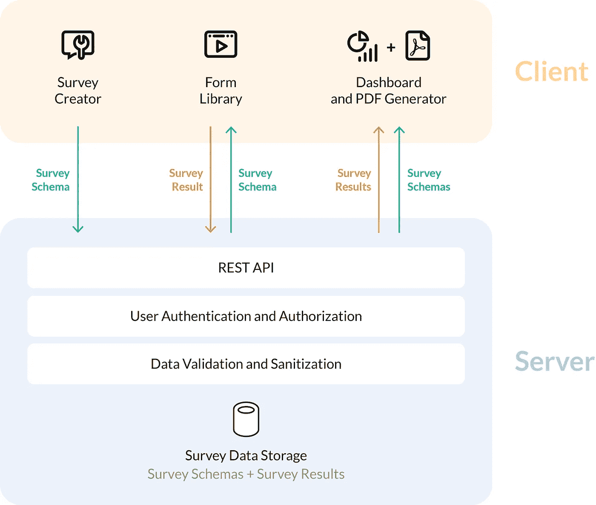
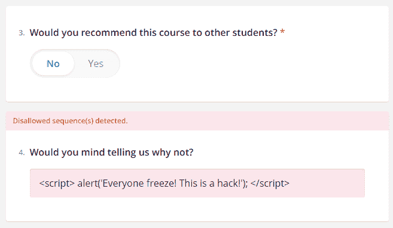
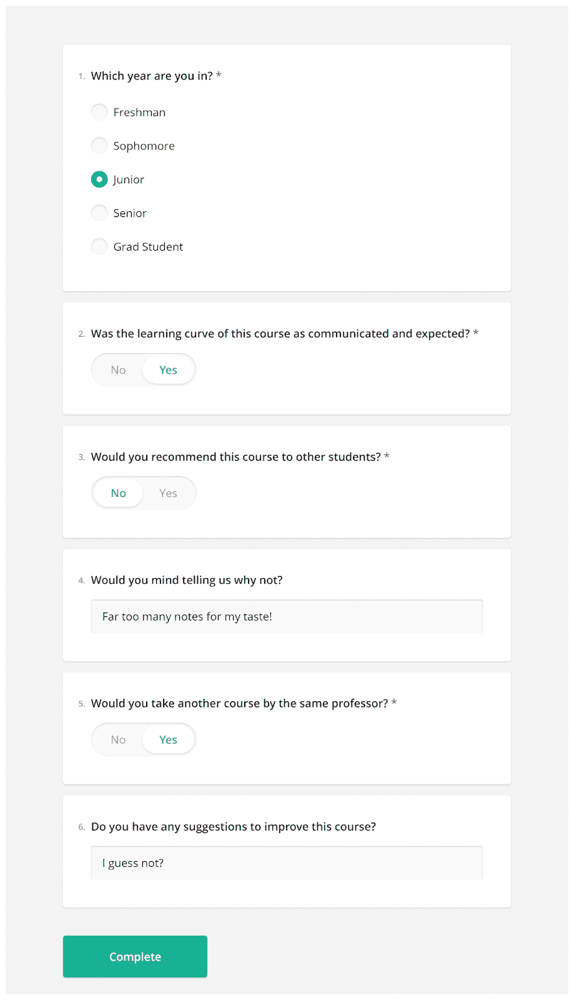

# 我如何使用 React + SurveyJS 在几分钟内创建一个安全的自主调查

> 原文：<https://javascript.plainenglish.io/how-i-created-a-secure-self-hosted-survey-in-minutes-with-react-surveyjs-9adc15207af2?source=collection_archive---------0----------------------->

## 在一个注重隐私的世界里，完全拥有调查数据的重要性。

[Photo by Matthew Henry](https://unsplash.com/photos/fPxOowbR6ls)

在线问卷调查——无论是针对教育部门、医疗保健还是简单的员工反馈——经常会要求回答者**提供必须保证匿名和隐私的信息**,这样，作为调查者的您就可以合法合规并确保诚实的答案。

因此，你用来创建和主持调查的软件需要比第三方的 SaaS 黑箱平台更 T2，因为知识产权法，你无法参与、监控或改进实际服务。

为了证明这一点，我们将使用 [SurveyJS](https://bit.ly/3amErbh) 构建一个调查，这是一个快速、通用、免费和开源(麻省理工学院许可)的 JavaScript 库，用于表格和调查，它是自托管的，让您保留对受访者数据的完全所有权，*而不会放弃隐私，或者被锁定到一个您无法控制的服务。*

但是首先…让我们来处理一个明显的问题。

# “隐私”？我为什么要在乎？

即使调查是在知情同意的情况下匿名进行的，你也不能逃脱责任。

即使您只存储聚合数据，小样本也可能会无意中识别出个人，从而导致不良后果。此外，大多数国家/地区都有管理所收集数据的存储和安全的法律(HIPAA、FERPA、GDPR)，这意味着您要对您保管的任何存储的个人信息负责，包括在保留期结束时对其进行**安全销毁**，并提供证据*。*

确保个人隐私和法律合规性的最简单方法是**自行主持**调查。您可以在自己的基础设施上运行调查并完全存储响应*,从而在没有任何第三方参与的情况下完全控制服务器和客户端之间的数据流。*

*至于好处呢？怎么样……*

*SurveyJS 作为客户端库分发，用于 [React](https://www.npmjs.com/package/survey-react-ui) 、 [Angular](https://www.npmjs.com/package/survey-angular) 、 [Vue.js](https://www.npmjs.com/package/survey-vue-ui) 、 [Knockout](https://bit.ly/3amEsMn) ，当然还有 [jQuery](https://bit.ly/3yK8HFh) 。对于后端，您也有完全的选择自由，因为任何服务器+数据库的组合都与 SurveyJS 完全兼容，只要它支持 JSON、文本或 BLOB 字段的存储和处理。*

*SurveyJS 如此松散耦合的事实意味着您可以完全按照您想要的方式保护和管理下面的每一层软件和硬件；SSL、防火墙、纯 Linux，尽情发挥吧。此外，您不必在实际的调查应用程序代码中做任何更改来符合未来的法规。*

*最后，SurveyJS 支持[web hooks](https://en.wikipedia.org/wiki/Webhook)；这意味着在受访者完成调查后，您可以完全控制如何处理数据。您通常希望[将它存储在数据库](https://bit.ly/3nMxfbr)中，在需要时向法律机构发布，并在您完成构建业务/内部指标后删除它。*

> ***注意:**虽然不是特定于调查，但在内部完全控制数据也意味着您可以在需要知道的基础上管理对数据的访问，从而确保最低权限策略。*

# *2.定制和可扩展性。*

*您可以使用自定义 CSS 和包含的主题，使您的调查看起来很棒，并以您品牌自己的设计语言脱颖而出，而不是由第三方供应商提供的相同默认设置。*

*SurveyJS 也是可扩展的，具有第三方 JavaScript 组件，如 [SortableJS](https://github.com/SortableJS/Sortable) 、 [react-tag-box](https://www.npmjs.com/package/react-tag-box) 等。您可以混合搭配不同库中的组件，以获得您想要的确切功能。*

*还有一个特性:使用 REST API[填充选项，您可以在调查/表单模式本身](https://bit.ly/3bZhKdq)中定义，不需要任何用于异步 XHR 的 JavaScript 代码。*

# *3.避免供应商锁定。*

*当第三方解决方案的性能标准下降，而他们却不断提高价格时，你难道不讨厌吗？如果他们不再支持您所依赖的技术，该怎么办？*

*在这种情况下，你没有追索权。你完全依赖于供应商来获得业务关键数据，因为你被太多的依赖关系锁定在一个糟糕的选择上，而且 SaaS 支持的软件从来不是 100%独立于供应商的，所以如果你想将业务转移到其他地方，你总是会产生成本。*

*自主管理 SurveyJS 解决方案给了你真正的自由，不仅使长期规划成为可能，而且使*可行*。*

# *好吧。那么我该怎么做呢？*

*这是游戏计划。*

**

*The SurveyJS offering consists of four individual products, as you can see, but we’re only concerned with our server, and the client-side SurveyJS Library.*

*我们的调查将使用实现 SurveyJS 库的 React 组件来构建，基于一个将请求代理回真实服务器的 Express 后端。*

*SurveyJS 使用数据驱动的方法——这意味着您将把调查定义为用 JSON 编写的数据模型(一个*模式*), React 应用程序通过 Express REST API 从后端检索该数据模型，并使用模板呈现调查。完成后，它将以同样的方式发送调查响应(也作为 JSON ),您的后端会将其添加到数据库中。*

> ***注:**要获得灵感，请随意查看 SurveyJS 提供的用于 Node.js、ASP.NET MVC 和 PHP 的[示例服务](https://bit.ly/3P8D1jT)，以帮助您快速启动并运行后端。请注意，这些只是作为指南，不建议按原样用于生产。*

*在安全性方面，下面是我们在这个代码示例中确保的内容:*

1.  *适当的验证，以消除调查响应中触发恶意行为的恶意 HTML。*
2.  *防范常见的攻击媒介，如 XSS 和 CSRF。*
3.  *使用后端将请求代理回实际的服务器，作为一种 web 过滤器。*

*如果你不是*自主主持本次调查，你不能做的三件事。**

*所以让我们来看看代码。*

## *1.该模式*

*这是一个非常标准的学生课程调查，带有一点条件逻辑，从数据安全/隐私的角度来看，这是一个理想的案例研究，因为这些信息在美国可能受到 FERPA 的保护。*

*我们的第一层保护是使用正则表达式进行验证，确保响应中不允许出现潜在的跨站点脚本(XSS)攻击。*

**

*我们也将在后端防止这种情况，但同时，SurveyJS 提供了一个健壮的验证系统，您可以使用正则表达式在 JSON 模式本身中定义该系统，避免了在 React 前端增加任何额外代码的需要。*

*此外，这种验证是很好的 UX 设计，让回答者即时反馈他们做错了什么，而不是等到调查发送出去。*

## *2.前端*

*首先，我们从后端(`getSchema()`)检索模式，并使用模板根据该模式呈现调查。然后，我们使用 SurveyJS 对 webhooks 的支持(`onComplete`触发器)将我们的受访者提交的调查结果发布到后端，这些结果将被添加到数据库中。*

*为了防止 CSRF 攻击，我们利用 cookies 作为授权在后端生成 CSRF 令牌(这就是`getCSRFToken()`在第一次加载时所做的)，然后我们用它来发出合法的 POST 请求(在`addToDatabase()`)。*

*此外，这里我们有第二层针对 XSS 攻击的保护——简单地使用 React 的默认[数据绑定](https://reactjs.org/docs/introducing-jsx.html#embedding-expressions-in-jsx)和花括号通过 JSX 呈现数据，并让 React 净化 HTML。*

> *像处理 XSS/CSRF 攻击这样的服务器端安全措施超出了作为客户端库的 SurveyJS 的范围。在这个代码示例中包含它们只是为了让您了解一个完整的自托管调查实例应该是什么样子。*

## *3.后端*

*我们在这里实现了 CSRF 保护策略的其余部分，使用 CORS 中间件来确保请求只有在满足以下条件时才被视为合法:*

*a)…事先沟通以获得批准的 CSRF 令牌，*

*b)…正在使用那个*相同的*令牌，并且*

*c)…是否*只是来自一个被批准的原始 URL 列表中的*(我们将它们存储在 dotenv 的 allowed_origins 变量中)*

*如果您使用 SurveyJS 提供的 [Node.js 后端示例](https://github.com/surveyjs/surveyjs-nodejs)，请注意，我们在这里仅使用客户端 cookies 进行授权，而该示例通过 [express-session](https://www.npmjs.com/package/express-session) 包使用会话(服务器*和*客户端)。*

*就这样结束了！启动 Express API 服务器和 React 应用程序，并尝试一下！*

**

# *权力，回到你的手中。*

*如果您希望以合法合规的方式为您的调查收集数据，并保护您的受访者的匿名和隐私，有一些职业和道德行为准则*必须*考虑在内，并且几个活动部分必须协调工作。这些都是非常不同的任务，涉及非常不同的学科。*

*希望您现在已经理解了如何使用 survey js——免费、开源，并在非常宽松的 MIT 许可下——将使您能够做到这一点，并解决这些关于隐私、数据所有权、定制和供应商锁定的问题。*

*别忘了*还要*起草一份全面的隐私政策！*

**更多内容看* [***说白了。报名参加我们的***](https://plainenglish.io/) **[***免费周报***](http://newsletter.plainenglish.io/) *。关注我们关于*[***Twitter***](https://twitter.com/inPlainEngHQ)*和*[***LinkedIn***](https://www.linkedin.com/company/inplainenglish/)*。查看我们的* [***社区不和谐***](https://discord.gg/GtDtUAvyhW) *，加入我们的* [***人才集体***](https://inplainenglish.pallet.com/talent/welcome) *。****