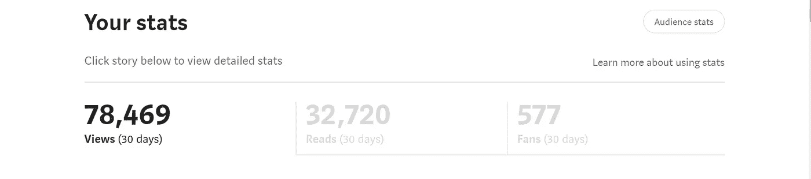

# 我如何在我的全职工作之外创造一个成功的副业

> 原文：<https://javascript.plainenglish.io/how-i-created-a-successful-side-hustle-beside-my-full-time-job-449e70d14f66?source=collection_archive---------6----------------------->

## 遵循这些简单的步骤。

Photo by [Matthew Hamilton](https://unsplash.com/@thatsmrbio?utm_source=medium&utm_medium=referral) on [Unsplash](https://unsplash.com?utm_source=medium&utm_medium=referral)

我是一名程序员，更准确地说是一名 web 开发人员。

而且我不想依赖单一的资金来源。是的，当我刚开始做一个的时候，我没能存更多的钱，甚至不能投资更多。

因此，在没有通知任何人的情况下，我开始了一个新的副业。即使是现在，我的大部分家人都不知道。

当然，我尝试过成为一名 YouTuber 和博客作者。然而，没有一个奏效。

然后我开始创作技术内容。

这里有一些你可以复制的步骤。

## 找一份让你生活轻松的工作

得到一份朝九晚五的工作是我做过的最好的决定之一。

老实说，我不想为了赚钱而冒生命危险去创业或副业。

最初，如果我试图创业或副业，我将不得不花更多的钱，或者暂时没钱。

相反，我试图做一份朝九晚五的工作。

我有一个简单的计划:如果我的副业有回报，我就辞职；如果没有，我会继续工作。

我的工作让我可以谋生，联系和学习其他人，并帮助我在朝九晚五之后开始做任何我想做的事情，而不会感到有义务。

所以我的工作是我的救命稻草。

## 专注于侧面碰撞

我知道我们大多数人对自己的职业不满意，但它对我们的大部分生活至关重要。

但是，我们可能会根据自己的爱好开一家副业公司。

另一方面，侧挤完全是为了我的利益，我可以自由地用它做任何我想做的事情。它可能包括从建立 API 到创建模板到写书的一切。

我选择了我喜欢做的侧推。对我来说，这不像是一份工作。我也选择什么时候工作，什么时候休息。

当我最初开始的时候，我并没有努力花一定的时间。我保持事情简单，每天限制自己工作两个小时。

几个星期后，它成了我的第二天性。

## 如果你不喜欢你的侧推，尝试一些不同的东西

老实说，我不确定我喜欢做什么。因此，我开通了 YouTube 账户，然后开始写博客(通过购买域名和托管)。

然而，没有一个是成功的。

我心情不好。这不是我想要的。坦率地说，我打算放弃接下来的两个月。

我厌倦了为什么它会发生在我身上，为什么我不喜欢我正在做的事情。

如果你也有同样的感觉就好了。

继续努力…

## 耐心是你所做的是一种美德

老实说，我不喜欢写博客。写了几百个帖子，然后等了一年才得到排名，靠 Google Adsense 赚钱。

我发现大多数读者鄙视广告，因此不会点击它们。

于是，两个多月后，我偶然发现了 YouTube 上一个关于为媒体写作的视频。

于是我开始了。我写作一个月还没赚到 1000 美元。第二个月，然后第三个月，都一样。

这给了我一种成就感。至少，我在学习写作。

在第四个月，我的故事像病毒一样传播开来。一年之内，我成为了 Medium 的前 1000 名作者之一。

震惊？甚至我。

仅在 Medium 上，我现在每个月就收到近 80，000 次浏览。

## 努力让它成长和繁殖

我有一份工作和副业。

那么，下一步是什么？我要努力提高我的侧滑。但是，只有具有可比性的才应该积累。

我到底是什么意思？假设我正在做一些 YouTube 视频。一年后，我幸运地从中赚了一些钱。

由于我的努力、毅力和持续不断的学习，我成为了 it 专家。现在制作一个视频需要更少的时间。因此，我可以花一些时间创造一些与我的副业相关的新东西。

我有什么选择？类似的课程可能会在 Udemy 和 Skillshare 上创建和销售。

很公平。

换句话说，从一个开始，努力成功，然后进行第二个，以此类推。

## 与其放弃，不如创新

竞争无处不在。如果你想做一年副业赚些钱。

有可能第二年你就赚不到足够的钱了。因此，与其放弃，不如尝试创新。

好吧，你现在是侧推的专家了。如果之后你试图放弃，你只是在浪费你的金钱、时间和技能。

相反，要有创造性，做一些研究，学习一些新的东西，改变你的方式，为你的客户提供更大的价值，这就是全部。

别忘了，解决的问题越多，获得的经验越多，赚的钱也越多。

因此，与其放弃，不如尝试想出一个解决方案。

## 接下来呢？

你有工作和副业。你可以从副业做起。可以雇佣员工，做大。

简而言之，你可以为所欲为。

[*如果你喜欢阅读这样的故事，并想帮助我成为一名作家，可以考虑成为一名中等会员*](https://nitinfab.medium.com/membership) *。每月花费 5 美元，你可以无限制地访问媒体内容。如果你通过我的链接注册，我会得到一点佣金。*

就这些——谢谢。

 [## 作为一名开发者，你可以在睡觉的时候用 5 种不同的方式赚钱

### 不要指望博客，媒体，YouTube

javascript.plainenglish.io](/5-different-ways-you-can-make-money-as-a-developer-while-you-sleep-ad54715b6ad7) 

*更多内容请看*[***plain English . io***](http://plainenglish.io/)*。报名参加我们的* [***免费周报***](http://newsletter.plainenglish.io/) *。在我们的* [***社区***](https://discord.gg/GtDtUAvyhW) *获得独家获得写作机会和建议。*