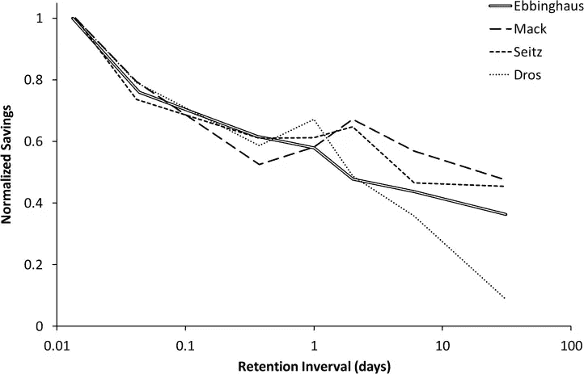
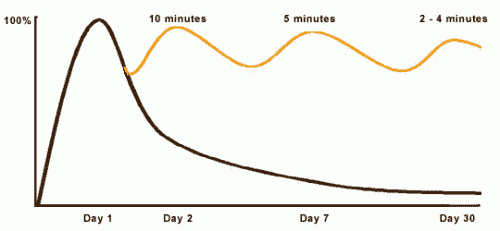
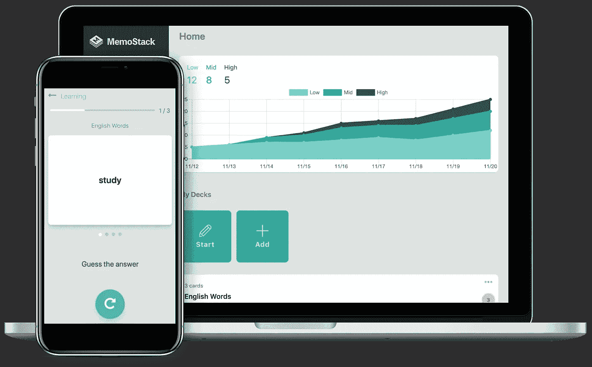

# 我多么容易记住我所学的东西

> 原文：<https://javascript.plainenglish.io/how-i-easily-remember-what-i-learn-2469e47c71ce?source=collection_archive---------5----------------------->

## 将你的职业生涯建立在良好的学习习惯上——每次 20 分钟

**免责声明:** *这不是另一个基于超级聪明人的“如何……”。这是我自己的经验，我的错误和工作技巧。我希望这对你也有用，我也很乐意听听你的记忆技巧。*

当我开始学习编码时，我面临着一个在任何领域的初学者中非常普遍的问题。

Photo by [Dmitry Ratushny](https://unsplash.com/@ratushny?utm_source=medium&utm_medium=referral) on [Unsplash](https://unsplash.com?utm_source=medium&utm_medium=referral)

要学习和记忆的东西之多令人印象深刻。

对于初学者来说尤其如此，因为在他们学习旅程的开始，他们没有太多的参考资料。

此外，这对每个试图学习全新事物的人来说都是正确的！我将举学习编码的例子，但同样的事情也适用于任何其他环境。

> 建立基础比改进基础更难！

# 为什么学习新事物很难

学习新事物比扩大你对已知事物的知识更难。

一旦基础到位，通常会更容易前进，原因如下:

*   **你对什么是什么和你在哪里有一个心理地图。**你不是在学习 *web 开发*，而是在学习 web 开发中的一个特定的东西，例如，如何设计一个元素的样式，如何在点击事件中执行一个功能，等等。你不是在学习*数据科学*，你是在学习如何使用 scikit-learn 来预测一些数据的值
*   **你理解你正在学习的东西的核心逻辑**。在任何编程语言中，循环都是你首先要学习的东西之一。然而，一旦你理解了循环的概念，学习它们在其他语言中是如何工作的就容易多了，因为你不需要再学习逻辑了！
*   **你知道去哪里找资源**。当你想在你的领域或邻近领域学习新的东西时，你知道去哪里找资源。一个初学者甚至分不清好的推荐信和平庸的推荐信。这会减慢学习速度，甚至会影响初学者的工作质量。

我在这里解释一个简单的技巧来更好地保留和记忆你所学的内容。

这种技术对我很有效，但对你或多或少也有好处。我鼓励你试着自己做决定。

# 首要的事情:睡觉，吃饭，锻炼

良好的睡眠、合理的饮食和一些锻炼是你学习之旅的重要组成部分。尤其是中长期关心自己的话。

此外，我鼓励你像运动员对待自己的身体一样对待自己的大脑。

Photo by [Braden Collum](https://unsplash.com/@bradencollum?utm_source=medium&utm_medium=referral) on [Unsplash](https://unsplash.com?utm_source=medium&utm_medium=referral)

一周内每晚睡 5 个小时，会有运动员参加比赛吗？有哪个运动员会在吃了自助餐后发挥出自己的最佳水平吗？

同样，你应该注意你的睡眠、饮食和锻炼习惯。

## **睡眠**

研究表明，当我们睡觉时，我们的身体会经历一种净化循环，大脑会清空所有不应该存在的担忧。

当我们睡眠不足时，这些垃圾就会积累起来，恶化大脑功能。

平均来说，人们需要七到九个小时的睡眠，对一些人来说少睡一点就够了，而另一些人可能需要更多。

每个人都是不同的:测试一下你的感受。

## **吃均衡的膳食**

健康均衡的饮食也很重要。

你的身体需要许多不同的营养才能正常工作，当你没有摄入这些营养时，就很难集中注意力和吸收信息。

学习时暴饮暴食或挨饿会削弱你的学习能力。

## **经常锻炼**

你可能不需要每天去健身房。然而，绕着街区走一小段路是一个很好的开始，可以让你精神焕发，活动活动身体。

一旦最佳的睡眠、饮食和锻炼到位，你就可以开始使用记忆技巧。

# 为什么我们会忘记？

几年前我偶然发现了间隔重复的概念，猜猜我是怎么想的？间隔重复是 BS。

我以为是卖书卖课程的另一种背诵技巧。

## *艾宾浩斯的遗忘曲线*

间隔重复是基于*艾宾浩斯的遗忘曲线。*

在维基百科[上快速搜索了一下](https://en.wikipedia.org/wiki/Forgetting_curve)告诉我“*从 1880 年到 1885 年，赫尔曼·艾宾浩斯对自己进行了有限的、不完整的研究，并于 1885 年发表了他的假说*”。

这家伙对他自己进行了有限的、不完整的研究，我应该把我的学习习惯建立在这个基础上吗？？而且还不是全部！

“艾宾浩斯研究了无意义音节的记忆”。不完全是我学到的。但是等等！最好的还在后面！

*“艾宾浩斯* ***调查了遗忘率，但没有调查间隔重复*** *对提高记忆可提取性的影响”*

所以他连间隔重复都没提出！说实话，这感觉越来越像一个骗局！

## 我为什么改变主意了？

因为下图:

[Replication and Analysis of Ebbinghaus’ Forgetting Curve](https://www.ncbi.nlm.nih.gov/pmc/articles/PMC4492928/)

他们重复了艾宾浩斯的遗忘曲线研究，得到了非常相似的结果！

当三个独立的科学研究，除了最初的一个，得出类似的结论，有一些有趣的事情正在发生。

上面的图表显示，一天后，我们失去了大约 40%的知识。太多了！

据滑铁卢大学网站上的一篇[帖子称，一天后，“*如果你对那次讲座中学到的信息什么都没做，没再想，又看了一遍，等等。你将会失去你所学知识的 50%-80%。*](https://uwaterloo.ca/campus-wellness/curve-forgetting)

与艾宾浩斯的遗忘曲线相比，有一些不同之处。

## 曲线是反过来的…

别担心！

The Curve of Forgetting according to the [University of Waterloo](https://uwaterloo.ca/campus-wellness/curve-forgetting)

把两条曲线都想成那一刻的“你记得多少”！

在遗忘曲线中，他们假设“*在第一天，讲座开始时，你一无所知，或者 0%，(曲线从基线开始)。*

0 的时候你还记得多少？没什么，因为你没开始学。

学习阶段介于 0 和第 1 天之间。

第一天 100%的峰值代表“ *100%你所知道的，无论你在那一点上有多了解*。该曲线处于最高点，在一次讲座或一次学习会议后保留的信息最多。

艾宾浩斯的第 0 天是这张图上的第 1 天。

讲座结束后的一天，如果你对材料什么也没做，你会从记忆中失去 50%到 80%的内容。这比艾宾浩斯曲线更糟糕。

再者，过了一天，我们越来越忘记！

## …但概念是相同的

到了第七天，这种信息会减少到大约 10%,到了第 30 天，这种信息实际上就消失了。显然，这之后只剩下 2%-3%了。

在没有任何干预的情况下，你可能需要从头开始重新学习这些材料。

现在，看这条黄线。那就是我们接下来要去的地方！

The Curve of Forgetting according to the [University of Waterloo](https://uwaterloo.ca/campus-wellness/curve-forgetting)

# 如何长期记忆

在适当间隔的记忆过程之后，你只需要 20 分钟就可以记住你所学的大部分内容。

你想重新审视和重新加工同样的材料，但要以一种非常特殊的方式。

这样，当你需要的时候，你从长期记忆中提取信息的时间会越来越少。

根据滑铁卢大学的研究,*当你反复接触相同的信息时，激活你长期记忆中的信息所需的时间会越来越少，当你需要时检索这些信息会变得更容易。*”

**它是这样工作的:**

1.  **在你学习的 24 小时内**，花 10 分钟回忆你学到了什么。这一点非常重要，因为在最初的 24 小时里，我们会忘记很多东西。然而，重复一次将使曲线回到几乎 100%。
2.  **七天后**，花五分钟重新激活相同的材料，再次将曲线抬高。老实说，我更喜欢在第二天花 5 分钟回忆我学到了什么，然后在第四天回忆。也许你不需要，但它对我来说很好。
3.  **到第 30 天**。你的大脑只需要两到四分钟就可以完全重新激活同样的材料，再次使曲线上升。还是那句话，以我个人的经验，我更喜欢每周回顾一下概念，哪怕只有几分钟。这是我的主观体验。

之后，每月几分钟的回忆会帮助你保持材料新鲜。

所以，这里的底线是，如果你想记住你从一堂课或一节学习课中学到的东西，遵循前面提到的方法。

相反，把这 20-30 分钟间隔开，这样一个月后，一切都还在。

## 技巧 1:间隔重复应用

我目前使用一款名为 [MemoStack](https://memostack.app/) 的免费应用来间隔我的重复。如果你知道更好的应用，那就太好了！

MemoStack 免费且易于使用

MemoStack

## 秘诀 2:在聚会前重复，也就是在任何地方重复

我在生活中经常想起我想记住的东西！

**这里有一个例子。**

我写了这篇文章: [RxJS 角度声明式模式](https://betterprogramming.pub/rxjs-declarative-pattern-in-angular-cafba3983d21)。我怎么记得这个概念？

底部有一个三步回顾。

当我坐在公交车上听音乐时，我会从第一步开始，想象我需要做什么，直到完成这三步。

第一次需要一些积极的努力。

第二次已经比较顺利了。

第三次，我可以在任何地方快速重复这个过程。

我最后的建议？

**就试一次，自己看。**

我很想听听你的经历！

以下是我提到的研究和帖子:

 [## 艾宾浩斯遗忘曲线的复制与分析

### 我们提出了一个成功的复制艾宾浩斯的经典遗忘曲线从 1880 年的基础上的方法储蓄…

www.ncbi.nlm.nih.gov](https://www.ncbi.nlm.nih.gov/pmc/articles/PMC4492928/)  [## 遗忘曲线|校园健康

### 遗忘曲线描述了我们如何保留或去除我们接受的信息。它基于一个小时的…

uwaterloo.ca](https://uwaterloo.ca/campus-wellness/curve-forgetting) 

*更多内容请看*[***plain English . io***](https://plainenglish.io/)*。报名参加我们的* [***免费周报***](http://newsletter.plainenglish.io/) *。关注我们关于*[***Twitter***](https://twitter.com/inPlainEngHQ)*和*[***LinkedIn***](https://www.linkedin.com/company/inplainenglish/)*。加入我们的* [***社区不和谐***](https://discord.gg/GtDtUAvyhW) *。*