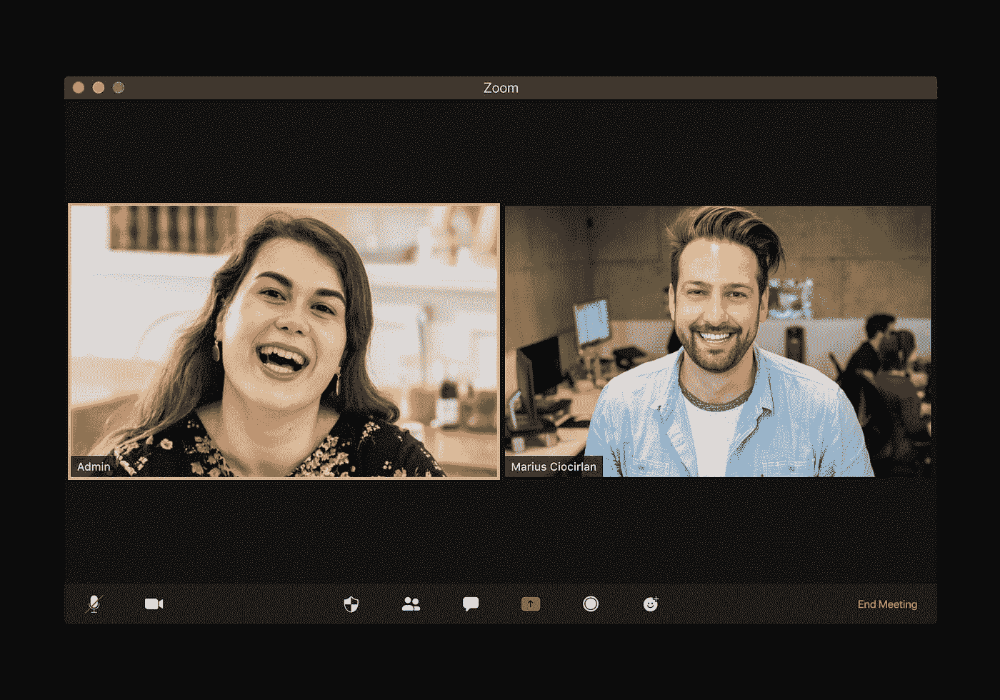

# 我是如何在一家软件公司的网上面试中失败的

> 原文：<https://javascript.plainenglish.io/how-i-failed-my-online-job-interview-in-a-software-company-2939de5ecff6?source=collection_archive---------14----------------------->

## 但我知道那是我的错。

Photo by [visuals](https://unsplash.com/@visuals?utm_source=medium&utm_medium=referral) on [Unsplash](https://unsplash.com?utm_source=medium&utm_medium=referral)

在一名招聘人员的帮助下，我接触到了一家为手机制作休闲视频游戏的英国软件公司。然而，这家公司并没有让我很兴奋，他们的办公室在英格兰中部的一个小村庄，我不喜欢它的游戏，它们很无聊，没有太多的兴趣去开发。

尽管如此，我还是决定试试，因为我需要练习面试，因为我想离开我当时工作的公司。

面试是通过 Skype 进行的，在一周内包括三个步骤:认知面试、Unity 项目的开发，以及与首席执行官和首席技术官(创始人)以及人力资源经理的最终面试。

我成功通过了前两步。错误发生在第三个阶段:当他们问我的职业梦想是什么时，我回答说，一方面是因为焦虑，这没有让我按照自己的想法思考，另一方面是因为移动设备并没有让我非常兴奋，我希望看到我开发的游戏在 Steam 平台(一个知名的 PC 平台)或游戏机上发布，鉴于他们的目标，这个答案并不太受欢迎。

第二个也是致命的错误是当他们问我最喜欢他们公司的什么游戏时我的反应。

每当我进行远程采访时，我都有在身边放一支笔和一张笔记的习惯，比如我将与之聊天的人的名字和其他由于激动而可能忘记的事情，比如我从那家公司尝试的少数游戏中最喜欢的游戏名称。

顺着问题，大概是我看卷子看名字的时候她太显眼了，人事经理笑了，没多久就面试完了。

过了几天，我从招聘人员那里得到了结果:明显是否定的，但是他们加了一句话，让我觉得有点像我们的邪恶计划被揭露时可能会有的感觉:

你似乎对这家公司不太感兴趣。最重要的是，你似乎想不惜一切代价进入视频游戏开发的世界。他们不想成为你进入环境并在短时间内离开的“敲门砖”

# 说什么？

一开始我觉得被冒犯了，但事实是他们完全理解，几个月后可能就这样结束了。

从那以后，我学会了在所有面试中 100%诚实，即使以被拒绝为代价。如果是这样的话，不要把它当成个人问题，利用你的反馈来不断提高自己。

*更多内容请看*[***plain English . io***](https://plainenglish.io/)*。报名参加我们的* [***免费周报***](http://newsletter.plainenglish.io/) *。关注我们关于*[***Twitter***](https://twitter.com/inPlainEngHQ)*和*[***LinkedIn***](https://www.linkedin.com/company/inplainenglish/)*。加入我们的* [***社区不和谐***](https://discord.gg/GtDtUAvyhW) *。*