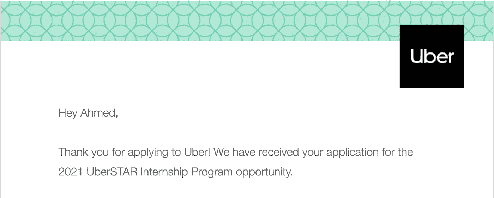
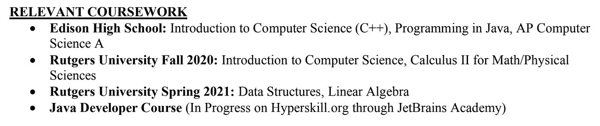

# 我 18 岁时如何获得谷歌的聘用

> 原文：<https://javascript.plainenglish.io/how-i-got-a-google-offer-at-18-7c0314a44958?source=collection_archive---------2----------------------->

## 以下是你也能从谷歌获得工作机会的方法。

The Googleplex — Google’s massive headquarters in Mountain View, CA

没错。你没看错。我真的在 18 岁时就在谷歌找到了一份工作。当然不是全职工作。我没那么聪明。反而是实习。没那么令人印象深刻，但也不算太寒酸。那么我是怎么做到的呢？

# 背景资料

现在，在我们深入这个故事之前，我必须提供一些背景信息。你看，进入大学我知道两件事:我想在毕业后成为一名**软件工程师**，我想在 **FAANG** (脸书、亚马逊、苹果、网飞、谷歌)工作。软件工程师部分很简单。我宣布我的专业是计算机科学，并开始尽可能多地学习。FAANG 部分需要更多的工作。

FAANG — The most prestigious companies in Software Engineering

我开始研究(主要是看 YouTube 视频和阅读 Reddit 帖子)这些公司是如何雇佣他们的工程师的。我发现毕业后在 FAANG 获得全职工作的关键是实习。顶级公司喜欢看到候选人已经拥有现实世界的经验，有时如果你表现足够好，你甚至可以在实习结束时获得全职工作。

现在我有了一个明确的目标:**不惜一切代价获得实习机会**。但是有一个问题。我还是个新生，没有人会雇佣新生，除非你是某种天才(我绝对不是)。我回到 YouTube 和 Reddit，找到了我的问题的解决方案:**低年级实习**。FAANG 或其他大公司将为还没有任何实际经验的低年级学生提供实习机会。报酬更低，强度更低，当然，招聘门槛也更低。对你的好处是，你可以进入一家顶级公司，并获得宝贵的经验。对公司来说，好处是他们可以在职业生涯的早期招募年轻人才。

我没有浪费时间，尽可能多地申请了这些实习机会。我申请的是 **Google STEP、微软 Explore、脸书大学和 UberSTAR** 。两年过去了，我仍在等待优步的回复(祈祷好运)。六个月后，微软才设法给我发了一封拒绝邮件(谢谢各位)。脸书在一个特别不方便的时候拒绝了我，但那是后来的事了。现在说说这个故事。

# 第一部分:应用

STEP 的申请流程相对简单。我必须提交我的简历、大学成绩单和一些短文问题的答案。我的大学成绩单上没有任何分数，因为这是在我第一学期开始的时候。对于大一新生来说，Google 只是想看看你在上什么课。

我的简历没有任何与软件工程相关的工作经验，所以我不得不精心制作。我确保在**“教育”**部分包含了我已经学过或正在学的任何相关的计算机科学课程。我还确保添加了一个标题为**“项目”**的部分，以突出我所做的编程项目。这证明了我的编码能力和我所熟悉的语言。这两点都非常重要，我相信正是它们让我通过了简历筛选。

The “Relevant Coursework” section from the resume that got me into Google

每篇论文的回答大约有 200 字，由关于我的背景和以前的编程经验的问题组成。我会讲得更详细，但是你不再需要为 STEP 提交任何论文回复了(哇哦！).我在 9 月初申请开放的那天申请了，然后等着回音。

在**12 月 17 日**，我收到了一封祝贺我的邮件。我被邀请去谷歌面试！我兴高采烈，很快回复了邮件，告知我未来几周有空。这学期的这个时候，我正在准备期末考试。23 号之后，我会有一个月的寒假，所以我把面试安排在 1 月 7 日。这让我完成了我的考试，还有足够的时间为我的面试学习。

LeetCode — the platform I used to prepare for my interviews

招聘人员告诉我，面试是技术性的，所以我必须提高我的编码和解决问题的技能。寒假一开始，我就在**LeetCode.com**上练习提问，每天和一个朋友做**模拟面试**，帮助我习惯在编码时大声思考。经过两个星期的紧张准备，这个重要的日子到了。

# 第二部分:面试

这个**的“采访”实际上是两个背靠背的小型电话采访。每部电影时长 45 分钟，中间有 15 分钟的休息时间。每个部分我都有不同的面试官，但两个人都是真正的谷歌软件工程师。如果我想通过这些面试，我就必须在工作中处于领先地位。**

**现在，我不能对这些采访的内容说太多，因为我必须事先签署一份 NDA。我能告诉你的是，我的面试几乎被一些坏消息彻底毁了。记得我说过脸书在不方便的时候拒绝了我吗？这就是我的意思。在我的一次面试中，我的手机震动了，迎接我的是一封可爱的 ***“谢谢你对脸书的兴趣……”***电子邮件。这几乎是滑稽的。就像脸书告诉我的一样， ***“别给我压力，伙计，但谷歌是你唯一的机会。”这是在一月份，所以我并不感到惊讶。我知道如果脸书对我感兴趣的话，他们现在应该已经联系我了，但是那封邮件的时机实在是太完美了。*****

****

**Me trying to keep my composure during my interview**

**最终，我通过了两次面试，并对它们充满信心。完成后，我给招聘人员发了一封感谢邮件，几周来第一次坐下来放松了一下。**

# **第三部分:等待**

**放松远不是我实际做的事。面试结束后，我无法停止思考面试结果如何，我是否通过了，我什么时候会得到回音等等。**

**大约一周后，1 月 13 日，我的招聘人员发邮件给我，说我的申请将被提交给招聘委员会审核。基本上，在谷歌雇佣任何人之前，由高级员工组成的招聘委员会会看一看你的整个申请，然后做出决定。**

**这是个好消息，因为这意味着我的面试并没有糟糕到立刻被拒绝。然而，这并不意味着我得到了一份工作，只是说我还在考虑之中。**

**我的招聘人员通知我，招聘委员会将于 2 月 1 日开会，届时我将知道我是否被选中接受聘用。我耐心地等待，直到 2 月 1 日终于到来。令我惊讶的是，我什么也没收到！没有邮件，没有拒绝，没有邀约。**

****

**Me waiting for my offer decision**

**我给招聘人员发了电子邮件，被告知有大量的申请，需要稍长一点的时间才能得到回复。她说，到 2 月 18 日，她将能够与我分享一切。**

**我在 LinkedIn 上搜索了一下，发现其他一些孩子已经收到了邀请。我开始怀疑我是否会被拒绝，但我能做的只有等待。我照做了。但直到 2 月 18 日。**

**2 月 11 日，我在为我的数据结构和算法课程做一些家庭作业，我需要一些帮助。当我问一些与作业有关的问题时，我的教授和我在交换电子邮件。我的手机震动，我忽略了它，最初以为这是我的教授。几分钟后，我查看手机，看看教授发了什么。我没有找到我所期待的，但男孩我震惊了。**

**果然，是我的招聘人员。**我得到了那份工作！**不用说，那天晚上我没有完成数据结构作业，但我还是很开心。**

# **最后几条建议**

****利用你所拥有的。不要专注于你所不具备的一切，无论是某门语言的知识、工作经验、更好的项目、好成绩还是其他。抓住你所拥有的，并最大化它。当我申请 STEP 的时候，我没有任何相关的工作经验，但是通过突出我的项目和课程，我得到了一次面试的机会。****

****早点开始。如果有一件事可以让我把我的成功归功于它，那绝对是领先一步。大学一年级开始找实习。大多数孩子甚至不知道他们想学什么(这完全没问题)。如果你*真的*知道自己想做什么，那你还在等什么？我可以很容易地对自己说， ***“没人雇佣大一新生，申请没有意义”*** 我可能会错过我一生中最大的机会。****

**互联网是你最好的朋友。在 Reddit 和 YouTube 等网站上，有丰富的知识在等着你。Reddit 特别有助于阅读其他人的实习和面试经历，而 YouTube 则有助于更广泛的主题，如如何获得实习机会或如何制作一份可靠的简历。**

**所以我希望你能从中学到一些东西，或者至少喜欢阅读它。我很喜欢写它。关注我，了解未来帖子的最新动态。**

**[在 LinkedIn 上联系我](https://www.linkedin.com/in/ahmed-ishaque-a6a51b1b5/)**

**点击这里查看我的个人网站。干杯！**

***更多内容请看*[***plain English . io***](https://plainenglish.io/)*。报名参加我们的* [***免费周报***](http://newsletter.plainenglish.io/) *。关注我们关于*[***Twitter***](https://twitter.com/inPlainEngHQ)[***LinkedIn***](https://www.linkedin.com/company/inplainenglish/)*[***YouTube***](https://www.youtube.com/channel/UCtipWUghju290NWcn8jhyAw)*[***不和***](https://discord.gg/GtDtUAvyhW) *。对增长黑客感兴趣？检查* [***电路***](https://circuit.ooo/) *。*****