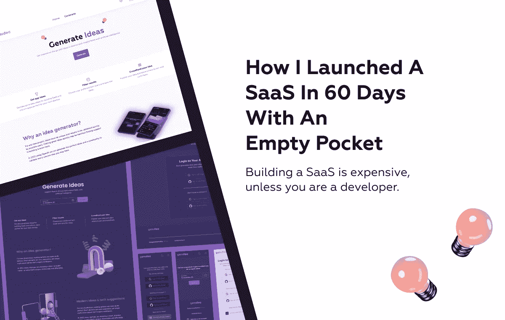
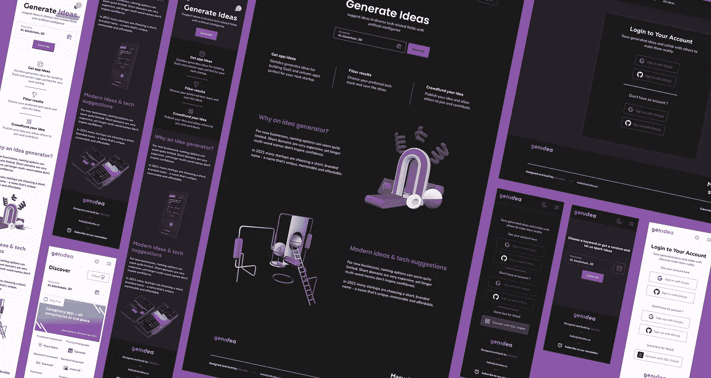
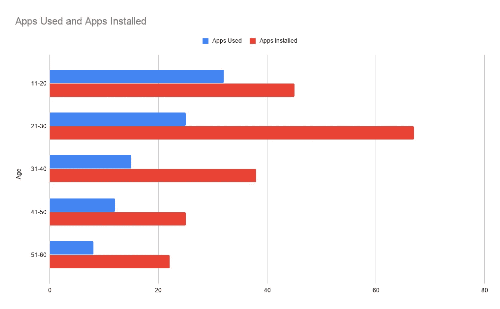
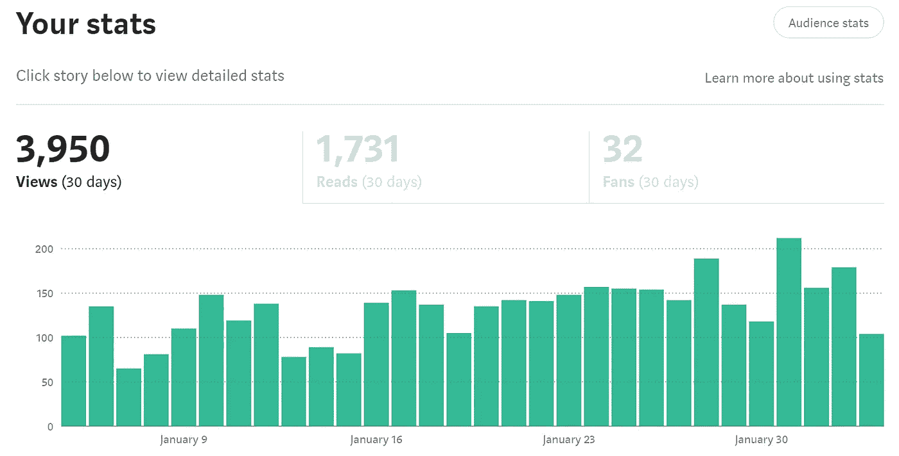
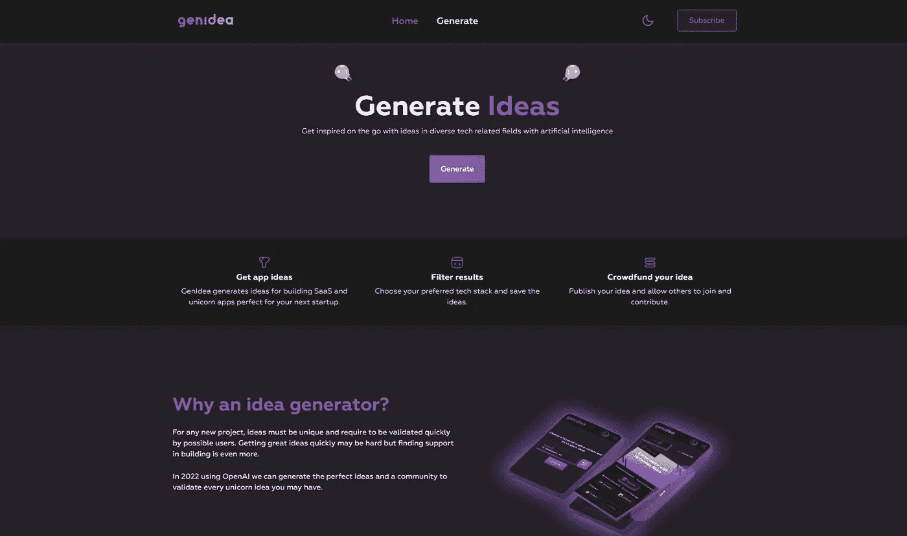
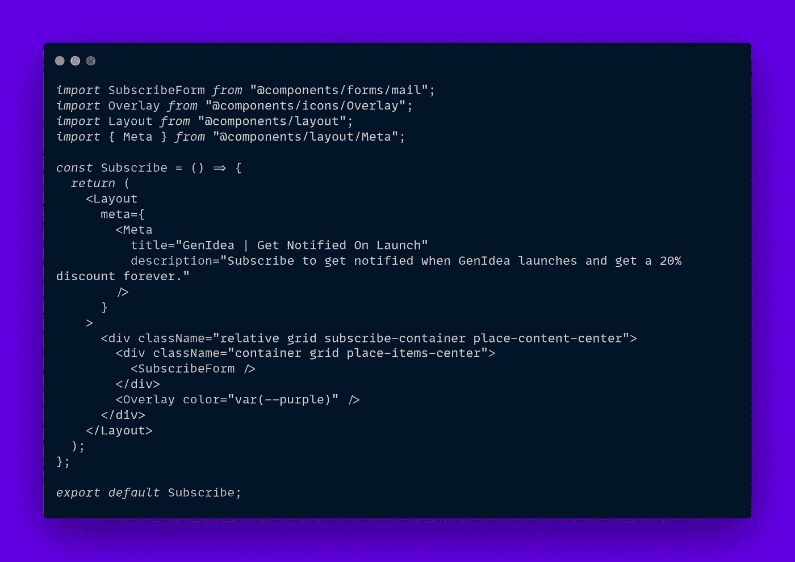
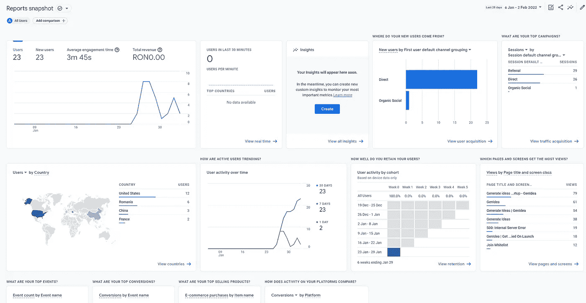

# 我如何在口袋空空的情况下，在 60 天内推出 SaaS

> 原文：<https://javascript.plainenglish.io/how-i-launched-a-saas-in-60-days-with-an-empty-pocket-313aa59c3e78?source=collection_archive---------2----------------------->

## 除非你是开发者，否则建造一个 SaaS 是很昂贵的。

SaaS — From Idea to Launch

你有一个想法，想把它变成一个成熟的产品，但害怕成本，不具备商业头脑或知识来获得资金，让其他人帮助你建立它。

这听起来有点令人沮丧，但不要犹豫，因为如果你是一名开发人员，你可能会大幅削减成本，以换取时间和学习新事物的动力。如果你不担心，创建一个无代码的登陆页面是**出奇的简单**。

几年来，我一直在收集建造一个数码产品的动力和动机，去年 12 月，我开始建造我的第一个 SaaS。我知道不是每个人都是开发人员，但如果你在技术方面的技能有限，你可以创建一个无代码的登录页面来验证你的想法。

让我们看看建立 SaaS 的主要步骤是什么，并高效地完成它。

# 1.有想法

*我在哪里可以得到一个好主意？*

你可能已经有了很多想法，其中任何一个都可能成为下一个在 [ProductHunt](https://www.producthunt.com/) 上展示的独角兽 SaaS，但是你永远不知道哪个会成功。我的想法正是缺乏一个想法，所以我建立了一个名为 GenIdea 的[人工智能应用想法生成 SaaS。](https://www.genidea.app/)

GenIdea Preview

你的想法甚至可以不完全是数字的，为你的城市/国家提供某些真正的服务，如食品和交通，如果当地市场尚未对此类应用程序饱和的话。

# 2.验证这个想法

*为什么我在乎别人在乎的？*

想法是伟大的，但它们需要解决一个特定的问题，即使是一个小的利基如果人们不认为这是他们的问题的解决方案，他们甚至不会看它，更不用说购买它。

Apps count usage across age categories

如果我们谈论移动应用，我们可以看到用户每天访问的应用数量有限，要在这个专属类别中获得一席之地很难，尤其是与科技巨头和抖音或 Instagram 这样的应用竞争。

因此**想法验证**是必不可少的，但是你如何去做，而且是免费的。

首先，你需要建立一个简单而令人信服的登陆页面来展示你的产品，你可以用流行的无代码工具 [Webflow](https://webflow.com/) 来完成。

其次，从网站上的某个地方收集反馈/电子邮件回忆，这样你就可以收集关于像你这样的应用程序/平台需求的意见。

我选择了一个更复杂的方法，在没有这一步的情况下建立了 MVP，也跳过了建立一个观众群，这是由于懒惰和一种以后再做的心态，这是错误的。

# 3.建立观众群

什么是观众，我为什么关心？

我知道你只是想看到你的想法形成并欣赏它，但如果你想有机会让它货币化，这样别人就可以珍惜它，这一步是必不可少的。

拥有一个伟大的产品却无人知晓，这是成功推出 SaaS 最常见的失败原因。没有一个拥有成千上万粉丝的社交媒体账户并不是借口，解决这个问题的最好方法就是现在就创建一个。

Sample Medium stats

记录和联系潜在用户的一个很好的平台就是 Medium，因为许多开发人员使用它，并且可以提供反馈甚至建议。

创建一系列每周开发日志文章，甚至是一个 YouTube 频道来报道你的进展是一个好主意。(我希望我已经这样做了)

接触潜在用户的另一种方式是通过像 [MailChimp](https://mailchimp.com/) 这样的服务创建电子邮件列表。我把它用于订阅表单，它有很好的开发者体验，而且它对多达 2000 个联系人是免费的。

# 4.创建 MVP

*我怎么能免费这么做呢？*

创造一个软件产品是一项复杂且相当昂贵的工作，快速完成更是难上加难。我缩小了我认为开发 SaaS 最快的技术的范围。

GenIdea MVP Landing Page

1.  设计— [图玛](https://www.figma.com/)
2.  前端框架— [React](https://reactjs.org/) / [NextJS](https://nextjs.org/)
3.  CSS — [TailwindCSS](https://tailwindcss.com/) (快速开发体验)
4.  后端框架— [NextJS API 路由](https://nextjs.org/docs/api-routes/introduction)(如果需要的话& [Express](https://expressjs.com/) )
5.  数据库— [Supabase](https://supabase.com/) 或 [Firebase](https://firebase.google.com/)
6.  支付— [条纹](https://stripe.com/)
7.  认证— [谷歌](https://developers.google.com/identity/protocols/oauth2) / [Github OAuth](https://docs.github.com/en/developers/apps/building-oauth-apps/authorizing-oauth-apps) (两者都与 Supabase 进行了开箱即用的集成)
8.  主持— [Vercel](https://vercel.com/)

所有这些工具和平台的伟大之处在于，它们在整个开发周期都是免费的，而且基于订阅的付费计划相当便宜。

我知道，能够独自处理所有这些不同的技术和集成对于一个单独的开发人员来说可能很难，但这仍然是可行的。

我花了不到 30 天的时间实现了基本功能，但是在调整和删除测试版中的功能时迷失了方向，所以用了 60 天。

# 5.启动和推广

*去哪里做什么？*

在花了很多天设计、编码和配置必要的服务和特性之后，最后一个小时就要到了，是时候发布了。但是，一次发射究竟包括什么？

通过 Twitter 或 LinkedIn 这样的社交媒体宣布发布是很重要的，甚至写一篇展示其主要功能的中型文章也是值得的。

假设你已经在任何一个平台上有了观众，你就可以进入更技术性的部分了。在谷歌搜索中排名靠前可以极大地提升你的影响力，但是你如何做到呢？

SEO 决定了你的网站内容是否是高质量的，是否符合用户的搜索要求，幸运的是，如果你选择了 NextJS，SEO 应该很容易实现。

Sample Usage of custom Meta component for SEO

您必须确保添加到页面中的最重要的元标签是:

*   标题
*   描述
*   图片( [OG 格式](https://ogp.me/)用于社交媒体)

查看此[要点，了解 NextJS 的简单元组件](https://gist.github.com/alex-streza/17165b146e9807fa8c4ae707f3c1bed8)实现。

确保得到一个域名，符合你的 SaaS 品牌，最现代和最受欢迎的结束。app，。木卫一，。但可能更贵(> 20 美元)。

为一个 [Vercel](https://vercel.com/) 项目配置一个域非常简单，只需选择您想要部署的域名和分支。

需要注意的一点是，Vercel 为除了**生产分支**之外的所有分支添加了一个特殊的头，这样它们就不会被 SEO 索引。

另外，请确保遵循说明，并在域提供商端进行配置，我使用了 GoDaddy，并在查找 DNS 管理页面的界面中迷失了一点。

确保你的网站被谷歌索引的最后一步是将它添加到谷歌搜索控制台。添加属性(域)允许您查看分析和配置网站的 SEO 可见性。

差点忘了 sitemap(一个显示所有 SEO 可索引文件的 XML 文件)。在[这篇文章](https://cheatcode.co/tutorials/how-to-generate-a-dynamic-sitemap-with-next-js)中了解更多关于生成的信息。

关于 NextJS 的 SEO 优化，我会写另一篇更深入的博文，敬请关注🐼。

Google Analytics 4 UI

如果你想获得极其详细的分析，你可以集成[谷歌分析 4](https://analytics.google.com/) 并在你的应用程序上记录用户行为，以更好地了解其他人如何使用你的应用程序。

不要忘记在 [ProductHunt](https://www.producthunt.com/) 上列出你的应用程序以获得更多覆盖，你永远不知道你是否会获得顶部。

此外，如果你在 ProductHunt 上投票支持 [GenIdea，那将是**不可思议的**💜。](https://www.producthunt.com/posts/genidea)

希望你喜欢这篇“**开发日志**”按照创建 **SaaS** 的步骤，我会确保在真正的产品成型后，更经常地写关于新功能和区块链集成的博客🚀。

*更多内容请看* [***说白了就是***](http://plainenglish.io/) *。报名参加我们的* [***免费每周简讯***](http://newsletter.plainenglish.io/) *。在我们的* [***社区不和谐***](https://discord.gg/GtDtUAvyhW) *获得独家获取写作机会和建议。*