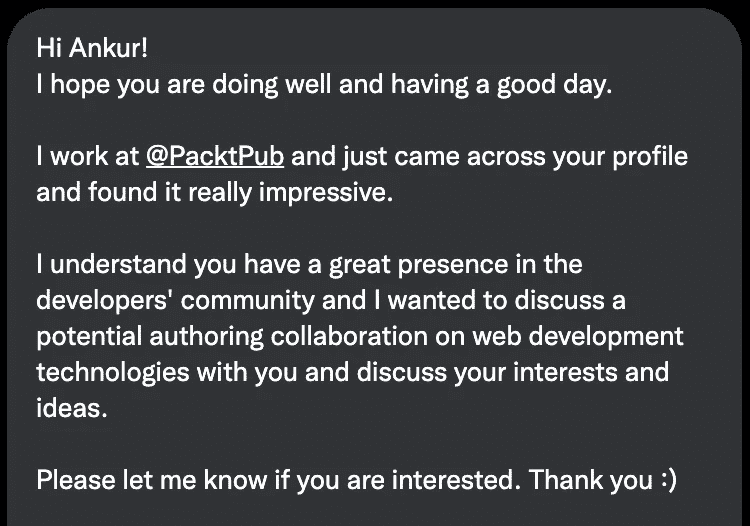
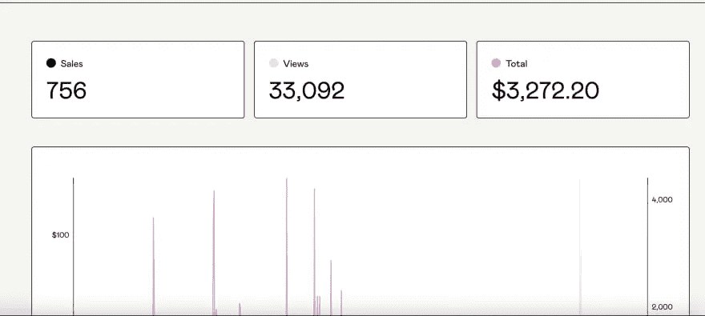
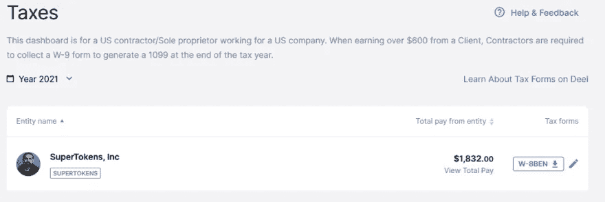
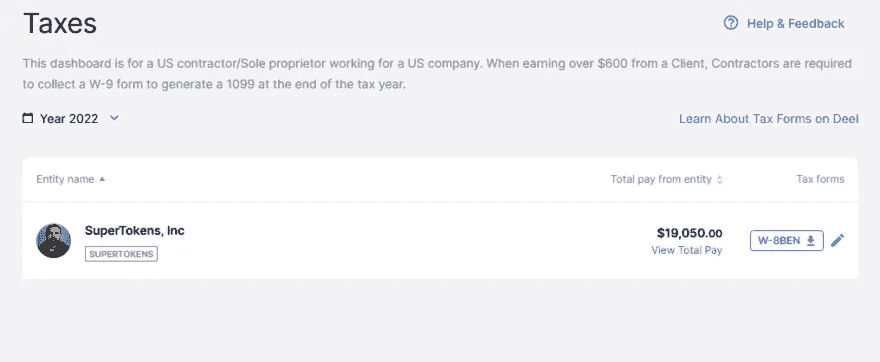
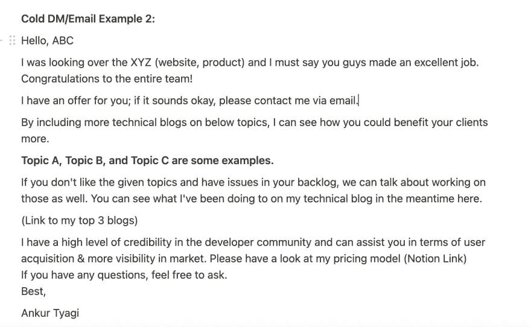
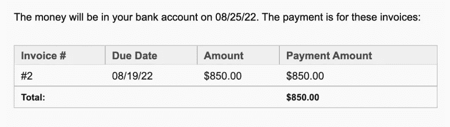
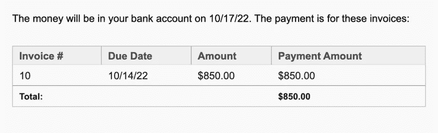
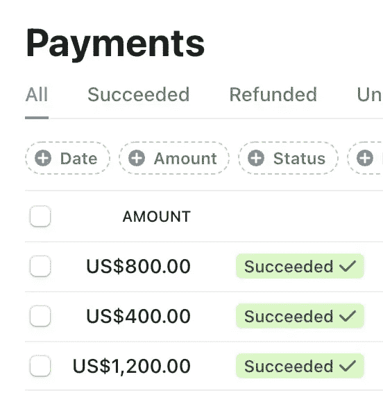
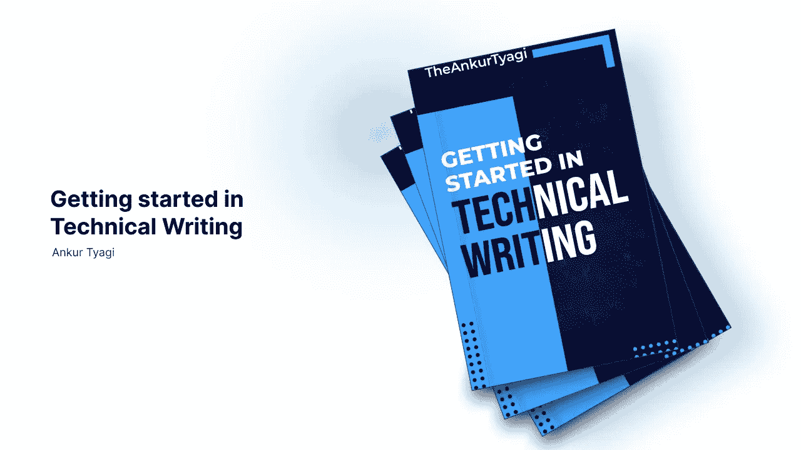
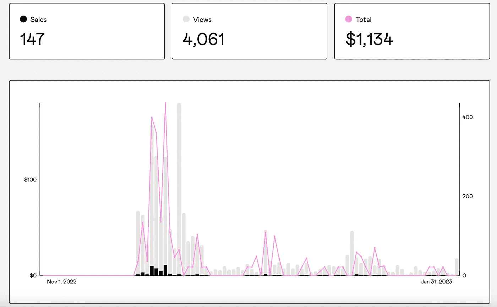

# 我是如何在一年内通过写作赚到 30，000 美元的

> 原文：<https://javascript.plainenglish.io/how-i-made-30-000-from-writing-in-1-year-30a127d53fd0?source=collection_archive---------1----------------------->

如果你问我是否会从我的博客中赚钱，我会说不会。我缺乏任何特殊的天赋，甚至没有一个作家来指导我。

在过去的 365 天里，我通过写作赚了 3 万多美元。

如果我可以通过写作赚钱，你也可以。

许多人认为这是一项不可能完成的任务，但事实并非如此。你可能需要做出一些牺牲来实现你的目标，即使事情变得困难，你也要保持忠诚。

> 对于工程师来说，拥有一个博客并写下他们正在做什么、他们知道什么、他们正在学习什么等等是很有用的。

想想吧。在你解决了一个棘手的错误或问题后，你不想记住你做了什么吗？很可能其他人很快也会遇到同样的问题，所以为什么不记录下你的步骤并与社区分享呢？你在为自己和他人做一件好事。

> **写博客对于写作来说就像极限运动对于体育运动一样——更自由，更容易发生事故，更不正式，也更有活力。从很多方面来说，它是大声写出来的。
> —安德鲁·苏利文**

如果你正在寻找快速写作技巧或快速赚钱的窍门，请停止阅读。但是，如果你想知道我的故事，我是如何开始的，花了多长时间，以及用写作走到这一步需要什么，请继续阅读。

让我们深入探讨一下我是如何通过写作赚到 30000 美元的，这样你就可以更多地了解我的策略以及你自己如何使用它。

# 我建立了一个在线形象

自从 2010 年进入 tech 以来，我一直努力提高自己的编码和软件技能。很长一段时间，这是我唯一的关注点。但在 2020 年疫情期间，我有机会做一些不同的事情，并开始在 Twitter 上分享我的技术经验。

> 在我的职业生涯开始之前，我必须建立一个品牌，确立我的资历。

随着我在互联网上的形象和权威的增加，我遇到的机会也增加了。

> 不要误会我的意思:你一定是一名优秀的开发人员。

真正的天赋和技能是被科技行业录用所必需的。

然而，如果你有一个强大的网络存在，并且在你的工程领域是众所周知的，更多的企业会找到你，并希望与你合作。

> 对于工程师来说，Twitter 是推进他们职业发展的一个无价工具。

# 建立一个推特粉丝群

我使用 Twitter 多年，几乎没有追随者。我大多是随便贴些我觉得好玩的照片或者迷因。我不知道 Twitter 是一个网络工具，因此，我错过了一些非常棒的机会。

我把注意力转移到了在我的推文中提供价值上。当我写这本书的时候，我在两个月内获得了 10，000 名追随者。我不再发布我认为有趣的东西或有助于推广我的博客帖子或其他材料，相反，我专注于分享我自己的真实技术体验，我认为这些体验会为他人增加价值。

## 从 8 月 20 日至 1 月 21 日

在此期间，没有一个美元是通过写作赚来的，但是为什么呢？因为我做得最多的是“在互联网上写作”，并专注于建立一个良好的专业网络，而不是去寻求小额的赞助交易。

## 从 2021 年 1 月至 2021 年 10 月(电子书创意)

这一切都是从我在 Twitter 上收到这条直接消息开始的。

经过深思熟虑，我决定独自写作，并在 Gumroad 上自行出版。

# 公共建筑

我推出了我的书[《下一代开发者的主要指南](https://theankurtyagi.gumroad.com/l/nextgendev)。

到目前为止，我从这本书赚了 3000 多美元，不算成功，但这是一个好的开始，它让我相信在互联网上任何事情都有可能发生。

快进到 2021 年 6 月，我搬到了瑞典；再一次，通过帮助他人和在互联网上写作，这一切都变得可能。

我帮助 Showwcase 团队建立了一个在线形象。我推广了他们，创建了 Twitter 空间，甚至免费写了一篇文章来帮助他们(这是一个错误，TBH)，但因为我的好朋友是社区经理，所以我不介意。这一切都是值得的，因为在那段时间里我结交了许多一生的朋友。

但是正如人们所说的，**如果你做好事，好事就会降临到你身上。**

2021 年 10 月，我在 Twitter 上发了几条冷冰冰的 DMs 很快，我收到了我在 SuperTokens 的第一个季度职位机会。

2021 年 12 月的某一天，我醒来时发现这条推文给我带来了数百名关注者、超过 19000 个赞和近 2000 次转发。

> **我在 SuperTokens 的开发商关系部每周工作 10-15 小时，签了一份 5 个月的合同，挣了 2 万多美元。**

再说一次，钱来之不易，但是如果你想做点什么，你必须做出牺牲。

> “改变是很好的——如果方向正确的话。”

当你做小事时，你必须考虑大事。

我正朝着正确的方向前进。因为“速度不会让你到达那里，但正确的道路会。”

如果你对我在那里做的事情感兴趣的话[我在 SuperTokens 做开发者代言人](/working-at-supertokens-as-a-developer-advocate-8ccc41de1bf9)。

# 作为一名软件顾问，我如何增加我的运气。

*   四分之一时间合同
*   写作和销售电子书
*   YouTube(因为编辑是最大的痛苦而放弃😉)
*   付费时事通讯
*   赞助内容
*   技术博客
*   师徒制

我没有多想；我只是采取了很多行动。

# 我如何获得技术写作合作伙伴？

我在 Twitter 上给一些初创公司的首席执行官/首席技术官发邮件，推销我的技能，以及我如何解决他们的问题，因为我已经为超级博客撰写了技术博客，我最初发送的 10 到 20 封邮件中有一封是 DM；我收到了 5-6 封跟进邮件，要求分享我过去或现在的工作，并安排一些初始会议，这正是我继续写作业务所需要的。

现在来谈谈我如何抓住这些机会，主要是通过冷冰冰的电子邮件/DM。

我做了一个有根据的猜测。

例如:

> **【名字】@【公司】。com**
> 
> **【名字首字母】【姓氏】@【公司】。com**
> 
> **【名】。[姓氏]@[公司]。com**
> 
> **【姓氏】@【公司】。com**

让某人回复冰冷的电子邮件可能很难。也许你听说过或者想过。

> **冷冰冰的邮件死了；是垃圾邮件！**

我听过很多这样的抱怨。但我不同意。

大家都写冷冰冰的邮件，但是谁擅长呢？

我在这里分享了我作为软件工程师[如何写出功能强大的冰冷邮件的观点](/how-to-write-powerful-cold-email-as-a-software-engineer-4d95f9947391)。

这就是你不假设不行动的结果。

> **写博客是一种对话，而不是代码。—迈克·布彻**

然而，如果你知道你能做什么，并找到一些可靠的赞助商，它最终会产生非常好的钱。

# 他们付多少钱

> **请记住，在互联网上，不同的话题报酬不同。**

你的收入取决于两个因素。

1.你的定位。

2.你如何选择货币化。

但是，取决于你的小众，你可以用很少的流量赚钱。

这里有一个很多博主不想分享的秘密。不一定非要专注于最有竞争力的关键词才能获得流量。

更好的方法是将你的关键词输入谷歌，然后寻找谷歌建议你查找的问题。

> 把写博客当作一个小赌注，你会开始投入时间并从中赚钱。

这是关键。

我最近写作收入的快照。

此外，我从[付费社区作家项目](https://github.com/malgamves/CommunityWriterPrograms)获得了一些优秀的线索。

你可以阅读更多关于今天写博客的好处[**2022 年开博客的八大理由**](https://theankurtyagi.medium.com/top-8-reasons-to-start-a-blog-in-2022-2bd32364ca64) 。

# 新博客犯的主要错误

*   购买一个新的域名并开始他们的博客，这是浪费时间，而不是专注于生产优质的文章和使用现有的平台。
*   不是一开始就到处写(Hashnode，Dev。To、Medium、LinkedIn、Twitter)。
*   过于关注 SEO。
*   不推广他们的博客内容。

如果人们没有意识到，即使一个写得很好、编辑得很好的博客也会失败。

> 成功的作家通过认识到错误，利用失败来提高他们的直觉。

金钱和从写作中获得的知识属于那些不把失败归咎于他人的人。

# 我写作的二阶效应

> 一切都比你想象的要长。

不是你写得不够快；这就是问题所在。这是因为你从一开始就没有任何现实的期望。

## 除了钱，写作还为我做了什么？

*   自从我开始写作以来，我的专业关系网显著增加。
*   学习新技能的机会。
*   当我在网上写作时，我可以更好地管理我的时间。当我住在印度时，我喜欢熬夜，但自从去年搬到瑞典后，我不得不早起写作，直到房子里的每个人都醒了。

此外，我最近接受了一些采访，完全是因为我的写作。

而且，在不久的将来，我的主要目标是在未来几年全职为自己的企业工作，写作给了我更多的信心，我最近在瑞典注册了我的 AB 公司。

## 我写作时学到的四大经验

*   如果你是第一次写作，给自己更多的时间去思考。
*   需要纪律和毅力；这是关键，只要不断出现。
*   允许自己写的很差。不要期望第一稿完美无瑕。相反，允许自己失败、学习和进步。停止准备，开始行动。
*   有些人会不喜欢你的写作风格&猜猜谁在乎。

通过改变你对完成一个博客需要多长时间的假设，你可以制作一个更现实的写作作品集。

# 结论

> **这只是我的旅程；对我来说是独一无二的。我的一些成功策略可能对你无效。**

如果你已经为升职工作了很多年，表达了对职业发展的渴望，并且想要写作，那么可能是时候开始了。

> **为了挣钱，你不应该创建博客；首先，让我们解决这个问题。**

*   好消息是，开博客比你想象的要容易得多。
*   写博客会帮助你在生活中获得自信。
*   作为一名作家，你会进步的。
*   专注于提供价值而不是增加流量。

> 具有讽刺意味的是，所有这些事情都有可能发生。建博客可以给你提供一份全职收入。

我们不会很快看到博客的终结。📝

目前就这些；我希望这些信息对你有用。如果你有任何问题，请留下你的评论。我很乐意分享我的想法。

如果你喜欢这篇文章，你应该注册我的 2–1–1 职业发展简讯:

-没有垃圾邮件
-没有废话。更重要的是，你可以通过电子邮件一对一地提出你的问题。

在此加入:[**2–1–1 职业成长简讯**](https://www.getrevue.co/profile/AnkurTyagi)

关注我的 [**Twitter**](https://twitter.com/TheAnkurTyagi) 获取更多可行的职业建议。

如果你曾经纠结于技术写作，为什么每个软件工程师都应该在这种新的远程工作文化中写作。

## 我正在为你写一本书。

> 科技写作入门:一步一步地指导你作为一名作家如何赚取每月 1000 美元。

这本书将于 2023 年 3 月发行，已经预售了 150 多本。

**点击这里查看发布推文:**