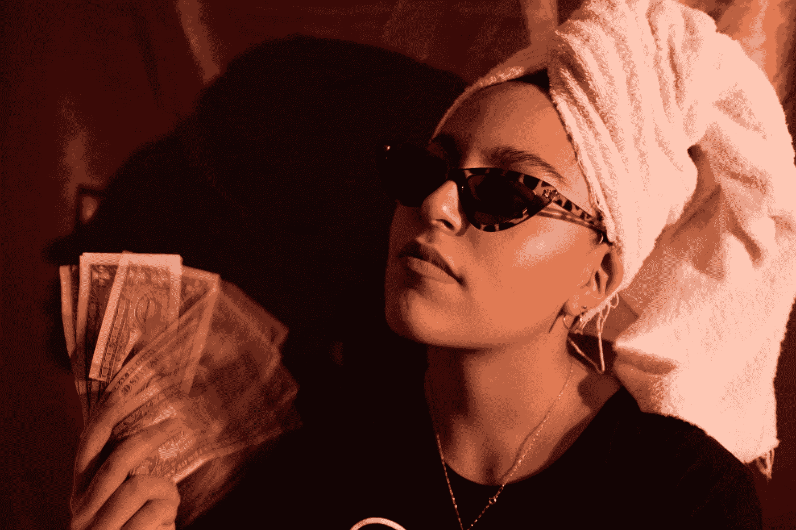

# 我如何通过兼职每月多赚 1000 美元

> 原文：<https://javascript.plainenglish.io/how-i-made-an-extra-1-000-a-month-by-starting-a-side-hustle-a6af01339719?source=collection_archive---------9----------------------->

## 这个数字在未来很可能会上升到六位数。

Photo by [Vanessa Murrieta](https://unsplash.com/@vmacevedo?utm_source=medium&utm_medium=referral) on [Unsplash](https://unsplash.com?utm_source=medium&utm_medium=referral)

我正试图写一系列关于兼职和在线盈利的文章。

你可能读过我之前的一些帖子，比如

*   [11 愚蠢简单的一面，以程序员的身份赚外快](/11-stupidly-simple-side-hustles-to-earn-extra-money-as-a-programmer-23fd30ca5cda)
*   [如何通过这种简单的方式每月额外赚 500 美元](/how-to-make-an-extra-500-every-month-with-this-easy-side-hustle-bac6fd48cdfe)
*   [你做自由职业的方式是错误的——下面是如何改正的方法](/you-are-doing-freelancing-the-wrong-way-here-is-how-to-fix-it-d4aea82d4bea)

前两个帖子本质上是关于你可能会从事的副业，甚至包括一些收入证明。读者们把它当成了病毒，并要求我提供更多关于他们的信息。

第三篇文章是关于自由职业，新手走的导致失败的常规道路，以及如何克服它。

现在还有一篇文章，我将和你分享最好的开始和赚更多钱的方法。

是的，它会有六到七分钟长，所以你可以慢慢读，或者把它添加到你的阅读清单中，这样你以后就可以回头再看。

我为什么要写这个？准确地说，互联网上有太多的 side hustle 文章，其中一些是合法的，另一些则完全是胡说八道。

尽管如此，我发现大多数作者只是在没有证据的情况下撰写虚假文章。

这是一个必须解决的大问题。更具体地说，我是一名开发人员，因此我的大部分帖子都是关于编程的；你也会看到我的 side hustles 文章是关于编程的。

我从事编程已经有几年了，正因为如此，我在这方面有一些经验。

这是我这篇文章的真正动机:向你展示如何建立一个侧面的骗局并保持下去。

# 你需要付出一年的努力

你至少需要一年的时间成为任何行业的专家，获得一份开发人员的工作，掌握任何技能，或者开始任何兼职。

确切地说，无论你做什么都需要时间。而当有人暗示你可以在几天之内赚到钱的时候，这完全是一个谎言。

我花了几年时间和许多了不起的人交谈，所以我可以自信地说。是的，你可以在一周内赚到一些钱，但你所能做的就是喝咖啡。

是什么让你认为你需要一年时间？来提升自己的能力。世界是基于价值的概念。如果你给予更多的价值，你会赚更多的钱。

举个例子，我们需要几年时间才能赚到埃隆·马斯克一个月的收入(可能更多)。

根据我的经验，第一年你只能挣到 1 万美元，然后是 10 万美元，甚至 50 万美元。不，我没开玩笑。

这就是侧滑的效果。

一言以蔽之，想做什么就做什么。选择任何一方，它可以是任何东西。确保它与你的职业相关，或者你对它感兴趣。

你应该一直努力改进它。一有空就考虑怎么改进。

# 大多数人不想冒险

信不信由你，风险是成功的重要组成部分。每一个白手起家的百万富翁在他们的一生中都冒过几次险。不管是埃隆·马斯克、杰夫·贝索斯还是其他人。

这并不意味着你应该把所有的钱都投入到 cryptos 中。我想传达的是，你应该明智地思考，根据你的经验冒一点小风险。

大多数人避免冒险，这就是他们五六十岁时破产的原因。

我们二十几岁的人大多没有承诺，不用购房，不用交 EMI。这是抓住机会的时候了。或者换一种说法，现在是赚更多钱，冒更多风险的年龄。

尝试新事物，做更多的工作，开始新的东西，没有耐心会让你变得更强大，你会获得很多经验，让你快速解决困难。

当我开始做副业的时候，大多数从事副业的人赚的钱都很少。但是，为了扩大我的副业，我冒了一些风险，改变了我做事的方式。

让我给你举个例子:大多数中等收入的人每月收入不超过 100 美元，但我的收入是这个数字的十倍。

我到底是什么意思？当我这样说的时候，我的意思是无论你做什么，你都应该尝试去改进它，抓住机会，解决问题，并尽可能地成长。

# 像专业人士一样使用社交媒体

我知道你想变得富有，这就是为什么你试图在亚马逊和 Gumroad 上卖技术电子书。

告诉我为什么人们会购买它。只是因为你创造了高质量的材料。

然而，互联网上有大量的免费内容。

要做到这一点，你必须建立信任，营销自己，让自己有价值。换句话说，你可能知道如何销售这些商品。相信我，开发有价值的材料是没有意义的，除非它被推广给目标受众。

这就是社交媒体发挥作用的地方。是的，在 Twitter、Pinterest、Medium、YouTube、LinkedIn、Substack、Gumroad 和其他平台上销售可能会让你赚到数千美元。

借助社交媒体，你可以简单地看到这种增长。因为这些平台让有价值的信息得以快速流通。

更重要的是，所有这些网站都是完全免费的。是的，你不必支付任何钱来使用它。

我到底是什么意思？我想展示社交媒体的真正力量。你需要一个观众来开始一个侧面的宣传，最简单的方法就是通过社交媒体。

# 向比你更有技巧的人学习

每个行业都有一些富有的坏蛋，他们可以教会你一切。我开始跟随同样的坏蛋，采取和他们一样的态度，现在我赚的比我预期的多。

但是从哪里？简单地从 YouTube，Medium，和 Twitter。他们有一些真正的宝石，我也订阅了一些帮助我提高的子编辑。

进步最快最简单的方法就是向专业人士学习。他们花了很多时间才到达现在的位置。你可以从他们那里学到所有的战术。

我到底是什么意思？不断学习的人有机会比其他人更快地扩大他们的财富。越早学到东西，就能越快付诸实践，就能赚到越多的钱。

这正是我正在做的，也正是我建议你做的。

# 让 side hustle 帝国成长

单边骗局会给你带来收入。

那么，下一步是什么？保持一致性，尽可能地增加你的侧身跑动。雇佣一些聪明的人，参加一些课程来学习更多，在相同的领域创造一个新的，扩大你的副业。

甚至可以从中获得[被动收益](/5-different-ways-you-can-make-money-as-a-developer-while-you-sleep-ad54715b6ad7)。

这完全取决于你。

这就是你如何赚钱，并在一年内彻底改变你的生活。

就这样——谢谢。

[*如果你喜欢看这样的故事，并想帮助我成为一名作家，可以考虑成为一名中等会员*](https://nitinfab.medium.com/membership) *。它每月花费 5 美元，给你* [*无限制访问媒体内容*](https://nitinfab.medium.com/membership) *。如果你通过我的链接注册，我会得到一点佣金。*

*更多内容请看*[***plain English . io***](https://plainenglish.io/)*。报名参加我们的* [***免费周报***](http://newsletter.plainenglish.io/) *。关注我们关于*[***Twitter***](https://twitter.com/inPlainEngHQ)*和*[***LinkedIn***](https://www.linkedin.com/company/inplainenglish/)*。查看我们的* [***社区不和谐***](https://discord.gg/GtDtUAvyhW) *加入我们的* [***人才集体***](https://inplainenglish.pallet.com/talent/welcome) *。*