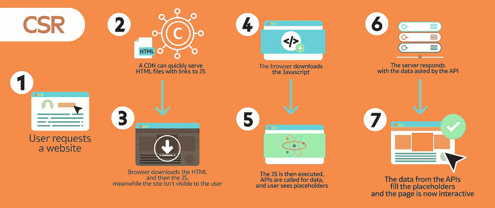
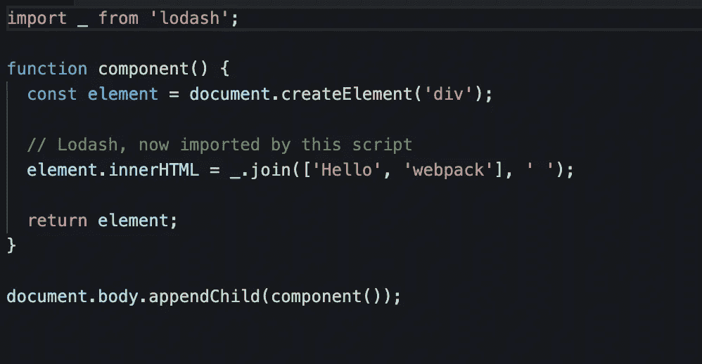
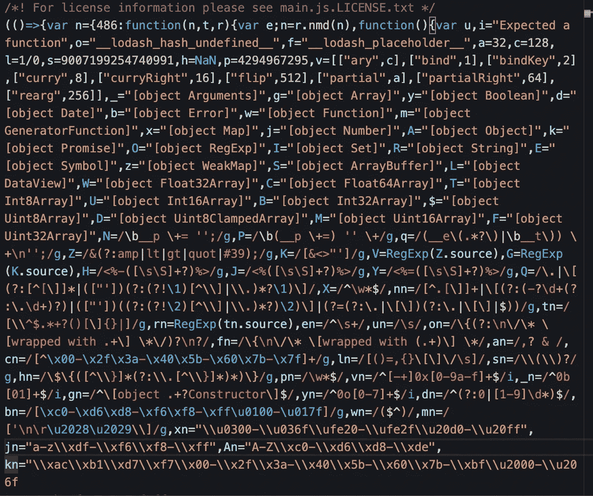
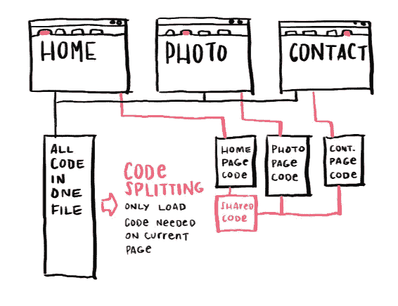
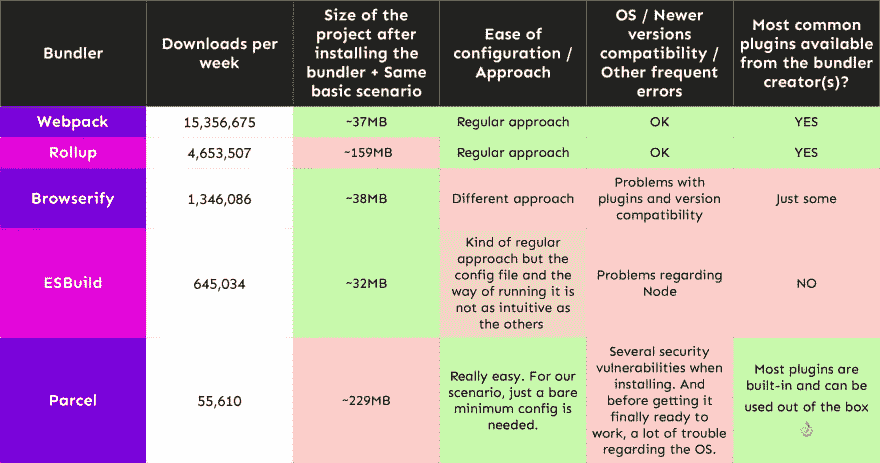
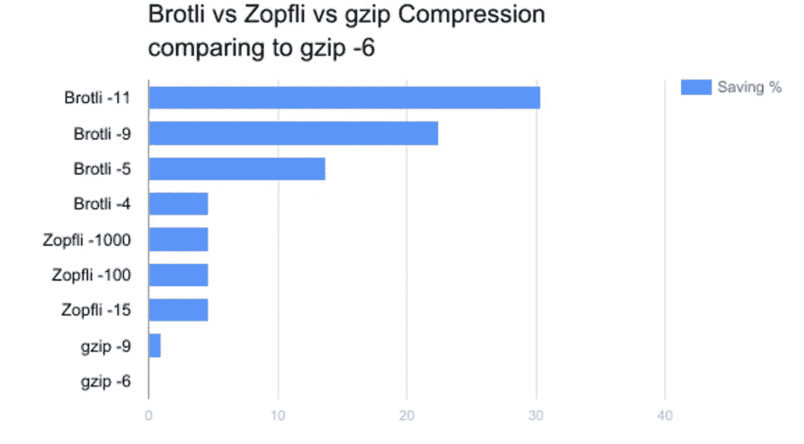

# 我如何让我的 JavaScript 应用程序速度提高两倍

> 原文：<https://javascript.plainenglish.io/how-i-make-my-javascript-applications-2-times-faster-dbbfd7e5ceec?source=collection_archive---------1----------------------->

## 在本文中，我们将快速浏览一下可以用来尽快创建 web 应用程序的技巧。

如今，对于科技公司来说，拥有一个快速且可持续的 web 应用程序是一件必须做的事情，而有了这个庞大的 web 开发人员社区，实现这一目标比以往任何时候都更容易。

但是首先我想描述一下一个新的 JavaScript web 应用程序在客户端实际上是如何工作的。

## 浏览器如何理解一个 JS web app？

让我们用一个 web 应用程序阶段的渲染图来做这件事。

对于所有使用**客户端渲染(CSR)** 方法的 JS 应用程序来说，这幅图几乎是一样的。

建立我们的 JS 文件下载和渲染块，然后我们有我们的网站。看起来很容易，不是吗？！在这些步骤的背后是一个新方法的大黑洞，帮助我们使这个过程更快更有效，所以让我们来谈谈它们。

## 捆绑和组块

您以 React、Vue.js 或 Angular 格式编写的代码在编写时和呈现时会有所不同，代码由模块捆绑器转换成许多片段、组块或带有向后兼容的普通 js 代码的捆绑包，以让浏览器理解代码并向用户呈现正常外观的网站。让我用一个由 webpack 捆绑的小 React 应用程序展示给你看。

this is the code we write

this is a piece of the previous code bundle that is generated by the webpack

看吧！Webpack 会将所有的 Lodash 代码导入到一个包含我们已经编写的 JS 代码的文件中！这个文件包将被发送到浏览器，并在下载完成后开始渲染。因此，想象一个大块文件——下载它会有多慢！

# 使最佳化

这里的大部分速度技巧是关于通过做一些事情来减少块文件的大小，比如延迟加载，编写自定义库而不是安装它们，压缩块文件& [核心网站邀请](/core-web-vitals-boosting-your-websites-speed-a2ea4d595f0d?source=rss-8dd7eb196b7a------2)(我也写了一篇关于这个的文章，你可以在这里阅读)。所以让我们开始吧。

## 延迟加载和代码分割

这里的主要概念是防止加载不必要的代码或在用户需要的一些逻辑点加载它们，这样我们不会在第一次或每次刷新时加载整个块，我们只导入和下载我们当时需要的代码！

Credit to [susielu](https://www.susielu.com/content/1-data-viz/10-bundle-buddy/codesplitting.png)

## 模块捆扎机

对于开发者来说，选择 Webpack 这个概念曾经非常简单，但现在比以前复杂得多，因为最近出现了一些很酷的新模块捆绑器，使这个过程比以前更有性能，我现在选择这个部分是 [Vite](https://vitejs.dev/) ！

## 但是为什么 Vite 比 Webpack 好呢？

相比原生的 ESM，Vite 更喜欢提供源代码。通过允许浏览器执行捆绑程序的一部分职责，Vite 在浏览器的请求下根据需要修改源代码。条件动态导入背后的代码只有在当前屏幕上使用时才会被处理。

## 压缩

这是目前大多数模块捆绑器处理的事情，但这里有一个技巧是使用 [Brotli](https://github.com/google/brotli) 作为压缩算法，而不是传统的 GZIP 算法，Brotli 将包大小减少了 20% — 30%！是啊，这很酷。

## 包扎

没什么可说的，但感谢你阅读这篇文章:)

*更多内容看* [***说白了就是***](https://plainenglish.io/) *。报名参加我们的* [***免费周报***](http://newsletter.plainenglish.io/) *。关注我们关于* [***推特***](https://twitter.com/inPlainEngHQ) ， [***领英***](https://www.linkedin.com/company/inplainenglish/) *，*[***YouTube***](https://www.youtube.com/channel/UCtipWUghju290NWcn8jhyAw)*，以及* [***不和***](https://discord.gg/GtDtUAvyhW) *。*