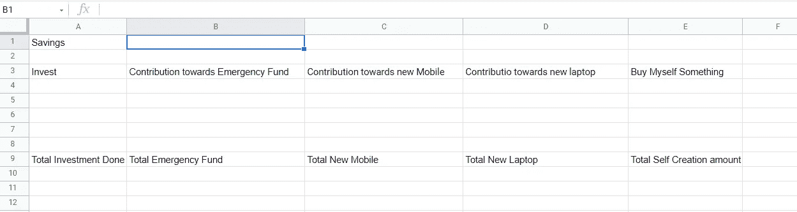
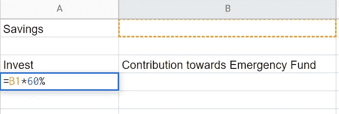
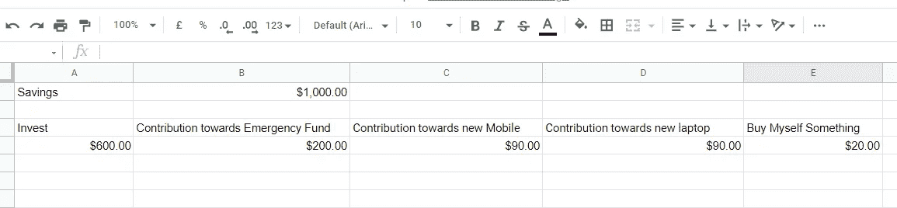
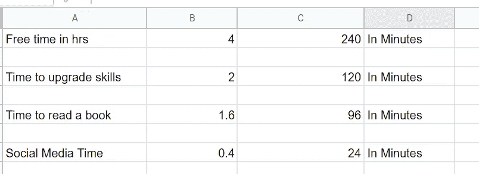

# 作为一名开发人员，我如何使用 Excel 管理我的金钱和时间

> 原文：<https://javascript.plainenglish.io/how-i-manage-my-money-and-time-with-excel-as-a-developer-19d5df7ad67f?source=collection_archive---------10----------------------->

## 使用简单的 Excel 公式规划金钱和时间

Photo by [Austin Distel](https://unsplash.com/@austindistel?utm_source=medium&utm_medium=referral) on [Unsplash](https://unsplash.com?utm_source=medium&utm_medium=referral)

当你拿到薪水时，管理金钱是一项相当困难的任务，我怀疑人们不会费心计划他们将如何处理他们的储蓄。

从长远来看，你应该避免把钱存在银行里。通货膨胀率会烧掉你的钱，你最终会损失每年 6%的存款。

每当我在支付所有账单和费用后剩下我的存款时，我更喜欢使用内置的谷歌 Excel 表格，它为我做所有的计算。

## 理财

我最近创建了一个简单的谷歌 Excel 表格，它为我做了一些计算，并让我知道我的储蓄突破。

使用谷歌 Excel 表格来计算你的钱的突破肯定不是强制性的，你可以使用计算器和笔记本。我更喜欢使用 Excel 表格，因为它节省了我的时间，而且我不会忘记我的突破部分。

***我个人把我的积蓄分成 5 部分—***

*   投资(60%)
*   对紧急基金的捐款(20%)
*   对新手机的贡献(9%)
*   对新笔记本电脑的贡献(9%)
*   额外的一小笔钱花在我身上(2%)

这些比例完全基于我的要求，并不强制遵循我遵循的确切百分比。

我的 Excel 表格结构如下所示—

Image from the Author (Screenshot from Google Excel)

下一步是放置公式，让*根据我们的要求自动*计算比例。

我用简单的百分比公式来分解存储在 B1 中的数量—

Formula to calculate Proportion

在 Excel 中使用公式很简单，只需输入`=`并选择`Column`来储存你的存款，然后输入`percentage%`你想要的并点击回车。这很简单。

因此，我为每一部分都放置了公式，每当我输入上个月的储蓄时，Excel 就会计算每一部分。这是非常简单的数学，有一个 excel 表可以节省时间，使计算变得容易。

假设我存了 1000 美元，我的计算是—

Calculations

建立一个应急基金是非常重要的，因此，我把我 20%的储蓄投入到应急基金中。我个人将应急基金存放在流动性共同基金中(这是我更喜欢的，我也不是在推销什么)。

我根据自己的风险承担能力，将 60%的储蓄投资于不同的共同基金。一个人必须拥有完整的 [*金融术语*](/finance-for-programmers-1fa767e3d304) 知识。

除了开销，我还有一个“给自己买点东西”的基金，最近我用它买了一本技术书籍。

后来，我把每个月投资的每一笔金额都记录下来。此外，紧急基金的目标是 *$10，000* ，当这个目标完成后，从下个月开始，紧急基金部分将与投资部分合并。这意味着，一旦我完全达到我的应急基金目标，我的投资比例将变为 75%至 80%左右。

## 管理时间

通常，我把我的空闲时间分成三类—

*   [*提升我的技能(50%)*](/steps-i-follow-to-keep-myself-upgraded-as-a-programmer-25737d953fa7)
*   看书(40%)
*   社交媒体(10%)

很明显，遵循这种时间划分方法会有一些起伏，但我会尽可能地保持高效率。

我通常把空闲时间定义为除了日常事务之外，我觉得有所作为的时间。

因此，在应用一个简单的百分比公式后，我的日常 excel 表格看起来像这样—

Screenshot from google sheet

关于我——我是*技术*和*自我提升* [*的顶级作家点击这里*](https://aniketz.medium.com/) *阅读更多我的文章。*

就这样，这是文章的结尾。希望它对你有价值。如果你喜欢这篇文章，点击这里订阅我的邮件列表。我会通过电子邮件给您发送技术相关的文章。

[**通过电子邮件获取我的文章点击这里**](https://aniketz.medium.com/subscribe) **|** [**购买 5 美元中等会员**](https://aniketz.medium.com/membership)

[如果你觉得这篇文章有价值，那么点击这里阅读更多我的技术文章](https://aniketz.medium.com/)

 [## 通过我的推荐链接加入 Medium-Aniket

### 作为一个媒体会员，你的会员费的一部分会给你阅读的作家，你可以完全接触到每一个故事…

aniketz.medium.com](https://aniketz.medium.com/membership) 

本文仅供参考，在做出重大投资决定之前，必须咨询财务顾问。这篇文章不应该被认为是财务建议。

*更多内容请看*[***plain English . io***](http://plainenglish.io/)*。报名参加我们的* [***免费周报***](http://newsletter.plainenglish.io/) *。在我们的* [***社区***](https://discord.gg/GtDtUAvyhW) *获得独家获得写作机会和建议。*